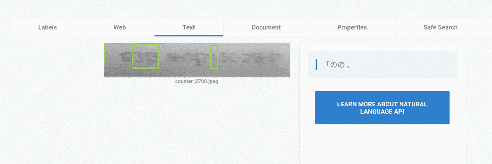
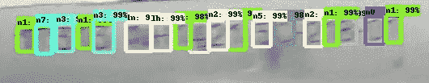

# 用于制造质量控制的张量流

> 原文：<https://towardsdatascience.com/tensorflow-for-manufacturing-quality-control-bc1bc6740558?source=collection_archive---------7----------------------->

*By*[*Priya DWI vedi*](https://medium.com/u/b040ce924438?source=post_page-----bc1bc6740558--------------------------------)*，数据科学家@ SpringML*

人工智能正在改变每个行业。在制造业，人工智能和机器学习正在自动化质量控制方面发挥巨大作用。目视检查和问题识别是一项挑战，通常需要大量人力。例如，正确的包装是一个重要的步骤，不仅用于品牌，也用于物流目的。包裹上印有代码，允许制造商跟踪包裹的时间、来源和路线。

SpringML 的标签检测应用程序使用机器学习来识别包装标签中的异常。这款应用可以实时观看视频或包装图片，并提取文本。如果文本不符合标准，它会实时发出警报。

这是一个具有挑战性的问题，原因有几个——视频镜头可能不稳定，因此盒子上序列号的位置会在帧之间发生变化，盒子的运动模糊了序列号，裁剪出的文本分辨率较低，这对于标准 OCR 包来说是一个具有挑战性的输入。

我们通过使用谷歌的 [Tensorflow 对象检测](https://github.com/tensorflow/models/tree/master/research/object_detection)框架解决了这个问题。

请看下面的结果。当预测的文本被完美地阅读时，一个绿色框形成。令人印象深刻的权利！！

OCR on moving objects

# 方法

解决这个问题有两个主要步骤:

1.  检测盒子上序列号的位置
2.  读取序列号

让我们详细讨论每一个问题

**检测盒子上序列号的位置**

如果摄像机位置固定，而传送带以恒定速度移动，那么您可以使用基于空间和时间的逻辑来识别并在传送带穿过框架时裁剪出序列号。然而，由于手持摄像机，这个问题更具挑战性，因此我使用 [Tensorflow 对象检测框架](https://github.com/tensorflow/models/tree/master/research/object_detection)来训练识别序列号的模型。要了解更多关于在这个框架上训练定制模型的信息，请查看我的这篇文章。

对象检测框架非常强大，您可以使用迁移学习在一组非常小的图像(本例中为 50-100 张图像)上训练您自己的模型。然后，您可以在剪辑上运行该模型，它会标记出序列号的位置。我们能够裁剪出这些图像，反转它们，增加它们的对比度，并保存它们以供下一步使用。请看下面的一些样本图片:

Sample output after step 1

**读取序列号**

正如你从上面的图片中看到的，由于模糊和细字体，即使经过一些预处理，裁剪出来的图像质量也非常低。即使是最好的 OCR 软件包之一——Google Vision API 也难以处理这种类型的输入。Vision API 提供了一个非常好的 web 界面，可以在样本图像上快速尝试 API。请看这个[链接](https://cloud.google.com/vision/)。

请参见下面的 Vision API OCR 对上面示例的输出:

经过一些实验后，最终采用的方法是训练第二个对象检测模型，该模型可以识别序列号中的每个数字和字母，如 1、7、3、N、H、4、2、C 等。第二个对象检测模型将检查图像并标出它可以识别的每个字母或数字，最后我们将得到的字符连接起来形成完整的字符串。

那么，这种方法为什么有效呢？

原因是模型是在这个特定数据上训练的。通过给它看许多“7”的模糊照片，我们可以训练它在这种情况下“7”是什么样子。

参见下面第二个对象检测模型的输出:

Letter/Number detection model

# 结论

这种自动化技术可以部署在制造工厂，以提高包装的准确性，减少物流和运输错误。TensorFlow 对象检测提供了在制造工厂内部署此类解决方案的灵活性，因此可以进行实时预测。

*SpringML 是谷歌云平台的首要合作伙伴，专注于机器学习和大数据分析。我们已经在多家财富 500 强企业中实施了预测和分析解决方案。请联系了解更多:*[*info@springml.com*](mailto:info@springml.com)*，*[*www.springml.com*](http://www.springml.com/)