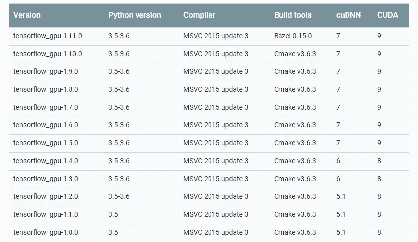
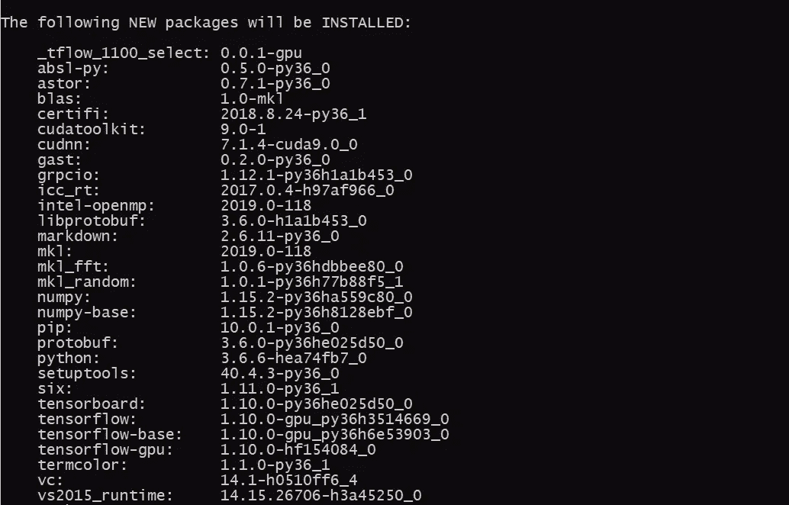
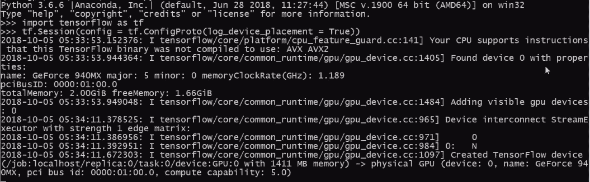

# 轻松安装 Tensorflow GPU:使用 conda 代替 pip [Update-2]

> 原文：<https://towardsdatascience.com/tensorflow-gpu-installation-made-easy-use-conda-instead-of-pip-52e5249374bc?source=collection_archive---------0----------------------->

想在你的 GPU 机器上安装 Tensorflow，运行那些 GPU 吃深度学习算法？你来对地方了。我有一个配置不错的 GPU，以前玩 FIFA 都是用它。换成 AI，本来想用 GPU 做深度学习，而不是玩游戏。但是…..我害怕 Tensorflow 安装不兼容的 CUDA 版本。在这篇文章中，我将解释传统的方法和新的优化方法，以及为什么我们应该放弃 pip 而使用 conda。

## *如果你是一个 UBUNTU 用户，想要一步一步的使用 LONG 方法，那么我已经在这里发表了一篇完整的文章:*

[](https://medium.com/@harveenchadha/tensorflow-gpu-installation-made-easy-ubuntu-version-4260a52dd7b0) [## Tensorflow GPU 安装变得简单:Ubuntu 版本

### 在 ubuntu 上安装 Tensorflow GPU 对于正确版本的 cuda 和 cudnn 来说是一个挑战。一年前，我写了一篇…

medium.com](https://medium.com/@harveenchadha/tensorflow-gpu-installation-made-easy-ubuntu-version-4260a52dd7b0) 

# 传统方法

要安装 Tensorflow for GPU，我必须遵循以下步骤(这些步骤适用于 windows):

1.  先弄清楚 GPU 是否兼容 Tensorflow GPU！(来自[这里](https://developer.nvidia.com/cuda-gpus))
2.  从[这里](https://developer.nvidia.com/cuda-downloads)下载并安装 Cuda 工具包。
3.  在 Nvidia 开发者[网站](https://developer.nvidia.com/cudnn)注册下载 cuDNN
4.  通过将 cuDNN 的内容提取到步骤 2 中安装的工具包路径中来安装 cuDNN。CUDA Toolkit 目录中会有一些你必须替换的文件。
5.  就这样吗？不，那么你需要检查你的路径变量是否存在 CUDA_HOME。如果没有，请手动添加。
6.  然后检查路径变量，看工具箱路径是否可用。
7.  然后最后安装 Anaconda 或 Miniconda
8.  创建安装了 Python 和 Pip 包的环境。
9.  然后最后' *pip 安装 tensorflow-gpu '。*
10.  测试您的安装。

你会说这很简单，对吗？为什么不试一试呢？请记住，我没有为上述任何步骤提供视觉效果，因为这些只是为了让您了解，并解释我们在此过程中遇到的问题。

## 这个过程有 1%的概率会对你有利！

**为什么？**

> 由于版本编号的原因



Figure 1\. [Source](https://www.tensorflow.org/install/source_windows)

Tensorflow 的不同版本支持不同的 cuDNN 和 CUDA 版本(在此表中，CUDA 有一个整数值，但当您下载时，它实际上是一个浮点数，这使得编号和兼容性更加困难)。cuDNN 和 conda 也不是 conda 的一部分。

# 获奖的新方法

安装 Miniconda 或 Anaconda，然后运行这个命令。

```
conda create --name tf_gpu tensorflow-gpu 
```

**嗯是这样吗？是的。**

该命令将创建一个以“tf_gpu”命名的环境，并将安装 tensorflow-gpu 所需的所有软件包，包括**cuda 和 cuDNN 兼容版本。**



Figure 2\. cuDNN and Cuda are a part of Conda installation now

此外，它也不会干扰您当前已经设置好的环境。

如果你很难想象这个命令，我会把它分成三个命令。

```
conda create --name tf_gpuactivate tf_gpuconda install tensorflow-gpu
```

**注意:这也适用于 Ubuntu 用户。不再需要很长的脚本来让 DL 在 GPU 上运行。**

# 测试 Tensorflow 安装

要测试 tensorflow 安装，请遵循以下步骤:

1.  打开终端，使用*‘激活 TF _ GPU’激活环境。*
2.  使用*python*进入 python 控制台

```
import tensorflow as tfsess = tf.Session(config=tf.ConfigProto(log_device_placement=True))
```



Figure 3\. Validating your Tensorflow Installation

阅读我在 Medium 上的其他文章:

1.  [我的第一次数据科学面试](/my-first-data-science-interview-bccc006ba2c8)
2.  [机器学习:什么、何时、如何？](/machine-learning-what-why-when-and-how-9a2f244647a4)
3.  [卡尔曼滤波面试](/kalman-filter-interview-bdc39f3e6cf3)

关于我:我是一名自动驾驶汽车工程师，专注于使用深度学习为车辆提供智能。如果你遇到任何困难，请通过 LinkedIn 联系我。

此信息最初在此发布[。这篇文章也谈到了张量流计算的一些改进，但我现在并不关心这些，因为那不是我的首要任务，:D](https://www.anaconda.com/blog/developer-blog/tensorflow-in-anaconda/)

**更新 1** :一些用户抱怨它不能在 Ubuntu 上工作，我发现你需要在 Ubuntu 上手动安装与卡兼容的驱动程序。此外，如果您已经设置了任何其他环境，那么它是一个烂摊子，这可能不会帮助你。

**更新 2** :这篇文章已经被阅读了超过 50k 次，甚至 Aurélien Géron 也推荐使用这个技巧来安装 Tensorflow。

## 如果你是一个 UBUNTU 用户，想要一个使用 LONG 方法的逐步指南，那么我在这里发表了一篇完整的文章:

[](https://medium.com/@harveenchadha/tensorflow-gpu-installation-made-easy-ubuntu-version-4260a52dd7b0) [## Tensorflow GPU 安装变得简单:Ubuntu 版本

### 在 ubuntu 上安装 Tensorflow GPU 对于正确版本的 cuda 和 cudnn 来说是一个挑战。一年前，我写了一篇…

medium.com](https://medium.com/@harveenchadha/tensorflow-gpu-installation-made-easy-ubuntu-version-4260a52dd7b0)