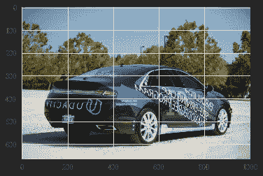
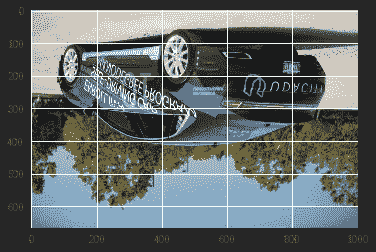
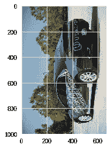
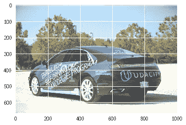
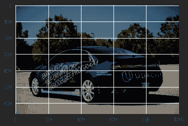
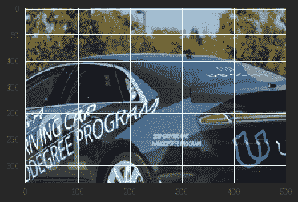
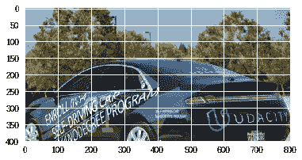

# 张量流图像:在 GPU 上增强

> 原文：<https://towardsdatascience.com/tensorflow-image-augmentation-on-gpu-bf0eaac4c967?source=collection_archive---------8----------------------->

深度学习可以解决许多对人类来说似乎不可能的有趣问题，但这是有成本的，我们需要大量的数据和计算能力来训练深度神经网络。

为了解决数据问题，我们可以使用数据扩充。增强也可能需要大量的计算，因为我们可能需要增强数百万张图像，为了处理这一点，我们可以使用 tensorflow.image，它提供了一些基本的图像功能，所有的计算都在 GPU 上完成。

我正在使用 tensorflow eager_execution，这样我们就可以在不运行会话的情况下看到增强的结果，如果你想了解更多关于 eager_execution 的信息，请阅读[此处](/eager-execution-tensorflow-8042128ca7be)。

让我们来看看一些增强功能:

# 1.加载图像

张量流图像函数期望传递的图像是张量。让我们加载一幅图像并将其转换为张量:

img = matplotlib . py plot . im read('/img _ path ')
TF _ img = TF . convert _ to _ tensor(img)

Image soure:[https://cdn-images-1.medium.com/max/1000/1*ULBhR9EVavi-HhpdbrjEzQ.jpeg](https://cdn-images-1.medium.com/max/1000/1*ULBhR9EVavi-HhpdbrjEzQ.jpeg)

# 2.应用增强功能

在这里，我们将看到不同类型的增强，可以适用于图像。

## a.翻转图像

一个最基本的增强是将翻转应用于图像，这可以使数据翻倍(基于你如何应用)。

**水平翻转:**

brright _ img = TF . image . flip _ left _ right(TF _ img)

Horizontally Flipped Image

**垂直翻转:**

brright _ img = TF . image . flip _ up _ down(TF _ img)

Vertically flipped Image

**随机翻转:**您的图像有 1/2 的几率会水平或垂直翻转。

brright _ img = TF . image . random _ flip _ left _ right(TF _ img)
brright _ img = TF . image . random _ flip _ up _ down(TF _ img)

或者，您也可以使用 tf.reverse 进行同样的操作。tf.reverse 接受一个附加参数，即 axis，它定义了图像应该沿 x 轴或 y 轴翻转的位置。

brright _ img = TF . reverse(TF _ img，axis =[0])#垂直翻转
brright _ img = TF . reverse(TF _ img，axis =[1])#水平翻转

## b.图像旋转

Tensorflow 提供*tensor flow . image . rot 90()*函数，将图像逆时针旋转 90 度。

brright _ img = TF . image . rot 90(TF _ img，k = 1)

Rotated Image

图像将逆时针旋转 90 度 k 次。

## c.聪明

用下面的代码改变图像的亮度:

brright _ img = TF . image . adjust _ brightness(TF _ img，delta= 0.2)

Brightened Image

其中δ是要加到每个像素上的值的量。δ值越大，图像越亮。如果 delta 为负，那么图像将变暗。如果你想应用随机亮度，你可以使用下面的函数:

brght _ img = TF . image . random _ brightness(TF _ img，max_delta=0.5)

Random brightness

Delta 将介于-max_delta 和 max_delta 之间。

## d.其他方法

除了上述方法之外，还有如下类似的方法可用于图像增强:

*   `[tf.image.adjust_contrast](https://www.tensorflow.org/api_docs/python/tf/image/adjust_contrast)`
*   `[tf.image.random_contrast](https://www.tensorflow.org/api_docs/python/tf/image/random_contrast)`
*   `[tf.image.adjust_hue](https://www.tensorflow.org/api_docs/python/tf/image/adjust_hue)`
*   `[tf.image.random_hue](https://www.tensorflow.org/api_docs/python/tf/image/random_hue)`
*   `[tf.image.adjust_gamma](https://www.tensorflow.org/api_docs/python/tf/image/adjust_gamma)`
*   `[tf.image.adjust_saturation](https://www.tensorflow.org/api_docs/python/tf/image/adjust_saturation)`
*   `[tf.image.random_saturation](https://www.tensorflow.org/api_docs/python/tf/image/random_saturation)`

# 3.其他图像处理任务

除了图像增强，tf.image 还提供了一些其他有用的图像处理功能。

## 农作物

Tensorflow 提供了以下用于裁剪图像的功能。

br right _ img = TF . image . central _ crop(TF _ img，0.5)

central_crop 使图像沿每个维度远离中心，并移除外部部分。

brght _ img = TF . image . crop _ to _ bounding _ box(TF _ img，offset_height = 100，offset_width = 100，target_height = 400，target_width = 800)

通过提供偏移和图像尺寸值，crop_to_bounding_box 可以帮助您裁剪图像的特定区域。

如你所见，Tensorflow 提供了一些基本类型的图像函数，可以帮助你增加图像数据。你可以在这里探索更多关于 he tensorflow.image class [。](https://www.tensorflow.org/api_guides/python/image)