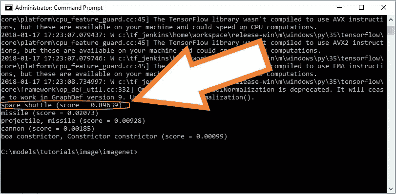
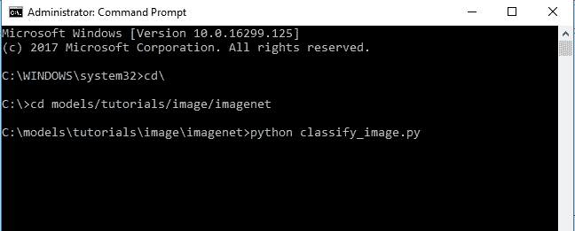
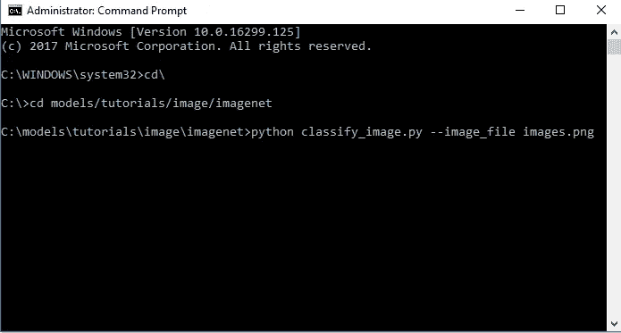
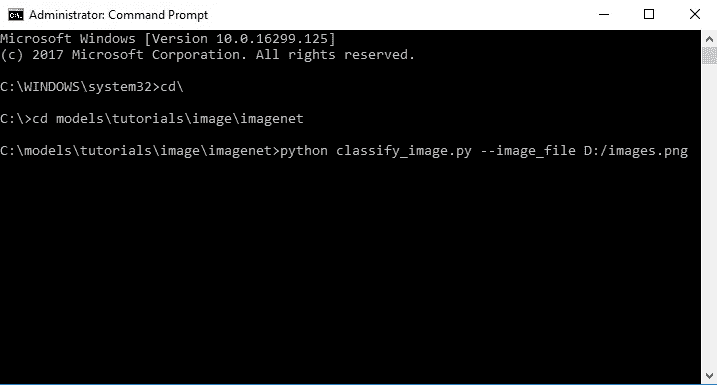
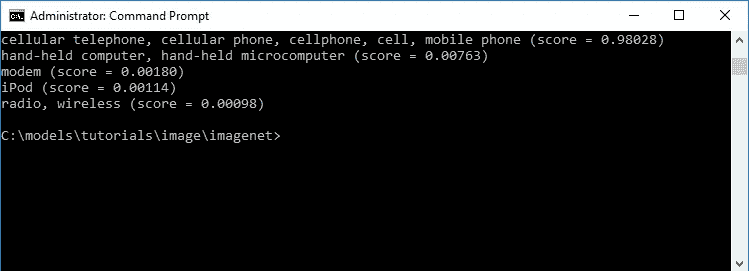

# TensorFlow 图像识别 Python API 教程

> 原文：<https://towardsdatascience.com/tensorflow-image-recognition-python-api-e35f7d412a70?source=collection_archive---------2----------------------->

## 在带有 Inception-v3 的 CPU 上(以秒为单位)

这是在你的笔记本电脑或电脑上进行图像识别的最快和最简单的方法，不需要任何 GPU，因为它只是一个 API，而你的 CPU 足以胜任这一工作。

我知道，我对这个特定的 API 有点晚了，因为它是 tensorflow 早期版本附带的。API 使用在 [*1000 类*](http://image-net.org/challenges/LSVRC/2014/browse-synsets) *上训练的 CNN 模型。*更多详情请参考本 [*张量流页面*](https://www.tensorflow.org/tutorials/image_recognition) 。

在我开始向你们展示如何用任何图像实现这个 API 之前，这里有一个**例子**...

输入是航天火箭/航天飞机的图像，不管你怎么称呼它。


Fig: Rocketlaunch.jpg

命令行的输出是“航天飞机(得分= 89.639%)”。



Fig: Space shuttle (score 89.639%)

如果你有 linux 或者 Mac 也不用担心。我敢肯定，这将在任何 CPU 的每个系统上工作，假设你已经安装了 TensorFlow 1.4。

整个过程将分 4 步完成:

## 1.从 tensorflow 资源库下载模型。

转到 tensorflow [存储库链接](https://github.com/tensorflow/models)并下载到您的计算机上，并将其解压缩到根文件夹中，因为我使用的是 Windows，所以我会将其解压缩到“C:”驱动器中。

现在将文件夹命名为“模型”。

## **2。命令行**

打开命令提示符(以管理员身份)。

现在，我们需要运行"*models>tutorials>imagenet>classify _ image . py "*中的 *classify_image.py* 文件。



**Fig: Running the classifier file**

这将下载一个 200mb 的模型，这将有助于您识别您的图像。

如果一切正常，您将在命令提示符下看到:

```
giant panda, panda, panda bear, coon bear, Ailuropoda melanoleuca (score = 0.88493)
indri, indris, Indri indri, Indri brevicaudatus (score = 0.00878)
lesser panda, red panda, panda, bear cat, cat bear, Ailurus fulgens (score = 0.00317)
custard apple (score = 0.00149)
earthstar (score = 0.00127)
```

现在，为了确保我们理解如何正确使用它，我们将做两次。一次将图像文件保存在“*模型>教程> imagenet >* ”目录中，第二次将图像保存在不同的目录或驱动器中😏

## 3.下载目录中的图像

您可以随意使用互联网或其他任何地方的任何图像，并使用 *classify_image.py* 将其粘贴到“*models>tutorials>imagenet【images.png】T42*目录中，然后我们会将其粘贴到“D:\ *images.png”或您想要的任何目录中，只是不要忘记在命令提示符中键入正确的地址。我使用的图像如下。*


**Fig: images.png**

## 4.使用命令提示符执行识别

为此，您只需编辑“—图像文件*”参数，如下所示。*

**a)与 classify_image.py 文件在同一目录**下的图像。进入 imagenet 目录后，打开命令提示符并键入…

```
python classify_image.py --image_file images.png
```



**Fig: images.png is the same directory**

**b)对于不同目录中的图像**通过指向放置图像的目录进行键入。

```
python classify_image.py --image_file D:/images.png
```



**Fig: images.png in different directory**

## 结果

现在，显然两张图片的结果是相同的，如下所示。



**Fig Result for images.png**

如你所见，分数相当准确，即**手机**的分数为 98.028%。

> 注意:您可以随意使用任何您想要的图像，并将其保存在任何目录中。只要记住输入正确的图像路径。


**下一步:转到** [对您的自定义图像进行新类别](/training-inception-with-tensorflow-on-custom-images-using-cpu-8ecd91595f26)的培训。

我已经尽力让文章尽可能准确易懂。有什么意见，建议或者有什么问题，**写在评论里吧。**

关注我[中](https://medium.com/@sagarsharma4244)、[脸书](https://www.facebook.com/profile.php?id=100003188718299)、[推特](https://twitter.com/SagarSharma4244)、 [LinkedIn](https://www.linkedin.com/in/sagar-sharma-232a06148/) 、 [Google+](https://plus.google.com/u/0/+SAGARSHARMA4244) 、 [Quora](https://www.quora.com/profile/Sagar-Sharma-71) 看类似帖子。

**鼓掌吧！分享一下！跟我来。**

乐意帮忙。荣誉……..

# 你会喜欢的以前的故事:

1.  [“Tensor flow”中的“Tensor”是什么鬼？](https://hackernoon.com/what-the-hell-is-tensor-in-tensorflow-e40dbf0253ee)

2.[历元对批量对迭代](/epoch-vs-iterations-vs-batch-size-4dfb9c7ce9c9)

3.[感知器是什么鬼？](/what-the-hell-is-perceptron-626217814f53)

4.[激活功能解释:神经网络](https://medium.com/towards-data-science/activation-functions-neural-networks-1cbd9f8d91d6)