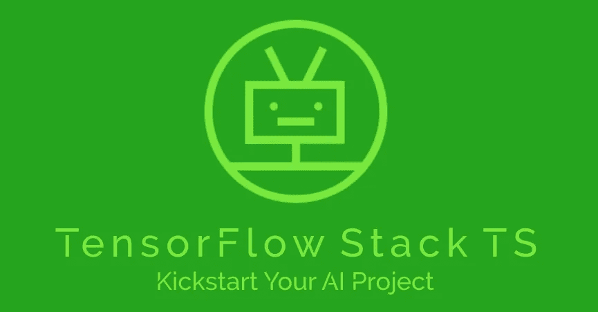
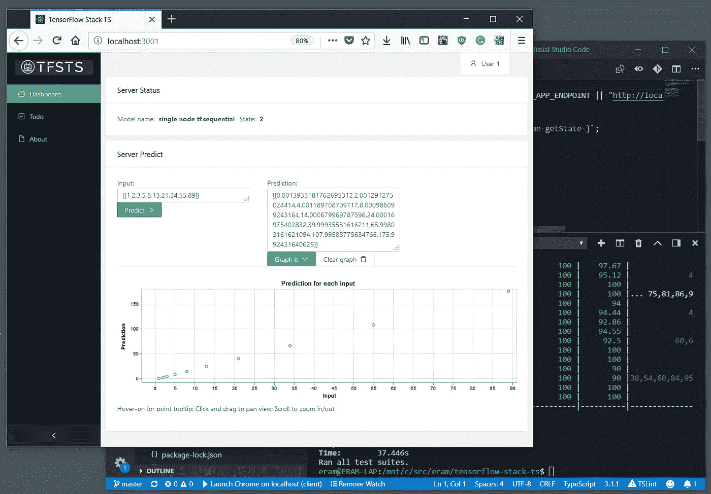

# TensorFlow.js 全栈入门套件

> 原文：<https://towardsdatascience.com/tensorflow-js-full-stack-starter-kit-2e6693192bcf?source=collection_archive---------9----------------------->

## 使用 TensorFlow-Stack-TS 启动您的人工智能项目

Kickstart Your AI Project with TensorFlow-Stack-TS

开始一个新的人工智能项目有许多事情要考虑，用你遇到的一堆工具进行概念验证可能是一条路。但是一旦项目的这一阶段结束，你将需要考虑工程！获得一个可以工作的测试平台，或者更好——一个可以开发应用程序的应用环境。最近，当我试图为一个基于 AI/TensoFlow 的项目建立应用程序堆栈时，我发现我过去使用的[基于均值的模板](http://mean.io/)远远落后，没有完全集成最新的技术。所以我决定把最新最棒的为我工作的库放在一起，作为一个新的全栈模板。在看到它对我的项目有多么有用之后，我现在开源了它。

# 有什么好处？

谷歌的 TensorFlow.js 运行在 NodeJS 环境的**后端**上——V8 单线程 Javascript 引擎，使用八进制 WebGL 或 CUDA 二进制文件进行硬件加速。在这种环境下，用大型数据集训练复杂模型似乎是行不通的。一个更合理的方向是(1)采用在别处构建的大型模型，[转换它](https://github.com/tensorflow/tfjs-converter)，并使用这个后端服务于客户的请求。在 cloud/K8S 上运行这样的应用程序并根据需要进行扩展是很容易的。使用它来(2)探索一个模型，可视化它并调整它的参数是一个很好的选择。不考虑这里的 AI 引擎，这是(3)一个很好的集成库和现代开发环境，可以快速启动任何 web/mobile/native 项目。

# 盒子里有什么？

集成良好的全栈工作样本:

*   TensorFlow.js 后端引擎预装了一个简单的模型来查看它的运行情况。
*   集成到响应式 web/移动应用程序中的可视化库:一个用于运行上述模型并可视化其预测的仪表板。
*   一种跨堆栈的编码语言— TypeScript/Javascript 完全支持 ES6，所有代码都支持 async/await。
*   基于 GraphQL 模式的最新 API。
*   现代的开发工具，可以热重载变更、林挺、单元测试和代码覆盖报告。作为 IDE 和调试器很好地集成到 VSCode 中。
*   [保持简单的哲学跨越](https://www.slideshare.net/ethanram/kissts-the-keep-it-simple-software-stack-for-2017-82329212)！我已经通过**而不是**节省了大量的学习曲线时间，包括一堆我觉得过时或繁琐的库:REST、yarn、Babel、Redux、Apollo server/client、Enzym、Winston/Bunyan、Relay…

TensortFlow-Stack-TS running in development

# 堆栈中的主要集成库

## 后端

*   [TensorFlow.js](https://js.tensorflow.org/) 引擎
*   [基于 GraphQL](http://graphql.org/) 的 API 来为— [节点提供信息。JS](https://nodejs.org/en/) / [打字稿](https://www.typescriptlang.org/)环境和工具与[蒙迪蒙](https://nodemon.io/)/热重装 TFJS 发动机
*   [KoaJS](https://koajs.com/) 网络服务器、中间件和健康检查
*   [typegql](https://prismake.github.io/typegql/) —基于 TypeScript 注释的简化 GraphQL 模式
*   [GraphQL](https://github.com/graphql/graphiql)用于探索 graph QL 模式的浏览器内集成开发环境
*   [Dotenv-扩展](https://github.com/motdotla/dotenv-expand)用于基于环境的配置(见`.env`文件)
*   Jest —具有良好覆盖率的单元测试
*   [VSCode](https://code.visualstudio.com/) 启动设置

## 客户端

*   [Vega-lite](https://vega.github.io/vega-lite/) —用于制图和可视化
*   [Ant Design/Typescript](https://ant.design/docs/react/introduce)React components—响应式仪表板
*   更少/LCSS —更好的造型
*   ts-FSM—React 的简化状态管理
*   [graphql-请求](https://github.com/prisma/graphql-request) —简化的 graph QL 客户端
*   Jest —基于 React 的单元测试
*   节点。JS/Typescript 工具，包括[带有 babel 和热模块替换的 web pack(HMR)](https://webpack.js.org/concepts/hot-module-replacement/)
*   客户端基于带有 [antd-demo](https://ant.design/docs/react/use-with-create-react-app) 脚本的 react-create-app，不会被弹出。

# 主要兴趣点

mono-repo 分为服务器端(后端)项目和客户端(前端)项目。后端运行 TensorFlow 模型和一个调用它的 API。客户端是一个单页面的响应式应用程序，它通过 API 调用模型，并显示结果的图表。

1.  TensorFlow 模型作为“模型提供者”在`src/tensorFlowProvider`文件夹中实现。它遵循一个简单的初始化> >训练> >编译> >预测的工作流程。如果需要一个不同的引擎，很容易实现一个基于其他 AI 引擎的类似提供者。
2.  模型的客户端在`client/src/components/server-predict-card`中实现。在那里你可以找到一个输入输出表单，一个可视化面板和一个驱动它们的小模型。可视化面板规范可在`VegaLiteSpec`文件中找到。你可以在[织女星网站](https://vega.github.io/editor/#/examples/vega-lite/point_2d)上找到一堆图表规格的例子。
3.  后端 API 在`src/graphqlApi`中的 GraphQL 模式上实现，并由模式浏览器提供服务(仅限开发构建)。
4.  API 的客户端在`client/src/utils/graphqlQuery`中实现为通用的 GraphQL 客户端，在`client/src/components/graphql-types`中实现为一堆接口。
5.  性能:如上所述，TensorFlow.js 在后端与“标准的”基于 TF-Python 的环境有很大不同。我找不到好的基准。如果你在下面的评论里提到我，我会很高兴。

这个项目可以从我的 Github 中克隆出来— [这里](https://github.com/eram/tensorflow-stack-ts)

很高兴得到评论，加强该项目等援助。如果您的项目需要一些咨询，请联系我。欢迎你来星/拍手/点赞/分享给我看看你有多牛逼，帮助别人找到这个故事；-)

干杯！

eram at weblegions dot com

*原载于* [*Github*](https://github.com/eram/tensorflow-stack-ts)