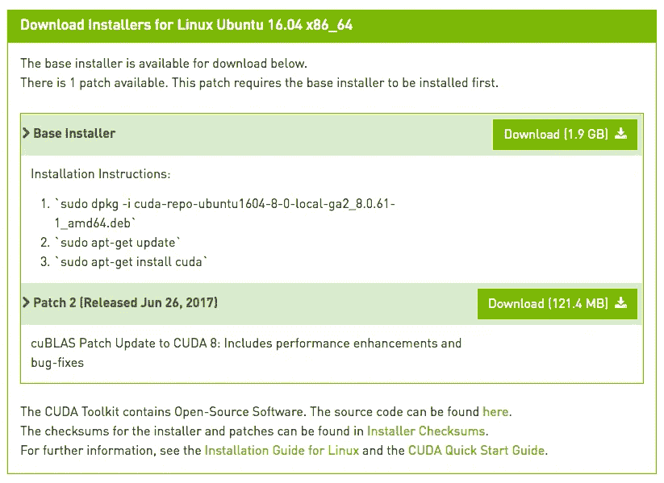
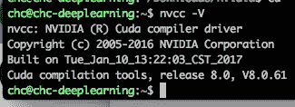
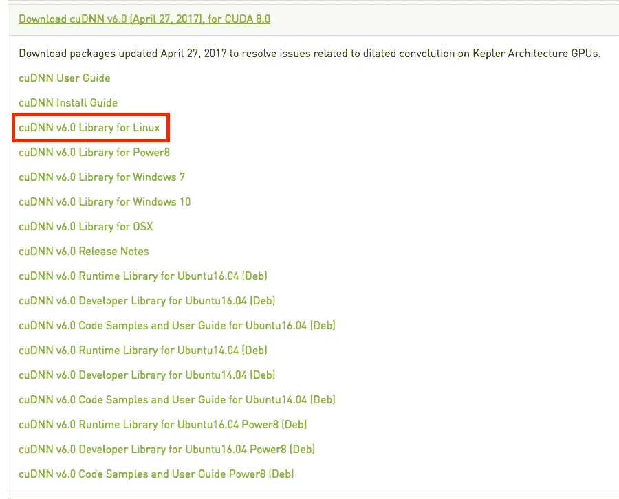
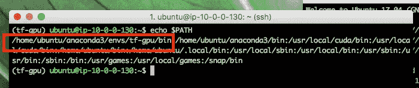
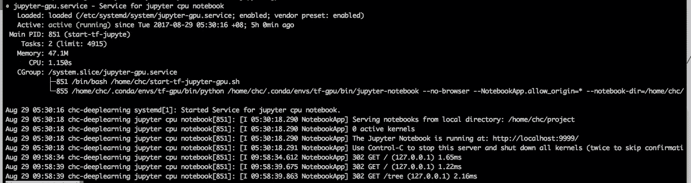
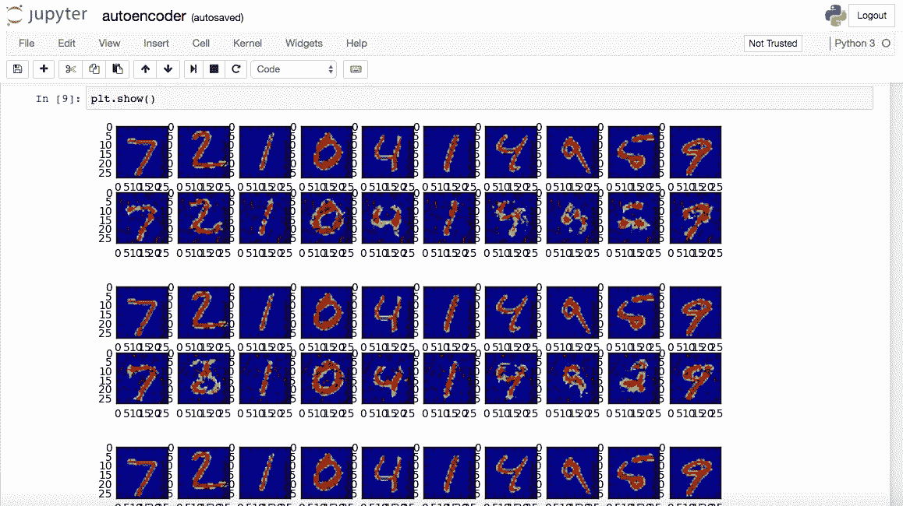

# TensorFlow + Jupyter 笔记本+ Nvidia DIY 设置

> 原文：<https://towardsdatascience.com/tensorflow-jupyter-notebook-nvidia-diy-setup-473acfe5b0e?source=collection_archive---------2----------------------->


基于我的[第一个故事](https://medium.com/@hongcheng79/my-first-step-for-deep-learning-adventure-with-udacity-and-coursera-ee135042ac1e)，更详细的使用 Xbuntu / Ubuntu 17.04 的逐步设置。请注意，我们将使用拥有 sudo 权限的用户，而不是直接拥有 root 权限的用户。

# Nvidia 驱动程序设置

安装 Nvidia 驱动程序库

```
sudo add-apt-repository ppa:graphics-drivers/ppa
sudo apt-get update  
sudo apt-get upgrade  
sudo apt-get install build-essential cmake g++ gfortran git pkg-config python-dev software-properties-common wget
```

从 [Nvidia](https://developer.nvidia.com/cuda-toolkit) 安装 CUDA 8.0，获得基础安装程序和补丁 2。CUDA 也将安装 nvidia 驱动程序，相应地专门针对 CUDA 版本



```
sudo dpkg -i cuda-repo-ubuntu1604-8-0-local-*amd64.deb
sudo apt-get update
sudo apt-get install cuda
```

为本地用户设置 CUDA 环境

```
echo 'export PATH=/usr/local/cuda/bin:$PATH' >> ~/.bashrc
echo 'export LD_LIBRARY_PATH=/usr/local/cuda/lib64:$LD_LIBRARY_PATH' >> ~/.bashrc
source ~/.bashrc
```

使用测试它

```
nvcc -V
```



最后安装 cuDNN，从 [Nvidia](https://developer.nvidia.com/cudnn) 获取，这个是后面给 Tensorflow 的。为当前安装的 CUDA 获取正确的版本



```
cd ~/Downloads/
tar xvf cudnn*.tgz
cd cuda
sudo cp */*.h /usr/local/cuda/include/
sudo cp */libcudnn* /usr/local/cuda/lib64/
sudo chmod a+r /usr/local/cuda/lib64/libcudnn*
```

# Anaconda 设置

使用 Python 3.6 从 [Anaconda](https://www.anaconda.com/download/) 获取安装程序，并遵循安装说明

```
cd ~/Downloads/
bash Anaconda3-4.4.0-Linux-x86_64.sh
```

通常我会将 Anaconda 安装在/opt 文件夹下。

如果安装在主文件夹下，我们需要在激活环境后找到环境文件夹

```
source activate tf-gpu
echo $PATH
```



这对以后设置 Jupyter 笔记本很重要。

# TensorFlow 设置

一旦我们安装了 Anaconda，我们将为 Jupyter 设置创建一个环境，并安装 [TensorFlow](https://www.tensorflow.org/install/install_linux) GPU

```
conda create --name tf-gpu python=3.6
source activate tf-gpu
pip install --ignore-installed --upgrade https://storage.googleapis.com/tensorflow/linux/gpu/tensorflow_gpu-1.3.0-cp36-cp36m-linux_x86_64.whl
```

# Jupyter 设置

一旦我们安装了 TensorFlow，我们将安装 Jupyter，我们将使用 conda 来管理 Jupyter 笔记本和 shell 运行时的包

```
conda install jupyter notebook numpy pandas matplotlib
```

# DDNS 设置

安装任何 ddns 客户端能够更新域，所以我们可以连接回我们的家庭服务器。我们可以为此使用 [NoIP](https://www.noip.com/free) ，它有 [linux 客户端](http://www.noip.com/support/knowledgebase/installing-the-linux-dynamic-update-client/)来更新域。

# NGINX 设置

确保我们在使用 [letsencrypt](https://letsencrypt.org/) 之前停止当前的 nginx，而不是购买 SSL 证书，因为我在节约成本

```
sudo systemctl stop nginx
```

一旦 NGINX 停止，我们可以运行初始的 letsencrypt 命令，该命令将使它自己的内部服务器脱离验证过程

使用命令克隆 letsencrypt，然后设置初始证书

```
sudo git clone https://github.com/letsencrypt/letsencrypt /opt/letsencryptsudo -H /opt/letsencrypt/letsencrypt-auto certonly --[email=me@chclab.net](mailto:email=me@chclab.net) -d deeplearning.chclab.net -d jupyter-cpu.chclab.net -d jupyter-nvidia.chclab.net -d monitor.chclab.net
```

设置 cron 作业以运行证书续订过程

```
0 0 * * *   /opt/letsencrypt/letsencrypt-auto renew --quiet
```

在~/start-tf-jupyter-gpu.sh 创建一个 shell 脚本来启动 Jupyter Notebook，这将使用我们之前设置的名为 tf-gpu 的 conda 环境。

```
#!/bin/bash
export PATH=/home/chc/.conda/envs/tf-gpu/bin:$PATH
/home/chc/.conda/envs/tf-gpu/bin/jupyter notebook --no-browser --NotebookApp.allow_origin='*' --notebook-dir='/home/chc/project' --NotebookApp.port=9999
```

使用以下命令保护 Jupyter 笔记本，更多信息请点击[此链接](http://jupyter-notebook.readthedocs.io/en/latest/public_server.html#securing-a-notebook-server)

```
jupyter notebook --generate-config
jupyter notebook password
```

在**sudo VI/etc/systemd/system/jupyter-GPU . service**创建一个 Systemctl 服务

```
[Unit]
Description=Service for jupyter cpu notebook
After=local-fs.target network.target[Service]
Type=simple
User=chc
Group=chc
ExecStart=/home/chc/start-tf-jupyter-gpu.sh
Restart=always
SyslogIdentifier=jupyter cpu notebook[Install]
WantedBy=multi-user.target
```

启用该服务并尝试运行它

```
sudo systemctl daemon-reload
sudo systemctl enable jupyter-gpu.service
sudo systemctl start jupyter-gpu.service
sudo systemctl status jupyter-gpu.service
```



安装 NGINX

```
sudo apt-get install nginx
```

设置以下 NGINX，对我来说是**sudo VI/etc/NGINX/conf . d/jupyter-NVIDIA . chc lab . net . conf**

```
upstream notebook-tensorflow {
        server localhost:9999;
}
server {
        server_name jupyter-nvidia.chclab.net;
        listen 443 ssl;
        access_log off;ssl_certificate /etc/letsencrypt/live/deeplearning.chclab.net-0001/fullchain.pem;
        ssl_certificate_key /etc/letsencrypt/live/deeplearning.chclab.net-0001/privkey.pem;ssl_protocols TLSv1 TLSv1.1 TLSv1.2;
        ssl_prefer_server_ciphers on;
        ssl_ciphers "EECDH+AESGCM:EDH+AESGCM:AES256+EECDH:AES256+EDH";
        ssl_ecdh_curve secp384r1;
        ssl_session_cache shared:SSL:10m;
        ssl_session_tickets off;
        ssl_stapling on;
        ssl_stapling_verify on;
        resolver 8.8.8.8 8.8.4.4 valid=300s;
        resolver_timeout 5s;
        # disable HSTS header for now
        #add_header Strict-Transport-Security "max-age=63072000; includeSubDomains; preload";
        add_header X-Frame-Options DENY;
        add_header X-Content-Type-Options nosniff;ssl_dhparam /etc/ssl/certs/dhparam.pem;location / {
            proxy_pass            [http://notebook-tensorflow](http://notebook-tensorflow);
            proxy_set_header      Host $host;
        }location ~ /api/kernels/ {
            proxy_pass            [http://notebook-tensorflow](http://notebook-tensorflow);
            proxy_set_header      Host $host;
            # websocket support
            proxy_http_version    1.1;
            proxy_set_header      Upgrade "websocket";
            proxy_set_header      Connection "Upgrade";
            proxy_read_timeout    86400;
        }
        location ~ /terminals/ {
            proxy_pass            [http://notebook-tensorflow](http://notebook-tensorflow);
            proxy_set_header      Host $host;
            # websocket support
            proxy_http_version    1.1;
            proxy_set_header      Upgrade "websocket";
            proxy_set_header      Connection "Upgrade";
            proxy_read_timeout    86400;
        }
}
```

生成一个强 dhparam 文件

```
openssl dhparam -out /etc/ssl/certs/dhparam.pem 4096
```

重启 NGINX

```
sudo systemctl restart nginx
```

最后是使用 Jupyter 笔记本的样子

