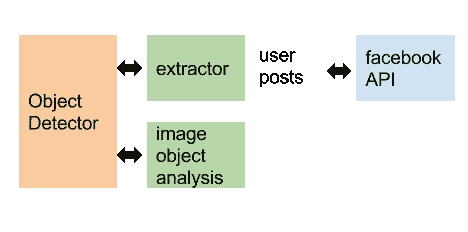
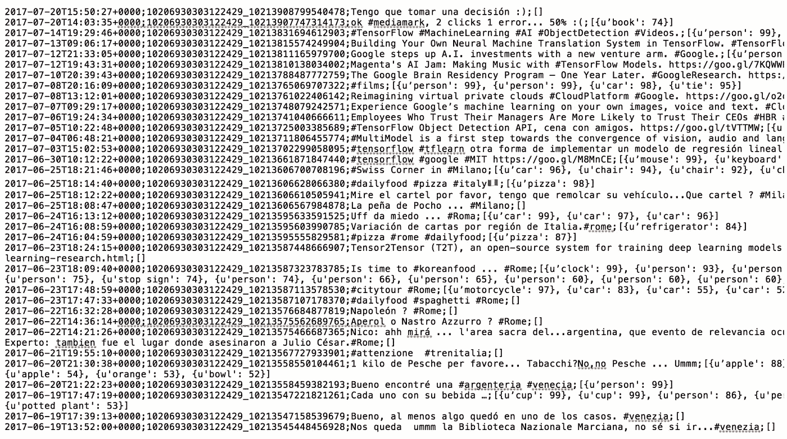
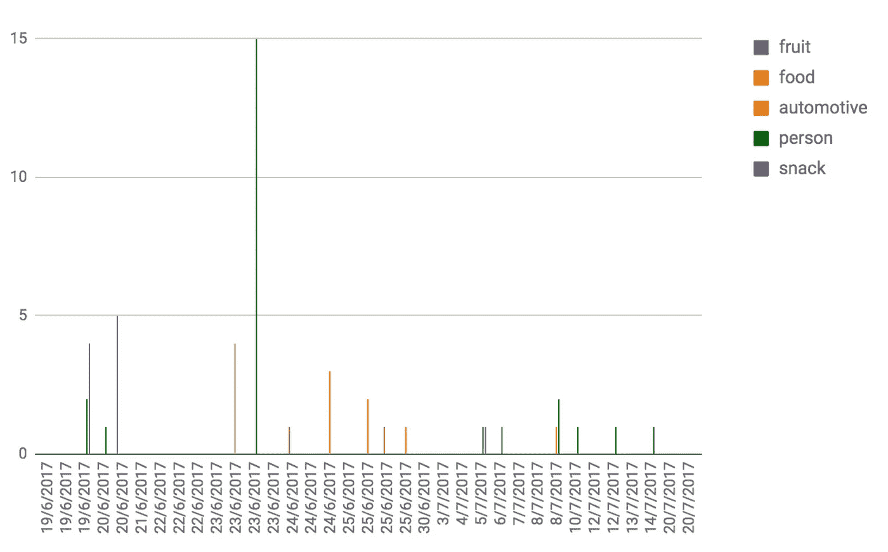
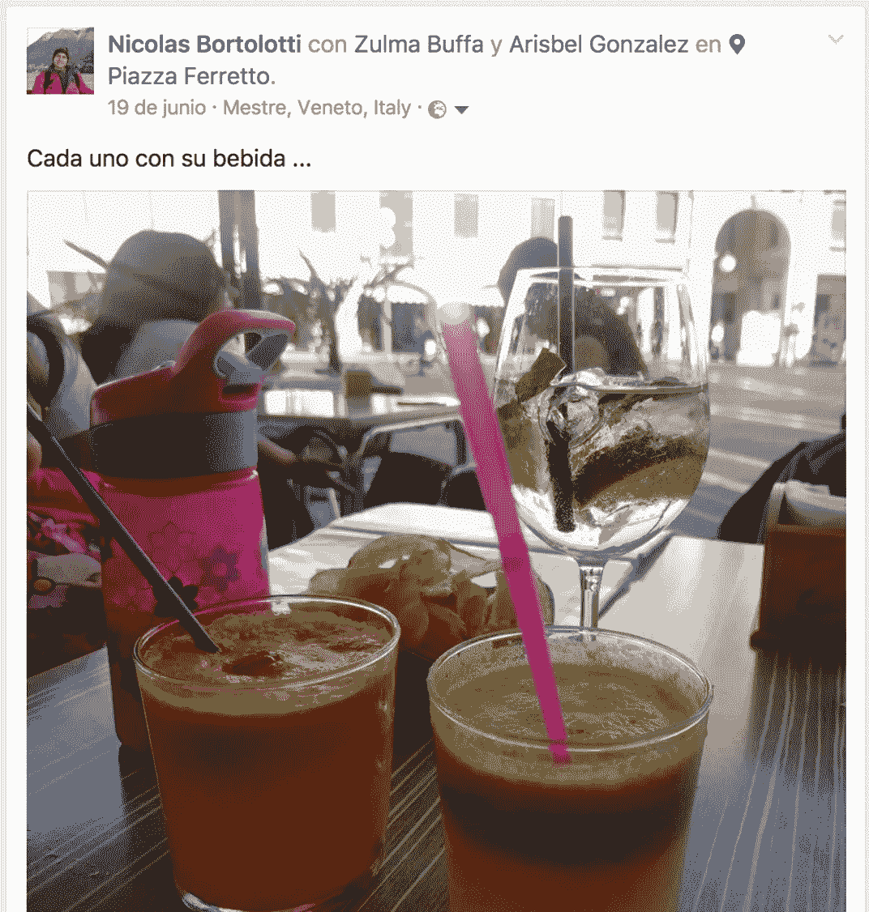
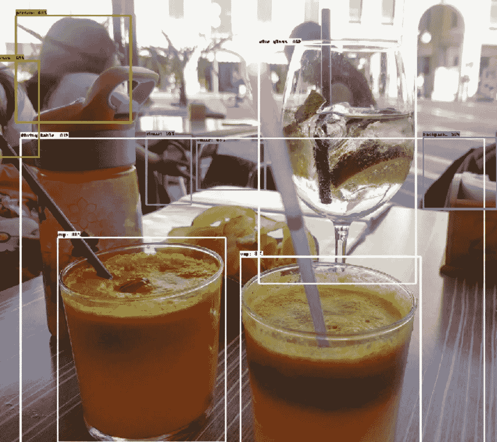

# 张量流物体探测，脸书出版物综述

> 原文：<https://towardsdatascience.com/tensorflow-object-detection-an-overview-of-facebook-publications-2391698ed82f?source=collection_archive---------8----------------------->

在之前的故事中，我们在图像中检测到一些物体[，然后我们做了一个扩展](https://medium.com/towards-data-science/object-detection-dinner-with-friends-ea1caab3b666)[来分析一个视频](https://medium.com/towards-data-science/tensorflow-object-detection-in-videos-avoiding-pizza-donuts-and-cakes-7d188fcb1d2b)，以一种非常基本但实用的方式，今天我们有了另一个挑战。我们能从任何可用的社交网络的共享图片中发现社交方法中的某些东西吗？。我们能做这个探索社交流的操作吗？

让我们假设我们不分析这种情况的真实背景，我们只关注共享出版物的图像。同样，这一方案将有助于启动对所提议的社会环境的分析。让我们使用脸书作为我们的示例实现。

**操作总图:**

**要执行的操作:**

1.  社交用户连接。
2.  阅读/扫描每份出版物。
3.  图像的提取。
4.  图像分析(使用 Tensorflow 对象检测 API)
5.  对检测到的标签进行分组。

让我们看一下提议的实现。分析我自己的个人资料(40 篇文章)。

**按照建议的操作注销:**

**在带有发布时间线的列上建模的信息:**

*注*:我把水果、食物、汽车、人、零食这些概念进行了归类。从与每个帖子相关的图片中共享的内容行。

我们将使用日期为 *06/19/2016* 的出版物通过案例验证我们的信息。在这本书中，我们享受了一顿午后家庭小吃…

**社会出版:**

**视觉图像分析:**

检测到的概念及其信任值的数组:[{u'cup': 99}、{u'cup': 99}、{u'person': 86}、{u'person': 77}、{u'wine glass': 76}、{u'dining table': 69}、{u'chair': 56}、{ u ' potential plant ':53 }]

**结论:**

在这一领域有许多需要改进的地方，包括接收信息的上下文、个人/共享出版物中的过滤器、按更具代表性的元素分组以及更多的变化。但是，解决我们的挑战是一个很好的建议，我们有一个社会分析的概述(在这种情况下，脸书，但我们可以根据所需的社会信息量合并其他网络)

**实施:**

该例程接收要检查的用户 id、帖子数量和使用图形 API(脸书)的令牌。 [**这里的**](https://gist.github.com/nbortolotti/99f32ca8d8c08b359a8bef73f04fd2f7) **实现了。**

**使用的技术:**

*   Tensorflow 1.2.1(对象检测 api)
*   COCO 模式，更快 _ rcnn _ inception _ resnet _ v2 _ atrous _ COCO _ 11 _ 06 _ 2017
*   脸书 sdk

最后一个问题仍然悬而未决……了解人们的社会信息，我们能改善个人会议的环境和同理心吗？我们能利用社交图片做到这一点吗？