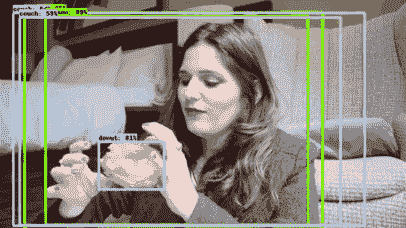
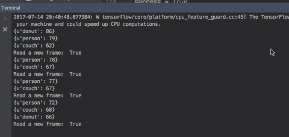
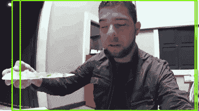
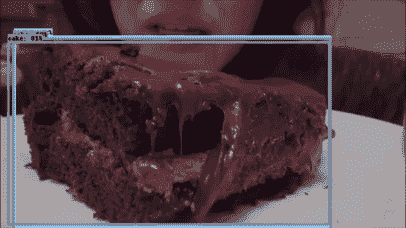

# 视频中的 TensorFlow 对象检测，避免披萨、甜甜圈和蛋糕

> 原文：<https://towardsdatascience.com/tensorflow-object-detection-in-videos-avoiding-pizza-donuts-and-cakes-7d188fcb1d2b?source=collection_archive---------2----------------------->

在之前的一篇文章中，我分享了一个挑战，我们分析了一个社交场景的图像，一次和朋友的晚餐。现在让我们来应对一个更大的挑战，让我们来分析视频。在这个挑战中，我们将只尝试检测视频中的违禁物品(披萨、甜甜圈、蛋糕)。让我们用一个简单的方法。

1.  我们将阅读视频，并按帧将它们分开(作为图像处理)
2.  我们将使用基于 Tensorflow 对象检测 API[版本 1.2.1]的**对象检测**例程来分析每张图像。
3.  我们可以重新组合视频来可视化结果。[我们必须知道这是一个耗费资源的过程]
4.  由于我们不想直观地看到结果，我将提出一些建议。由于我们只需要以高概率识别一个对象，因此我们将设置规则，以便在视频中检测到这些标签时生成警报。

**检测和警报程序**包括:当我们发现一个被禁止的对象标签的概率很高时，我们将发出警报并关闭分析(在许多情况下使分析更快)。

对于视频的操作，我们将使用 [OpenCv](https://opencv-python-tutroals.readthedocs.io/) ，如果我们想对视频执行其他操作，我们也可以使用 [moviepy](http://zulko.github.io/moviepy/) 。[Python 环境]

让我们只关注寻找概率大于 50% 60% 90%的标签[示例]，如果我们发现这种情况，为了简化挑战，我们将关闭检测例程。

让我们看看提出的 3 种情况:

# 油炸圈饼盒

*让我们详细说明第一种情况

视频摘录与视觉检测相结合:

常规检测和警报动画:

*此建议方案分析视频，它也可以采用流式传输，并逐帧执行分析。

# 披萨盒

视频摘录与视觉检测相结合:

# 蛋糕盒

视频摘录与视觉检测相结合:

现在，如果你的伴侣禁止你摄入这些食物，你将不得不更加小心，或者至少避免有它的视频。[这里是完整的例程](https://gist.github.com/nbortolotti/99e1ad329383de04be4834a8c3e28c0d)。