# 从零开始使用 Docker 进行 TensorFlow 对象检测

> 原文：<https://towardsdatascience.com/tensorflow-object-detection-with-docker-from-scratch-5e015b639b0b?source=collection_archive---------1----------------------->

在这篇文章中，我想告诉你如何用 [**TensorFlow**](https://www.tensorflow.org/) 创建 docker 图像，并运行 [**对象检测示例**](https://github.com/tensorflow/models/tree/master/research/object_detection) 。

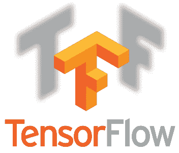

为什么是 Docker？

Docker 提供了一种在容器中运行安全隔离的应用程序的方法，该容器打包了所有的依赖项和库。[安装](https://docs.docker.com/engine/installation/)很容易。我有一篇关于 Docker 的有趣文章: [**使用 Docker**](https://hackernoon.com/making-right-things-using-docker-7296cf0f6c6e) 做正确的事情。

什么是张量流？

这是一个机器智能的开源软件库。

## 关于张量流

TensorFlow 是一个使用数据流图进行数值计算的开源软件库。图中的节点表示数学运算，而图边表示它们之间通信的多维数据数组(张量)。灵活的架构允许您使用单个 API 将计算部署到台式机、服务器或移动设备中的一个或多个 CPU 或 GPU。TensorFlow 最初是由谷歌机器智能研究组织内谷歌大脑团队的研究人员和工程师开发的，目的是进行机器学习和深度神经网络研究，但该系统足够通用，也适用于各种其他领域。

首先，我们需要创建目录和 **Dockerfile** 来构建我们的映像:

```
mkdir tensorflow
cd tensorflowtouch Dockerfile
```

我们将使用 ubuntu 镜像作为基础，因此我们应该从 Ubuntu 官方库[扩展我们的新镜像。并在以下时间后更新软件包:](https://hub.docker.com/_/ubuntu/)

```
**FROM** "ubuntu:bionic"**RUN** apt-get update && yes | apt-get upgrade
```

然后我们需要创建工作目录:

```
**RUN** mkdir -p /tensorflow/models
```

并用 **pip** 安装**git**；

```
**RUN** apt-get install -y git python-pip
**RUN** pip install --upgrade pip
```

目前就这些。由于我们要运行 [**对象检测示例**](https://github.com/tensorflow/models/tree/master/research/object_detection) 我们需要安装所有的依赖项。所有步骤你可以在 [**安装页面**](https://github.com/tensorflow/models/blob/master/research/object_detection/g3doc/installation.md) 上找到。

Tensorflow 对象检测 API 依赖于以下库:

*   Protobuf 2.6
*   枕头 1.0
*   lxml
*   tf Slim(包含在“tensorflow/models/research/”结帐中)
*   Jupyter 笔记本
*   Matplotlib
*   张量流

有关安装 Tensorflow 的详细步骤，请遵循 [Tensorflow 安装说明](https://www.tensorflow.org/install/)。我们将使用命令安装 Tensorflow:

```
**RUN** pip install tensorflow
```

其余的库可以通过 apt-get 安装在 Ubuntu 上:

```
**RUN** apt-get install protobuf-compiler python-pil python-lxml
**RUN** pip install jupyter
**RUN** pip install matplotlib
```

接下来，我们需要将示例代码复制到我们的映像中:

```
**RUN** git clone [https://github.com/tensorflow/models.git](https://github.com/tensorflow/models.git) **/tensorflow/models**
```

让我们制作/tensorflow/models/research 我们的工作目录:

```
**WORKDIR** /tensorflow/models/research
```

Tensorflow 对象检测 API 使用 Protobufs 来配置模型和训练参数。在使用框架之前，必须编译 Protobuf 库。这应该通过运行以下命令来完成:

```
**RUN** protoc object_detection/protos/*.proto --python_out=.
```

在本地运行时，应该将/tensorflow/models/research/和 slim 目录附加到 PYTHONPATH 中。这可以通过运行以下命令来完成:

```
**RUN** export PYTHONPATH=$PYTHONPATH:`pwd`:`pwd`/slim
```

接下来我们需要配置 jupyter 笔记本:

```
**RUN** jupyter notebook --generate-config --allow-root
**RUN** echo "c.NotebookApp.password = u'sha1:6a3f528eec40:6e896b6e4828f525a6e20e5411cd1c8075d68619'" >> /root/.jupyter/jupyter_notebook_config.py
```

最后一行是为 web 界面设置 **root** 密码。

为了处理来自主机的请求，我们需要公开端口:

```
**EXPOSE** 8888
```

并运行主流程:

```
**CMD** ["jupyter", "notebook", "--allow-root", "--notebook-dir=/tensorflow/models/research/object_detection", "--ip=0.0.0.0", "--port=8888", "--no-browser"]
```

## 所以完整的 Dockerfile 文件:

```
**FROM** "ubuntu:bionic"**RUN** apt-get update && yes | apt-get upgrade**RUN** mkdir -p /tensorflow/models**RUN** apt-get install -y git python-pip
**RUN** pip install --upgrade pip**RUN** pip install tensorflow**RUN** apt-get install -y protobuf-compiler python-pil python-lxml**RUN** pip install jupyter
**RUN** pip install matplotlib**RUN** git clone [https://github.com/tensorflow/models.git](https://github.com/tensorflow/models.git) /tensorflow/models**WORKDIR** /tensorflow/models/research**RUN** protoc object_detection/protos/*.proto --python_out=.**RUN** export PYTHONPATH=$PYTHONPATH:`pwd`:`pwd`/slim**RUN** jupyter notebook --generate-config --allow-root
**RUN** echo "c.NotebookApp.password = u'sha1:6a3f528eec40:6e896b6e4828f525a6e20e5411cd1c8075d68619'" >> /root/.jupyter/jupyter_notebook_config.py**EXPOSE** 8888**CMD** ["jupyter", "notebook", "--allow-root", "--notebook-dir=/tensorflow/models/research/object_detection", "--ip=0.0.0.0", "--port=8888", "--no-browser"]
```

要构建我们的形象营销:

```
docker build -t tensorflow .
```

你会看到这个过程:

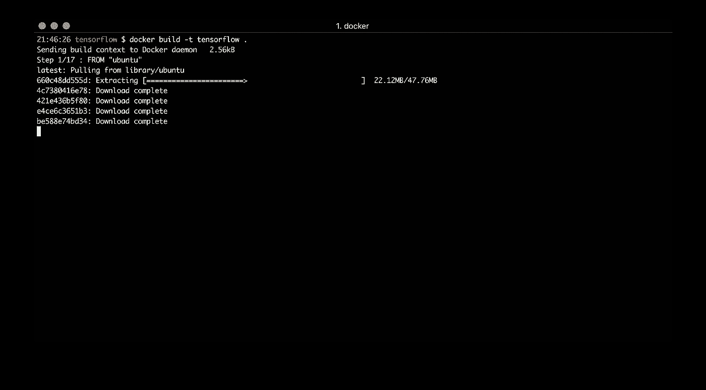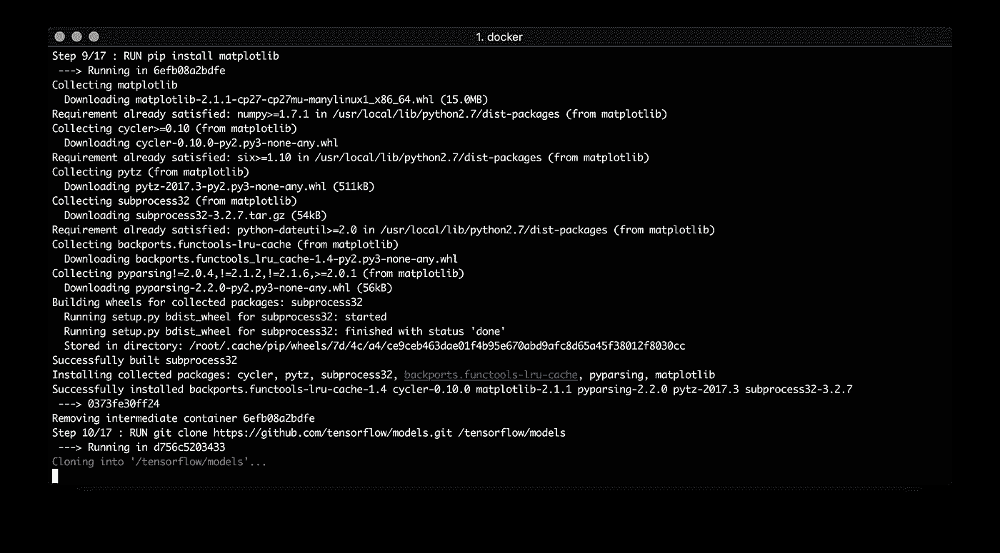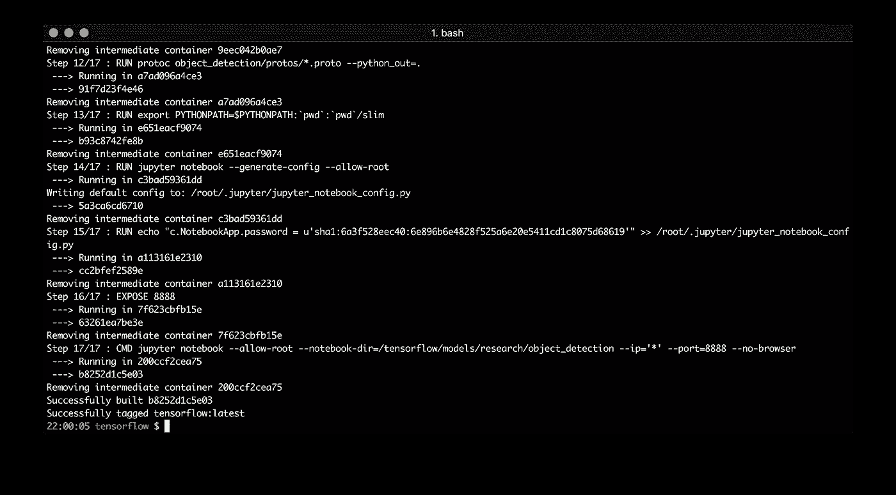

要从映像运行容器，请使用命令:

```
docker run --name tensorflow -p 8888:8888 -d tensorflow
```

并打开 [http://localhost:8888/](http://localhost:8888/:) :

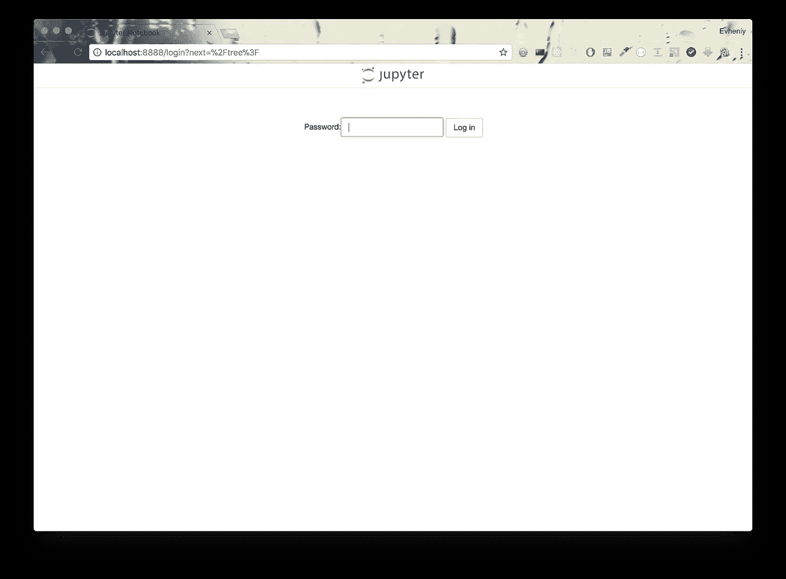

我们的密码是 **root** :

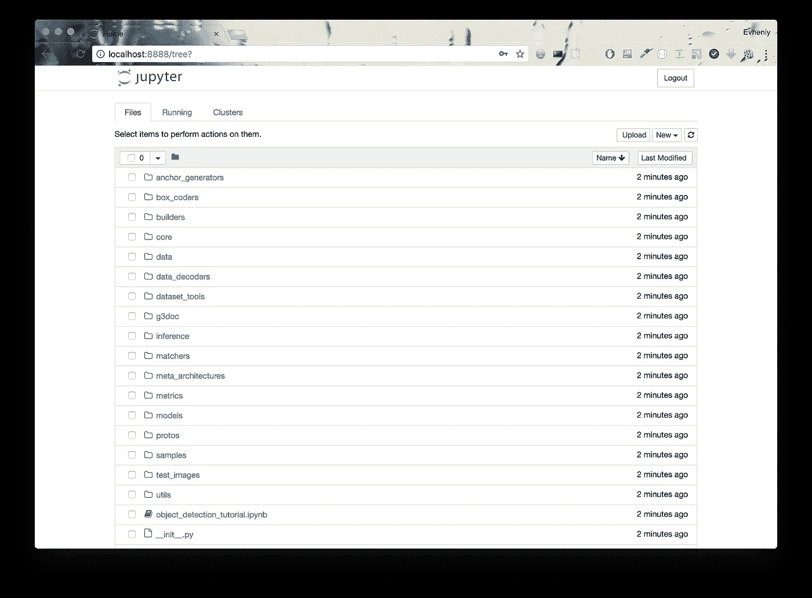

打开[object _ detection _ tutorial . ipynb](http://localhost:8888/notebooks/object_detection_tutorial.ipynb):

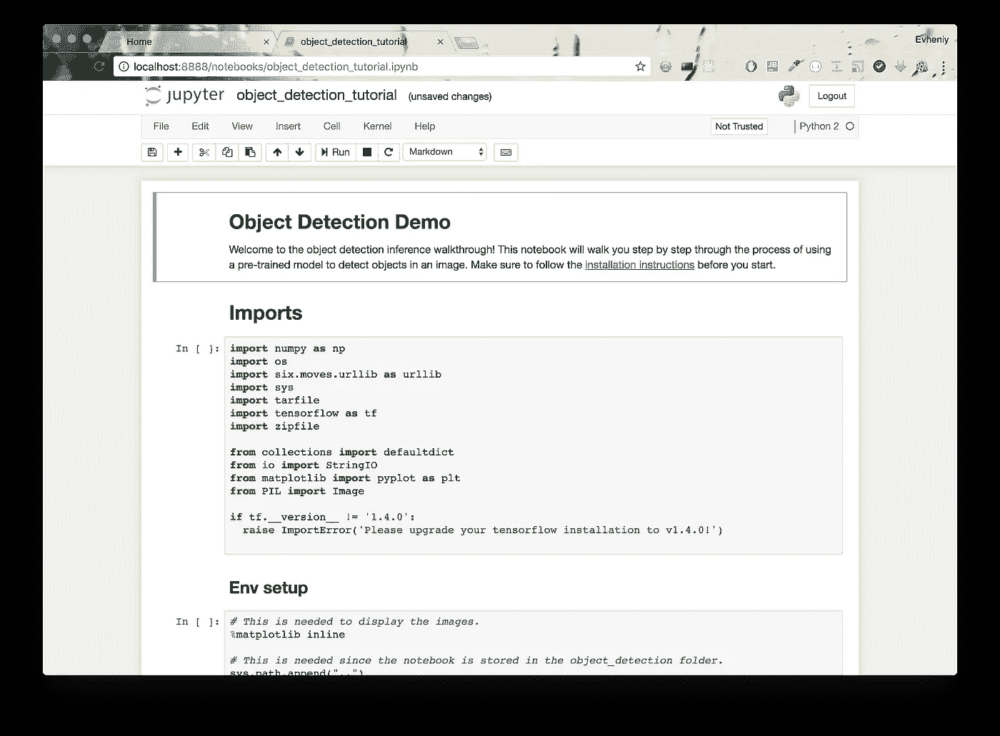

这是 Tensorflow 对象检测示例，我们的目标。

在运行之前，你需要做一个小的更新。将 TensorFlow 的版本从 1.4.0 更改为 1.4.1(目前为最新版本):

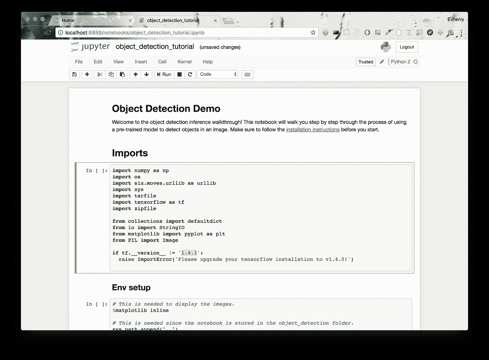

点击顶部菜单**单元格**->-**运行全部**即可运行:

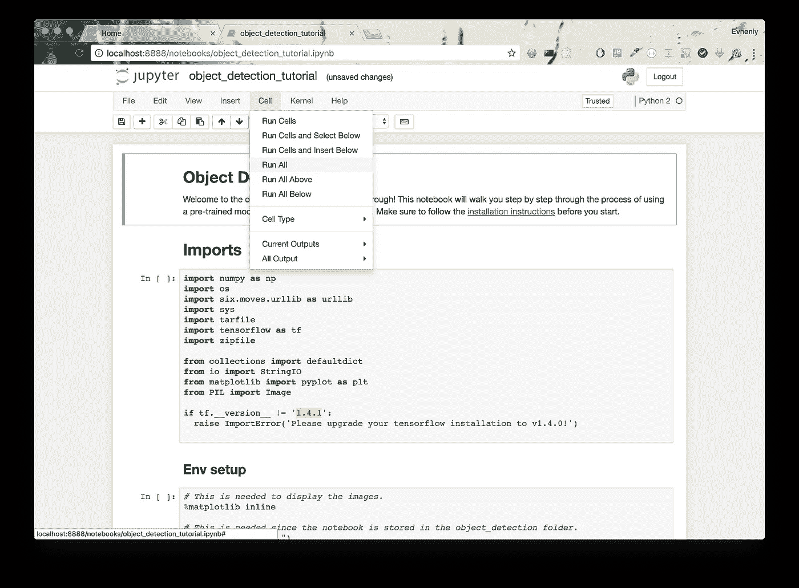

之后你会发现我们的工作成果:

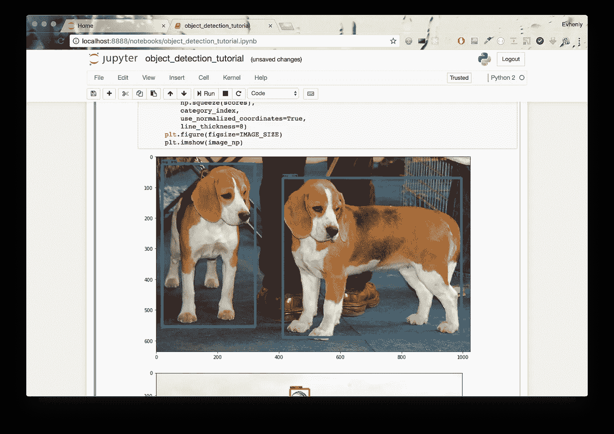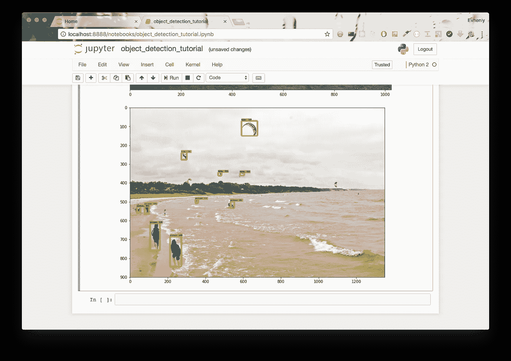

要停止它运行:

```
docker rm -f tensorflow
```

仅此而已。我们刚刚用 Google TensorFlow 创建了 docker 图像，并基于该图像运行了容器。多亏了 jupyter notebook，我们可以在浏览器中测试我们的例子。在下一篇文章中，我将展示如何使用不同的模型。

## 参考

*   [使用 Docker 做正确的事情](https://hackernoon.com/making-right-things-using-docker-7296cf0f6c6e)
*   [张量流](https://www.tensorflow.org/)
*   [张量流模型](https://github.com/tensorflow/models)
*   [用 Tensorflow 和 OpenCV 构建实时物体识别 App](/building-a-real-time-object-recognition-app-with-tensorflow-and-opencv-b7a2b4ebdc32)
*   [如何用 TensorFlow 的物体检测器 API 训练自己的物体检测器](/how-to-train-your-own-object-detector-with-tensorflows-object-detector-api-bec72ecfe1d9)
*   [Google tensor flow 物体检测 API 是实现图像识别最简单的方法吗？](/is-google-tensorflow-object-detection-api-the-easiest-way-to-implement-image-recognition-a8bd1f500ea0)
*   [用 Tensorflow 对象检测 API 构建玩具检测器](/building-a-toy-detector-with-tensorflow-object-detection-api-63c0fdf2ac95)
*   [使用物体检测实现更智能的零售结账体验](/using-object-detection-for-a-smarter-retail-checkout-experience-3f39acef857b)
*   [张量流检测模型动物园](https://github.com/tensorflow/models/blob/master/research/object_detection/g3doc/detection_model_zoo.md)