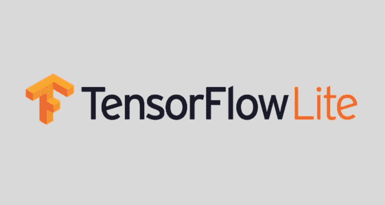
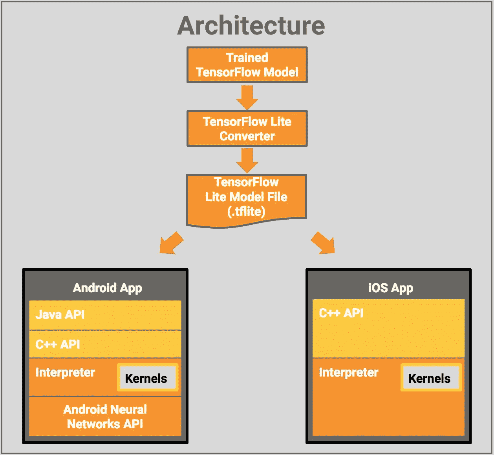

# 手机上的 tensor flow:tensor flow Lite

> 原文：<https://towardsdatascience.com/tensorflow-on-mobile-tensorflow-lite-a5303eef77eb?source=collection_archive---------6----------------------->

## 我们得到了什么？

TensorFlow Lite 是一款轻量级产品，是 TensorFlow Mobile 的下一步。你可以在 TensorFlow mobile 上做几乎所有的事情，但速度要快得多。

就像 TensorFlow Mobile 一样，它主要专注于移动和嵌入式设备开发人员，以便他们可以在 Android、iOS、Raspberry PI 等系统上开发下一级应用程序。

## 怎么更快？🚀

它支持一组**核心操作符，包括量化操作符和浮点操作符**，这些操作符已经针对移动平台进行了调整。

核心操作包括**预融合激活和偏置**，以进一步提高性能和量化精度。

TensorFlow Lite 支持在模型中使用**自定义操作**。

## 它是如何工作的？

让我们看看这个架构，了解它是如何工作的。

它从我们从训练数据生成的简单训练模型开始，然后执行测试。它将模型转换成 ***。tflite*** 模型文件格式，基于 [FlatBuffer](https://google.github.io/flatbuffers/) ，类似于[协议缓冲区](https://developers.google.com/protocol-buffers/?hl=en)，但没那么多。Floatbuffer 的 codeprint 要小很多。

然后，根据操作系统，你想使用移动优化的解释器😎这使得应用程序更小更快。

解释器通过使用静态图排序和自定义内存分配器来确保**最小负载、初始化和执行延迟**。

**Android 上的特殊:**它提供了 Android 神经网络 API 库，用于设备之间更好的接口，以利用**硬件加速**。

## 我们得到了什么？

1.  [**安卓神经网络 API**](https://developer.android.com/ndk/guides/neuralnetworks/index.html) **和 C++ API**
2.  新模型文件格式**。tflite👏**

3.速度:新的神经网络 API 使得计算速度更快。🏃

4.**隐私**:数据不会离开设备。🔐

5.**可用性**:离线工作。✈️

6.**没有计算成本**:所有的计算都在你的设备上进行。因此，不需要服务器。💵

7.**预测试模型:**所有模型开箱即用。📦

《盗梦空间》第三版

b) [移动网络](https://github.com/tensorflow/models/blob/master/research/slim/nets/mobilenet_v1.md)

b)适用于所有第一和第三方应用程序😎[Android Wear 上的智能回复](https://research.googleblog.com/2017/02/on-device-machine-intelligence.html)。

## 权衡取舍😐

1.  **系统利用率**:评估神经网络涉及大量计算，这可能会增加电池电量的使用。你应该考虑监控电池🔋健康，如果这是你的应用程序所关心的，特别是对于长时间运行的计算。
2.  **应用尺寸**:注意你的模型尺寸。模型可能会占用数兆字节的空间。如果在 APK 中捆绑大型模型会过度影响用户，您可能需要考虑在应用程序安装后下载模型、使用较小的模型或在云中运行计算。NNAPI 不提供在云中运行模型的功能。☁️

️I 试图让这篇文章尽可能准确易懂。有任何意见、建议或者有任何问题，请在评论中写下。

有关如何在移动应用程序中使用 **TensorFlow 的更多教程**请关注我的[**Medium**](https://medium.com/@sagarsharma4244)[脸书](https://www.facebook.com/profile.php?id=100003188718299)[Twitter](https://twitter.com/SagarSharma4244)[LinkedIn](https://www.linkedin.com/in/sagar-sharma-232a06148/)[Google+](https://plus.google.com/u/0/+SAGARSHARMA4244)[Quora](https://www.quora.com/profile/Sagar-Sharma-71)查看类似帖子。

**鼓掌吧！分享一下！跟我来。**

乐意帮忙。荣誉……..

# 你会喜欢的以前的故事:

1.  [手机上的 TensorFlow:教程(Android 和 iOS 上)](/tensorflow-on-mobile-tutorial-1-744703297267)

2.[历元对批量对迭代](/epoch-vs-iterations-vs-batch-size-4dfb9c7ce9c9)

3. [TensorFlow 图像识别 Python API 教程 CPU 上](/tensorflow-image-recognition-python-api-e35f7d412a70)

4.[激活功能解释:神经网络](https://medium.com/towards-data-science/activation-functions-neural-networks-1cbd9f8d91d6)

5.[CPU 上带有自定义图像的列车启动](/training-inception-with-tensorflow-on-custom-images-using-cpu-8ecd91595f26)