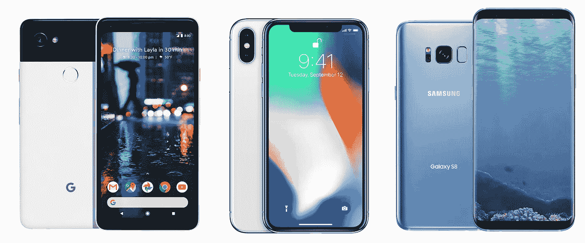

# 手机上的 TensorFlow:教程

> 原文：<https://towardsdatascience.com/tensorflow-on-mobile-tutorial-1-744703297267?source=collection_archive---------3----------------------->

## **在安卓和 iOS 上**

TensorFlow 通常用于从大量数据中训练巨大的模型，但没有人能忽视智能手机的新兴市场以及让我们的未来“人工智能”的需要。而那些对未来迫不及待、热爱机器学习的人，正在通过制造工具来推动边界，这些工具瞄准了数万亿美元的市场。



[Source](https://mossandfog.com/2017/10/06/design-verdict-iphone-x-vs-google-pixel-2-vs-samsung-galaxy-s8/)

你是这个数万亿美元市场的一部分，因为你现在可能正在你的 Android 或 iOS 上阅读这篇文章，或者你的口袋里有一个，无论是哪种情况，你都知道移动设备上面向未来的机器学习是多么重要…

我将写 2 个不同的教程，关于如何在你的 Android 和 iOS 设备上运行你的机器学习模型。

## 这是第一个教程。

本教程使用了更稳定的 tensorflow 版本，即 TensorFlow Mobile，因此请按照步骤来实现您的模型，并使它们**针对移动设备**进行优化。

我们将通过重新训练 Inception-v3 模型的最后(瓶颈)层来制作一个*图像分类器，然后为您的智能设备优化该模型。*

本教程仅包含 5-6 个步骤:

## 第一步:用 TensorFlow 创建你的模型

我很确定你已经知道这一步，因为你正在学习在智能手机上运行相同的模型。

另外，为了使本教程严格集中在智能手机的*实现模型上，*我推荐这个快速教程🔹[利用 CPU 上的自定义图像进行列车启动](/training-inception-with-tensorflow-on-custom-images-using-cpu-8ecd91595f26)🔹这样我们就能达成一致了📄你可以用一个新训练的模型在一个新的目录中开始这些东西。

**仅供参考:** *数据*📗*模型被训练的地方包含郁金香的种类*🌷*、雏菊、向日葵*🌻*、蒲公英和玫瑰*🌹

在这之后，你应该有这两个文件:

```
tf_files/retrained_graph.pb 
```

其中包含所选网络的一个版本，以及根据您的类别重新训练的最终层。

和

```
 tf_files/retrained_labels.txt
```

这是一个文本文件📝包含标签。

## 步骤 2:创建一个优化的模型😎

运行以下命令提示符(保持路径正确)

```
python -m tensorflow.python.tools.optimize_for_inference \
  --input=tf_files/retrained_graph.pb \
  --output=tf_files/optimized_graph.pb \
  --input_names="input" \
  --output_names="final_result"
```

它将创建一个新的优化模型文件`tf_files/optimized_graph.pb`

> **注意:**如果出现错误`KeyError: “The following input nodes were not found: {‘input’}\n”` ，则将“输入”改为“Mul”。

**取舍😇**

为了减少应用的预处理，同时减少库的大小，tensorflow 只支持推理过程中常用的操作子集。不支持的操作有[tensor flow/contrib/makefile/TF _ op _ files . txt](https://github.com/tensorflow/tensorflow/blob/master/tensorflow/contrib/makefile/tf_op_files.txt)

现在，为了确保我们刚刚创建的任何图形文件都包括支持的操作，如下所示…

## 验证✔️

确保新的优化图正在运行，并且 **optimize_for_inference** 文件删除了一组给定输入和输出不需要的所有节点，并且没有改变网络的输出。

使用图形**retained _ graph . Pb**和 **optimized_graph.pb** 上的 **label_file** 比较同一*图像*的输出

用**retained _ graph . Pb**

```
python -m scripts.label_image \
  --graph=tf_files/retrained_graph.pb \
  --image=tf_files/flower_photos/daisy/3475870145_685a19116d.jpg
```

用 **optimized_graph.pb**

```
python -m scripts/label_image \
    --graph=tf_files/optimized_graph.pb \
    --image=tf_files/flower_photos/daisy/3475870145_685a19116d.jpg
```

逐一运行这些命令，如果两个输出相同，这意味着 **optimized_graph.pb** 已完美创建🎉

## 第三步:量化模型，然后压缩

问题仍然是模型的尺寸仍然很大，肯定不适合手机。因为，图中所占的大部分空间是由权重占据的，权重是大块的浮点数。每个权重的浮点值略有不同，规律性很小。

但是压缩通过利用数据中的规律性来工作，这解释了这里的失败。

通过对网络的权重进行量化，量化有助于通过因子来减小神经网络的大小。这在图形中给出了更多的重复，并且对之后的压缩有很大的帮助。

现在使用 **quantize_graph** 脚本将更改应用到图形:

```
python -m scripts.quantize_graph \
  --input=tf_files/optimized_graph.pb \
  --output=tf_files/rounded_graph.pb \
  --output_node_names=final_result \
  --mode=weights_rounded
```

现在压缩模型:

```
gzip -c tf_files/rounded_graph.pb > tf_files/rounded_graph.pb.gz

gzip -l tf_files/rounded_graph.pb.gz
```

这将创建一个 **rounded_graph.pb** 文件。

您应该会看到压缩方面的一些显著改进。

> **注意:**如果您在运行 **quantize_graph** 时遇到任何错误，请下载该文件并将其粘贴到 tensorflow 库(安装 TensorFlow 的位置)中的*tools/quantization/quantize _ graph . py*中。

> 从这里开始，教程分为两个部分 Android 和 iOS。

# 🍎ios📱

## 第四步:添加 tensor flow-实验舱

将 TensorFlow-experimental pod 添加到您的 pod 文件中，这将安装一个通用二进制框架。这是在 iOS 上运行 tensorflow 最简单的方法。

## 步骤 5:创建你的应用程序

🔹创建您自己的应用程序或在 XCode 中载入您已经创建的应用程序。

🔹在项目根目录下添加一个名为 Podfile 的文件，内容如下:

```
target 'YourProjectName'
pod 'TensorFlow-experimental'
```

🔹运行`pod install`下载&安装`TensorFlow-experimental` pod。

🔹打开`YourProjectName.xcworkspace`，添加你的代码。

🔹在你的应用的**构建设置**中，确保将`$(inherited)`添加到**其他链接器标志**和**头搜索路径**部分。

## 步骤 6:运行样品

您需要 Xcode 7.3 或更高版本来运行我们的 iOS 示例。

简单、基准和相机中有三个例子。可以克隆[代码](https://github.com/tensorflow/tensorflow/tree/master/tensorflow/examples/ios#building-the-tensorflow-ios-libraries-from-source)。

此外，从 tensorflow 的根目录下载 [Inception v1](https://storage.googleapis.com/download.tensorflow.org/models/inception5h.zip) ，并使用以下步骤将标签和图形文件提取到简单示例和相机示例中的数据文件夹中:

```
mkdir -p ~/graphs
curl -o ~/graphs/inception5h.zip \
 https://storage.googleapis.com/download.tensorflow.org/models/inception5h.zip \
 && unzip ~/graphs/inception5h.zip -d ~/graphs/inception5h
cp ~/graphs/inception5h/* tensorflow/examples/ios/benchmark/data/
cp ~/graphs/inception5h/* tensorflow/examples/ios/camera/data/
cp ~/graphs/inception5h/* tensorflow/examples/ios/simple/data/
```

切换到其中一个示例目录，下载[tensor flow-experimental](https://cocoapods.org/pods/TensorFlow-experimental)pod，并打开 Xcode 工作区。请注意，安装 pod 可能需要很长时间，因为它很大(约 450MB)。如果您想运行这个简单的示例，那么:

```
cd tensorflow/examples/ios/simple
pod install
open tf_simple_example.xcworkspace #note .xcworkspace,not .xcodeproj 
```

在 XCode 模拟器中运行简单的应用程序。您应该会看到一个带有**运行模式**按钮的单屏幕应用程序。点击它，你会看到一个格蕾丝·赫柏的图像。一旦你建立并运行它，你应该得到一个实时的摄像机视图，你可以指向物体以获得实时的识别结果。

> **注意:**我很确定我犯了一些错误或者在 iOS 部分留下了一些东西。请浏览下面的官方链接，如果你有任何错误，请在下面评论，社区会帮助你。

## 现在，你可以跳过这篇文章的 Android 部分。

[https://github . com/tensor flow/tensor flow/tree/master/tensor flow/examples/IOs # building-the-tensor flow-IOs-libraries-from-source](https://github.com/tensorflow/tensorflow/tree/master/tensorflow/examples/ios#building-the-tensorflow-ios-libraries-from-source)

 [## 在 iOS | TensorFlow 上构建 TensorFlow

### TensorFlow-experimental pod 目前大约为 450MB。它如此之大的原因是因为我们捆绑了多个…

www.tensorflow.org](https://www.tensorflow.org/mobile/ios_build) 

# 🍭 🍦机器人🍞🐝 🍩

## 步骤 4:安装 Android Studio 并测试运行

有两种方法可以做到这一点:Android Studio 和 Bazel。我将使用 AS，因为更多的人熟悉它。

如果您还没有安装它，请到这里安装它

[](https://developer.android.com/studio/index.html) [## 下载 Android Studio 和 SDK 工具| Android Studio

### 下载官方 Android IDE 和开发工具，为 Android 手机、平板电脑、可穿戴设备、电视和…构建应用

developer.android.com](https://developer.android.com/studio/index.html) 

## 试运转🏃

为了检查 Android Studio 中的一切是否正常，让我们进行一次测试。

🔸打开 Android Studio，选择“📁打开一个现有的 Android Studio 项目”。

🔸进入**tensor flow-for-poets-2/Android/TF mobile**目录。

🔸打开 **Build.gradle** 文件，同步 **Gradle。**如果一切正常，点击**构建>构建 APK** 按钮。

> **注意:**如果你和我一样是 Android Studio 的新手，并且有一些问题，请在下面评论。

现在应该有一个文件夹，里面有 **app.apk** 文件，复制到手机里安装。另外，记住打开手机中的**开发者模式**。

## 第五步:运行定制的应用程序👏 👏 👏

如果到现在为止一切正常，从现在开始就是小菜一碟。

默认应用程序是一个分类图像应用程序，有来自 [Imagenet](http://www.image-net.org/) 的 1000 个类别。

现在，要运行我们定制的应用程序，请执行以下两个步骤:

## 将模型文件添加到项目中

现在，演示应用程序正在查看出现在***Android/TF mobile/assets***中的 **graph.pb** 文件和 **label.txt** 文件，而不是您的 **rounded_graph.pb** 和**retained _ labels . txt**

现在，用下面的命令替换这些文件，或者也可以手动替换。

```
cp tf_files/rounded_graph.pb android/tfmobile/assets/graph.pb
cp tf_files/retrained_labels.txt android/tfmobile/assets/labels.txt
```

## 更改`ClassifierActivity.java file`中的`output_name"`

我们模型的输出节点有一个不同的名字:`"final_result"`。打开`ClassifierActivity.java`，更新`OUTPUT_NAME`变量，如下所示:

```
private static final String INPUT_NAME = "input";
private static final String OUTPUT_NAME = "final_result";
```

## 👏 👏 👏再次运行，事情应该工作了。👏 👏 👏

> **注意:**如果你出现任何错误或者打中了下面任何一个墙评论。


️I 试图让这篇文章尽可能准确易懂。有任何意见、建议或疑问，请写在评论里。

有关如何在移动应用程序中使用**tensor flow**的更多教程，请关注我的 [**中的**](https://medium.com/@sagarsharma4244) 、[脸书](https://www.facebook.com/profile.php?id=100003188718299)、 [Twitter](https://twitter.com/SagarSharma4244) 、 [LinkedIn](https://www.linkedin.com/in/sagar-sharma-232a06148/) 、 [Google+](https://plus.google.com/u/0/+SAGARSHARMA4244) 、 [Quora](https://www.quora.com/profile/Sagar-Sharma-71) 以查看类似的帖子。

**鼓掌吧！分享一下！跟我来。**

乐意帮忙。荣誉……..

# 你会喜欢的以前的故事:

1.  [手机上的 tensor flow:tensor flow Lite](/tensorflow-on-mobile-tensorflow-lite-a5303eef77eb)

2.[纪元 vs 批量 vs 迭代](/epoch-vs-iterations-vs-batch-size-4dfb9c7ce9c9)

3. [TensorFlow 图像识别 Python API 教程 CPU 上](/tensorflow-image-recognition-python-api-e35f7d412a70)

4.[激活函数解释:神经网络](https://medium.com/towards-data-science/activation-functions-neural-networks-1cbd9f8d91d6)

[](https://medium.com/@sagarsharma4244/how-to-send-emails-using-python-4293dacc57d9) [## 如何使用 Python 发送电子邮件

### 使用 Flask 设计专业邮件！

medium.com](https://medium.com/@sagarsharma4244/how-to-send-emails-using-python-4293dacc57d9)