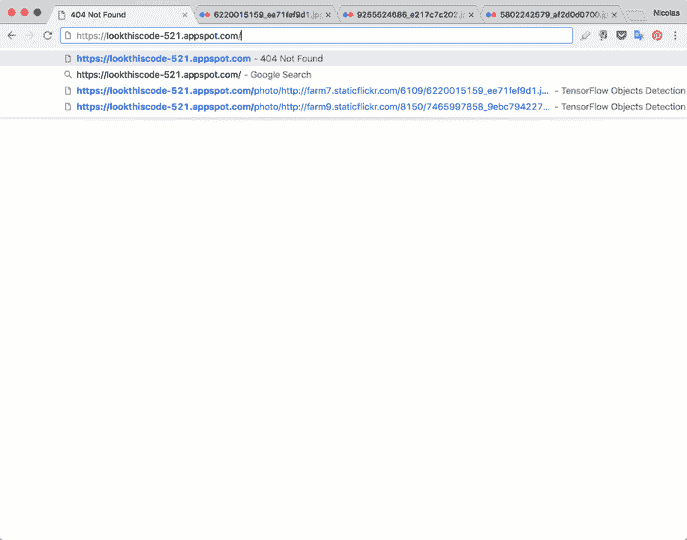
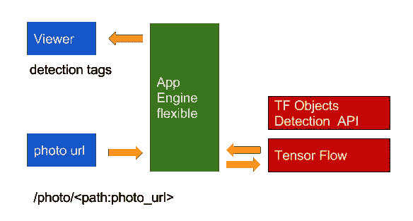

# 使用应用程序引擎的 TensorFlow 照片 x 射线对象检测

> 原文：<https://towardsdatascience.com/tensorflow-photo-x-ray-object-detection-with-app-engine-7de9dd8f63f5?source=collection_archive---------5----------------------->

在以前的文章中，我们使用 [TensorFlow 对象检测 API](https://github.com/tensorflow/models/tree/master/object_detection) 应用不同类型的模型来分析图像中的对象。([第一条](https://medium.com/towards-data-science/object-detection-dinner-with-friends-ea1caab3b666)，[第二条](https://medium.com/towards-data-science/tensorflow-object-detection-an-overview-of-facebook-publications-2391698ed82f))

在这些例子中，解决方案总是为一个控制台应用程序设计的(即一个本地运行的 Python 脚本)。

现在我们的挑战是把它带到一个**网络环境**，**检测照片中的物体(比如 x 光)**，最后我们应该提出一个**简单的架构选项。**

# 概观

我们可以考虑使用服务器模式的几种架构选项(来自官方文档 [TensorFlow Serving](https://tensorflow.github.io/serving/) 的示例)。我们甚至可以考虑传统的替代方案(如 Apache、Nginx 等)。)但是我们应该考虑安装 Web 服务器，并使用 [TensorFlow](https://www.tensorflow.org/) 调整所有元素来执行分析。

我喜欢使用像 App Engine 这样的**平台** **方案**的想法，但是实现我们的想法对于像 App Engine 这样的传统环境来说是一个挑战(我们可以考虑使用 PubSub 和 VMs workers 的解决方案，但是会考虑到更多的复杂性)，所以…为了解决我们的挑战，我将使用 **App Engine 灵活环境**。

# 拟议解决方案

* [更高质量的视频](https://youtu.be/Uoi7O04asd4)

# 提议的架构

# App Engine 灵活环境项目

*   app.yaml
*   main.py
*   模板/索引. html

关于 [App Engine 灵活环境](https://cloud.google.com/appengine/docs/flexible/)的更多详情

照片的评估程序:

*   主要依赖关系[Flask](http://flask.pocoo.org/)(0 . 12 . 2)[tensor flow](https://www.tensorflow.org/)(1 . 2 . 1)除了这些支持元素，numpy，Image，cStringIO，urllib。

要使用这个示例，您需要 [TensorFlow 对象检测 API](https://github.com/tensorflow/models/tree/master/object_detection) 的这些基本元素:

*   模型[文件夹]
*   原型[文件夹]
*   实用程序[文件夹]

**注**:如果你需要下载测试功能文件，[这里](https://storage.googleapis.com/appengine_tensorflow/object_detection_api.zip)我准备了一个工作版本。

此外，我们需要在我们的解决方案中有模型的**冻结 _ 推理 _ 图形**。对于我们的例子:

*   SSD _ mobilenet _ v1 _ coco _ 11 _ 06 _ 2017(如果您需要更多条件，可以更改此型号)

**注意**:如果你需要下载测试功能文件，这里[我准备了一个工作版本。](https://storage.googleapis.com/appengine_tensorflow/ssd_mobilenet_v1_coco_11_06_2017.zip)

对于我们的例子，我们使用 [COCO](http://mscoco.org/) 作为对象识别方案，因此我们需要识别标签来进行分析。

*   data/mscoco_label_map.pbtxt

**注意**:如果你需要下载测试功能文件，这里[我准备了一个工作版本。](https://storage.googleapis.com/appengine_tensorflow/data.zip)

在这里，我将从这个 [Github 库](https://github.com/nbortolotti/TensorPhotoXRay)中实现解决方案(初始阶段)。

# 部署项目

*   **本地** : python main.py
*   **生产环境** : gcloud app 部署

*(-v 版本)如果要将其部署到特定版本。

**注意**:你要有 [Google Cloud SDK](https://cloud.google.com/sdk/docs/) 。更多关于 App Engine 灵活环境的信息，Python [在此。](https://cloud.google.com/appengine/docs/flexible/python/quickstart)