# TensorFlow &反光胶带🏀(我篮球打得不好吗？)

> 原文：<https://towardsdatascience.com/tensorflow-reflective-tape-why-im-bad-at-basketball-a30a923332de?source=collection_archive---------13----------------------->

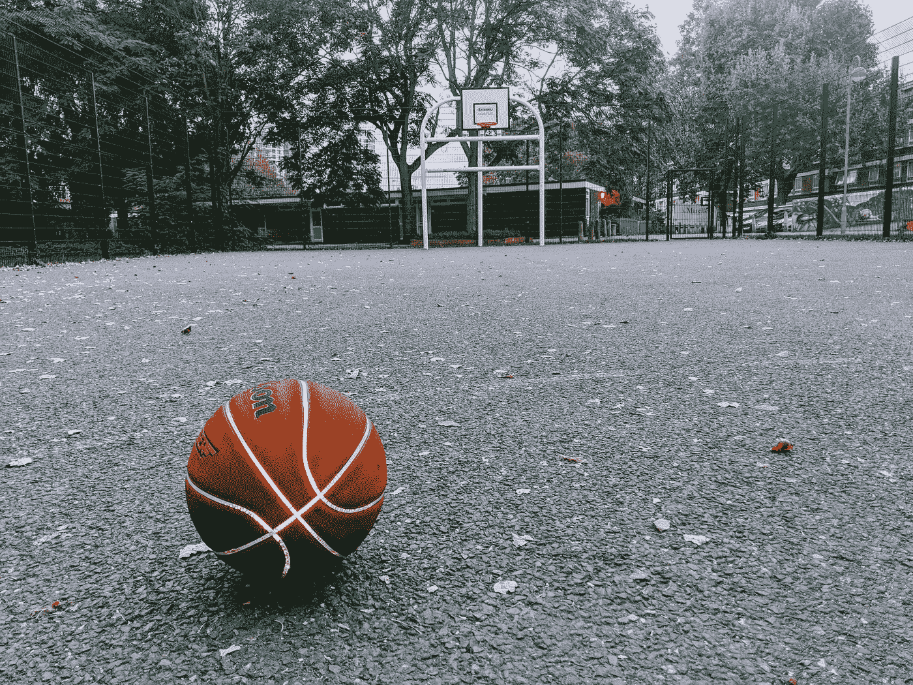

最近一个朋友让我迷上了篮球。事实证明，这比看起来难多了。没关系，我可以用机器学习来设计解决方案。如果你对 ML 和投篮感兴趣，那么也有[这篇文章](https://medium.com/tensorflow/tf-jam-shooting-hoops-with-machine-learning-7a96e1236c32)在模拟中结合了张量流和篮球。

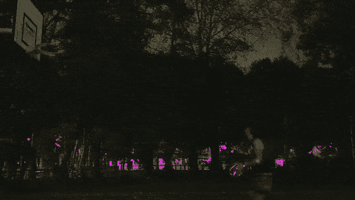

nothing but net… if there was a net

任务是找到我拍摄的准确角度。然后，我就可以积极主动地利用这些信息，变得更好。

*嘶！这一切的代码都在我的* [*Github*](https://github.com/ZackAkil/optimising-basketball) 上

# 任务 1:收集数据

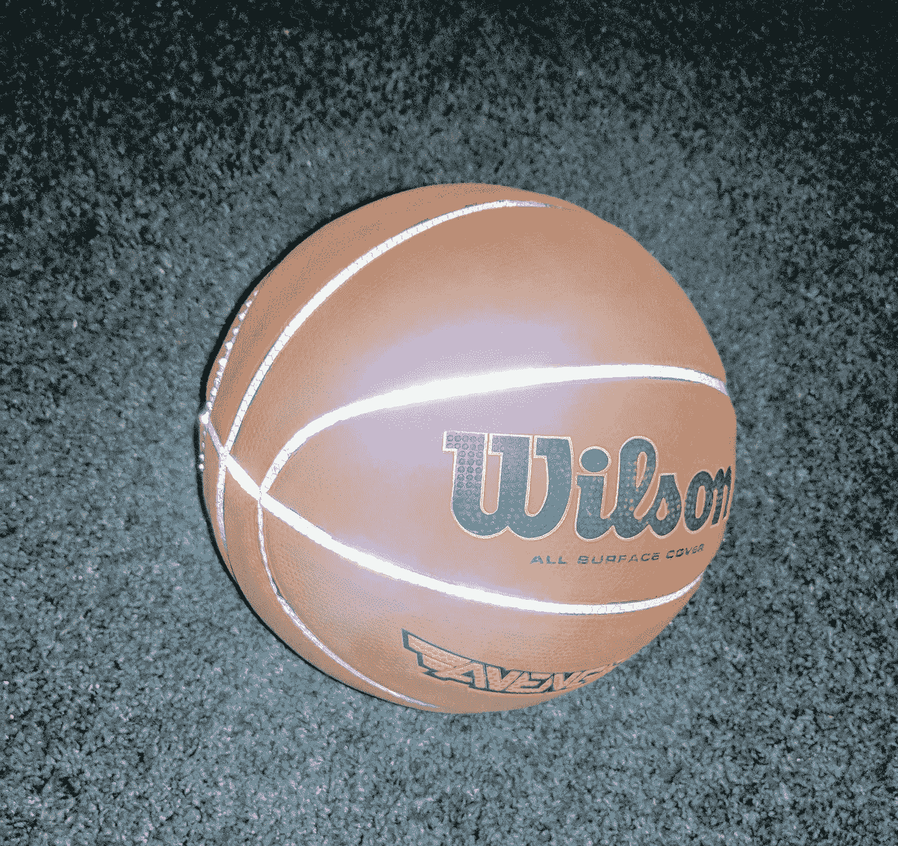

I didn’t need to follow the seems of the ball, but it looks cool

我没有配备 200 个摄像头的 3D 追踪工作室，但我有 Ebay。网上买[反光带](https://www.google.com/search?q=reflective+tape)贴在球上还是挺容易的。然后(由于我当地的球场缺乏照明)，我可以录下一些我晚上练习的镜头，并捕捉球的运动。

我手机内置的手电筒提供了完美的光源来反射球的反光。

因此，捕捉到的镜头显示了一个闪闪发光的物体飞过一个几乎黑暗的场景，非常适合在 python 中进行一些图像处理。

# 任务 2:将我们的视频导入 python

首先，我用 Python 做所有事情，将视频导入 Python 的一个非常简单的方法是使用一个名为' [scikit-video](http://www.scikit-video.org) '的库，所以我安装了:

```
pip install scikit-video
```

然后用它来加载我的视频作为一个矩阵:

```
from skvideo.io import vreadvideo_data = vread('VID_20180930_193148_2.mp4')
```

这个数据的形状(可以通过运行 **video_data.shape** 找到)是(220，1080，1920，3)。这意味着 3 个颜色通道(红、绿、蓝)的 1080×1920 像素的 220 帧:

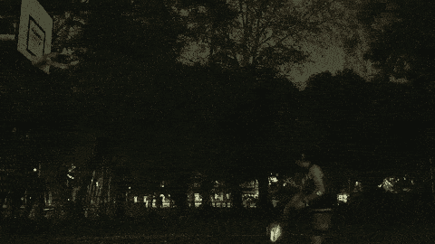

raw video data

# 任务 3:提取镜头(图像处理)

所以我想得到球运动的数据。幸运的是，这是视频中唯一会动的东西之一。所以我可以做我最喜欢的视频处理技巧:**增量帧提取**！(*我就是这么叫的，不过可能还有另外一个名字*)。

通过从下一帧中的所有像素值中减去一帧中的所有像素值，您将只在已经改变的像素中得到非零值。

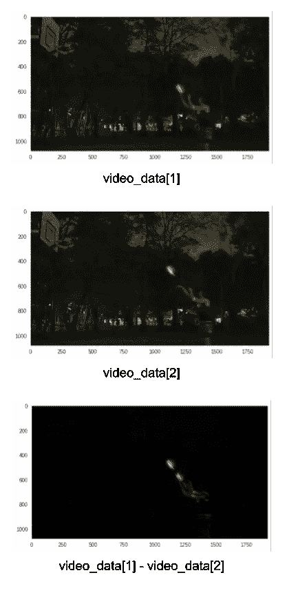

calculating delta frame in order to isolate moving pixels

酷酷酷，现在我对视频中的每一帧都这样做，并将结果合并成一幅图像:

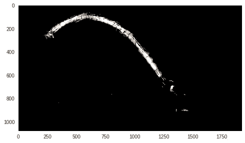

adding together all of the delta frames from the video sequence

接下来是将拍摄数据提取成可用的格式。所以我们将把精简后的像素值转换成一个由***【x】***和 ***y*** 点组成的列表。完成这项工作的代码是一个名为 [**numpy.where**](https://docs.scipy.org/doc/numpy-1.13.0/reference/generated/numpy.where.html) 的 numpy 函数，它将在一个数组中找到所有**为真**的值，并返回它们的索引(即它们在矩阵中的位置)。

但在此之前，我们将快速裁剪出球的轨迹并翻转数据，使其从原点(场景的左下方)开始:

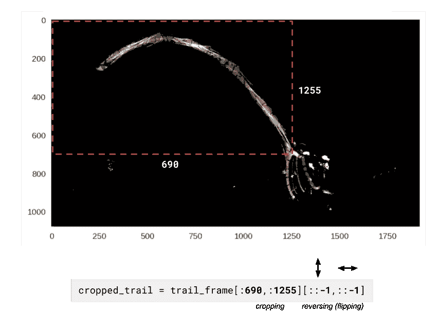

由此产生的图像:

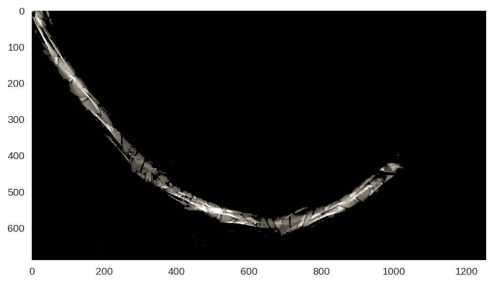

注意到它看起来还是上下颠倒了吗？这只是因为图像倾向于从左上角的**开始绘制(注意轴编号)。当我们将像素转换为数据点并将它们绘制在普通图上时，它们将从底部的**左下角开始绘制。****

现在我们运行我们的 **numpy.where** 代码来获取像素作为数据点:

```
pixels_that_are_not_black = cropped_trail.sum(axis=2) > 0y_data, x_data = numpy.where(pixels_that_are_not_black)
```

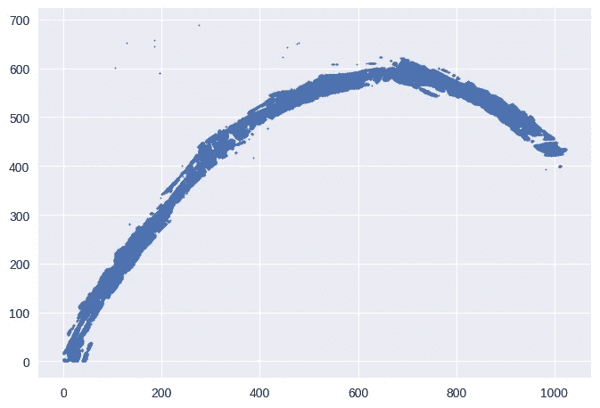

awesome! our relatively clean ball trajectory data

# 任务 4:构建张量流模型

这就是 TensorFlow 大放异彩的地方。你可能习惯于听说使用 TensorFlow 来构建神经网络，但你可以定义几乎任何数学公式，并告诉它优化你想要的任何部分。在我们的例子中，我们将使用从小学就知道的轨迹公式:

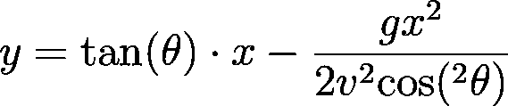

extremely mathematical equation of trajectory that I found online

**θ** (theta)是拍摄的角度(*我们真正关心的值*)

***v*** 是初速度

***g*** 是重力(9.8m/s)

***x*** 是水平位置(*数据我们已经*)

***y*** 是垂直位置(*数据我们已经*)

一个更有趣的方式来看这个方程的作用是用[这个轨迹工具](https://www.desmos.com/calculator/gjnco6mzjo)来玩。

我们可以使用我击球的球轨迹作为 ***x*** 和*y**方程和任务张量流，找到适合我击球的正确角度( **θ** )和初始速度( ***v*** )*

*我们将开始在张量流中重建我们的轨迹方程:*

*首先告诉它，当我们运行优化时，我们将输入什么数据:*

```
*x = tf.placeholder(tf.float32, [**None**, 1])
y = tf.placeholder(tf.float32, [**None**, 1])*
```

*接下来，告诉它我们希望它调整哪些变量，以使轨迹曲线符合我们的数据:*

```
*angle_variable = tf.Variable(40.0, name='angle_variable')
force_variable = tf.Variable(100.0, name='force_variable')

gravity_constant = tf.constant(9.8, name='gravity_constant')*
```

*并将所有这些结合在一起(**警告**:这看起来会很乱，但这只是之前看到的用 TensorFlow 语法编写的数学方程):*

```
*left_hand_side = x * tf.tan(deg2rad(angle_variable))
top = gravity_constant * x ** 2
bottom = (2*(force_variable)**2) * 
            (tf.cos(deg2rad(angle_variable))**2)output = left_hand_side - (top / bottom)*
```

*然后告诉 TensorFlow 如何判断它在将轨迹函数拟合到我们的数据时是否做得很好:*

```
*# the lower this score, the better
error_score = tf.losses.mean_squared_error(y, output)*
```

*创建一个优化器，对变量(angle_variable 和 force_variable)进行实际调整，以降低 error_score:*

```
*optimiser = tf.train.AdamOptimizer(learning_rate=5) 
optimiser_op = optimiser.minimize(error_score)*
```

# *任务 5:魔法*

*我们现在可以运行优化任务来找到适合我的镜头的**角度变量**和**力变量**值。*

```
*sess = tf.Session()
sess.run(tf.global_variables_initializer())# do 150 steps of optimisation
for i in range(150): sess.run([optimiser_op], 
             feed_dict={x: np.array(x_data).reshape(-1, 1), 
                        y: np.array(y_data).reshape(-1, 1)})found_angle = sess.run(angle_constant.value())print(found_angle)*
```

*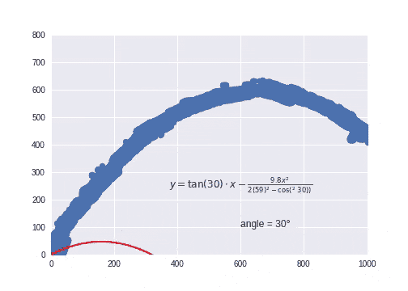*

*TensorFlow finding the angle of my shot*

*在优化的最后，我们发现最符合我的拍摄数据的轨迹函数的角度约为 61 度…不知道如何处理这些信息…我想我可以看看专业拍摄角度是什么，以便进行比较…待续。*

> *要吸取的教训:你总是可以用完全不必要(但有趣)的机器学习来分散注意力。*

*我使用的所有代码都可以在我的 Github 上找到:*

*[](https://github.com/ZackAkil/optimising-basketball) [## ZackAkil/优化-篮球

### 用张量流和图像处理分析我的篮球技术。-ZackAkil/优化-篮球

github.com](https://github.com/ZackAkil/optimising-basketball)*