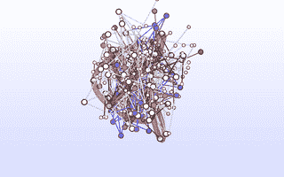
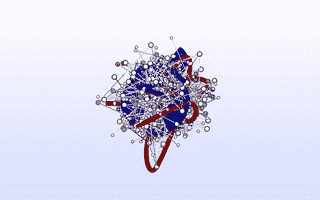
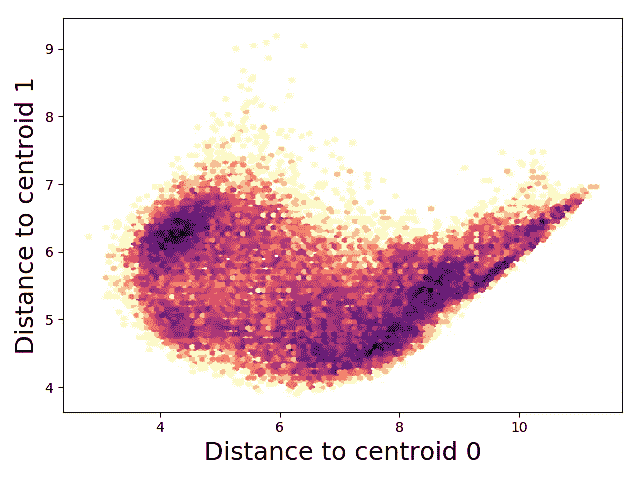

# Tensorflow RMSD:使用 Tensorflow 做非设计用途的事情

> 原文：<https://towardsdatascience.com/tensorflow-rmsd-using-tensorflow-for-things-it-was-not-designed-to-do-ada4c9aa0ea2?source=collection_archive---------3----------------------->

*职务由* [*马修·哈里根*](http://mpharrigan.com) *。在*[*GitHub*](https://github.com/mdtraj/tftraj)*上查看代码并报告问题。*



深度学习彻底改变了图像和语音处理，让你可以把[边缘变成猫](https://affinelayer.com/pixsrv/index.html)。在我们的实验室里，我们将这些技术应用于小分子药物研发。

深度学习革命的一个副产品是产生了几个高质量的开源机器学习框架，可以计算任意操作的梯度。谷歌的 [Tensorflow](https://www.tensorflow.org/) 可能是最知名的。我的研究专注于理解蛋白质和其他生物分子的大型分子动力学模拟的结果。你可以很容易地把预测小分子结合能想象成一个学习问题；除了[艺术蛋白质图像](https://twitter.com/mmsltn/status/759590171427745792)之外，我们能否利用一些深度学习的进展来研究分子动力学？

生物物理学中的一个常见操作是用 [RMSD 距离度量](https://en.wikipedia.org/wiki/Root-mean-square_deviation_of_atomic_positions)计算两种蛋白质姿态(构象)的相似性。这种度量因其平移和旋转不变性而受人喜爱。粗略地说，它覆盖了两个蛋白质结构，并报告了一个原子与其在另一个结构中的伙伴之间的平均距离。

# RMSD 和旋转

满足平移对称性很容易:在进行比较之前，你只需将你的蛋白质集中在原点

```
*# traj = np.array(...) [shape (n_frames, n_atoms, 3)]*
traj -= np.mean(traj, axis=1, keepdims=True)
```

满足旋转对称更难。你需要找到每对构象之间的最佳旋转(最佳=最小化 RMSD)。早在 1976 年， [Kabsch](https://doi.org/10.1107/S0567739476001873) 发现可以对 3x3 (xyz)相关矩阵进行奇异值分解，从而找到最佳旋转矩阵。

```
*# x1 = np.array(...) [shape (n_atoms, 3)]*
correlation_matrix = np.dot(x1.T, x2)
V, S, W_tr = np.linalg.svd(correlation_matrix)
rotation = np.dot(V, W_tr)
x1_rot = np.dot(x1, rotation)
```

这并不理想，因为 SVD 可能会给你一个“旋转反转”，也就是 impropper 旋转，也就是旋转后再反转。我们必须明确检查并修复这种情况:

```
correlation_matrix = np.dot(x1.T, x2)
V, S, W_tr = np.linalg.svd(correlation_matrix)
is_reflection = (np.linalg.det(V) * np.linalg.det(W_tr)) < 0.0
**if** is_reflection:
    V[:, -1] = -V[:, -1]
rotation = np.dot(V, W_tr)
x1_rot = np.dot(x1, rotation)
```

# 四元数拯救世界

1987 年， [Horn](https://dx.doi.org/10.1364/JOSAA.4.000629) 发现可以从相关矩阵的元素组合中构建一个 4x4 的“关键”矩阵。他从四元数数学中推导出这个矩阵(虽然关键矩阵是正规矩阵)。该矩阵的主特征值可用于“旋转校正”原子坐标之间的朴素平方差。

```
correlation_matrix = np.dot(x1.T, x2)
F = key_matrix(correlation_matrix)
vals, vecs = np.linalg.eigh(F)
max_val = vals[-1] *# numpy sorts ascending*
sd = np.sum(traj1 ** 2 + traj2 ** 2) - 2 * max_val
msd = sd / n_atoms
rmsd = np.sqrt(msd)
```

至关重要的是，您不需要显式构建旋转矩阵来查找 RMSD 值。如果你想要旋转，你可以从关键矩阵的主特征*向量*中重建它。

# 张量流可以做到这一点

我们把这个问题公式化为向量运算和一个自伴特征值问题。这些操作都是在 Tensorflow 中实现的！

```
**def** key_matrix(r):
    *# @formatter:off*
    **return** [
        [r[0][0] + r[1][1] + r[2][2], r[1][2] - r[2][1], r[2][0] - r[0][2], r[0][1] - r[1][0]],
        [r[1][2] - r[2][1], r[0][0] - r[1][1] - r[2][2], r[0][1] + r[1][0], r[0][2] + r[2][0]],
        [r[2][0] - r[0][2], r[0][1] + r[1][0], -r[0][0] + r[1][1] - r[2][2], r[1][2] + r[2][1]],
        [r[0][1] - r[1][0], r[0][2] + r[2][0], r[1][2] + r[2][1], -r[0][0] - r[1][1] + r[2][2]],
    ] **def** squared_deviation(frame, target):
    R = tf.matmul(frame, target, transpose_a=True)
    R_parts = [tf.unstack(t) **for** t **in** tf.unstack(R)]
    F_parts = key_matrix(R_parts)
    F = tf.stack(F_parts, name='F')
    vals, vecs = tf.self_adjoint_eig(F, name='eig')
    lmax = tf.unstack(vals)[-1] *# tensorflow sorts ascending*
    sd = tf.reduce_sum(frame ** 2 + target ** 2) - 2 * lmax
```

好处是现在我们可以免费获得衍生品，所以我们可以做有趣的事情。作为一个玩具的例子，这表明找到一个“共识”结构，最小化平均 RMSD 分子动力学轨迹中的每一帧


这是用于执行优化的常规张量流代码。

```
target = tf.Variable(tf.truncated_normal((1, n_atoms, 3), stddev=0.3), name='target')
msd, rot = pairwise_msd(traj, target)
loss = tf.reduce_mean(msd, axis=0)optimizer = tf.train.AdamOptimizer(1e-3)
train = optimizer.minimize(loss)sess = tf.Session()
sess.run(tf.global_variables_initializer())
**for** step **in** range(2500):
    sess.run(train)
```

# Tensorflow 实际上不能很好地做到这一点

对每个数据点进行特征分解变得很昂贵，特别是因为我希望能够在大的轨迹和相当数量的目标结构之间进行成对(R)MSD 计算。 [MDTraj](http://mdtraj.org/) 能够极快地执行大量的 RMSD 运算。它使用更好的策略从上面寻找 4x4 密钥矩阵的主要特征值。2005 年的[西奥博尔德·QCP](http://theobald.brandeis.edu/qcp/)方法明确写出了密钥矩阵的特征多项式。我们利用相同结构存在一个界限的事实((R)MSD = 0)来选择寻找主特征值的迭代牛顿法的起点。如果我们从这一点开始，我们保证特征多项式的第一个根将是最大的特征值。所以让我们用 Tensorflow 来编码吧！没那么快(字面上):你不能真的在 Tensorflow 中做迭代，如果你能，谁知道会有多高的性能。

# 自定义成对 MSD 运算

相反，我实现了一个[自定义 tensor flow“op”](https://www.tensorflow.org/extend/adding_an_op)。起初，我害怕构建和跟踪一个定制的 Tensorflow 安装。幸运的是，Tensorflow 将很乐意在运行时加载共享库来注册 op。更好的是，潘德集团的一位校友 Imran Haque [用 C 实现了一个我可以包装的快速(R)MSD 计算实现。](https://github.com/pandegroup/IRMSD)

我实现了一个进行成对 MSD 计算的 Op，其中 double for loop 通过 OpenMP 实现了并行化。除了 Horn 方法的本机 tensorflow 实现的 10，000 倍加速之外，我们比 MDTraj 略快，尽管它使用了相同的实现。对于 MDTraj，轨迹上的循环是用 C 中的 OpenMP 来完成的，但是目标上的迭代必须用 Python 来完成，这带来了相关的开销。

我运行了一个基准测试，在 [fs 肽](https://figshare.com/articles/Fs_MD_Trajectories/1030363)轨迹之间执行成对 RMSD 计算。具体来说，介于 2800(步距= 100)帧和 28 个目标(步距= 100 * 100)之间。

**实施……时间/毫秒** TF 原生操作………..22，843
MDTraj …………..….33.3
TF 自定义操作……..….0.9
TF 自定义操作(带旋转)..1.6

# 渐变呢？

我们最初想用 Tensorflow 的原因是用自动微分做有趣的事情。天下没有免费的午餐，Tensorflow 不会自动区分我们的定制 Op。艾尔。指出 MSD 的导数仅仅是叠加的一对结构中的坐标之差。我们可以编码这个。

第一个问题是，我们现在需要明确的旋转矩阵，这样我们就可以用它来计算梯度。请记住，西奥博尔德提出了一个聪明的方法来寻找领先的特征值，但这只能给我们 RMSD 值，而不是实际的旋转(这需要特征向量)。幸运的是，在 2010 年，他扩展了该方法，使用主特征值来快速找到主特征向量。

我修改了`pairwise_msd` op 以返回一个(n_frames，n_targets)成对 MSD 矩阵*和*(n _ frames，n_targets，3，3)旋转矩阵。用户永远不应该使用旋转矩阵进行进一步的计算，因为我没有实现输出的导数。相反，我将该输出用于 MSDs 的梯度计算。如果有人知道更好的方法，请告诉我。

在基准表中，这个版本的 Op 是“w/rot”变体，速度较慢(因为它必须做更多的工作)。

# 梯度代码的细节太多了

这段代码的大部分只是把张量做成正确的形状。我们需要将我们的 n_frames * n_targets 旋转矩阵分别应用于每个构象，我们需要在计算图中混合来自上一个 Op 的梯度`grad`，因此我们将所有东西放大到秩 4 矩阵，并且*显式平铺*要旋转的构象，因为`matmul`不做广播。

```
rots = op.outputs[1]
N1 = int(confs1.get_shape()[0])
N2 = int(confs2.get_shape()[0])*# expand from (n_frames, n_targets) to (n_frame, n_targets, 1, 1)* 
grad = tf.expand_dims(tf.expand_dims(grad, axis=-1), axis=-1)*# expand from (n_frames OR n_targets, n_atoms, 3)* 
*# to (n_frames OR 1, 1 OR n_targets, n_atoms, 3)*
expand_confs1 = tf.expand_dims(confs1, axis=1)
expand_confs2 = tf.expand_dims(confs2, axis=0)*# Explicitly tile conformations for matmul*
big_confs1 = tf.tile(expand_confs1, [1, N2, 1, 1])
big_confs2 = tf.tile(expand_confs2, [N1, 1, 1, 1])*# This is the gradient!*
dxy = expand_confs1 - tf.matmul(big_confs2, rots, transpose_b=True)
dyx = expand_confs2 - tf.matmul(big_confs1, rots, transpose_b=False)
```

梯度的实际形式有几个我们必须包括的因素:

```
n_atom = float(int(confs1.get_shape()[1]))
dxy = 2 * dxy / n_atom
dyx = 2 * dyx / n_atom
```

最后，我们对具有*和其他*构象的轴求和，以确保我们的梯度张量在形状上与它们的变量匹配。

```
dr_dc1 = tf.reduce_sum(grad * dxy, axis=1)
dr_dc2 = tf.reduce_sum(grad * dyx, axis=0)
```

在关注旋转之后，你忘记了平移对称性吗？我本来有！在各种输入*上测试你的代码，包括*非预先居中的轨迹:)。这部分就用 Tensorflow 的自动微分吧。

具体来说，我们设置了“forward”op 并在其上调用`tf.gradients`。我们将梯度 w.r.t .旋转作为`grad_ys`参数传递。耶连锁法则！

```
centered1 = confs1 - tf.reduce_mean(confs1, axis=1, keep_dims=True)
centered2 = confs2 - tf.reduce_mean(confs2, axis=1, keep_dims=True)
dc_dx1 = tf.gradients(centered1, [confs1], grad_ys=dr_dc1)[0]
dc_dx2 = tf.gradients(centered2, [confs2], grad_ys=dr_dc2)[0]
```

# KMeans 启发的 RMSD 聚类

作为一个例子，我们可以用我们的快速成对 MSD 梯度运算，让我们找到“最佳”聚类中心(质心)。对于构象的轨迹，找到使每个点与其最近的质心之间的距离最小的中心。为了防止它两次找到同一个质心，我们添加了一个惩罚来强制质心分开。小心确保这个惩罚在某个点饱和，否则你的优化将会产生真正不同的质心，而不考虑簇间距离。

```
*# Out inputs*
n_clusters = 2
target = tf.Variable(tf.truncated_normal((n_clusters, traj.xyz.shape[1], 3), stddev=0.3))*# Set up the compute graph*
msd, rot = rmsd_op.pairwise_msd(traj.xyz, target)
nearest_cluster = msd * tf.nn.softmax(-msd)
cluster_dist = tf.reduce_mean(nearest_cluster, axis=(0, 1))
cluster_diff, _ = rmsd_op.pairwise_msd(target, target)
cluster_diff = cluster_diff[0, 1]
loss = cluster_dist - tf.tanh(cluster_diff*10)*# Train it in the normal way*
optimizer = tf.train.AdamOptimizer(5e-3)
train = optimizer.minimize(loss)sess = tf.Session()
sess.run(tf.global_variables_initializer())
**for** step **in** range(1000):
    sess.run(train)
```



现在你可以在这个漂亮的地方做 tICA 或者[做一个 MSM](http://msmbuilder.org/) 。



# 代码可用性

所有代码都可以在 [Github](https://github.com/mdtraj/tftraj) 上获得。请务必查看[自述文件](https://github.com/mdtraj/tftraj/blob/master/README.md)中的安装说明，因为定制 Op 需要一个有效的 c++编译器。一致性示例、聚类示例和分析脚本位于[示例](https://github.com/mdtraj/tftraj/tree/master/examples)文件夹中，需要 [fs 肽](https://figshare.com/articles/Fs_MD_Trajectories/1030363)数据集。

本机 tensorflow 实现位于 [rmsd.py](https://github.com/mdtraj/tftraj/blob/master/tftraj/rmsd.py) 中。自定义 Op 的底层代码位于 [rmsd/](https://github.com/mdtraj/tftraj/tree/master/tftraj/rmsd) 子文件夹中，具体来说就是 [rmsd.cpp](https://github.com/mdtraj/tftraj/blob/master/tftraj/rmsd/rmsd.cpp) 。最后， [rmsd_op.py](https://github.com/mdtraj/tftraj/blob/master/tftraj/rmsd_op.py) 包含一个方便的函数，用于加载注册 op 的共享对象。