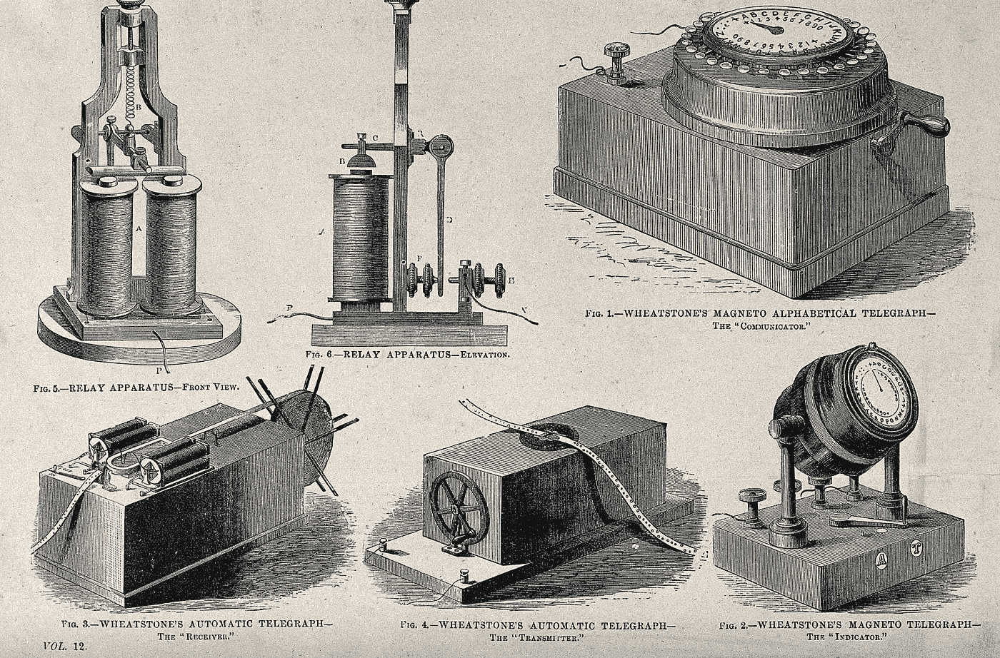
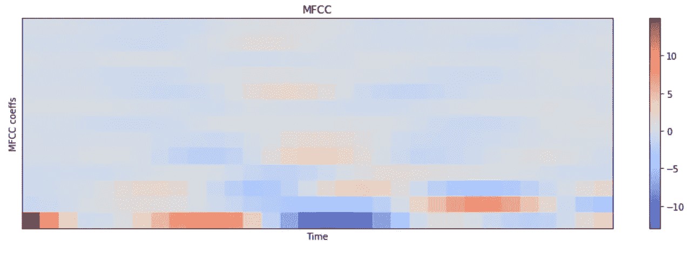

# TensorFlow 语音识别挑战—解决方案概述

> 原文：<https://towardsdatascience.com/tensorflow-speech-recognition-challenge-solution-outline-9c42dbd219c9?source=collection_archive---------4----------------------->

Telegraph network equipment — we’ve come a long way ([source](https://en.wikipedia.org/wiki/Electrical_telegraph#/media/File:Components_of_the_electromechanical_telegraph_network._Proce_Wellcome_V0025510.jpg))

不久前，我参加了由 Kaggle 和 Google Brain 组织的关键字检测挑战赛。问题是，我们如何在像 siri 或 alexa 这样的语音界面中提高关键词检测准确率，比如当你说“打电话给 Brad”时。

Tensorflow 团队已经分享了一个完成这项工作的基线系统的[完整 receipe](https://www.tensorflow.org/versions/master/tutorials/audio_recognition) ，但目标是看看社区能提出什么。最后，获胜的团队与谷歌的基线差距相当大；竞争测试集上约 80%对约 70%的准确度范围。

我设法独自达到 88%，在与 Russ 和其他人合作后，我们以 90%的分数排在第 6 位。在这里，我主要概述了我的部分解决方案。

我的代码转储可以在[这里](https://github.com/olix20/google_keyword_detection_challenge)(警告:非常混乱)

# 设置

dev 集包含 64k 的音频文件，每个大约 1 秒。我们也给了每个样本的标签，也就是说，在那一秒钟里说了什么。总共有 31 个标签，但在这场比赛中，我们只对 12 个标签感兴趣:“是”、“否”、“上”、“下”、“左”、“右”、“开”、“关”、“停止”、“开始”、“沉默”和“未知”。未知标签基本上是除了其他 11 个以外的任何东西，而沉默标签是一个代理标签，用于指示何时没有语音。评价是从准确性来说的。

你可以在竞赛页面[这里](https://www.kaggle.com/c/tensorflow-speech-recognition-challenge/data)找到更多细节。关于标签分发、音频样本的温和介绍，以及关于声音和特征提取的足够理论，请查看此 [EDA](https://www.kaggle.com/davids1992/speech-representation-and-data-exploration) 。

# **数据预处理**

似乎有一些关于原始波数据的训练模型的工作，但标准做法是首先从原始音频中提取频谱图或 MFCC (Mel 频率倒谱系数)。你可以很容易地用 Librosa 得到这些。以下是“是”的声谱图:

Spectrogram for “yes”

您可以将自然声波分解为不同频率的组成波(~傅立叶变换)。这基本上是声谱图告诉我们的:在每个时间点，每个频率的强度是多少。

所有音频文件都有 16k 采样率，这意味着它们可以捕捉高达 8k Hz 的声音频率(见 y 轴)。Mel 是放置特定频率范围的容器，使用较高数量的 Mel 会产生更精细的频谱图。我用 128 和 256 为不同的模型在这个比较粗糙。x 轴与时间相关，给定样本的 x 轴长度取决于用于计算频谱图的几个参数，如跳跃长度。

MFCCs 是对频谱图的另一种转换，旨在更好地捕捉人类语音的特征(例如，与音乐相比)。在 MFCC 的基础上，还有德尔塔和德尔塔-德尔塔变换，你可能会认为它们是一阶和二阶导数。这是同一个样本的 MFCC 的样子:

MFCC for “yes”

MFCCs 是 Kaldi 等流行的语音识别框架中的标准特征表示。我确实尝试了它们，但是由于我在准确性上没有太大的差异，并且我认为光谱图保存了更多的数据，所以我最后没有使用 MFCCs。

回到 spectrograms，最后你会得到一个形状类似(32，128)的 numpy 数组——把它想象成(time，frequency)——它告诉你一个给定时间戳的某个频率有多强。从这里开始，你基本上可以把声音文件当作图像来处理，并且可以疯狂地使用任何基于卷积的模型，比如 vgg，resnet 等等。最重要的是，你要利用数据的顺序性，这样递归神经网络就能派上用场。

在语音识别中，数据扩充有助于概括模型，并使它们对速度、音量、音调或背景噪声的变化具有鲁棒性。我自己实现了增强，以便完全理解和控制发生的事情(而不是使用 tensorflow 实现)。Pydub 对这部分来说真的很方便；例如，它允许你通过写`wav += 5`来增加一个波形文件的音量 5 分贝，其中`wav`是一个 pydub `AudioSegment`对象。

为了创建“沉默”标签的样本，我从数据集附带的噪声样本中提取了一秒钟的部分。

一开始，我在训练期间进行了数据增强，但我发现我的 gpu 没有得到充分利用，数据增强本身就是瓶颈。然后，我决定预计算 4x 批扩充，并将它们与原始数据一起保存为一个大的 pickle 文件。我把所有东西都加载到内存中进行训练，这给了我快速尝试不同架构的巨大优势；这也将使结果具有可比性，因为所有模型都将使用相同的数据进行训练。

Tensorflow 团队[似乎正在开发](https://www.youtube.com/watch?v=gplTc2F5Wvk&t=2852s)一个简单的 api 来简化和优化培训前的 etl，我很想尽快尝试一下。

我使用 tensorflow 实现中默认的 90%-10%分割进行训练验证；你可能会认为 k 倍 cv 在准确性/过度拟合方面会更好，但我更喜欢简单的分割来快速尝试不同的架构并调整它们的超参数。

你可以在 utils.py 和 etl*下找到我的 etl 脚本。ipynb(抱歉代码乱七八糟)。

Theodore meets Samantha

# 模型

像所有其他比赛一样，这个想法是集合一些不同的模型，这些模型在架构、数据扩充、特征提取等方面有所不同。在这里，我列出了我使用的一些基本模型变体，它们都是深度神经网络。我考虑过使用 Kaldi，但因为我认为优化语言模型和沉默概率可能会很棘手，所以我像其他人一样利用了深度 NN 波。

## 1D CNN

这是我见过的最高效和轻量级的模型，精确度在 85-87%之间。它可能是最好的单个模型，几乎不需要调整就可以在生产中使用。

在二维数据(光谱图)上使用“一维”滤波器可能听起来有点混乱，但基本上你有很大的二维滤波器，你只能在一维上卷积。例如，输入形状为`(t,f)`并经过频域，滤波器将具有形状`(k,t)`，其中`k`是滤波器宽度。在这种情况下，点积将具有形状`(1,f)`(假设`padding=”same"`)。更多可视化解释[在这里](https://stackoverflow.com/questions/42883547/what-do-you-mean-by-1d-2d-and-3d-convolutions-in-cnn)。

你可以借用流行的图像处理模型的基本概念，只需调整它们来使用 1d 而不是 2d 卷积。例如，带有 keras 的 vgg 灵感模型看起来像:

然后将这些层附着到一个 dense 和 softmax 头上，并使用`categorical_crossentropy`损耗进行训练。我在中间层尝试了很多调整，比如添加扩展、跳过连接或末尾的 LSTMs，以利用数据的顺序性质。

我发现一个简单的不太深的模型，在开始时具有大的内核大小，在频域上工作得很好(大约 86%的准确度)。将它与时间域上的 1d 转换以及每种转换的一些变化组合在一起，使我达到 87%。

## 2D CNN

在这里，您可以将声谱图视为单通道图像，并原样应用著名的图像模型架构。不过，我最初尝试 ResNet 时运气不佳。我意识到太深或太宽实际上会损害准确性，我猜这是因为太多的信息在 maxpool 层中丢失了。因为我的队友已经有了这种型号，所以我没有在这里花太多时间来获得更好的结果。对于像 InceptionResNetV2 这样的单一模型，他们报告的准确率为 88%。

我没有双倍下注 2d 模型的另一个原因是我缺乏硬件能力。我当时使用的是 aws p2/g3 实例，即使对所有增强进行了预编码并将其加载到内存中，训练时间也比我尝试不同架构/超级参数的耐心和意愿要长得多。当我听到新的 aws p3 实例发布时，我非常激动。同样值得注意的是 tensorflow 最近的分布式培训支持。TF 在易用性方面做了一些很好的改进，我很高兴能尽快尝试新的 API。

## CNN-RNN 组合

其思想是使用 convnet 提取特征，展平非时间维度，然后使用 RNN 来利用数据的顺序性质。我在这里[遇到了这个想法](https://yerevann.github.io/2016/06/26/combining-cnn-and-rnn-for-spoken-language-identification/)，Hray 使用这种技术来正确识别口语。

keras 中的一个实现如下所示:

我们必须非常小心最大池层，以免删除太多信息，特别是在时域上，因为它很短(1 秒)。我还发现了 CuDNNLSTM 实现，它是 Cuda 上的一个优化的 LSTM 实现；这确实有很大的不同，API 几乎与默认的 LSTM 实现相同。强烈推荐！

仅用这个模型就让我达到了 88%的准确率。将它与 1d convs 组合在一起，使我在黄金领域的公共排行榜(lb)上多了几个名次(仍然在 88%的准确率范围内，lb 只显示了 2 个小数点)。

值得注意的是，2d conv 层不是很深，可能通过尝试其他替代方法可以获得更多的多样性。使用 1d 转换器不会产生同样多的增益。堆叠循环层没有帮助。

Terminator impersonates John — machine to machine Turing test passed!

# 我尝试过的其他事情

以下是我尝试过的其他一些事情:

## 扬声器嵌入

在 Kaldi 的许多方法中，当训练声学模型时，说话人嵌入(I 向量)与原始特征(例如 MFCCs)一起使用。根据我看到的一些出版物，它有助于提高单词错误率，并且默认包含在内。本次比赛的数据集带有说话人标签，因此我认为这可能有助于训练独立的说话人识别模型，并在训练主要关键词检测模型时使用其瓶颈特征(嵌入)作为附加输入。

三连音缺失的一击训练在这里是个不错的选择。网络(一堆 1d 转换器)取 3 个样本，2 个来自同一说话者，1 个来自其他人。然后，三元组损失函数推动网络，如果样本来自同一说话人，则使距离最小化，否则使距离最大化。这里有一个片段可以让它更清楚:

这些模型似乎很好地收敛了，但是在训练主模型时将嵌入作为附加特征对准确性没有帮助。我还尝试了多任务学习说话者 id 和标签，但仍然没有改变主要任务的准确性。

我还没有找到一个好的解释，但假设我做得正确，这个观察暗示说话者嵌入对转录有帮助，但对关键字检测没那么大帮助。

## 自动编码器

在比赛的早期，我非常希望自动编码器的瓶颈特性可以包含一些额外的信号。我们可以认为瓶颈值是指同一类别中的指纹和样本最终具有相似的值。此外，因为我们已经在 dev+测试集上训练了 autoencoder，所以关键字检测模型可以在测试时比较这些指纹，可能会产生更多的 robus 预测。

我用一个简单的不太深的 2d cnn 编码器-解码器架构实现了这一点，该架构具有不同的瓶颈形状，例如 128。它给了我早期的 1d conv 合奏 0.01 的提升，我们在最终的 lightgbm stacker 中使用了它。这里肯定会有更多收获，我非常确定我的自动编码器架构可以改进——特别是在阅读了像 [wavenet autoencoder](https://arxiv.org/pdf/1704.01279.pdf) 这样的相关工作之后。这部分训练起来也非常慢，我采取了我能想到的最简单的方法；例如，用简单的上采样层替换去卷积层。

## 伪标签

这个想法是使用你目前为止最好的模型预测测试样本的标签，然后使用测试数据和你预测的标签重新训练/微调你的模型。在“硬”版本中，您获取 softmax 预测的 argmax 并将其用作标签(当您的模型对预测足够有信心时，您可以更有选择性地这样做)。在“软”版本中，您直接使用预测的软最大概率作为标签，因此某个测试样本可能有 50%“开”，30%“关”，20%是其他标签的组合。我认为，软版本通过将标签之间的关系编码到分配给模型学习的概率中，进入了知识提炼的领域。我在以前的作品中看到了这种方法的改进，认为它在这里也会有所帮助。

在我的早期试验中，我在本地验证集上获得了显著的准确性提升，但在公共 LB 上没有。似乎简单地预测测试标签并使用它们进行训练变得太“天真”了，你必须做更多的工程工作来找到硬案例，并强行让你的模型专门学习这些。我的团队在这里做了一些有趣的把戏，比如针对某些标签出现错误，并试图在测试集中隔离那些困难的案例或合成新的样本。例如，我们意识到相当多的无声样本被错误地归类为其他东西，因为在音频的结尾有一个明显但无意义的元音。为了应对这一点，Bob 创建了一组新的训练样本，通过将正常样本偏移 0.9 秒来模拟这些拐角情况。

这里的尝试都没有反映公共/私有 lb 的大变化，但是也很难忽略它们的有效性，因为测试集的子集被用于评估。此外，你可能会觉得自己在最后做了相当多的修补，但顶级团队之间的差异在于正确地多分类几个词，你宁愿尽可能多地从数据中挤出来。

## 未知的未知物

在竞赛的早期，很明显一个主要的挑战是预测“未知”标签。dev 集合包含来自 21 个不同标签(“猫”、“希拉”、“等等”)的 42k 个样本，这些样本应被视为未知。然而，在实践中，字面上任何东西都可以代替主要关键字，它们都应该被视为未知。因此，重要的是要找到方法使我们的模型对测试集中看不见的未知内容具有鲁棒性，或者对未知内容具有更好的韵律:)

我尝试过通过反转来增加训练数据，所以当有人说“停止”时，它实际上被视为“停止”，但它的反向口语“pots”是一个“未知”样本。没用。我们也做了一些试验，通过剪切和拼贴已知类别的部分音频来合成新的未知样本；这对我们没用，但显然其他球队运气不错——细节决定成败。

我们还尝试了其他一些事情:

*   有额外的模型头来预测音素/辅音，并与主要任务一起学习
*   为每一个可能的 31(默认为 10 +任何进入未知类的事物)训练隔离森林，并使用它们的异常值分数来识别测试样本以包括未知的未知物(这也算作伪标记)

这里所有个人的努力得分在 88%左右，但我要说，他们帮助我们最终的合奏增加了多样性。

# 组装

最后我们得到的是不同模型/集合的简单加权平均值。我特别喜欢 Bob 如何使用层次聚类来挖掘模型相关性:

这个想法基本上是将所有的类预测展平到一维数组中，然后将它们视为模型的单个指纹。然后，您可以使用这些指纹来计算模型相关性。分层聚类视图有助于识别模型之间的差异，并选择正确的模型/权重。此外，如果你的预测中有一些异常情况没有在公共 lb 中捕捉到(就像之前我在《星球大战》中遇到的情况)，你可以马上发现它们。

我们还尝试用 lightgbm stacker 集成我们的最佳集成，该集成对所有实验预测都有效(自动编码器、未知-未知模型、伪标记模型的输出)，它在公共 lb 上产生轻微的改进，而私有 lb 分数保持不变。

# 结论

像迄今为止的所有比赛一样，一路上有很多学习点和挑战，所以感谢 kaggle 和 google brain 的组织。有趣的是，人们在图像处理等其他领域学到的许多技术也可以在这里应用。虽然很有帮助，但是你不需要成为一个语言科学家就有机会在这里竞争。

我还要感谢我的优秀团队，感谢他们分享的所有知识和技巧——和合适的团队在一起真的会让学习经历和动力更上一层楼。其他获奖团队也在[论坛](https://www.kaggle.com/c/tensorflow-speech-recognition-challenge/discussion)上分享了他们的解决方案，请务必查看以获取更多灵感。

我发现传统的语音识别(如 Kaldi)在设置、训练和运行方面非常复杂，所以亲眼看到一种“端到端”的完全基于神经网络的方法可以给出下降的结果是非常令人耳目一新的。这让我对这个领域的所有相关工作寄予厚望，比如 Mozilla DeepSpeech。我特别喜欢[百度的愿景](https://sites.grenadine.co/sites/cmu-scs-lti/en/colloquium/items/392)，一个高度简化的语音识别管道应该使语音识别研究民主化，就像 CNN 彻底改变了计算机视觉一样，而且我们理想中希望语音识别系统可以由一个在语音识别方面几乎没有经验的团队来构建、调试和改进。

话虽如此，我还是很想看看基于 Kaldi 的 receipe 在这个数据集和任务上表现如何。这可能是我接下来要尝试的东西。

我们在促进沟通方面取得了长足的进步；这些进步在我们自身发展的时间线上是指数级的，从智人的黎明开始。首先，我们消除了距离的障碍，现在我们甚至将交谈(和思考)委托给机器。在这样一个世界里，只要机器能相互交流就够了，我们的口语可能会成为交流的瓶颈，而不是促进者。

— Mic Drop —