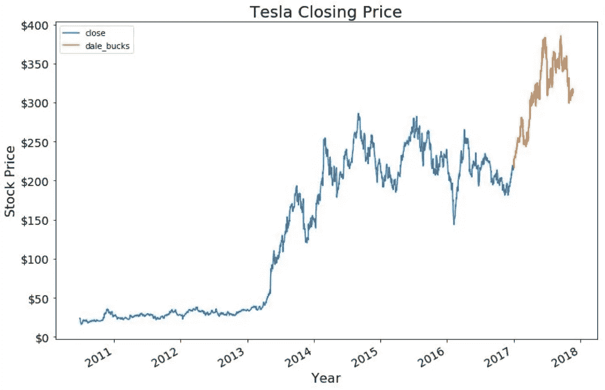
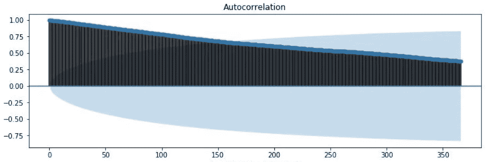
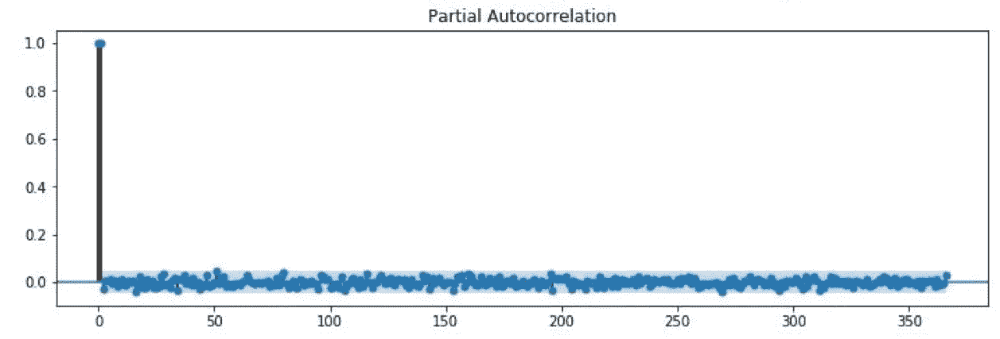
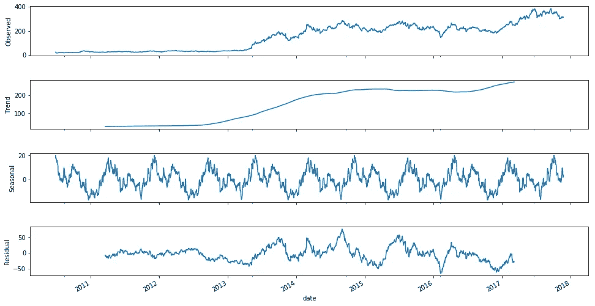
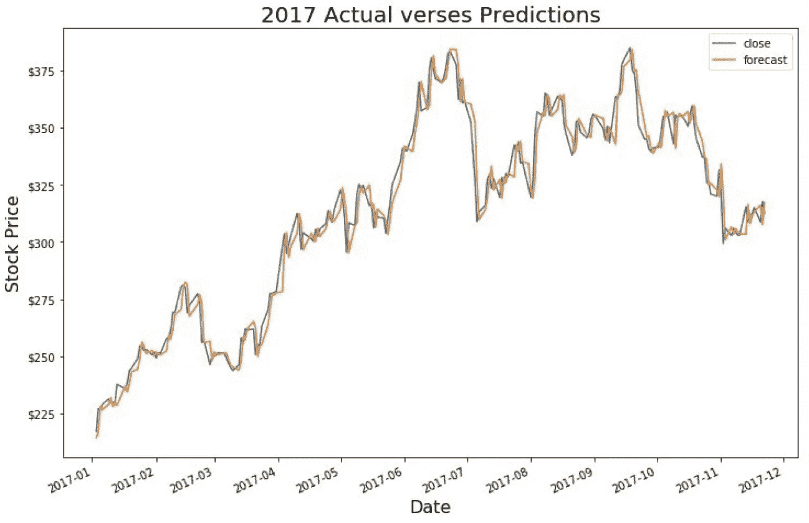

# 特斯拉:股价预测

> 原文：<https://towardsdatascience.com/tesla-stock-price-prediction-f16a702f67d7?source=collection_archive---------4----------------------->

快速提示:我不会预测特斯拉的股价。但我会努力的。

我着手解决这个特殊的问题有两个原因。第一，在尝试学习如何使用 ARIMA 模型和处理时间序列数据时，头脑中要有一些目标。第二是变得肮脏，发臭的富有。第一个目标似乎很成功，这也是我们在这篇文章中要关注的。第二…你很幸运，我不会失去继续写作的动力！

我的计划是创建一个 ARIMA 模型，跟踪足够接近 TSLA 每天的收盘价，然后将其输入第二个模型，该模型结合了自然语言处理，特别是对埃隆·马斯克的推文(他在 ole Twitter 上相当多产)，以及其他新闻来源。据我所知，由于特斯拉股票的价格完全是投机性的，它应该基于新闻(特斯拉从未有过盈利的一年，只有几个盈利的季度)。数据科学的伟大之处在于，如果你有一个像这样的随机假设，测试它是相当容易的。

> "当某件事足够重要时，即使形势对你不利，你也要去做。"
> 
> ― **埃隆·马斯克**

TSLA stock price since 2010

正如你从上面看到的，Telsa 自 2013 年初以来一直在上升，这恰好是在他们的第一辆汽车发布后不久。2017 年 1 月，我买了几只股票(实际上是 3 只)，获得了 50%的回报。不幸的是，我不知道是应该卖掉还是继续持有。我希望有个模型能帮我避免这种忽上忽下的废话。

好吧，什么是时间序列问题？时间序列问题是指任何给定的观察值都依赖于之前的观察值。如果你想象购买食品杂货，这是很容易想到的。如果你走进商店，发现奶酪比你上次买的时候多了 5 美元，你可能不会觉得这很合理。当然，如果价格几个月来一直在逐渐上涨，你可能会发现它的新价格是合理的(如果令人讨厌的话)。外部因素也可能起作用，但对于普通买家来说，他们的购买决定主要来自之前的价格。这不仅仅是最近的几个价格。如果我们谈论购买草莓，我们可以说价格遵循一个基于历史价格的模式。如果草莓当季上市，我们预计价格会下降，然后随着季节的结束而上涨，草莓会变得更加稀少。今天的价格可能比昨天更取决于 365 天前的价格。我的朋友本发了一个极好的帖子[在这里打破这些组件](/understanding-the-hyperparameters-of-a-simple-time-series-model-631f26c46c9)。

正如你可能已经猜到的，股票价格中有很强的时间序列成分。我心目中的 ARIMA 模型结合了时间序列的两个特征。AR 代表第一部分，考察价格的“自回归”程度，MA 代表第二部分，考虑移动平均价格的影响。(I 代表集成。)自回归分析了今天的价格与各个先前价格的相关性，并描述了这种关系。我们可以画出前一天对当天的影响有多大。

This shows the correlation between the current price and each previous price up to 365 days

上图显示了这种相关性；随着滞后天数的增加，相关性稳步下降。这告诉我们，最重要的相关性是当前价格之前的价格。如果我们看到其他峰值，这将是一个很好的指标，表明存在其他相关性(例如每周、每季度或每年)。我们也可以查看不同滞后的部分自相关，看看是否有额外的相关性需要考虑。

This maps the partial autocorrelation in closing price over the same time period as above

部分自相关查看与上述相同的关系，但删除了以前的关系。换句话说，在滞后 7 时，它查看 7 个观察值之前(7 天前与我们的收盘价数据)的关系，同时消除滞后 1 到 6 的影响。这可以显示季节关系，就像我们在之前的草莓例子中发现的那样。这些图表读起来可能有点棘手，但上面的图表没有直接明显的关系，显示的主要是噪音。

这涵盖了 ARIMA 模型的自回归性质，但移动平均部分呢？要发现隐藏在数据中的东西可能有点困难，但我们可以把它看作是对数据变化的平滑，以消除噪声和随机变化。

Comparing different rolling means to over six months

你可以在上面看到，特斯拉股价的滚动平均值淡化了通常代表噪音和其他波动的急剧变化。这可以帮助您的模型变得更具预测弹性，而不是完全依赖于自回归。你需要你的模型有多大的反应能力可以帮助你决定最有意义的滚动平均值的时间段。您可以看到，随着用于计算滚动平均值的天数的增加，模型响应变化的时间也变长了。

最后一个要考虑的因素是“平稳性”的概念。简而言之，如果均值和方差在一段时间内相同，则数据是稳定的。这通常是适当的统计分析的要求。正如我们之前看到的，特斯拉的股票价格随着时间的推移一直在上涨，特别是自 2013 年以来，因此不是静止的。有各种方法可以转换数据并使其稳定，这将允许我们建模和进行预测。我们主要是找出数据中的趋势和任何季节性，从建模的数据中删除这些方面，进行预测，然后将趋势和季节性添加回预测结果中。

We can see our observed stock prices on top, the overall trend in the price second, any yearly repetition third, and finally our residual which is whatever variation is still left over and needs explaining

这里是一个尝试，看看任何季节趋势超过一年，任何趋势超过股票的生命。下面的三个图代表寿命趋势、年度变化和残差，它们加在一起就形成了上面的观察图！底部的残差是所有剩下要预测的，我们希望它尽可能的稳定。我还研究了所谓的第一个差异(采用当前价格并减去之前的价格)，并进行了一项名为 [Dickey-Fuller 测试](https://en.wikipedia.org/wiki/Dickey–Fuller_test)的测试，该测试本身可能值得发表一篇文章，以观察这是否有助于我们达到平稳性，它确实做到了。

结合所有这些因素，我们可以根据我们的数据得出训练 ARIMA 模型所需的参数。我们将希望在我们的数据子集上训练模型，例如直到 2017 年的所有数据，然后在 2017 年测试模型。

Not too shabby, yea?

哒哒！这里有一个非常简单的例子，说明如何用 Python 和这里的[数据](https://github.com/dale-wahl/Tesla_stock_prediction/blob/master/TESLAHistoricalQuotes.csv)创建这个模型。

30 行代码，一半是我在唠叨，四分之一只是在读数据？说到站在巨人的肩膀上…

我希望这有助于您理解时间序列建模的基础，何时使用它，如何为您的模型确定参数，以及如何实现模型本身。这只是触及了表面；接下来，我们需要弄清楚如何评估我们的模型，看看它是否能让我们变得富有！

一如既往，感谢阅读。如果你注意到任何错误或者认为我可以澄清任何事情，请让我知道。如果你想知道更多关于我如何开始评估这个模型和内置自然语言组件的信息，请告诉我！你可以在这里找到我剩余的代码。