# 用 NLTK 试水

> 原文：<https://towardsdatascience.com/testing-the-waters-with-nltk-3600574f891c?source=collection_archive---------13----------------------->

## “你好，Word！”

__init__(自己，博客):

计算机是如何理解人类语言的？

自从我兴高采烈地故意让苹果、亚马逊和完全不知情的脸书通过 Siri、Alexa 和 Facebook 应用程序监听我个人生活的对话片段以来，我一直(相当平静地)想知道计算机实际上是如何处理人类语言的。这种好奇心从来没有强大到足以让我付诸行动。直到我开始在熨斗学校接受数据科学家的培训。数据科学训练营开始几周后，我发现从哪里开始回答这个问题。三个字的答案是，自然语言处理(NLP)。你瞧，那种古老的好奇心重新燃起，我决定以一个新手的身份写我的第一篇博客。

NLP 是计算机科学的一个发展领域，涉及计算机和人类的交互。这个博客是我第一次涉足自然语言处理领域。在开始任何复杂的分析之前，我将探索开始的文本预处理。我将使用一个流行的名为 NLTK 的 NLP 库。自然语言工具包(NLTK)是当今最强大的，也可能是最流行的自然语言处理库之一。它不仅拥有最全面的基于 python 的编程库，而且还支持最多的不同人类语言。

在开始之前，我不可避免地要简要回顾一下 NLP 的历史。

免责声明:在下面的部分，我将通过一个非常“相关”的奇幻小说角色的模因来“创造性地”进行类比，从而讨论 NLP 的发展。非常欢迎您跳过这一部分，继续学习 NLTK 部分。

## 自然语言处理的发展

自然语言是我们人类用来相互交流的语言。这就引出了一个问题(至少在我看来)那么，有没有一种非自然的语言？答案是一个响亮的是，它是，计算机语言，或者更确切地说，计算机如何与人类互动。外行人对自然语言处理的描述是:这是一个通过计算机破译自然语言的科学领域。根据 Wikipedia，NLP 通常包括三个主要子领域，简要描述如下:

[语音识别:](https://en.wikipedia.org/wiki/Speech_recognition)口语单词的识别和转换到转换。例子:Siri，Alexa。

[自然语言解释](https://en.wikipedia.org/wiki/Natural-language_understanding):理解自然语言并以此为基础做出决策。示例:将电子邮件分类为垃圾邮件。

[自然语言生成](https://en.wikipedia.org/wiki/Natural-language_generation):自然语言产生。示例:创建数据库或数据集的摘要。

在基本水平上，计算机知道如何将字母转换成二进制数、1 和 0。例如，下面左边的图像实际上是短语“Hello，World！”的二进制表示。计算机将我们的语言翻译成二进制代码序列，再转化成可操作的指令。这让我想到了我的“非常有创意”的类比，右边的第二张图片。

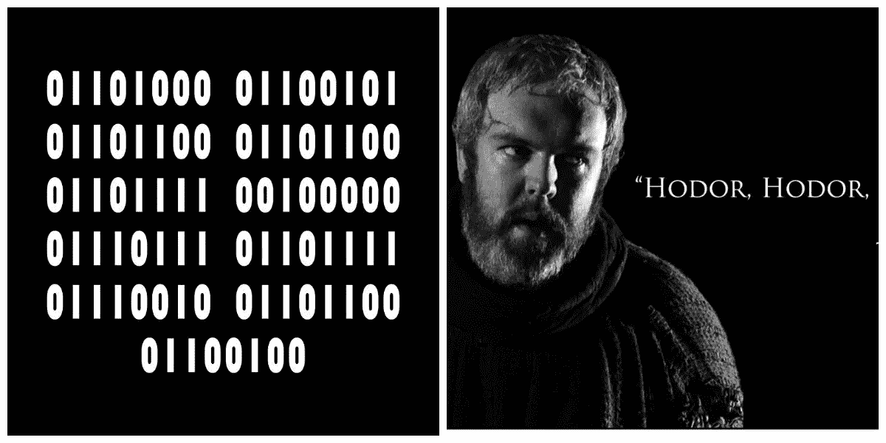

可以说，一个人(可能只有我)会发现二进制语言与广受欢迎的小说《权力的游戏》中深受喜爱的助手阿多(大多是哑巴)的交流方式非常相似。阿多只会说一个词，他的名字。他通过重复阿多来交流。或者他保持沉默。阿多。沉默。阿多。阿多。一个。零。一个。一个。明白了吗？所以，有人会说，阿多是二进制的完美代表！

既然我已经说清楚了，让我们稍微回顾一下。在这个万物快速发展的时代，与人类第一次在地球上行走的时间相比，我们很少能体会到计算机自发明以来在极短的时间内已经进化了多少。为了理解 NLP 发展的速度和规模，考虑一下这个。早期的程序员(只有 70 年前！)使用穿孔卡(如下图)与计算机对话。几行代码通常需要成堆成堆的穿孔卡片。

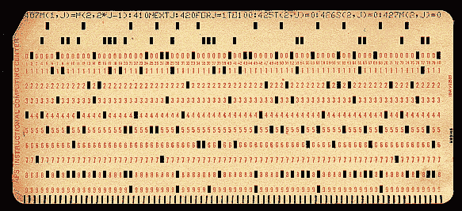

Punch Cards

今天，我们可以毫不费力地与机器对话，甚至不需要思考就可以对 Siri 不听我们的口音感到恼火！

那么我们是如何从这个，


对这个？

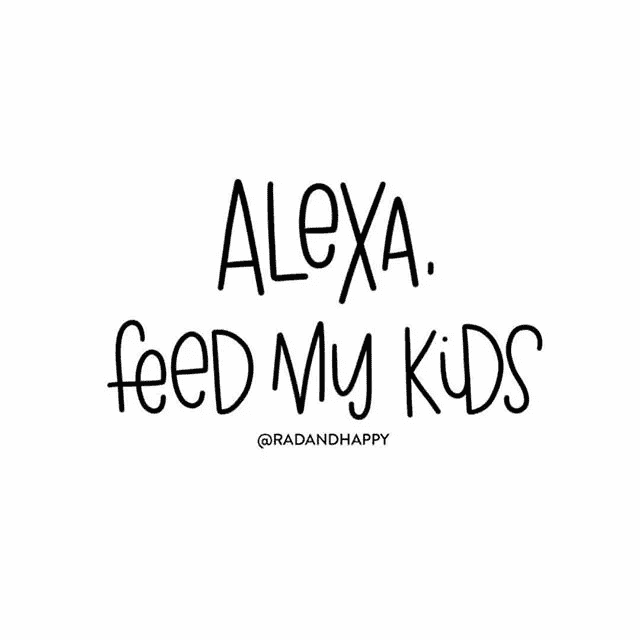

嗯，我们已经开发并继续开发一种更好的方法，通过更复杂的编程库与计算机对话。这是第二个“创造性”的类比。

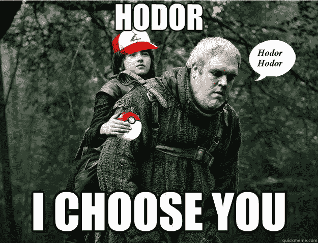

像 NLTK 这样的库基本上是现代计算机的品牌(最后一个，我保证。).通过内置的预写代码，这些库可以在后台执行复杂的文本处理，而其用户只需担心知道哪个方法完成了什么。这些库只需要几行代码就可以实现文本理解、解释和情感分析。下面的段落恰当地总结了 NLP 在当今环境中的重要性。

> [“今天的机器可以比人类分析更多基于语言的数据，不会疲劳，并且以一致、公正的方式进行分析。考虑到每天生成的非结构化数据数量惊人，从医疗记录到社交媒体，自动化对于高效地全面分析文本和语音数据至关重要。”](https://www.sas.com/en_us/insights/analytics/what-is-natural-language-processing-nlp.html)

下一部分是真正的工作开始的地方！

## 预处理

那么如何开始呢？如果你仔细想想，这是很直观的。想想婴儿是如何学习理解语言的。

逐字逐句。

为了能够理解一个整体，我们首先需要能够在元素层面上破译一些东西。如果不知道每个点代表什么，你就不能把这些点联系起来。自然语言处理的第一步包括将语言分解成单词/句子，也就是记号，然后尝试绘制这些记号之间的动态关系以及它们如何形成意义。

值得注意的是，NLP 中 99%的工作是预处理和组织数据，其中涉及 [*分词和解析、词条化/词干化、词性标注、语言检测和语义关系识别*](https://www.sas.com/en_us/insights/analytics/what-is-natural-language-processing-nlp.html) *。只有完成这些任务后，你才能开始分析数据。NLTK 让这 99%变得容易多了。*

在我第一次尝试使用 NLTK 进行 NLP 时，我选择处理现任总统唐纳德·特朗普的演讲。我找到了一个 2016 年至 2017 年特朗普演讲的 [GitHub 知识库](https://github.com/PedramNavid/trump_speeches)。其中总共有 73 篇文本文件形式的发言。我随机选择了一个演讲作为开始，并使用了 NLTK 的以下方法来探索这个演讲。

a)标记化，c)去除停用词，b)词性标注，c)索引

符号化

任何 NLP 项目的第一个任务都是标记化。就是把一个巨大的字符串拆分的过程(我的原始数据为。txt 文件)转换成单词或句子的列表。通常，字符串首先被标记为句子列表，然后是每个句子的单词列表。感觉很直观。

```
An example of Tokenizing: 
[‘Hello World! I am learning to use NLTK.’]Step 1: Sentence tokenizing:[‘Hello World!’, ‘I am learning to use NLTK.’]Step 2:  Word tokenizing:[ [ ‘Hello’, ‘World’, ‘!’ ], [ ‘I’, ‘am’, ‘learning’, ‘to’, ‘use’, ‘NLTK’, ‘.’] ]
```

因此，为了开始这个过程，我做了以下步骤:

在一个 Jupiter 笔记本中导入了以下库，以启动这个过程并读取我的文本文件。

```
import nltk
from nltk.tokenize import word_tokenize
from nltk.tokenize import sent_tokenize
from nltk.corpus import stopwords
from nltk.text import Text
import string, re
```

我把演讲标记成每个句子的字符串列表。我写了一个函数，使用正则表达式库中的 re.sub()方法删除字符串中的标点符号。为了便于展示，我只选择了演讲的前 15 个句子。

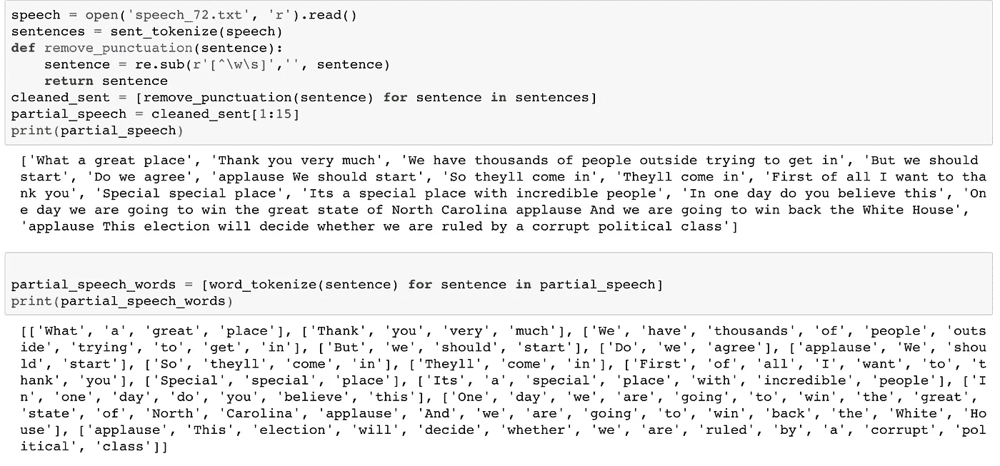

删除停用词

停用词是在语言处理过程中可以忽略而不改变句子意思的小词。删除它们可以提高效率(速度、内存使用)，而不会影响效率。NLTK 有一个停用词列表，16 种不同的语言各有一个。我导入了一个用于英语的函数，并编写了“remove_stopwords()”函数来查找并删除句子中的停用词。去除停用词后，单词总数从 99 个下降到 63 个，大约减少了 36%。在拥有数千个单词的语料库的环境中考虑这一点。

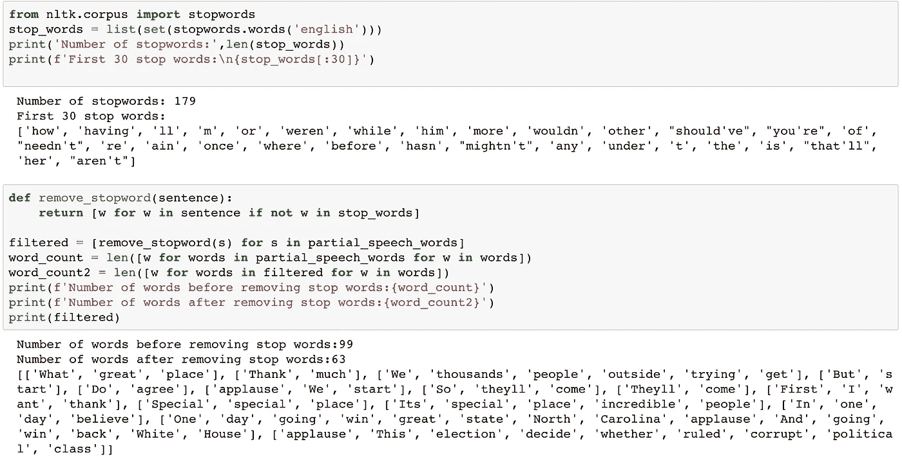

词性标注:

好了，接下来是更激动人心的工作。NLTK 有一个很棒的方法，叫做词性标注(nltk.pos_tag())，它接受一个标记化的句子，然后根据每个单词的语法功能(如名词、代词、形容词、时态等)将其转换为词性。有关所有标签的列表，请访问此[页面。](https://pythonprogramming.net/part-of-speech-tagging-nltk-tutorial/)

为了做到这一点，我只是使用列表理解来循环过滤后的语音并标记每个单词。

```
POS = [nltk.pos_tag(tokenized_sent) for tokenized_sent in filtered ]
print(POS[:3])output: 
[[('What', 'WP'), ('great', 'JJ'), ('place', 'NN')], [('Thank', 'CD'), ('much', 'JJ')], [('We', 'PRP'), ('thousands', 'NNS'), ('people', 'NNS'), ('outside', 'IN'), ('trying', 'VBG'), ('get', 'NN')]]
```

所有这一切只需要一行代码。

B.神盾局。

一致

为了快速探索，另一个非常有用的工具是索引。Concordance 可以用来查看特定单词在上下文中的所有用法。它返回一个单词的所有出现次数以及使用该单词的句子部分。NLTK 版本(3.3)有一个缺陷，由于这个缺陷，索引在默认情况下返回 25 个匹配项，宽度不超过 80 个字符。出于好奇，我想看看“伟大”这个词的上下文(你知道为什么)。

concordance 方法接受一个标记化单词列表。所以我回过头来对整个演讲进行了标记化，并对其调用了方法。

```
from nltk.text import Text
speech_words = Text(word_tokenize(speech))
speech_words.concordance('great')
```

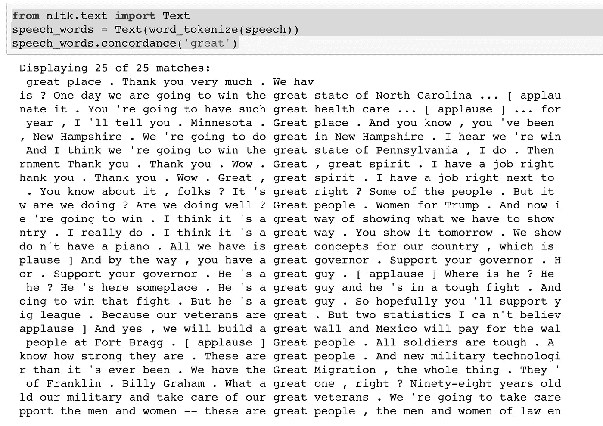

正如你所看到的，这种方法可以很方便地在初始阶段使用，以吸引某些单词的使用。

## 词云

最后总结一下，这和 NLTK 没有任何关系，我为 70 多个演讲中的每一个创建了单词云。使用单词云生成器。不仅仅是因为它们看起来很酷，事实也的确如此！然而，我发现这是一个快速找到最常用单词的非常方便的方法。这导致了一些非常有趣初步观察。例如，在总统竞选结束时，希拉里这个词开始更多地出现。云在最后按时间顺序显示。代码如下:

```
from wordcloud import WordCloud
import matplotlib.pyplot as plt
for speech in speeches:   
    print(speech)
    speech = open(speech, 'r').read()
    cleaned_speech = remove_punctuation(speech)
    text = cleaned_speech
    wordcloud = WordCloud().generate(text)
# Display the generated image:
    plt.figure( figsize=(20,10) )
    plt.imshow(wordcloud, interpolation='bilinear')
    plt.axis("off")
    plt.show()
```

下一步是什么？

我将继续探索 NLTK 的更多方法，并希望在未来能够做出一些有意义的分析。

以下是姜懿翔·川普在总统演讲中的演讲，按时间顺序排列。

尽情享受吧！

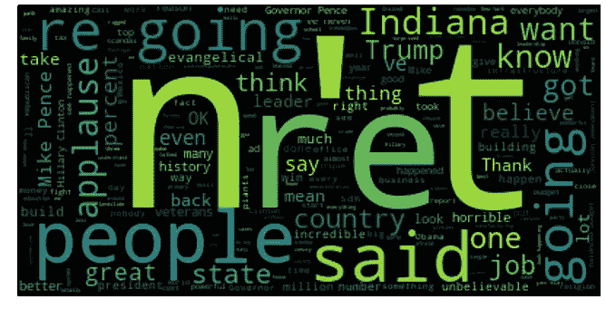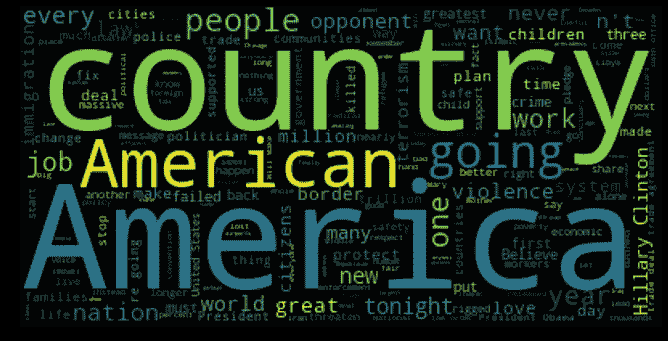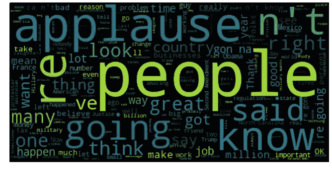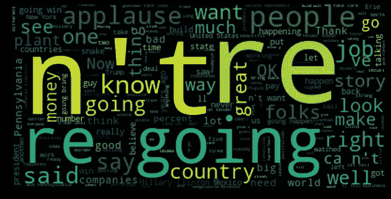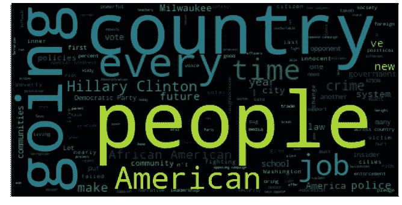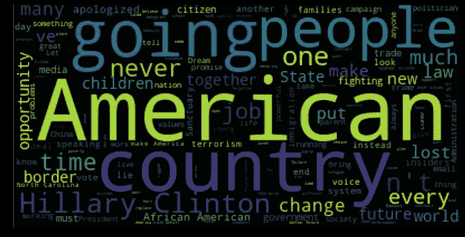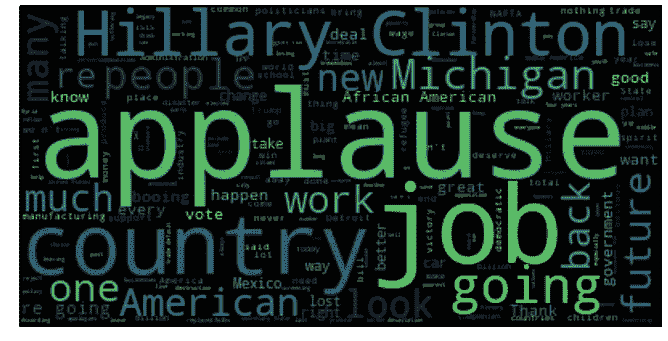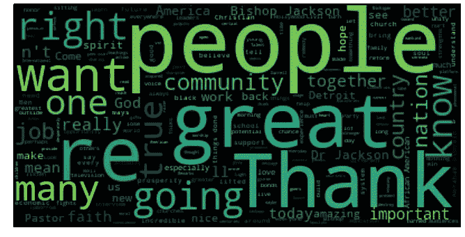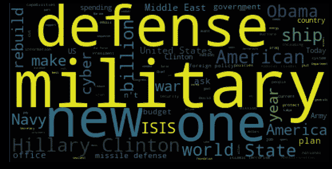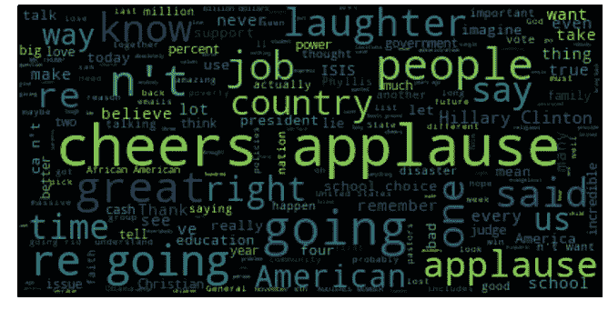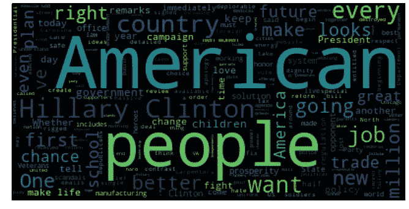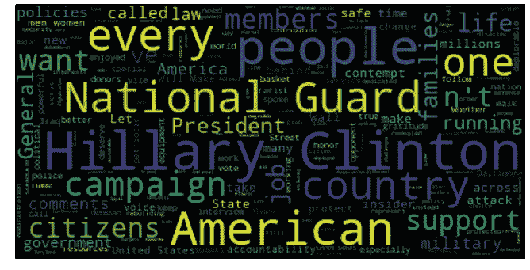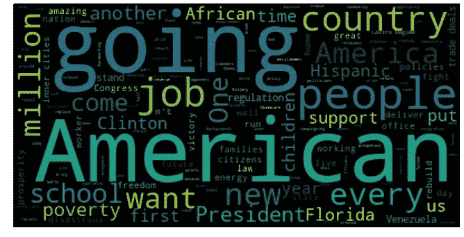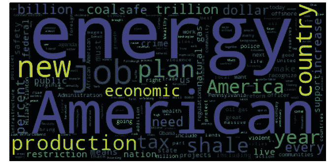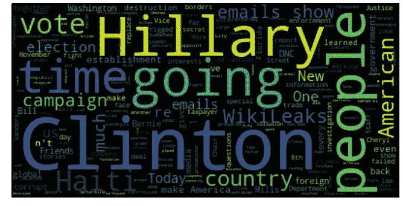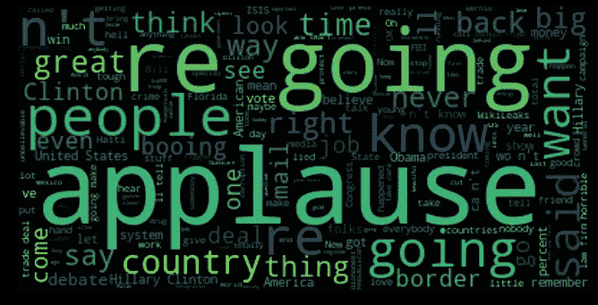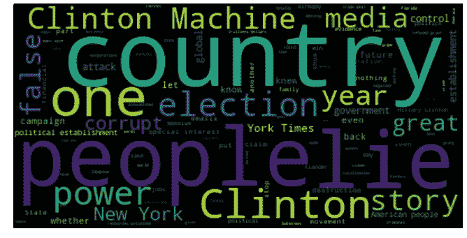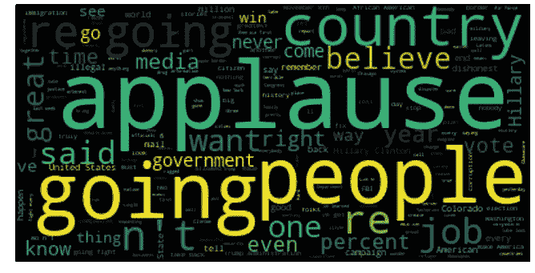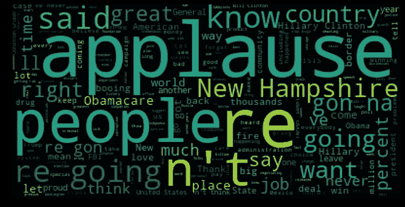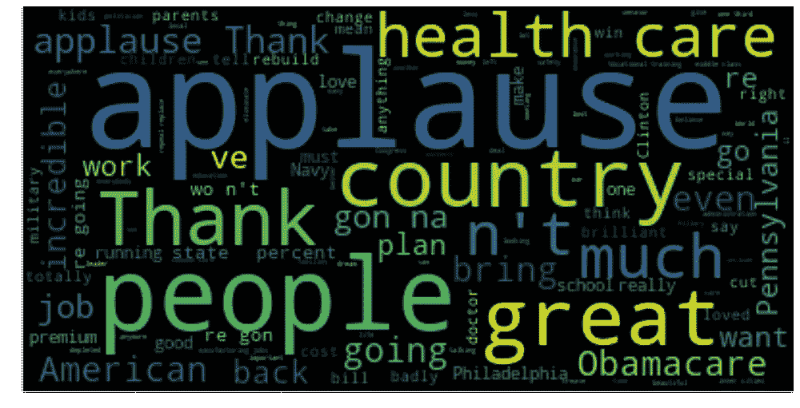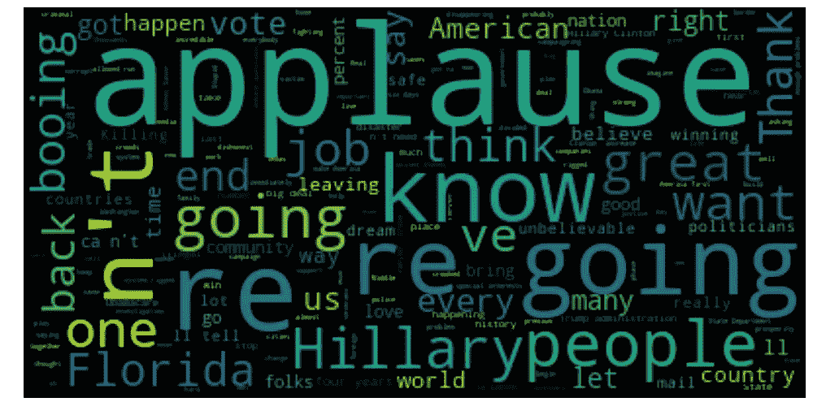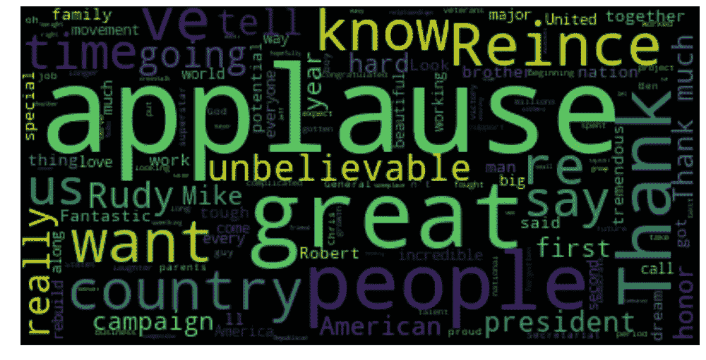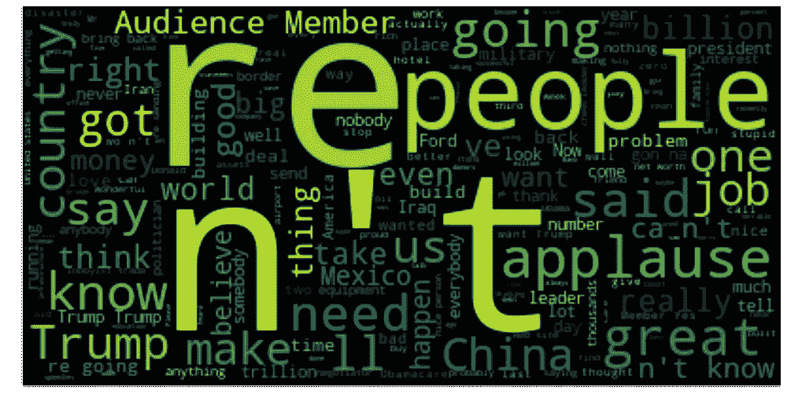