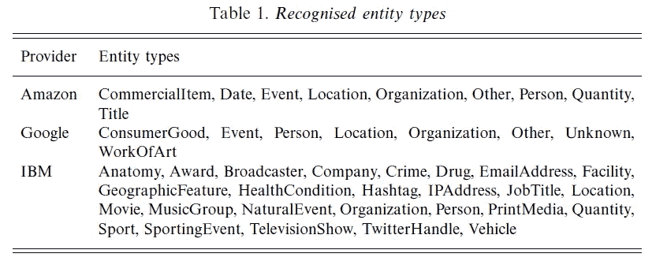
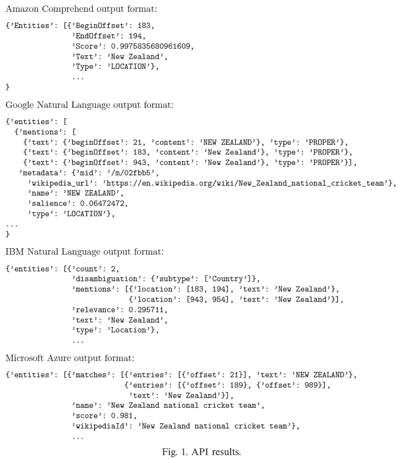
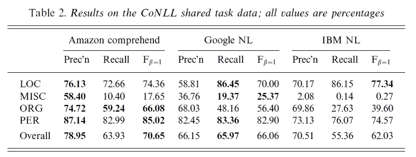

# 文本分析 API，第 1 部分:大玩家

> 原文：<https://towardsdatascience.com/text-analytics-apis-part-1-the-bigger-players-3ce8a93577bd?source=collection_archive---------9----------------------->

如果你在市场上寻找现成的文本分析 API，你有很多选择。你可以选择与软件世界的主要参与者合作，对他们来说，每个与人工智能相关的服务只是他们庞大工具目录中的另一个条目，或者你可以选择一个较小的提供商，专注于文本分析作为他们的核心业务。在这两篇相关文章的第一篇中，我们来看看当今最著名的软件巨头能提供什么。

> 本文最初作为 2018 年 3 月*行业观察*专栏出现在*自然语言工程杂志*上。你可以在这里找到完整的引用细节[，在这里](https://www.cambridge.org/core/journals/natural-language-engineering/article/text-analytics-apis-part-1-the-bigger-players/6E702561A0F5975D1537BC964F9C1366)了解更多关于语言技术组[。](https://www.language-technology.com/)

## 文本分析的前景

在最近的一个项目中，我需要回顾来自众多供应商的文本分析 API 产品。这些 API 在过去几年中激增:基于云的资源的易获得性和灵活性意味着开发文本分析驱动的 SaaS 产品的门槛相对较低，现在至少有二十几个 API 可供您使用。因此，如果你想利用第三方的文本分析功能，而不是构建自己的功能，你该如何选择呢？这篇文章，以及随后的一篇文章，旨在帮助你，如果你碰巧面临这种特殊的困境。[据我所知，这里提供的所有信息都是准确的，时间是 2018 年 1 月；但是事情可能会变化很快，所以你最好在根据这篇文章做出决定之前仔细检查所有关键信息。]在这里，我们来看看我们可能认为的软件行业的“巨人”:主要的玩家，对他们来说，文本分析只是一系列产品中的一个功能。例如，如果您希望确信您正在使用的工具是由一家几年后肯定会出现的公司支持的，那么您可能会被这些提供商所吸引。在随后的帖子中，我们将考虑“大卫”:专注于文本分析的小玩家，你可能希望他们更加灵活和创新。

关于范围的说明:我们将文本分析与各种类型和各种方式的文本文档的处理有关，通常使用该领域大多数人认为需要某种形式的自然语言处理的功能。对聊天机器人和虚拟助手的持续高度兴趣意味着每个供应商也有一系列语言相关的服务来支持这种类型的对话应用程序，但这不是我们在这里考虑的；我们将在随后的文章中讨论这个话题。

## 巨人队

虽然也有其他软件巨头提供文本分析功能——例如，惠普有自己的 [Haven OnDemand](https://dev.havenondemand.com/apis/) 服务，SAP 提供[文本数据处理服务](https://wiki.scn.sap.com/wiki/display/EIM/Text+Data+Processing)——但我们在这里重点关注这个领域最引人注目的四家主要公司:按字母顺序排列，亚马逊、谷歌、IBM 和微软。[脸书](https://developers.facebook.com/docs/messenger-platform/built-in-nlp)和[苹果](https://developer.apple.com/documentation/sirikit)也有用于一些文本分析任务的 API，但在每一种情况下，它们主要是作为在这些公司各自的软件平台上工作的工具。如果你是一个软件开发人员，想要构建一个独立的应用程序，利用第三方文本分析工具集，我们在这里考虑的四个可能是最明显的选择。

亚马逊是这个俱乐部的最新成员:尽管他们已经围绕 Alexa 平台提供了各种语言相关的服务有一段时间了，但打包为[Amazon understand](https://aws.amazon.com/comprehend/)的文本分析功能直到 2017 年 11 月才与亚马逊翻译和亚马逊转录一起公开提供。当然，这些只是 AWS 旗下提供的大量服务中的一部分。understand 提供五种不同的文本分析服务:实体识别、情感分析、关键短语提取、语言检测和主题建模。understand 被归类为机器学习服务，以及其他与 Alexa 相关的服务。

谷歌的[自然语言 API](https://cloud.google.com/natural-language/) 是谷歌云平台的一部分。提供的 API 涵盖实体识别、情感分析、句法分析和内容分类。同样，这些只是基于云的工具的广泛套件中的组件。谷歌也将这些功能归入[机器学习](https://cloud.google.com/products/machine-learning/)，以及一系列相关工具，包括更高级的服务，如“工作发现”。谷歌 NLP API 于 2016 年 7 月发布测试版。

正如我们之前在本专栏中提到的，IBM 的自然语言能力——或者至少是我们感兴趣的能力——是通过收购来实现的:IBM 在 2015 年 3 月收购了 AlchemyAPI，这可能是第一个基于云的文本分析 API。AlchemyAPI 本身于 2009 年推出；Alchemy 保留了它作为 IBM Watson 服务的名字，直到 2016 年初，它变成了 [IBM 自然语言理解](https://www.ibm.com/watson/services/natural-language-understanding/)。IBM API 提供了比这里讨论的其他提供者更广泛的功能:实体检测、情感分析、主题检测、关键字检测、五级层次结构中的内容分类、关系和语义角色提取，以及一些有用的元数据工具。IBM framework 还允许您使用针对实体和关系标识的定制领域特定模型来扩展所提供的功能。

微软的 NLP 相关产品分布在 Azure 平台认知服务下的各个子类别中。在语言子类别下，我们有语言分析(提供标记化、词性标注和基于选区的解析)和文本分析(提供语言检测、情感分析和关键短语提取)等。链接 API 的[实体可以在 Knowledge 子类别下找到，并且至少从 2016 年初开始就是 Azure 服务的一部分；在此之前，它是微软牛津项目的一部分。](https://azure.microsoft.com/en-au/services/cognitive-services/entitylinking- intelligence-service/)

由于可用功能的具体范围因提供商而异，您的特定需求可能会从一开始就排除一些候选人。

## 使用 API

因为它们都是全栈云平台提供商，所以对于上述每一个，你都可以完全在云端开发和部署应用，除了在你的本地机器上使用终端窗口之外，不需要使用任何东西。但是，您也可以将这些文本分析服务用作 API，从您自己的机器或其他地方托管的应用程序中调用。

在每种情况下，注册一个免费或试用帐户，并设置认证以使用服务都相当简单。这四个提供商都提供 SDK 和对各种编程语言的支持；同样，在支持的语言方面有一些变化，所以这是您可能要考虑的另一个因素。

为了便于比较，我们在这里只关注一个特定的核心功能:检测文本文档中的命名实体提及。四个 API 中的每一个为这个任务提供了稍微不同的输入选项；我们将在下面进一步讨论输出。

*   Amazon 的方法是最简单的:您提供一个文本字符串和用于分析的语言。目前，仅支持英语和西班牙语。
*   Google 接受纯文本或 HTML 文档，或者对位于 Google 云存储中的文档的引用，以及文本编码类型，这对于计算偏移量很重要。您还可以指定分析中使用的语言；默认情况下，这是自动检测的，但是包含大量非英文名称的文本似乎会忽略这一点，所以如果可能的话，指定这个参数会更安全。
*   IBM 的 API 还接受纯文本或 HTML 内容，或者要分析的文档的 URL，以及分析中要使用的语言。这个 API 提供了一个简洁的特性，它试图从一个检索到的 HTML 页面中删除广告，并且你可以询问它的情绪(喜悦、愤怒等等)。)和对检测到的实体表达的情感(消极或积极)。
*   微软的 API 只支持 UTF-8 文本。与其他服务不同的是，微软的服务只希望每次通话都有一段文字。同样独特的是，API 提供了一个选项，您可以通过它来查询文本中的特定单词或短语。这些属性让我想知道开发人员在这里考虑的目标用例是否可能与其他产品不同；例如，每段操作模式可能是有用的，因为当在文字处理程序中键入 ENTER 时会触发这种模式。

也许不足为奇的是，所有这些服务对于什么是命名实体有稍微不同的概念。表 1 列出了每种识别的类型。这里没有列出微软的服务，因为它不返回它检测到的实体的类型信息；更多信息请见下文。

当然，仅仅因为两个提供者对一个类别使用相同的名称并不意味着他们都以相同的方式定义那个类别；这就导致了跨平台对比的困难。

IBM 类别的粒度是惊人的；除此之外:该服务还检测 433 种实体子类型，包括“自行车制造商”和“视频游戏发行商”等；完整列表见[此处](https://console.bluemix.net/docs/services/natural-languageunderstanding/ entity-types.html#entity-types-and-subtypes)。给定的实体可以被分配几个子类型:例如，除了类型“公司”之外，CNN 还具有子类型“广播”、“获奖人”、“无线电网络”和“电视网络”。

## 比较的 API 输出

四个 API 的输出也有差异，如图 1 所示。

Amazon 返回一个实体提及数组，每个实体提及都有其开始和结束偏移量、从表 1 所示的列表中抽取的类型，以及系统在检测中的置信度得分。重要的是，似乎没有试图确定哪些提及是共同引用的，这是所有其他 API 都要做的事情；对于亚马逊来说，每一次提及都被视为一个独特而独立的实体。

Google 返回一个实体数组，每个实体都有被认为是对每个实体的引用。实体类型如表 1 所示。每个实体在文档中都有一个总体显著性；提及类型表明提及是专有名词还是普通名词。在可能的情况下，每个实体还与一个维基百科 URL 和一个[知识图 MID](https://developers.google.com/knowledge-graph/) 相关联。还可以请求对文档中的实体表达的总体情感。

IBM 的输出类似于 Google，每个被检测到的实体都与一组提及及其位置相关联。如果可用，将提供该实体的 DBpedia 链接。(奇怪的是，如图 1 中的例子所示，API 无法找到新西兰的 DBpedia 资源。)如前所述，还可以请求对实体的情感和情绪。对于给定的输入文本，最多返回 250 个实体。

微软还在文本中提供了一系列实体及其相关的提及，通过一个代表性的名称联系在一起。如果可以找到的话，会提供一个 Wikipedia ID，但是如上所述，没有提供类型信息。

图 1 显示了在板球比赛报告的上下文中，特定命名实体的每个 API 的结果(这是路透社文件 239046newsML)。这里所指的实体是新西兰板球队。短语*新西兰*和*板球*在文本中没有出现在任何相邻的地方，但是谷歌和微软都成功地将实体解析为板球队而不是国家。

## 他们工作得怎么样？

表 2 中显示的结果来自于在公开可用的 [CoNLL 2003 共享任务数据](https://www.clips.uantwerpen.be/conll2003/ner/)上运行每个 API，这些数据来自于路透社语料库。

这里有各种各样的问题:不同的 API 使用不同的标记化算法，这有时会产生与黄金标准不一致的结果(这并不意味着它们是错误的——有时 CoNLL 注释看起来是不正确的)；还有其他方法可以将每个 API 的实体类型映射到 CoNLL 实体类型。将这些数字与参与共享任务的参与者生成的数字进行比较可能也不公平，因为后者的系统可能是根据路透社的训练数据定制的，而这里审查的服务不太可能是这样。例如，IBM 在 MISC 类别上的糟糕表现似乎很大程度上是因为它没有识别出任何国籍形容词，如克罗地亚语和德语，这些形容词被 CoNLL 标记为 MISC。尽管如此，我认为在一个相对中立的数据集上观察这三个系统的相互比较还是很有趣的。(同样，微软的结果没有在这里显示，因为它们不包含已识别实体的类型信息。)

## 定价

在竞争激烈的市场中，SaaS 产品通常很难进行定价比较:不同提供商的定价会因所使用的特定分析服务、文本单元采用的大小以及分层拆分而有所不同。所有四个提供商都有免费等级或免费试用期，因此您可以试用它们。对于生产用途，亚马逊命名实体识别的单位大小为 100 个字符，定价为每单位 0.0001 美元，最多 1000 万个，此后打折；谷歌的单位大小称为文本记录，是 1000 个字符，每个文本单位收费 0.001 美元，最多 100 万个单位，此后打折；IBM 按照 NLU 单位收费，其中一个单位是 10 K 个字符×所请求的特征数(此处显示的实体识别结果计为单个特征)，每个 NLU 项目的成本为 0.003 美元，每月最多 250 K 个项目。我无法计算出微软产品的价格；我的最佳猜测是，如果你使用其他服务，它是免费的，但这很难说。这可能是因为该服务目前被归类为预览模式。

根据这些数字，如果你想每月处理 100，000 个 10 KB 大小的文档，亚马逊和谷歌都会向你收取 1，000 美元，但 IBM 只会向你收取 300 美元。但不同的单位规模方法和不同的分层分割意味着最佳交易将取决于您的具体数字。

## 获胜者是…

嗯，这要看情况。

*   如果您关心被检测到的实体的类型，那么微软的实体链接 API 就不适合，因为它(至少目前)不提供这种信息。当 API 提供一个维基百科的链接时，你也许能找到它的类型，但是，正如我的一个好朋友喜欢说的，生命太短暂了，穿不了太紧的鞋子。
*   如果您关心在一个文档中集合对同一个实体的不同引用，那么您不需要 Amazon API，因为它将每个引用都视为独立的。
*   如果您还想利用解析结果，那么您只能使用 Google(用于依赖解析)和 Microsoft(用于选区解析)；如果您只是追求语义角色和关系，而没有访问完整的语法分析，IBM 会做。
*   在某种程度上，对上述 CoNLL 数据的评估结果具有代表性，您可以根据对您重要的度量和实体类型做出选择。IBM 的实体类型可扩展性可能是这里的一张王牌:尽管它在默认设置下的性能不如其他产品，但扩展实体识别集的能力提供了一种解决方法。
*   正如我们在上面讨论的新西兰的例子中看到的，Google 和微软都很好地解决了对正确的依赖于上下文的实体的模糊引用，而 IBM 却没有，至少在这种情况下是这样；当然，亚马逊根本不提供实体链接。
*   IBM API 提供了许多其他 API 没有提供的“管理特性”，比如文本清理和元数据提取。
*   您的里程数可能会有所不同，但是我发现 Amazon 和 IBM 文档更容易找到。Google 的文档在某些地方似乎与实际的 API 不一致，但是请记住，它被归类为测试版，因此它可能比稳定版更频繁地变化。类似地，微软的文档似乎相当有限，但这可能是由于该产品的预览性质。

所以，很明显，这完全取决于你的具体要求。

但到目前为止，我们只讨论了歌利亚。那些小球员呢？对于大玩家来说，拥有一个文本分析产品可能比拥有一个好的文本分析产品更重要；也许有购买决定，西装只是想知道供应商是否勾选了文本分析框。但这对那些只专注于文本分析的公司来说并不合适。那么他们如何比较呢？我们将在下一篇文章中讨论这些——关注文本分析 API，第 2 部分。

*如果你想要一种简单的方法来跟上商业 NLP 世界的关键发展，可以考虑在 NLP* *中注册本周的* [*，这是一份每周周五出版的短小精悍的周报。*](http://www.language-technology.com/twin)