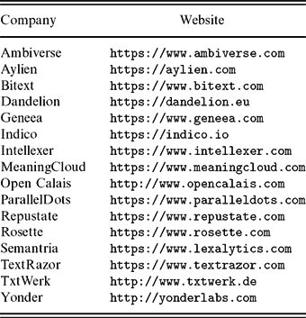
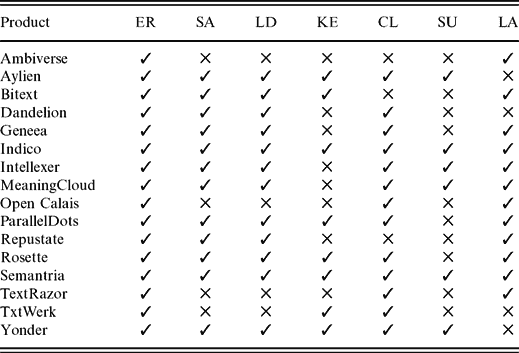
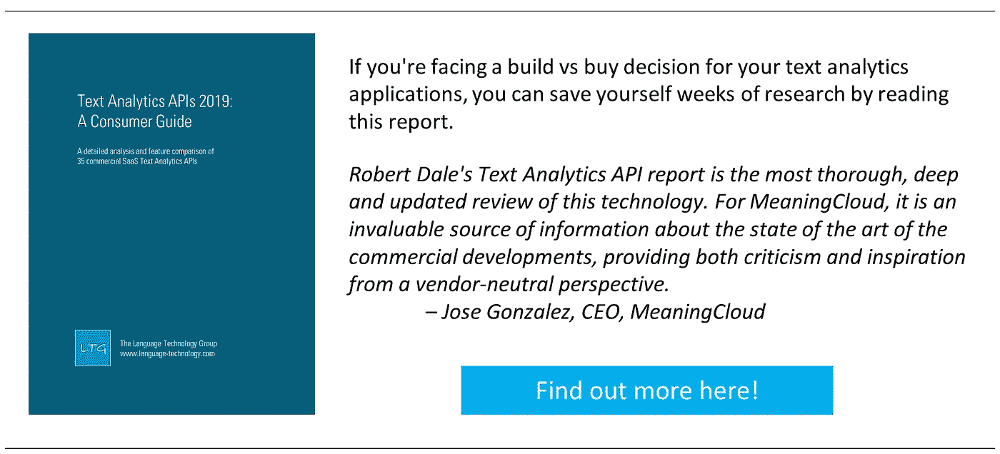
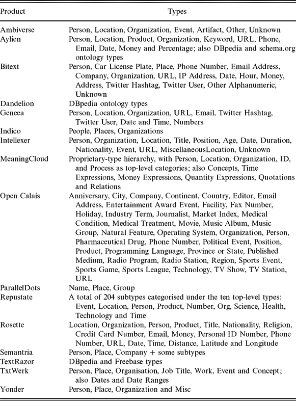
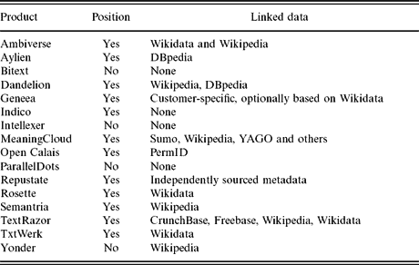
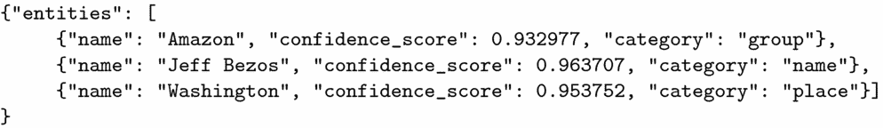
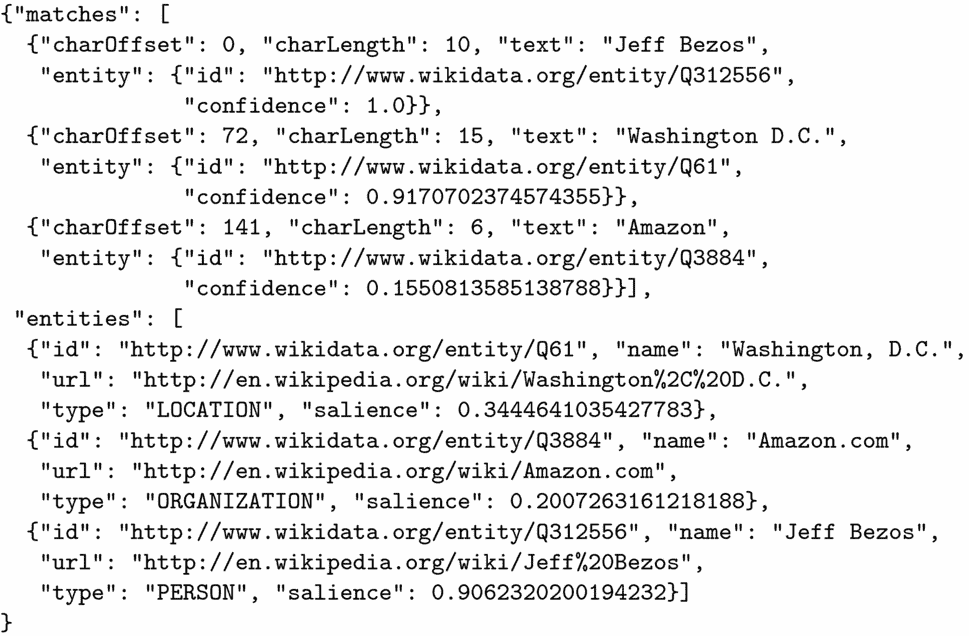
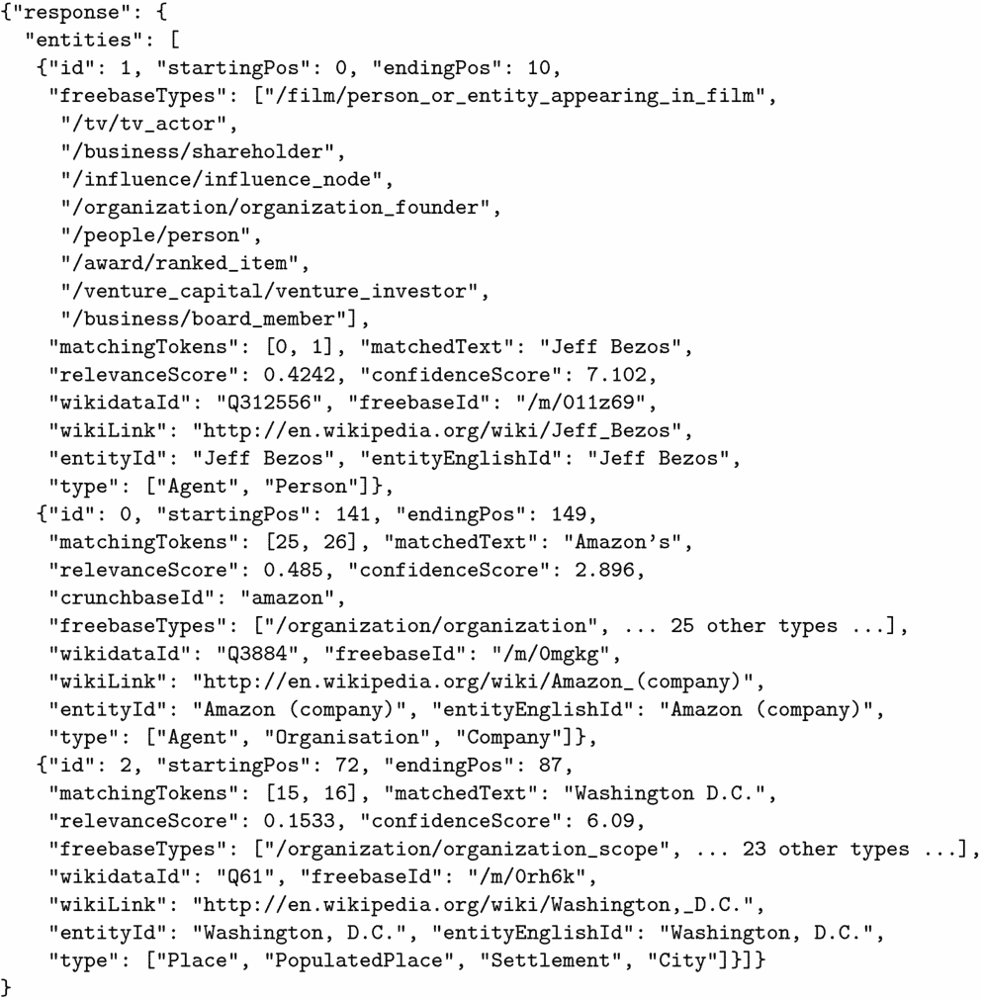

# 文本分析 API，第 2 部分:小玩家

> 原文：<https://towardsdatascience.com/text-analytics-apis-part-2-the-smaller-players-c9e608cf7810?source=collection_archive---------11----------------------->

似乎每隔几周市场上就会出现另一种基于云的文本分析应用编程接口(API)。如果您对使用这些类型的服务构建应用程序感兴趣，如何决定使用哪种 API 呢？在本系列的上一篇文章中，我们看了云软件世界中的巨头的文本分析 API:Amazon、Google、IBM 和 Microsoft。在本帖中，我们调查了市场上规模较小的公司提供的 16 种 API。

> 本文最初作为 2018 年 9 月*行业观察*专栏出现在*自然语言工程杂志*上。你可以在这里找到完整的引用细节[，在这里](https://www.cambridge.org/core/journals/natural-language-engineering/article/text-analytics-apis-part-2-the-smaller-players/17A1A223683894C0261C1B7741BAA9B4)了解更多关于语言技术组[。想要更多吗？在](https://www.language-technology.com/)[这里](https://www.language-technology.com/apis2019)可以找到关于 25 个以上文本分析 API 的更深入的探讨。

# 随处可见的文本分析 API

似乎每隔几周就会出现一个新的文本分析 API。在本系列的前一篇文章中，我们研究了软件即服务市场中的巨头提供的文本分析 API:亚马逊、谷歌、IBM 和微软。这些 APIs 考虑到它们背后的资源，毫不奇怪——是健壮的、开发良好的和有据可查的。但正如我们在那篇评论中指出的，出于这样或那样的原因，你可能不想与大玩家同床共枕。此外，规模较小的公司总有可能会有更新的想法，并能够灵活敏捷地实施这些想法，而不像规模较大的公司那样发展缓慢。

因此，考虑到这一点，在这篇文章中，我们来看看 16 个专注于文本分析作为核心业务的公司的 API。在撰写本文时，我知道至少还有另外 10 个文本分析 API，但是我们在本文和上一篇文章中讨论的总共 20 个应该足够让你知道提供了什么以及什么可能最适合你的需求。如果我错过了一个你用过并且喜欢的 API，或者——更糟！—如果我错过了你在过去几个月里不眠不休开发的 API，给我发一封电子邮件，我会很受鼓舞地在随后的帖子中报道它。

# 文本分析的前景

我们在这里关注的是通过软件即服务订阅模式以商业条款提供的基于云的 API。有更多的公司使用专有的文本分析工具集提供软件开发服务，但这里我们不关心他们。我们特别关注那些提供工具集的公司，你可以用这些工具集来构建自己的文本分析应用。我们还特别关注 API，其主要目的是支持构建处理文本文档的应用程序，如网页、PDF 文件、邮件消息或推文；还有另一类自然语言处理 API，我们在这里没有考虑，它们更基本地与构建交互式聊天机器人有关。就有用的功能而言，这两种类型的应用程序之间有一些交叉，事实上，这里讨论的一些供应商似乎正在将他们的主要注意力转移到聊天机器人领域；但是我们主要关心的是文件的处理。表 1 列出了我们在这里要考察的 16 家供应商。[请注意，自从这篇文章撰写以来，Ambiverse API 已经不再可以在商业基础上使用，现在可以开源使用。]

Table 1: The 16 Text Analytics APIs reviewed here

值得注意的是，每个文本分析供应商都提供一个功能组合，所提供的服务范围可能是您选择工具集的一个关键因素。例如，如果您需要进行命名实体识别和摘要，后一个需求已经大大缩小了您的选择范围。下表 2 总结了所提供的最重要的功能。这不是一个详尽的列表，许多 API 还提供了这里没有列出的额外功能。也不一定任何两个提供特定功能的供应商所用的术语是指同一件事，这里的列表不可避免地要做出一些妥协。特别要注意的是，这里的语言分析类别包含了广泛的功能:一些供应商只提供词性标注，一些供应商提供某种形式的解析，还有一小部分供应商提供开放关系提取。仅仅因为供应商提供了特定的功能并不意味着他们做得很好。

Table 2: Capabilities by product: ER = Entity recognition, SA = Sentiment analysis, LD = Language detection, KE = Keyword extraction, CL = Classification, SU = Summarisation, LA = Linguistic analysis

和前一篇文章一样，在本文的剩余部分，我们将集中讨论一个单一的功能，即实体识别，因为这是所有供应商共有的一个功能；如果您想了解更多关于所有这些 API 的其他功能的信息，以及这里没有包括的一些其他功能，请参见完整报告[这里](https://www.language-technology.com/apis2019)。

# 如何选择命名实体识别器

有许多非技术因素会影响您对提供商的选择，例如支持和文档的质量、正常运行时间保证，当然还有价格。然而，在这里，我们将关注技术因素。

让我们假设您已经决定了您想要什么样的通用文本分析功能，这有助于您筛选可用的候选功能。现在，您需要决定哪个命名实体识别器最适合您的需要。你可能需要考虑几个关键标准。

1.  您想要识别什么类型的实体？几乎每个 API 都返回与人、地点和组织的基本三元组相对应的类型，但有些 API 还提供许多其他类型。
2.  需要知道文中提到实体的位置吗？例如，如果您的应用程序需要在上下文中显示已识别的实体，而如果您的任务只是过滤文档，那么知道某个内容被提及就足够了，不管在哪里。
3.  您是否需要通过链接到一些外部知识源(如维基百科或 DBpedia)来消除已识别的实体提及的歧义？

表 3 显示了每个 API 所标识的类型，表 4 显示了这里调查的 16 个 API 如何符合其他两个标准。

Table 3: Recognized types by product

Table 4: NER features by product

除了这些特性之外，一些 API 还提供了文档中命名实体显著性的数值度量；并且许多还传递一些置信度的数字度量，该置信度可以是所识别的字符串是命名实体、所识别的字符串是指定类型或者所提供的歧义消除链接是正确的置信度。

当然，你想看一些例子。如果要显示所有提到的 API 的输出，那就太难了，所以我选择了一个有代表性的例子。鉴于输入句子*杰夫·贝索斯可能会在美国首都花费更多时间，因为华盛顿越来越像是亚马逊第二总部*的领跑者，图 1 显示了 ParallelDots 提供了什么；这是典型的简单输出。图 2 给出了由 Ambiverse 提供的更复杂结果的味道；图 3 显示了 TextRazor 提供的结果。

Figure 1: Example output from ParallelDots

Figure 2: Example output from Ambiverse

Figure 3: Example output from TextRazor, with some details elided

# 他们工作得怎么样？

同样，仅仅因为一个供应商声称检测到某某类型的实体并不意味着他们做得很好。正确的评估超出了本文的范围；对于一个简单的量化评估来说，用例需求中有太多的变量和太多的独特性。但是在决定选择哪个供应商之前，您肯定希望进行彻底的测试。我自己对这里列出的所有 API 进行的轶事测试表明，性能差异很大，因此没有捷径可以围绕构建适合您的需求的测试集并查看 API 如何处理它。

幸运的是，这里的所有供应商要么提供免费使用层，有时提供相当慷慨的调用配额，要么提供免费试用期，因此不难感受到这些 API 的性能有多好。每一个都提供了一个相当标准的注册过程，通过这个过程你可以创建一个账户，并获得授权证书；所有的供应商都提供了 RESTful API，您可以将它与适当的库一起用于几乎任何编程语言，和/或 API 包装器，使某些特定语言的使用变得容易。

# 底线

因此，正如您所料，最适合您的 API 取决于许多因素:所提供的文档和支持是否足以满足您的需求？该 API 是否提供了您所需要的功能，并且达到了您满意的性能水平？当然，价格需要是可接受的——同样，我们在这里看到的 API 的使用成本有相当大的差异。参见我的[文本分析 APIs 2018:消费者指南](https://www.language-technology.com/apis2018)获取详细分析。如果你面临在这个领域做决定，我希望这篇文章能帮你节省时间。我很想听听你的经历:给我发电子邮件，地址是 rdale@language-technology.com。

*如果你想要一种简单的方法来跟上商业 NLP 世界的关键发展，可以考虑在 NLP* *中注册本周的* [*，这是一份每周周五出版的短小精悍的每周时事通讯。*](http://www.language-technology.com/twin)