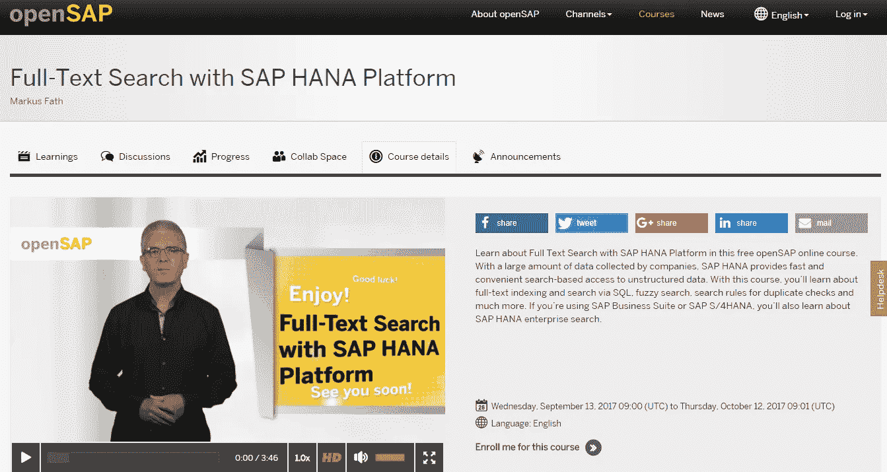

# 文本分析不是火箭科学，现在就学习吧！—开始 7 门文本分析课程

> 原文：<https://towardsdatascience.com/text-analytics-is-not-rocket-science-learn-them-now-7-text-analytics-courses-to-start-8860df51a9e1?source=collection_archive---------2----------------------->

**背景和动机**

文本无处不在，在书籍和印刷材料中，在报纸上，在维基百科和其他百科全书中。人们在网上论坛和讨论组中互相交谈，脸书和推特也大多是文本。

传统的数据分析基于关系模型，数据存储在表中(所谓的结构化数据)。然而，只有大约 20%的企业可用数据是结构化数据，其余 80%是非结构化数据和自由文本。非结构化数据和自由文本实际上是我们遇到的大多数数据，这包括维基百科中的 4000 多万篇文章(其中 500 多万篇是英文的)，45 亿个网页，每天大约 5 亿条推文，以及一年内在谷歌上超过 1.5 万亿次查询。

以下是来自[预测分析今日](https://www.predictiveanalyticstoday.com/text-analytics/)的简洁描述:“文本分析是将非结构化文本数据转换为有意义数据进行分析的过程，以衡量客户意见、产品评论、反馈，提供搜索功能、情感分析和实体建模，以支持基于事实的决策。”

我希望我已经能够说服你去探索文本分析。事不宜迟，让我们通过这 7 门在线课程深入研究文本分析。

**在线文本分析课程**

[*在 Python 中应用文本挖掘*](https://www.coursera.org/learn/python-text-mining)

*4.7 颗星(12 个等级)*

*密歇根大学 via*[*Coursera*](https://www.coursera.org/)

作为 Python 专业化的应用数据科学的一部分，该课程将向个人介绍文本挖掘和文本操作的基础知识。本课程从理解 Python 如何处理文本开始，对机器和人类来说都是文本的结构，以及对处理文本的 nltk 框架的概述。接下来的几周将重点关注常见的操作需求、基本自然语言处理方法在文本中的应用，以及如何完成文本分类的演示。最后一周将探索更高级的方法，如主题建模。

[*文本挖掘与分析*](https://www.coursera.org/learn/text-mining)

*4.4 颗星(164 个评级)*

*伊利诺伊大学香槟分校途经*[*Coursera*](https://www.coursera.org/)

作为数据挖掘专业的一部分，本课程将涵盖挖掘和分析文本数据的主要技术，以发现有趣的模式，提取有用的知识，并支持决策制定，重点是统计方法，这些方法通常可以应用于任何自然语言中的任意文本数据，只需很少或不需要人力。

[*动手进行文本挖掘和分析*](https://www.coursera.org/learn/text-mining-analytics)

*4.1 首发(22 个评分)*

*延世大学 via*[*Coursera*](https://www.coursera.org/)

本课程为个人提供了一个独特的机会，在真实世界数据集和用 Java 编写的文本挖掘工具包的帮助下，学习文本挖掘和分析的关键组件。

[*文本挖掘、抓取和情感分析同 R*](https://www.udemy.com/r-social-media-mining-scraping-with-twitter/)

*3.9 颗星(206 个评分)*

*R-教程训练通过* [*Udemy*](https://www.udemy.com/)

本课程教授个人如何在 r 中处理社交媒体数据。他们将使用 Twitter 数据作为示例数据集。

[*文本分析/文本挖掘使用 R*](https://www.udemy.com/text-analyticstext-mining-using-r/)

*4.2 颗星(57 个评分)*

*ExcelR 解决方案通过* [*Udemy*](https://www.udemy.com/)

本课程展示了如何理解非结构化数据，并为个人提供了各种工具的知识，这是至关重要的。

[*文字挖掘*](https://www.statistics.com/course-catalog/text-mining/)

[*Statistics.com*](https://www.statistics.com/)

本课程讨论文本挖掘的标准技术，并将相当大的注意力放在将非结构化文本转换成可挖掘形式所需的数据准备和处理方法上。

Full Text Search with SAP HANA course at [openSAP](https://open.sap.com/courses/hsesh1)

[*利用 SAP HANA 平台进行全文搜索*](https://open.sap.com/courses/hsesh1?tracking_user=agkqcCiIRelETEBIFUtLv&tracking_type=news&tracking_id=5Ztyj8OKxCIHy8upj9zDvS)

[*OpenSAP*](https://open.sap.com/?locale=en)

如果您的组织已经实施或将要实施 SAP HANA 环境，那么，本课程就是您在 SAP HAHA 中进行文本分析的起点。通过本课程，您将了解全文索引，并允许您通过 SQL、模糊搜索、重复检查搜索规则等进行搜索。下一节课 2017 年 9 月开学。这门课程是免费的，对所有人开放。

如果你知道任何我错过的文本分析课程，请在下面的评论中告诉我。