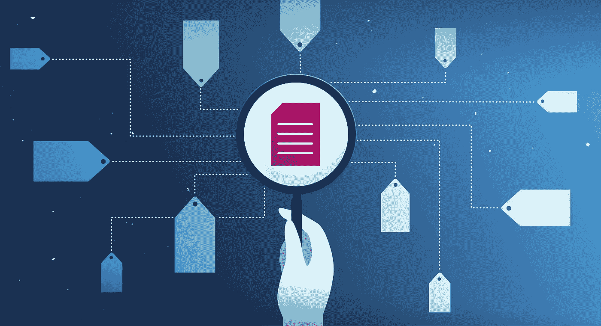
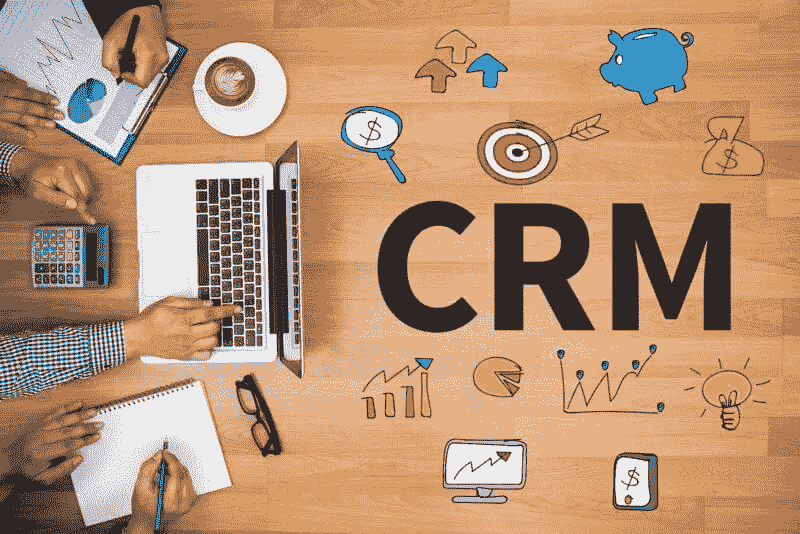
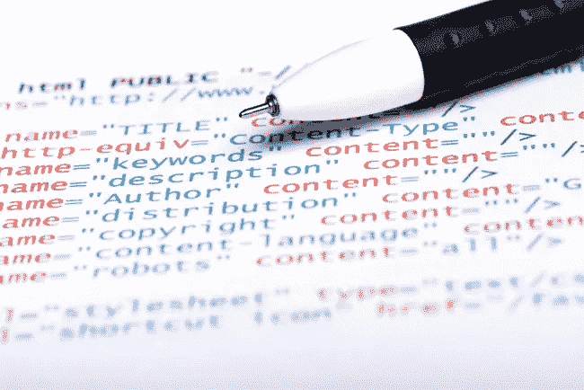
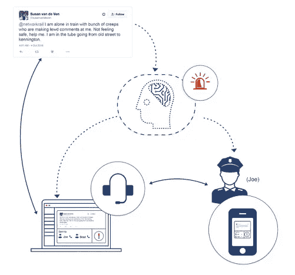
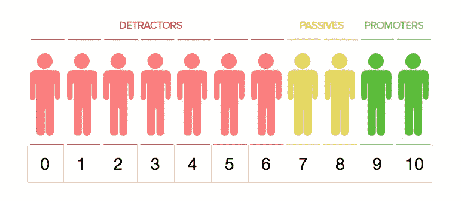
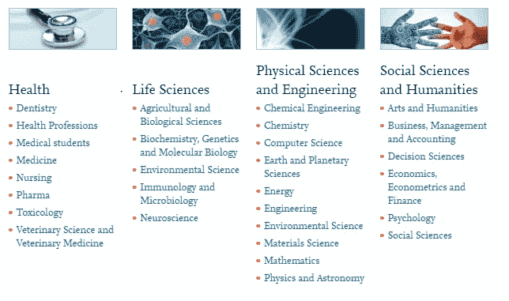

# 文本分类:应用和用例

> 原文：<https://towardsdatascience.com/text-classification-applications-and-use-cases-beab4bfe2e62?source=collection_archive---------4----------------------->

[文本分析](https://www.paralleldots.com/text-analysis-apis)，整体来说是一个新兴的研究领域。市场营销、产品管理、学术和治理等领域已经在利用从文本数据中分析和提取信息的过程。在之前的[帖子](https://blog.paralleldots.com/text-analytics/get-organized-with-automated-text-classification/)中，我们讨论了文本分类背后的技术，这是文本分析的重要部分之一。*文本分类是将自然语言文本按照预先定义的类别进行标注的活动。*通俗地说，文本分类就是从非结构化文本中提取通用标签的过程。这些通用标签来自一组预定义的类别。将您的内容和产品分类有助于用户在网站或应用程序中轻松搜索和导航。

> 使用文本分析生成的知识产品能够部署到任何人的办公桌上。
> –row analytics 首席执行官史蒂夫·加德纳

在这篇文章中，我们来谈谈当前和新兴的文本分类应用。很长一段时间以来，我们一直在使用文本分类来简化我们的事情。图书馆中的图书分类和新闻中的文章分割本质上是文本分类的例子。加入时下流行的人工智能技术，这个过程变得自动化和简单，只需要最少的人工操作。使用人工智能对文本进行分类的概念已经存在了相当长的时间*(Gmail 中的自动过滤和标签，有印象吗？)*。

只要有某些标记要映射到大量文本数据，就可以使用它。尤其是在营销方面，因为它已经从搜索引擎转移到社交媒体平台，在那里品牌和用户之间进行真正的交流。随着营销变得越来越有针对性，营销人员正在使用个性化来推动更好的参与。因此，倾听用户对话并对其进行分析成为营销人员的一项必做任务。

可以对任何数据集进行分类。文本分类对标记数据集进行处理的能力*(在 CRM 自动化的情况下)*(或没有它的情况下)*(在线阅读社会情绪)*只是扩大了这项技术可以实施的空间。

# 应用和使用案例:

*   使用类别来标记内容或产品，以此来改善浏览或识别网站上的相关内容。电子商务、新闻机构、内容管理者、博客、目录等平台可以使用自动化技术对内容和产品进行分类和标记。

*   文本分类也可以用来自动化 CRM 任务。文本分类器是高度可定制的，并且可以相应地被训练。可以基于重要性和相关性直接分配和分析 CRM 任务。它减少了人工工作，因此时间效率高。

*   使用标签对网站内容进行文本分类有助于 Google 轻松抓取您的网站，最终有助于 SEO。此外，自动化网站和应用程序上的内容标签可以使用户体验更好，并有助于标准化它们。营销人员的另一个用例是研究和分析竞争对手使用的标签和关键词。文本分类可用于自动化和加速这一过程。

*   通过对社交媒体上的恐慌对话进行分类，可以建立更快的应急响应系统。当局可以对紧急情况进行监控和分类，以便在任何此类情况出现时做出快速响应。这是一个非常选择性分类的例子。你可以看看这个[研究](https://blog.paralleldots.com/technology/artificial-intelligence-can-make-public-transportation-safer/)来阅读一篇关于这样一个紧急响应系统的详细文章。

*   随着营销每天变得越来越有针对性，自动将用户分类到群组中可以使营销人员的生活变得简单。营销人员可以根据用户在线谈论产品或品牌的方式对他们进行监控和分类。分类器可以被训练来识别提倡者或反对者。因此，让品牌更好地服务于这个群体。

*   学术界、法律从业者、社会研究人员、政府和非营利组织也可以利用文本分类技术。由于这些组织处理大量的非结构化文本，如果按照类别/标签对数据进行标准化，处理起来会容易得多。

文本分类为表格带来了自动化和简化。令人惊讶的是，营销人员、产品经理、设计师、学者和工程师都可以利用这项技术。技术的全部理念是让生活变得更简单。对大量文本数据进行分类有助于标准化平台，使搜索更容易、更相关，并通过简化导航来改善用户体验。

值得注意的是，机器智能和深度学习也正在大多数不可想象和正统的领域扎根。我们可能没有像每一个 60 年代的孩子预测的那样在地面上空盘旋的飞行汽车的具体公式，但肯定有一个将它们带到[地下](https://techcrunch.com/2017/04/28/watch-how-elon-musks-boring-company-tunnels-will-move-cars-faster/)的公式。*时代在变化，令人激动。谁知道文本分析未来会有什么样的应用。*

## 并行文本分类 API

你可以在这里找到 ParallelDot 的文本分类 API [的快速演示。可以为一组与您的业务相关的类别定制 API。我们正在升级我们的文本分类器。请继续关注关于其背后技术的详细文章。](https://www.paralleldots.com/text-analysis-apis#text-classification)

请在下面的评论中告诉我们你对文本分类这一新兴应用的想法。我们很乐意附上名单。

对使用人工智能感兴趣？你现在可以免费注册[的](https://user.apis.paralleldots.com/signing-up?utm_source=blog&utm_medium=banner&utm_campaign=paralleldots_blog)账号[的](https://www.paralleldots.com/)账号，使用触手可及的人工智能。