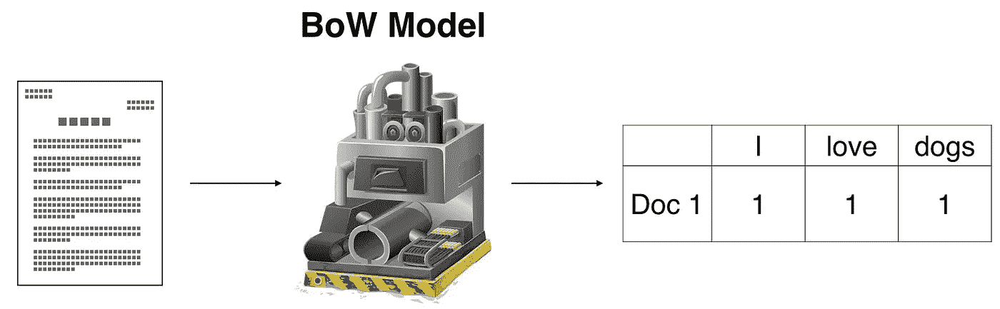

# 如何使用 Keras 记号赋予器

> 原文：<https://towardsdatascience.com/text-classification-in-keras-part-2-how-to-use-the-keras-tokenizer-word-representations-fd571674df23?source=collection_archive---------7----------------------->

## Keras 中教授 NLP 和文本分类系列的第 2 部分



如果你还没看过第一部 *的话，别忘了看看* [*！*](/text-classification-in-keras-part-1-a-simple-reuters-news-classifier-9558d34d01d3)

如果你喜欢这个视频或觉得它有任何帮助，如果你给我一两美元来资助我的机器学习教育和研究，我会永远爱你！每一美元都让我离成功更近一步，我永远心存感激。

# 《恋恋笔记本》

```
import keras
import numpy as np
from keras.datasets import reuters

(x_train, y_train), (x_test, y_test) = reuters.load_data(num_words=None, test_split=0.2)
word_index = reuters.get_word_index(path="reuters_word_index.json")

print('# of Training Samples: {}'.format(len(x_train)))
print('# of Test Samples: {}'.format(len(x_test)))

num_classes = max(y_train) + 1
print('# of Classes: {}'.format(num_classes))

from keras.preprocessing.text import Tokenizer

max_words = 10000

tokenizer = Tokenizer(num_words=max_words)
x_train = tokenizer.sequences_to_matrix(x_train, mode='binary')
x_test = tokenizer.sequences_to_matrix(x_test, mode='binary')

y_train = keras.utils.to_categorical(y_train, num_classes)
y_test = keras.utils.to_categorical(y_test, num_classes)

print(x_train[0])
print(len(x_train[0]))
print(max(x_train[0]))

print(y_train[0])
print(len(y_train[0]))

from keras.models import Sequential
from keras.layers import Dense, Dropout, Activation

model = Sequential()
model.add(Dense(512, input_shape=(max_words,)))
model.add(Activation('relu'))
model.add(Dropout(0.5))
model.add(Dense(num_classes))
model.add(Activation('softmax'))

model.compile(loss='categorical_crossentropy', optimizer='adam', metrics=['accuracy'])
print(model.metrics_names)

batch_size = 32
epochs = 2

history = model.fit(x_train, y_train, batch_size=batch_size, epochs=epochs, verbose=1, validation_split=0.1)
score = model.evaluate(x_test, y_test, batch_size=batch_size, verbose=1)
print('Test loss:', score[0])
print('Test accuracy:', score[1])

(x_train, y_train), (x_test, y_test) = reuters.load_data(num_words=None, test_split=0.2)

x_train = tokenizer.sequences_to_matrix(x_train, mode='count')
x_test = tokenizer.sequences_to_matrix(x_test, mode='count')

y_train = keras.utils.to_categorical(y_train, num_classes)
y_test = keras.utils.to_categorical(y_test, num_classes)

print(x_train[0])
print(len(x_train[0]))
print(max(x_train[0]))
print(np.argmax(x_train[0]))

model = Sequential()
model.add(Dense(512, input_shape=(max_words,)))
model.add(Activation('relu'))
model.add(Dropout(0.5))
model.add(Dense(num_classes))
model.add(Activation('softmax'))
model.compile(loss='categorical_crossentropy', optimizer='adam', metrics=['accuracy'])

history = model.fit(x_train, y_train, batch_size=batch_size, epochs=epochs, verbose=1, validation_split=0.1)
score = model.evaluate(x_test, y_test, batch_size=batch_size, verbose=1)
print('Test loss:', score[0])
print('Test accuracy:', score[1])

(x_train, y_train), (x_test, y_test) = reuters.load_data(num_words=None, test_split=0.2)

x_train = tokenizer.sequences_to_matrix(x_train, mode='freq')
x_test = tokenizer.sequences_to_matrix(x_test, mode='freq')

y_train = keras.utils.to_categorical(y_train, num_classes)
y_test = keras.utils.to_categorical(y_test, num_classes)

print(x_train[0])
print(len(x_train[0]))
print(max(x_train[0]))

model = Sequential()
model.add(Dense(512, input_shape=(max_words,)))
model.add(Activation('relu'))
model.add(Dropout(0.5))
model.add(Dense(num_classes))
model.add(Activation('softmax'))
model.compile(loss='categorical_crossentropy', optimizer='adam', metrics=['accuracy'])

history = model.fit(x_train, y_train, batch_size=batch_size, epochs=epochs, verbose=1, validation_split=0.1)
score = model.evaluate(x_test, y_test, batch_size=batch_size, verbose=1)
print('Test loss:', score[0])
print('Test accuracy:', score[1])

(x_train, y_train), (x_test, y_test) = reuters.load_data(num_words=None, test_split=0.2)

tokenizer.fit_on_sequences(x_train)

x_train = tokenizer.sequences_to_matrix(x_train, mode='tfidf')
x_test = tokenizer.sequences_to_matrix(x_test, mode='tfidf')

y_train = keras.utils.to_categorical(y_train, num_classes)
y_test = keras.utils.to_categorical(y_test, num_classes)

print(x_train[0])
print(len(x_train[0]))
print(max(x_train[0]))

model = Sequential()
model.add(Dense(512, input_shape=(max_words,)))
model.add(Activation('relu'))
model.add(Dropout(0.5))
model.add(Dense(num_classes))
model.add(Activation('softmax'))
model.compile(loss='categorical_crossentropy', optimizer='adam', metrics=['accuracy'])

history = model.fit(x_train, y_train, batch_size=batch_size, epochs=epochs, verbose=1, validation_split=0.1)
score = model.evaluate(x_test, y_test, batch_size=batch_size, verbose=1)
print('Test loss:', score[0])
print('Test accuracy:', score[1])
```