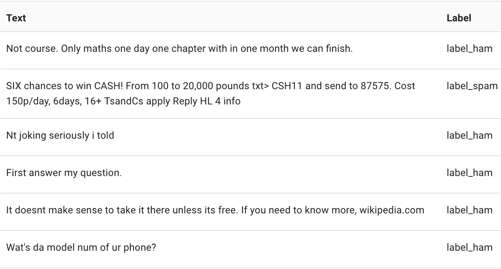

# 使用最先进的 NLP 库 Flair 进行文本分类

> 原文：<https://towardsdatascience.com/text-classification-with-state-of-the-art-nlp-library-flair-b541d7add21f?source=collection_archive---------1----------------------->

## Zalando Research 刚刚发布了 Flair - simple Python NLP 库的新版本！

**为什么这是 NLP 的大新闻？** Flair 在解决自然语言处理问题方面提供了一流的性能，例如命名实体识别(NER)、词性标注(PoS)、词义消歧和文本分类。这是一个建立在 PyTorch 之上的 NLP 框架。

本文解释了如何使用 Flair 来使用现有的和构建定制的文本分类器。


# 介绍

文本分类是一种受监督的机器学习方法，用于将句子或文本文档分类到一个或多个定义的类别中。这是一项广泛使用的自然语言处理任务，在垃圾邮件过滤、情感分析、新闻文章分类和许多其他商业相关问题中发挥着重要作用。

大多数当前技术水平的方法依赖于一种称为文本嵌入的技术。它将文本转换成高维空间中的数字表示。它允许将文档、句子、单词、字符(取决于我们使用的嵌入方式)表示为高维空间中的向量。

对于 NLP 来说，Flair 是一个令人兴奋的消息，因为 Zalando Research 最近的一篇论文[用于序列标记的上下文字符串嵌入](http://alanakbik.github.io/papers/coling2018.pdf) 涵盖了一种始终优于以前最先进解决方案的方法。它在 **Flair** 中得到实现和完全支持，可以用来构建文本分类器。

# 1.做好准备

要安装 Flair，你需要 **Python 3.6** 。如果你还没有，这里有一个关于如何做的指南。然后，要安装 Flair，请运行:

```
pip install flair
```

这将安装运行 Flair 所需的所有软件包。它还将包括 PyTorch，Flair 位于顶部。

# 2.使用预先训练的分类模型

新发布的 *0.4* 带有两个预训练模型。在 IMDB 数据集上训练的情感分析模型和“攻击性语言检测”模型(目前仅支持德语)。

使用、下载和存储模型都被合并到一个方法中，使得使用预训练模型的整个过程出奇地简单。

要使用情绪分析模型，只需运行:

```
from flair.models import TextClassifier
from flair.data import Sentenceclassifier = TextClassifier.load('en-sentiment')sentence = Sentence('Flair is pretty neat!')
classifier.predict(sentence)# print sentence with predicted labels
print('Sentence above is: ', sentence.labels)
```

第一次运行时，Flair 将下载情感分析模型，并默认将其存储到主目录的`.flair`子文件夹中。这可能需要几分钟时间。

上面的代码首先加载所需的库，然后将情感分析模型加载到内存中(如果需要，可以先下载它)，然后预测句子*“Flair 非常漂亮！”*在 0 到 1 的刻度上*。*最后一条命令打印出来:`The sentence above is: [Positive (1.0)]`。

就是这样！例如，现在你可以将代码整合到 REST api 中，并提供类似于 Google 的云自然语言 api 的情感分析的服务，这在大量请求的生产中使用时会被证明是非常昂贵的。

# 3.训练自定义文本分类器

为了训练一个定制的文本分类器，我们首先需要一个带标签的数据集。Flair 的分类数据集格式基于脸书的[快速文本格式](https://fasttext.cc/docs/en/supervised-tutorial.html)。该格式要求在以前缀`__label__`开始的每一行的开头定义一个或多个标签。格式如下:

```
__label__<class_1> <text>
__label__<class_2> <text>
```

在本文中，我们将使用 Kaggle 的垃圾短信检测数据集来构建一个垃圾/非垃圾分类器。该数据集适合于学习，因为它仅包含 5572 行，并且足够小，可以在 CPU 上在几分钟内训练一个模型。



SMS messages from the dataset labelled as either spam or ham (not spam)

## 3.1 预处理-构建数据集

我们首先从 Kaggle 上的[这个链接下载数据集以获得`spam.csv`。然后，在与我们的数据集相同的目录中，我们运行下面的预处理片段，它将进行一些预处理，并将我们的数据集分成训练集、开发集和测试集。](https://www.kaggle.com/uciml/sms-spam-collection-dataset)

确保你已经安装了熊猫。如果没有，先运行`pip install pandas`。

```
import pandas as pd
data = pd.read_csv("./spam.csv", encoding='latin-1').sample(frac=1).drop_duplicates()data = data[['v1', 'v2']].rename(columns={"v1":"label", "v2":"text"})

data['label'] = '__label__' + data['label'].astype(str)data.iloc[0:int(len(data)*0.8)].to_csv('train.csv', sep='\t', index = False, header = False)
data.iloc[int(len(data)*0.8):int(len(data)*0.9)].to_csv('test.csv', sep='\t', index = False, header = False)
data.iloc[int(len(data)*0.9):].to_csv('dev.csv', sep='\t', index = False, header = False);
```

这将从我们的数据集中删除一些重复的数据，对其进行混洗(随机化行)，并使用 80/10/10 拆分将数据分为训练集、开发集和测试集。

如果运行成功，你将得到以 FastText 格式格式化的`train.csv`、`test.csv`和`dev.csv`，准备与 Flair 一起使用。

## 3.2 训练自定义文本分类模型

若要定型模型，请在与生成的数据集相同的目录中运行此代码片段。

```
from flair.data_fetcher import NLPTaskDataFetcher
from flair.embeddings import WordEmbeddings, FlairEmbeddings, DocumentLSTMEmbeddings
from flair.models import TextClassifier
from flair.trainers import ModelTrainer
from pathlib import Pathcorpus = NLPTaskDataFetcher.load_classification_corpus(Path('./'), test_file='test.csv', dev_file='dev.csv', train_file='train.csv')word_embeddings = [WordEmbeddings('glove'), FlairEmbeddings('news-forward-fast'), FlairEmbeddings('news-backward-fast')]document_embeddings = DocumentLSTMEmbeddings(word_embeddings, hidden_size=512, reproject_words=True, reproject_words_dimension=256)classifier = TextClassifier(document_embeddings, label_dictionary=corpus.make_label_dictionary(), multi_label=False)trainer = ModelTrainer(classifier, corpus)trainer.train('./', max_epochs=10)
```

第一次运行这段代码时，Flair 将下载所有需要的嵌入模型，这可能需要几分钟的时间。整个训练过程还需要 5 分钟。

这个代码片段首先将所需的库和数据集加载到一个 corpus 对象中。

接下来，我们创建一个嵌入列表(两个 Flair 上下文 sting 嵌入和一个 GloVe 单词嵌入)。然后，这个列表被用作我们的文档嵌入对象的输入。堆叠和文档嵌入是 Flair 最有趣的概念之一。它们提供了将不同的嵌入组合在一起的方法。您可以将传统的单词嵌入(如 GloVe、word2vec、ELMo)与 Flair 上下文 sting 嵌入一起使用。在上面的例子中，我们使用了基于 LSTM 的方法来组合单词和上下文串嵌入，以生成文档嵌入。你可以在这里了解更多关于[的信息。](https://github.com/zalandoresearch/flair/blob/master/resources/docs/TUTORIAL_5_DOCUMENT_EMBEDDINGS.md)

最后，代码片段训练模型，产生代表我们存储的训练模型的`final-model.pt`和`best-model.pt`文件。

## 3.3 使用训练好的模型进行预测

现在，我们可以通过从同一目录运行以下代码片段，使用导出的模型来生成预测:

```
from flair.models import TextClassifier
from flair.data import Sentenceclassifier = TextClassifier.load_from_file('./best-model.pt')sentence = Sentence('Hi. Yes mum, I will...')classifier.predict(sentence)print(sentence.labels)
```

该代码片段打印出'*[火腿(1.0)]'【T5]，这意味着模型 100%确定我们的示例消息不是垃圾邮件。*

# 与其他框架相比，它的表现如何？

与脸书的 FastText 甚至谷歌的 AutoML 自然语言平台不同，用 Flair 进行文本分类仍然是一项相对低级的任务。我们可以通过设置学习速率、批量大小、退火因子、损失函数、优化器选择等参数选项，完全控制文本嵌入和训练的完成方式……为了实现最佳性能，需要调整这些超级参数。Flair 为我们提供了一个众所周知的 hyper parameter tuning library hyperpt([在这里描述](https://github.com/zalandoresearch/flair/blob/master/resources/docs/TUTORIAL_8_MODEL_OPTIMIZATION.md))的包装器，我们可以使用它来调整我们的 hyper parameters 以获得最佳性能。

在本文中，为了简单起见，我们使用了默认的 hyper 参数。使用大多数默认参数**，我们的 Flair 模型**在 10 个周期后获得了 0.973 的 **f1 分数。**

为了进行比较，我们在 AutoML 自然语言平台上用 FastText 训练了一个文本分类模型。我们首先使用默认参数运行了 **FastText** ，并获得了 0.883 的 **f1 分数，这意味着我们的模型远远超过了 FastText。然而，FastText 只需要几秒钟就可以完成训练，而我们定制的 Flair 模型则需要 5 分钟。**

然后，我们还将我们的结果与在谷歌的自动自然语言平台上获得的结果进行了比较。该平台首先需要 20 分钟来解析数据集。之后，我们开始了训练过程，花了近 3 个小时完成(花费了近 10 美元的免费积分)，但取得了 99.211 - 的 **f1 分数，比我们的定制天赋模型略好。**

# 最后的想法

这篇文章应该让你大致了解如何使用 Flair 进行文本分类。

[在下一期出版物](/how-to-beat-automl-hyperparameter-optimisation-with-flair-3b2f5092d9f5)中，我们将解释如何调整 Flair 的 hyper 参数以实现最佳性能，并在文本分类方面击败谷歌的 AutoML。