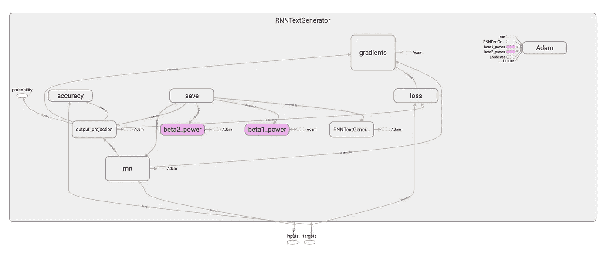
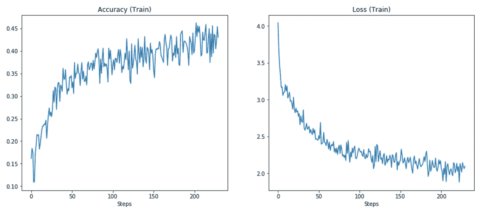

# 使用递归神经网络的文本生成

> 原文：<https://towardsdatascience.com/text-generation-using-rnns-fdb03a010b9f?source=collection_archive---------12----------------------->

## 从《爱丽丝梦游仙境》生成文本

# 介绍

文本生成是数据科学和机器学习中的一个热门问题，它适合于递归神经网络。该报告使用 TensorFlow 构建了一个 RNN 文本生成器，并在 Python3 中构建了一个高级 API。该报告的灵感来自于@karpathy ( [min-char-rnn](https://gist.github.com/karpathy/d4dee566867f8291f086) )和 Aurélien Géron ( [用 Scikit-Learn 和 TensorFlow](https://www.amazon.com/Hands-Machine-Learning-Scikit-Learn-TensorFlow/dp/1491962291) 进行动手机器学习)。这是 CST463 中的一个课堂项目——加州州立大学蒙特雷湾分校的高级机器学习，由 Glenn Bruns 博士指导。

# 模块

`Dataset`、`RNNTextGenerator`和`ModelSelector`是三个主要模块。有关文档，请在 [Github](https://github.com/donaldong/rnn-text-gen) 上查看该项目。

# 资料组

在 [src/dataset.py](https://github.com/donaldong/rnn-text-gen/blob/master/src/dataset.py) 中定义

创建包含独热编码文本数据的文本数据集。它批量生产编码标签序列。我们将文本数据分成批次用于训练 RNN，并且我们随机抽取文本样本(具有给定长度)来评估我们的模型的性能。

# RNNTextGenerator

在 [src/text_generator.py](https://github.com/donaldong/rnn-text-gen/blob/master/src/text_generator.py) 中定义

使用张量流 RNN 单元创建递归神经网络(执行`inputs`的动态展开)。它有一个输出投影图层，可生成每个字符类的最终概率。它通过基于当前序列的最后一个字符的概率分布对下一个字符进行采样来生成文本。



我们使用`Alice in Wonderland`作为文本。



我们可以看到精度和损耗并没有收敛。每个`fit`调用将运行一个时期(我们将`epoch=1`传递给了构造函数)。

我们希望在 30 秒内继续用更多的纪元来拟合模型，并且我们对模型如何随着时间的推移而改进感兴趣。

```
test acc: 0.535040020942688, test loss: 1.592130422592163
Yes, but much towe this NOT, aft open') said 'Letger comimpie hone,
'U VERY up in aborious, it with the adge,
-----------------------
test acc: 0.5360000133514404, test loss: 1.5756181478500366
Yes, but the Habembood cacs must, was the lang donant as perpen my his huril about harriered me shreep), whre
-----------------------
test acc: 0.5430399775505066, test loss: 1.5500394105911255
Yes, but to Alice.

So then
hep datee went orling,' said Alice,' said had geined,' she you not!' said the
nil
-----------------------
test acc: 0.5302400588989258, test loss: 1.6037070751190186
Yes, but the could mould cobl over howner? Now that oplo-thing to her orverewn.'

'Why, to
herself!

The Qu-e
-----------------------
test acc: 0.539199948310852, test loss: 1.6024020910263062
Yes, but the Queen home way the at the placsarnd of the sat a it,' the QUED INK Affece herge how eacushing ov
-----------------------
test acc: 0.5388799905776978, test loss: 1.538255214691162
Yes, but did they rossan that may the sing,' sayeing, round queer thatled thing's she went on, I'm she can wa
-----------------------
test acc: 0.5424000024795532, test loss: 1.5805484056472778
Yes, but first's word.' She was byself, if our it was en!' seemes you se
leasions of the doous rige out oldes
-----------------------
test acc: 0.5455999970436096, test loss: 1.5576822757720947
Yes, but the other--
 Whereet heam who her not
one and it didn't knowling e s
-----------------------
```

我们可以看到，随着时间的推移，生成的文本确实变得更好了。句子中有更多的实词。测试精度和损耗仍在提高。

现在，我们将尝试不同的超参数。

# 模型选择器

在 [src/model_selector.py](https://github.com/donaldong/rnn-text-gen/blob/master/src/model_selector.py) 中定义

执行随机搜索并按准确度对模型进行排序。它选择最好的排名模型，并允许长时间的搜索(几个小时/几天)。

我们为模型选择器定义了一个大的搜索空间，并给它 24 小时的搜索时间。我们希望它能为`Alice in Wonderland`文本发现一个优秀的模式。

选择器看到的最好的模型使用带有`320`神经元的`GRU Cell`和`leaky_relu`作为激活函数。它使用一个学习速率为`0.006`的`AdamOptimizer`。它在`45`个时期中被训练，每批有`91`个序列(batch_size)。在 5 个随机采样的测试序列中，它的平均精度为`0.6245`，损失`1.25`。

```
Yes, but to talk about this of ketched him in the puppy juging said to the tell messave off, things very unfusts, and that put on hesserriely I’ll make the pu
```

我们认为`epoch`是模型的超参数，因为大量的历元会使神经网络过度拟合，在测试序列上表现不佳。因此，选择器中的最佳模型是我们将使用的最终模型。

最好的文本生成器部署为[一个简单的 web 应用程序](https://www.ddong.me/alice-text-gen) ( `https://www.ddong.me/alice-text-gen`)用于教育目的。