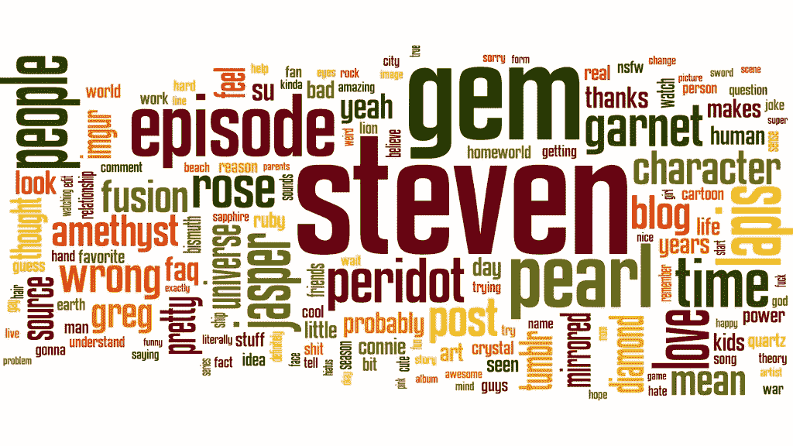
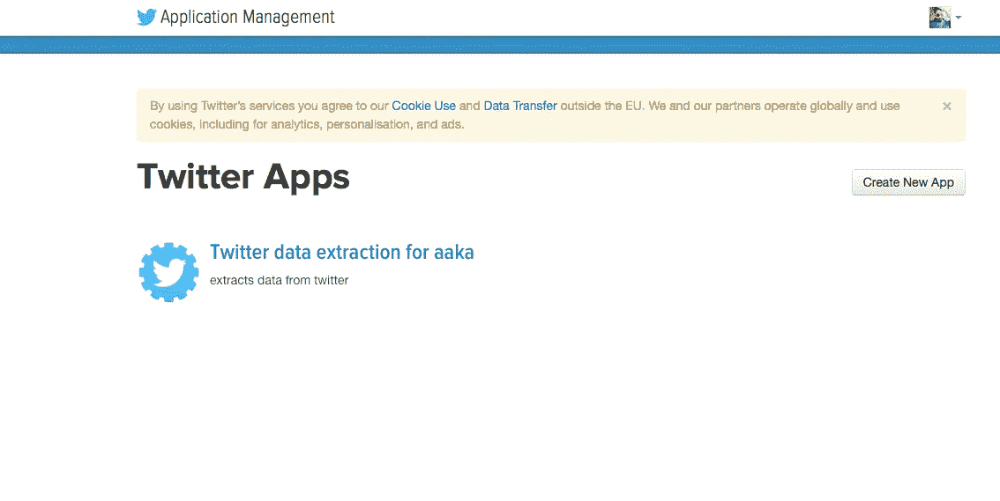
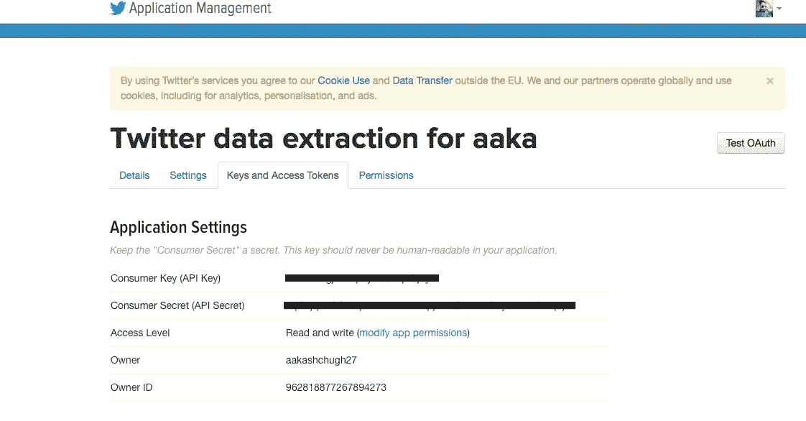
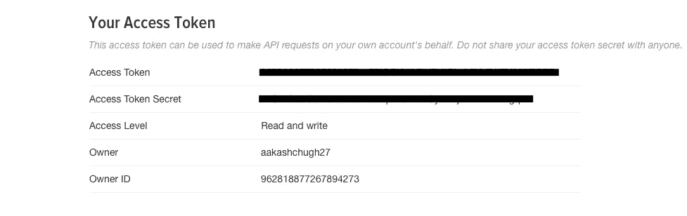
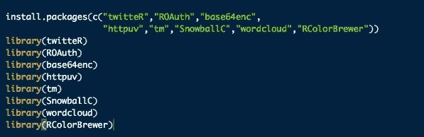
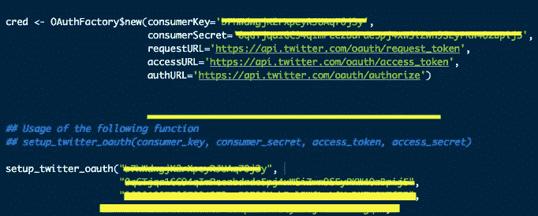
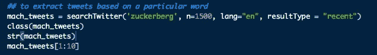
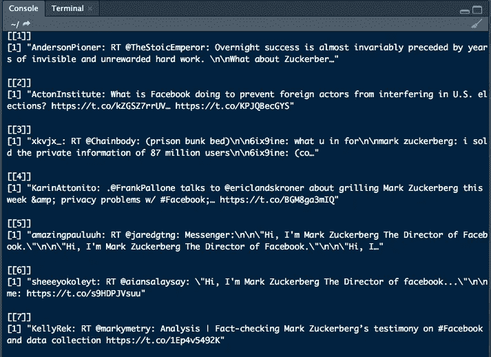
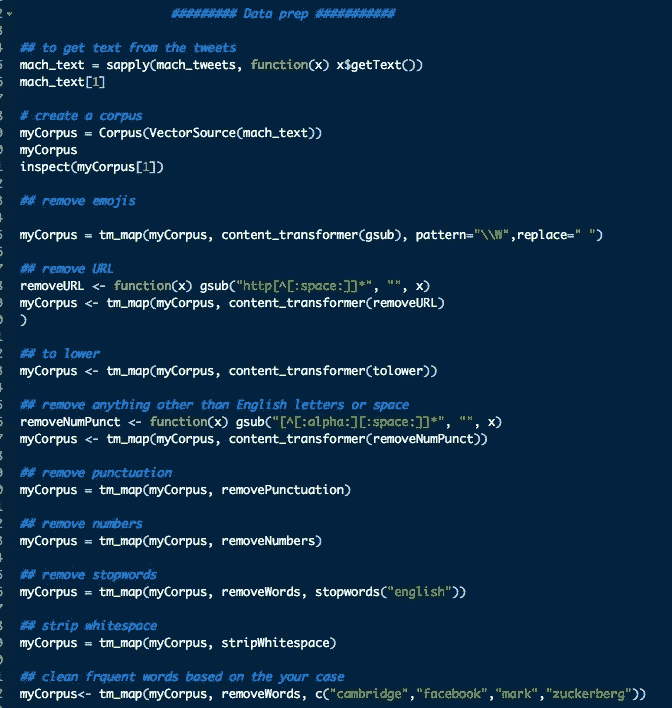
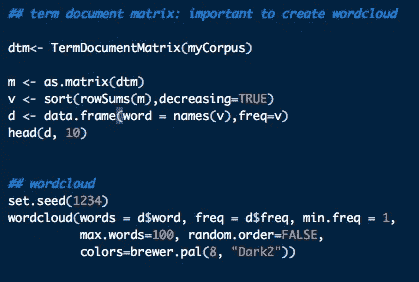

# 文本挖掘:Twitter 提取和逐步引导生成词云

> 原文：<https://towardsdatascience.com/text-mining-twitter-extraction-and-stepwise-guide-to-generate-a-word-cloud-a2c9d626008d?source=collection_archive---------5----------------------->

我看过很多帖子，作者谈论使用 tweets 生成单词云，但没有多少人谈论如何将你的设备连接到 Twitter 以生成单词云。这是非常简单但非常重要的一步(显然，我们将使用这些推文生成一个单词云)。在我们开始技术部分之前，重要的是理解我们为什么需要从 twitter 中提取数据，或者让我们只说从任何社交媒体平台，如 Twitter，facebook，LinkedIn 等。假设你在市场上推出了一个产品或方案，你想分析人们对它的看法。这也叫 ***风险感知*** 和 ***情绪分析。*** 它有助于确定人们对你的产品的看法，通过分析这些平台的数据，你可以很容易地知道对你的产品的评价是正面还是负面。相信我，它也能帮助你改变商业策略。

那么，我们开始吧。

**连接 R 和 twitter 的步骤:**

1.创建一个 Twitter 帐户。**不要忘记添加您的手机号码。**2
2。一旦您在 twitter 上创建了您的帐户，请访问以下链接创建您的第一个 Twitter 应用程序

## http://apps.twitter.com

3.点击创建新应用程序。为您的应用程序选择一个唯一的名称，并提供应用程序的简要描述。在“网站”中，您可以提供您的任何个人资料链接(我已经给出了我的 LinkedIn 个人资料链接)。
4。点击“创建您的 Twitter 应用程序”。您的应用程序已创建，看起来应该如下所示:

Figure 1: Twitter application

5.打开您的应用程序，进入“密钥和访问令牌”查看您的消费者密钥(API 密钥)和消费者秘密(API 秘密)密钥。我把我的藏起来了，但是一旦你站在这个舞台上，你就应该看到你的了。在某个地方记下两把钥匙。

Figure 2.1: Important Keys and Tokens 1

6.如果您是第一次这样做，那么您必须向下滚动到同一个“密钥和访问令牌”页面，并生成您的访问令牌。**记录访问令牌和访问令牌密码以及您的消费者密钥。**

Figure 2.2: Important Keys and Tokens 2

> 是时候打开你的 R 工作室了。

1.安装必要的软件包并加载库。安装这些包很重要，因为它们允许 R interface 与 twitter 连接，并对第三方应用程序进行认证。

Figure 3: R packages

2.是时候使用以下命令建立连接了。

Figure 4: Setting up the connection

3.R 与 Twitter 通信的环境和连接已经建立，现在终于可以提取一些 tweets 了。有几个命令可以用来提取用户的推文，或者通过使用特定的 ***单词*** 。在这里你应该非常聪明，对你的提取非常挑剔(*知道你想要提取和分析什么*)。我们都知道脸书和剑桥分析杂志的问题，以及马克·扎克伯格在国会山的听证会 **( *他被拷问并失去了他的眉毛)*** 。对于本教程，我将提取最近使用“扎克伯格”一词的前 1500 条推文。

Figure 5: Tweets Extraction

一旦你提取了推文，开始玩它。在分析数据之前先了解它。从检查结构、类别开始，查看 5-10 条最近的推文。您还可以使用 *nchar()计算每条 tweet 的字符数。*探索更多。

Figure 6: Ten recent tweets

***现在我们已经学会了如何提取推文，是时候学习如何使用这些推文，并从中获取一些重要信息了。在接下来的几个步骤中，我们将学习如何清理文本数据，创建语料库和文档术语矩阵，生成词云并从中获取一些有用的信息。请注意，我们今天要做的文本数据的数据准备可以用来准备任何文本数据。***

> 请按照以下步骤准备您的数据以供进一步分析。这些步骤不言自明。

Figure 7: Data preparation pipeline

# **词云**

词云是基于文档的词频，也就是说词的最大使用次数越大。了解一些真知灼见会非常有用。按照代码创建术语文档矩阵和词云。*不一定要保持相同的参数。*

Figure 8: Term document matrix

# 分析单词 cloud

似乎像 ***数据、百万、用户、隐私、信息、监狱*** 等词在提取的推文中被使用了几次。这些单词有时可能没有意义，但如果在上下文中阅读，它可以讲述一个价值百万美元的故事。

Figure 9: Word Cloud

> 附注:马克·扎克伯格不会进监狱。还没有。