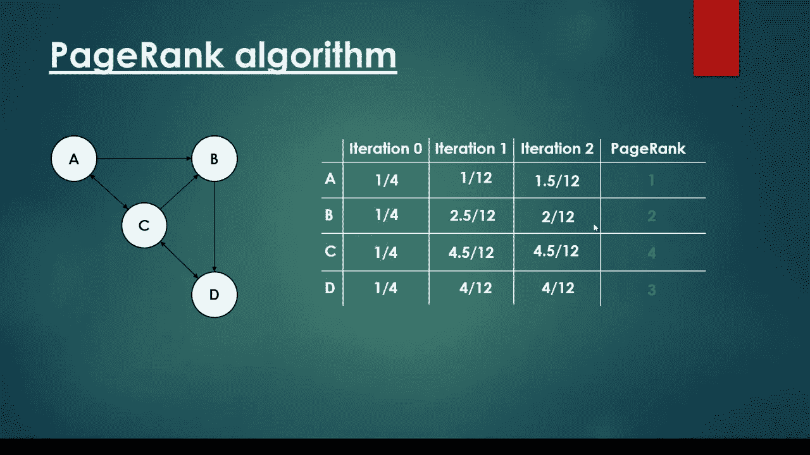
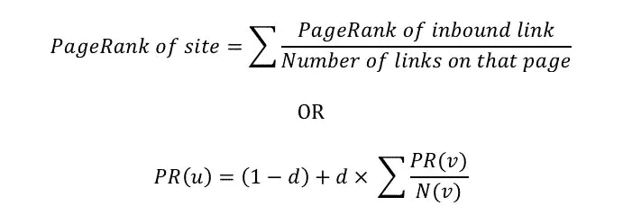

# 用提炼的方法把整段总结成一句话

> 原文：<https://towardsdatascience.com/text-summarization-extractive-approach-567fe4b85c23?source=collection_archive---------5----------------------->


Source: [https://unsplash.com/photos/RLw-UC03Gwc?utm_source=unsplash&utm_medium=referral&utm_content=creditCopyText](https://unsplash.com/photos/RLw-UC03Gwc?utm_source=unsplash&utm_medium=referral&utm_content=creditCopyText)

当我们阅读一篇文章或一本书时，为了快速理解一篇长文章，我们总是要做一个摘要。在英语中，每篇文章的第一个(或前两个)句子很有可能代表整篇文章。当然，主题句有时也可以是最后一句。

在自然语言处理中，有两种方法可以进行文本摘要。第一种，抽取法，是一种简单的方法，即从文章中抽取关键词或句子。有一些局限性，证明了性能不是很好。第二种是抽象方法，即根据给定的文章生成新的句子。它需要更先进的技术。

读完这篇文章后:

1.  了解 PageRank 算法
2.  了解 TextRank 算法
3.  如何使用 TextRank 算法进行摘要



Source: [https://www.youtube.com/watch?v=P8Kt6Abq_rM](https://www.youtube.com/watch?v=P8Kt6Abq_rM)

PageRank 算法是 Google 开发的，用于搜索网站的最重要部分，使 Google 搜索结果与查询相关。

在 PageRank 中，它是有向图。开始时，所有节点都有相同的分数(1 /节点总数)。

该算法



Source: [https://blogs.cornell.edu/info2040/2015/10/17/will-outbound-links-reduce-the-pagerank/](https://blogs.cornell.edu/info2040/2015/10/17/will-outbound-links-reduce-the-pagerank/)

第一个公式是 PageRank 的简化版本，我们将使用这个公式进行演示。第二个有点复杂，因为它涉及到另一个参数，即阻尼系数“d”。默认情况下，d 为 0.85

让我们看看简化版。在迭代 1 中，以下是 PageRank 计算方法:

*   答:(1/4)/3。因为只有 C 指向 A，所以我们使用先前的 C 分数(迭代 0)除以 C 所指向的节点数(即 3)
*   B: (1/4)/2 + (1/4)/3。A 和 C 都指向 B，因此之前的 A 得分(迭代 0)除以 A 所指向的节点数(即 2)。对于 C，它与前面的(1/4)/3 相同。

详细情况，你可以查看视频的完整解释。

问题:我们应该什么时候停止迭代？

按照理论，它应该一直计算到分数上没有大的更新。

# 文本排名

为什么要在 TextRank 之前引入 PageRank？因为 TextRank 的思想来源于 PageRank 并使用类似的算法(图的概念)来计算重要性。

差异:

1.  TextRank 图是无向的。意味着所有的边都是双向的
2.  PageRank 中边的权重为 1 时是不同的。有不同的计算方法，如 BM25，TF-IDF。

有许多不同的文档相似性实现，如 BM25、余弦相似性、IDF-修正余弦。你可以选择最适合你的问题。如果你对这些算法没有想法，请让我们知道，我们将在以后的分享中包括它。


Source: [https://radimrehurek.com/gensim/](https://radimrehurek.com/gensim/)

gensim 提供了一个简单的 API，通过使用 BM25(最佳匹配 25)来计算 TextRank。

步骤 1:环境设置

```
pip install gensim==3.4.0
```

步骤 2:导入库

```
import gensim 
print('gensim Version: %s' % (gensim.__version__))
```

结果:

```
gensim Version: 3.4.0
```

步骤 3:初始测试内容

```
# Capture from [https://www.cnbc.com/2018/06/01/microsoft--github-acquisition-talks-resume.html](https://www.cnbc.com/2018/06/01/microsoft--github-acquisition-talks-resume.html)content = "Microsoft held talks in the past few weeks " + \
    "to acquire software developer platform GitHub, Business " + \
    "Insider reports. One person familiar with the discussions " + \
    "between the companies told CNBC that they had been " + \
    "considering a joint marketing partnership valued around " + \
    "$35 million, and that those discussions had progressed to " + \
    "a possible investment or outright acquisition. It is " + \
    "unclear whether talks are still ongoing, but this " + \
    "person said that GitHub's price for a full acquisition " + \
    "was more than Microsoft currently wanted to pay. GitHub " + \
    "was last valued at $2 billion in its last funding round " + \
    "2015, but the price tag for an acquisition could be $5 " + \
    "billion or more, based on a price that was floated " + \
    "last year. GitHub's tools have become essential to " + \
    "software developers, who use it to store code, " + \
    "keep track of updates and discuss issues. The privately " + \
    "held company has more than 23 million individual users in " + \
    "more than 1.5 million organizations. It was on track to " + \
    "book more than $200 million in subscription revenue, " + \
    "including more than $110 million from companies using its " + \
    "enterprise product, GitHub told CNBC last fall.Microsoft " + \
    "has reportedly flirted with buying GitHub in the past, " + \
    "including in 2016, although GitHub denied those " + \
    "reports. A partnership would give Microsoft another " + \
    "connection point to the developers it needs to court to " + \
    "build applications on its various platforms, including " + \
    "the Azure cloud. Microsoft could also use data from " + \
    "GitHub to improve its artificial intelligence " + \
    "producs. The talks come amid GitHub's struggle to " + \
    "replace CEO and founder Chris Wanstrath, who stepped " + \
    "down 10 months ago. Business Insider reported that " + \
    "Microsoft exec Nat Friedman -- who previously " + \
    "ran Xamarin, a developer tools start-up that Microsoft " + \
    "acquired in 2016 -- may take that CEO role. Google's " + \
    "senior VP of ads and commerce, Sridhar Ramaswamy, has " + \
    "also been in discussions for the job, says the report. " + \
    "Microsoft declined to comment on the report. " + \
    "GitHub did not immediately return a request for comment."
```

尝试不同的比例

返回用于决定导入句子数量比率参数。

```
Original Content:
Microsoft held talks in the past few weeks to acquire software developer platform GitHub, Business Insider reports. One person familiar with the discussions between the companies told CNBC that they had been considering a joint marketing partnership valued around $35 million, and that those discussions had progressed to a possible investment or outright acquisition. It is unclear whether talks are still ongoing, but this person said that GitHub's price for a full acquisition was more than Microsoft currently wanted to pay. GitHub was last valued at $2 billion in its last funding round 2015, but the price tag for an acquisition could be $5 billion or more, based on a price that was floated last year. GitHub's tools have become essential to software developers, who use it to store code, keep track of updates and discuss issues. The privately held company has more than 23 million individual users in more than 1.5 million organizations. It was on track to book more than $200 million in subscription revenue, including more than $110 million from companies using its enterprise product, GitHub told CNBC last fall.Microsoft has reportedly flirted with buying GitHub in the past, including in 2016, although GitHub denied those reports. A partnership would give Microsoft another connection point to the developers it needs to court to build applications on its various platforms, including the Azure cloud. Microsoft could also use data from GitHub to improve its artificial intelligence producs. The talks come amid GitHub's struggle to replace CEO and founder Chris Wanstrath, who stepped down 10 months ago. Business Insider reported that Microsoft exec Nat Friedman -- who previously ran Xamarin, a developer tools start-up that Microsoft acquired in 2016 -- may take that CEO role. Google's senior VP of ads and commerce, Sridhar Ramaswamy, has also been in discussions for the job, says the report. Microsoft declined to comment on the report. GitHub did not immediately return a request for comment.

---> Summarized Content (Ratio is 0.3):
On Friday, Business Insider reported that Microsoft has held talks to buy GitHub — a $2 billion startup that claims 24 million software developers as users.
Just to catch you up: GitHub is an online service that allows developers to host their software projects.

---> Summarized Content (Ratio is 0.5):
On Friday, Business Insider reported that Microsoft has held talks to buy GitHub — a $2 billion startup that claims 24 million software developers as users.
Microsoft declined to comment, but you can read the full Business Insider report here.
While we wait for further word on the future of GitHub, one thing is very clear: It would make perfect sense for Microsoft to buy the startup.
Just to catch you up: GitHub is an online service that allows developers to host their software projects.

---> Summarized Content (Ratio is 0.7):
On Friday, Business Insider reported that Microsoft has held talks to buy GitHub — a $2 billion startup that claims 24 million software developers as users.
Microsoft declined to comment, but you can read the full Business Insider report here.
While we wait for further word on the future of GitHub, one thing is very clear: It would make perfect sense for Microsoft to buy the startup.
Just to catch you up: GitHub is an online service that allows developers to host their software projects.
From there, anyone from all over the world can download those projects and submit their own improvements.
development world.
```

结果

```
Original Content:
On Friday, Business Insider reported that Microsoft has held talks to buy GitHub — a $2 billion startup that claims 24 million software developers as users. It's not immediately clear what will come of these talks. Microsoft declined to comment, but you can read the full Business Insider report here. While we wait for further word on the future of GitHub, one thing is very clear: It would make perfect sense for Microsoft to buy the startup. If the stars align, and GitHub is integrated intelligently into Microsoft's products, it could give the company a big edge against Amazon Web Services, the leading player in the fast-growing cloud market. Just to catch you up: GitHub is an online service that allows developers to host their software projects. From there, anyone from all over the world can download those projects and submit their own improvements. That functionality has made GitHub the center of the open source software. development world.

---> Summarized Content (Ratio is 0.3):
On Friday, Business Insider reported that Microsoft has held talks to buy GitHub — a $2 billion startup that claims 24 million software developers as users.
Just to catch you up: GitHub is an online service that allows developers to host their software projects.

---> Summarized Content (Ratio is 0.5):
On Friday, Business Insider reported that Microsoft has held talks to buy GitHub — a $2 billion startup that claims 24 million software developers as users.
Microsoft declined to comment, but you can read the full Business Insider report here.
While we wait for further word on the future of GitHub, one thing is very clear: It would make perfect sense for Microsoft to buy the startup.
Just to catch you up: GitHub is an online service that allows developers to host their software projects.

---> Summarized Content (Ratio is 0.7):
On Friday, Business Insider reported that Microsoft has held talks to buy GitHub — a $2 billion startup that claims 24 million software developers as users.
Microsoft declined to comment, but you can read the full Business Insider report here.
While we wait for further word on the future of GitHub, one thing is very clear: It would make perfect sense for Microsoft to buy the startup.
Just to catch you up: GitHub is an online service that allows developers to host their software projects.
From there, anyone from all over the world can download those projects and submit their own improvements.
development world.
```

第五步:尝试不同的字数

字数参数是控制结果的另一个变量。如果同时输入了字数和比率。比率将被忽略。

```
print('Original Content:')
print(content)
for word_count in [10, 30, 50]:
    summarized_content = gensim.summarization.summarize(body, word_count=word_count)
    print()
    print('---> Summarized Content (Word Count is %d):' % word_count)
    print(summarized_content)
```

结果

```
riginal Content:
Microsoft held talks in the past few weeks to acquire software developer platform GitHub, Business Insider reports. One person familiar with the discussions between the companies told CNBC that they had been considering a joint marketing partnership valued around $35 million, and that those discussions had progressed to a possible investment or outright acquisition. It is unclear whether talks are still ongoing, but this person said that GitHub's price for a full acquisition was more than Microsoft currently wanted to pay. GitHub was last valued at $2 billion in its last funding round 2015, but the price tag for an acquisition could be $5 billion or more, based on a price that was floated last year. GitHub's tools have become essential to software developers, who use it to store code, keep track of updates and discuss issues. The privately held company has more than 23 million individual users in more than 1.5 million organizations. It was on track to book more than $200 million in subscription revenue, including more than $110 million from companies using its enterprise product, GitHub told CNBC last fall.Microsoft has reportedly flirted with buying GitHub in the past, including in 2016, although GitHub denied those reports. A partnership would give Microsoft another connection point to the developers it needs to court to build applications on its various platforms, including the Azure cloud. Microsoft could also use data from GitHub to improve its artificial intelligence producs. The talks come amid GitHub's struggle to replace CEO and founder Chris Wanstrath, who stepped down 10 months ago. Business Insider reported that Microsoft exec Nat Friedman -- who previously ran Xamarin, a developer tools start-up that Microsoft acquired in 2016 -- may take that CEO role. Google's senior VP of ads and commerce, Sridhar Ramaswamy, has also been in discussions for the job, says the report. Microsoft declined to comment on the report. GitHub did not immediately return a request for comment.

---> Summarized Content (Word Count is 10):

---> Summarized Content (Word Count is 30):
On Friday, Business Insider reported that Microsoft has held talks to buy GitHub — a $2 billion startup that claims 24 million software developers as users.

---> Summarized Content (Word Count is 50):
On Friday, Business Insider reported that Microsoft has held talks to buy GitHub — a $2 billion startup that claims 24 million software developers as users.
Just to catch you up: GitHub is an online service that allows developers to host their software projects.
```

# 结论

对于完整的代码，你可以从 github 查看。如果你也想了解抽象方法，请告诉我们。稍后我会安排一篇文章

*   根据 gensim 源代码，**建议输入至少 10 个句子**
*   **不需要训练**数据或建模。
*   它不仅适用于英语，也适用于任何其他输入(符号、日语等)。你也可以阅读 TextRank [的研究论文](http://www.aclweb.org/anthology/W04-3252)来获得详细的理解。
*   从我的经验来看，大多数时候结果是**不好**。这可能是由于**多种文字**和**的结果只是输入**的一个子集。

# 关于我

我是湾区的数据科学家。专注于数据科学、人工智能，尤其是 NLP 和平台相关领域的最新发展。

从[TTP://medium . com/@ makcedward/](http://medium.com/@makcedward/)访问我的博客

从 https://www.linkedin.com/in/edwardma1026[获得连接](https://www.linkedin.com/in/edwardma1026)

从[https://github.com/makcedward](https://github.com/makcedward)探索我的代码

检查我的内核从[https://www.kaggle.com/makcedward](https://www.kaggle.com/makcedward)