# 在 Python 中使用 TFIDF 处理文本

> 原文：<https://towardsdatascience.com/tfidf-for-piece-of-text-in-python-43feccaa74f8?source=collection_archive---------1----------------------->

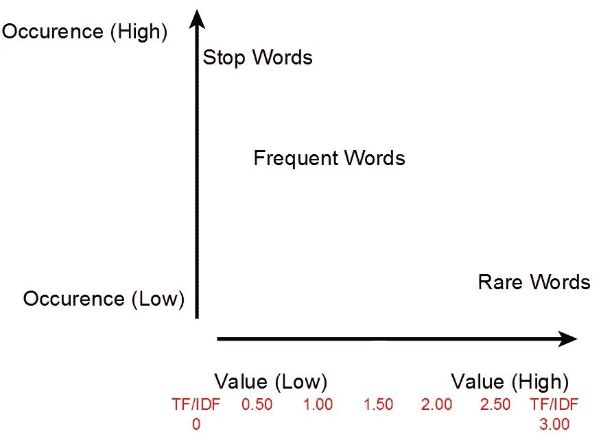

继之前的 TFIDF [post](https://medium.com/@shivangisareen/tfidf-7b29017dcdd) 之后，我们现在将在一段文本上手动实现 TFIDF、**。**

**我们将计算一段文本中每个术语的 TFIDF 分数。文本将被*符号化*成句子，然后每个句子被认为是一个*文档。***

**从导入所需的库开始:**

**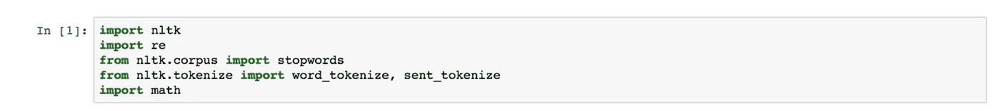**

**接下来，获取一些随机文本进行测试。**

**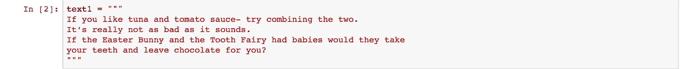**

**一个非常简单的预处理功能:**

**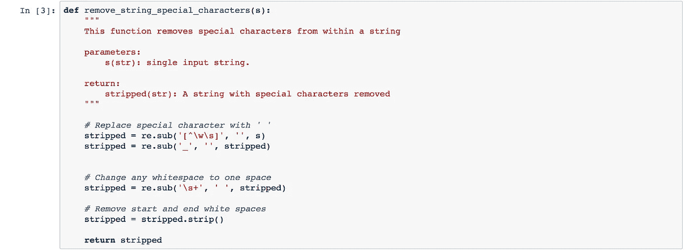**

**现在，创建文档的函数:**

**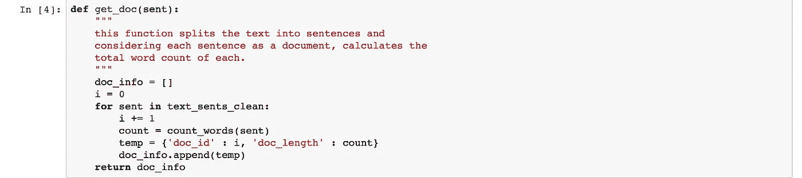**

**以下函数是计算 TF 和 IDF 分数的先决条件:**

**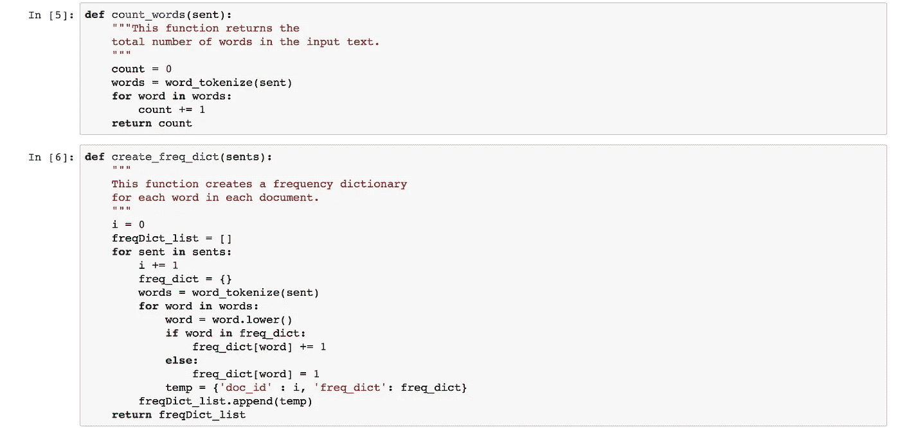**

**获取 TF 和 IDF 分数的函数:**

**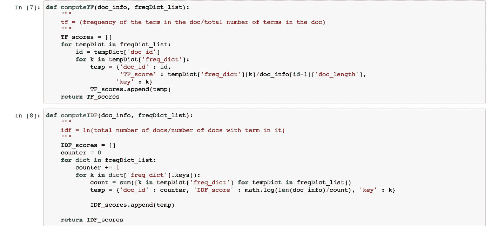**

**最后，**

**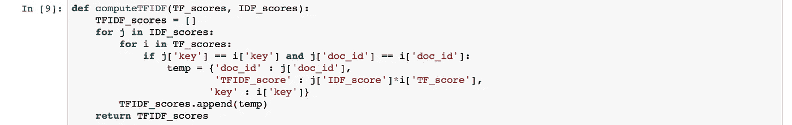**

**我们终于可以开始处理输入文本了。文本被*符号化*成句子并清除特殊字符。然后它被制作成一个名为 ***doc_info 的文档列表。*****

**清理后的句子***text _ sents _ clean***被传入***create _ freq _ dict****函数。***

***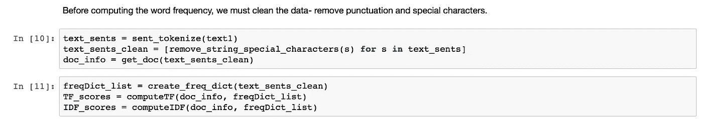***

******doc_info*** 和***freq dict _ list*:**的输出***

***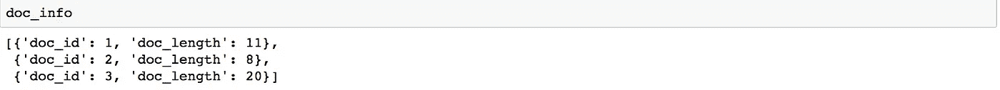******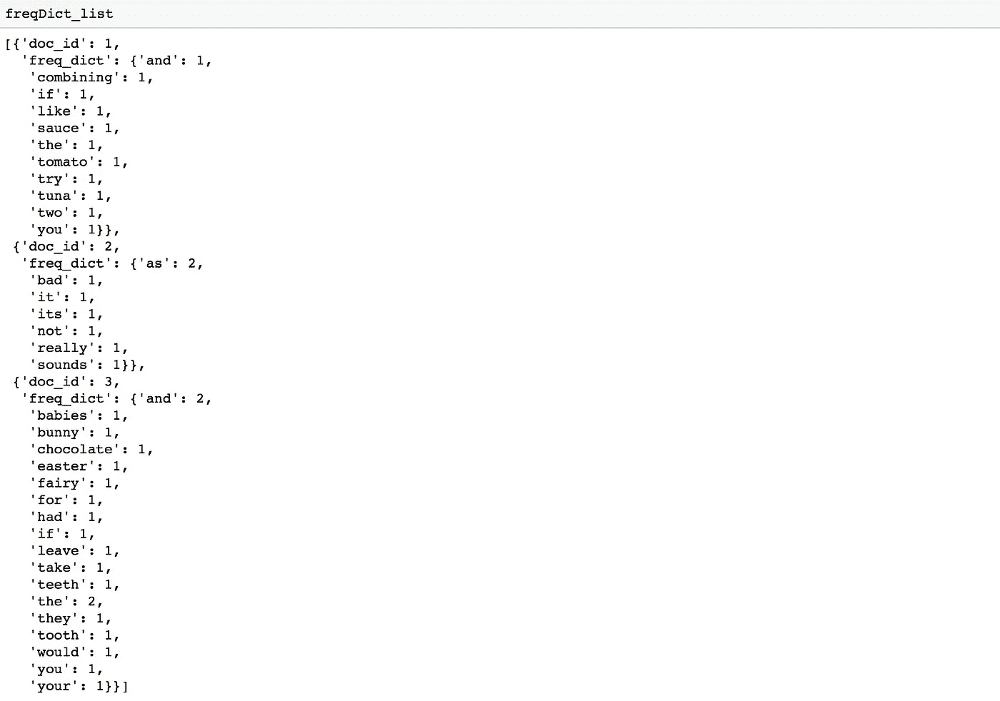***

******doc _ info****和****freq dict _ list****作为输入计算 TF 和 IDF 得分:******

*****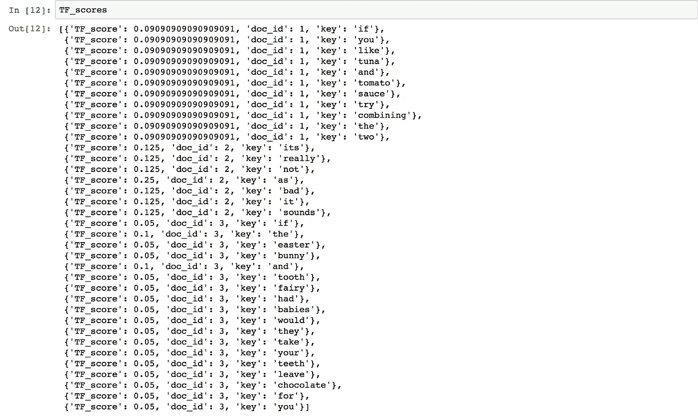**********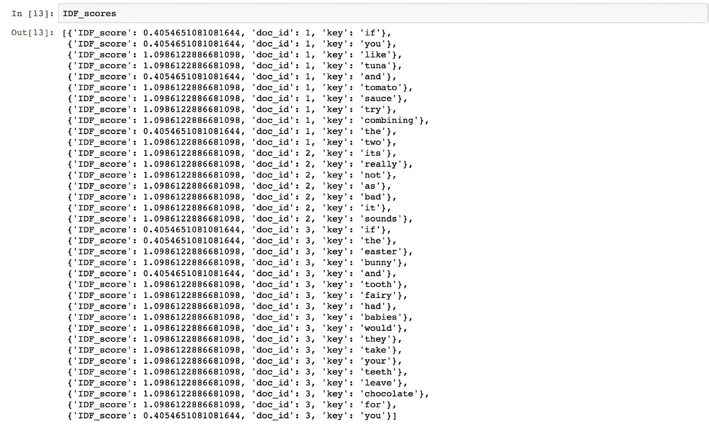*****

*****现在，通过将 TF 和 IDF 分数输入到函数 ***computeTFIDF*** 中来获得 TFIDF 分数:*****

****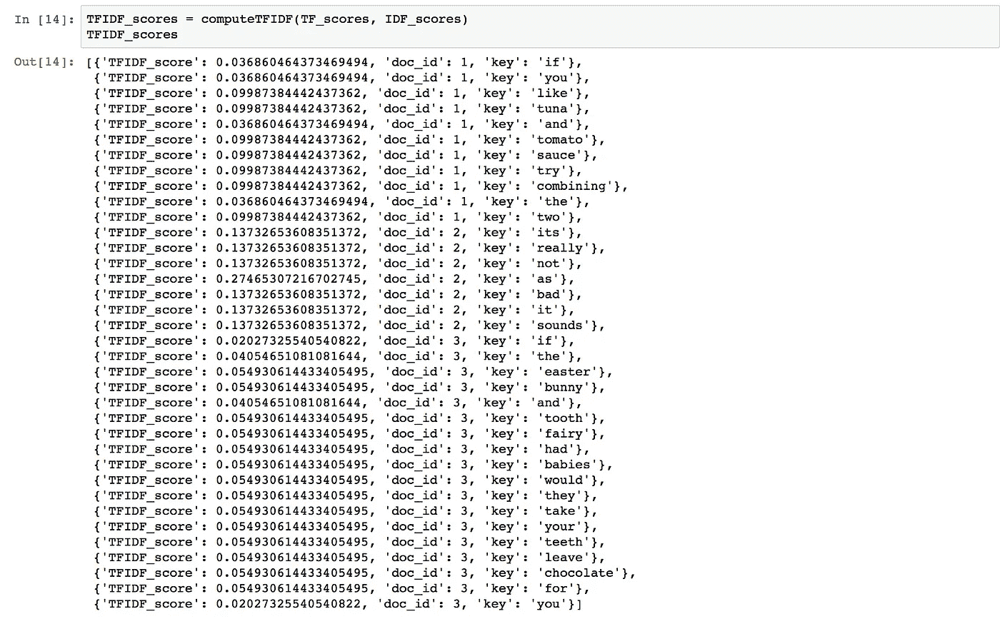****

****我们可以清楚地看到，出现一次的单词比出现多次的单词具有更高的 TFIDF 得分，不仅仅是在同一个句子中，而是跨所有输入句子。****

****找出算法实际上是如何工作的总是比直接实现自动化版本更好。****