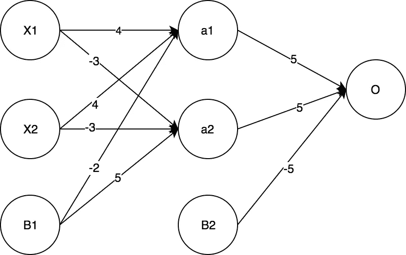
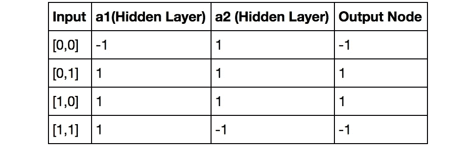

# Tflearn:在 Tensorflow 中使用 2x2x1 前馈神经网络求解 XOR

> 原文：<https://towardsdatascience.com/tflearn-soving-xor-with-a-2x2x1-feed-forward-neural-network-6c07d88689ed?source=collection_archive---------2----------------------->

**关于如何在 python tflearn 中仅使用 12 行代码训练 2x2x1 前馈神经网络来解决 XOR 问题的简单指南 python tflearn 是基于 Tensorflow 构建的深度学习库。**

我们的网络的目标是训练一个网络接收两个布尔输入，并且仅当一个输入为真而另一个为假时才返回真。

# 包装

```
**from** **tflearn** **import** DNN
**from** **tflearn.layers.core** **import** input_data, dropout, fully_connected **from** **tflearn.layers.estimator** **import** regression
```

# 输入数据

我们将输入数据 **X** 和预期结果 **Y** 定义为列表的列表。由于神经网络本质上只处理数值，我们将把布尔表达式转换成数字，这样 **True=1** 和 **False=0**

```
X = [[0,0], [0,1], [1,0], [1,1]]
Y = [[0], [1], [1], [0]]
```

# 模型

我们定义输入、隐藏和输出层。
语法再简单不过了——对输入层使用 **input_layer()** ，对后续层使用**full _ connected()**。

```
input_layer = input_data(shape=[**None**, 2])
hidden_layer = fully_connected(input_layer , 2, activation='tanh') 
output_layer = fully_connected(hidden_layer, 1, activation='tanh') 
```

为什么形状的输入是**【无，2】**？网络一次馈入多个学习实例。由于我们在每个学习示例中使用了**两个特征**，并且有**四个示例**，所以我们的数据是**形状的[4，2]。但是有时我们喜欢定义我们的网络，这样它可以接收任意数量的训练样本。我们可以将 **None** 用于任意数量的训练示例，并将输入形状定义为**【None，number_of_features，…】****

```
regression = regression(output_layer , optimizer='sgd', loss='binary_crossentropy', learning_rate=5)
model = DNN(regression)
```

在上面的代码块中，我们定义了将执行反向传播和训练网络的回归变量。我们将使用随机梯度下降作为优化方法，使用二元交叉熵作为损失函数。

最后，我们简单地使用 **DNN()在 ftlearn 中定义我们的(几乎)深度神经网络。**

接下来，我们需要训练模型。在此过程中，回归器将尝试优化损失函数。训练的最终结果只是连接层节点的权重(和偏差)。

# 培养

```
model.fit(X, Y, n_epoch=5000, show_metric=**True**)
```

运行 model.fit()后，Tensorflow 会馈送输入数据 5000 次，并尝试拟合模型。

如果你的输出看起来像这样(以小损耗和高精度为目标)，

```
>>> Training Step: 5048  | total loss: **0.31394** | time: 0.002s
| SGD | epoch: 5048 | loss: 0.31394 - binary_acc: 0.9994 -- iter: 4/4
```

你的模型有 0.999%的准确性，这意味着它成功地学会了解决问题。

> 请注意，您的回归变量不会总是产生相同的结果。它甚至可能无法学会正确解决我们的问题。这是因为网络权重是每次随机初始化的。神经网络**也需要大量的训练数据**来使反向传播正常工作。因此，我们的代码非常依赖于权重的初始化方式。

# 预言；预测；预告

为了检查我们的模型是否真的有效，让我们预测所有可能的组合，并使用简单的列表理解将输出转换为布尔值

```
[i[0] > 0 **for** i **in** model.predict(X)]
>>> [False, True, True, False]
```

太好了！我们的模型有效。

但是模型使用了什么逻辑来解决异或问题呢？让我们检查引擎盖下面。

# 重量分析

与 AND 和 OR 不同， **XOR 的输出不是线性可分的**。
因此，我们需要引入另一个隐藏层来解决它。原来，隐藏层中的每个节点都代表一种更简单的线性可分逻辑运算(AND、OR、NAND、…)，输出层将充当由前一层的输出提供的另一种逻辑运算。

如果我们仅限于使用简单的逻辑运算，我们可以将 XOR 定义为

> *XOR(X1，X2) = AND(OR(X1，X2)，NAND(X1，X2))*

为了理解我们的网络使用什么逻辑来得出结果，我们需要分析它的权重(和偏差)。
我们用 **model.get_weights(layer。W)** 获取权重向量和 **model.get_weights(层。W)** 得到偏差向量。

```
print(model.get_weights(hidden_layer.W), model.get_weights(hidden_layer.b))
print(model.get_weights(output_layer.W), model.get_weights(output_layer.b))>>> [[ 3.86708593 -3.11288071] [ 3.87053323 -3.1126008 ]]
    [-1.82562542  4.58438063]
>>> [[ 5.19325304]
    [-4.87336922]
```

下图显示了各个权重属于哪个节点(为简单起见，数字四舍五入)



> X1 *和* X2 *是我们的输入节点。* a1 *和* a2 *是我们隐藏层中的节点，而* O *是输出节点。* B1 *和* B2 *是偏差。*

这告诉我们什么？嗯，还没什么进展。但是通过计算单个输入的节点激活，我们可以看到特定节点的行为。
我们正在使用公式( *×代表矩阵乘法*):

> 激活= tanh(输入×权重+偏差)

> 注意，我们使用*[tanh()](http://mathworld.wolfram.com/HyperbolicTangent.html)*表示激活将在[-1，1] *范围内。***

****

**Rounded node activations for individual input combinations for acquired XOR neural network**

*   ****a1** 当输入中至少有一个 1 时为真(1)。 **a1** 节点因此代表**或**逻辑运算**
*   ****a2** 始终为真，除非两个输入都为真。 **a2** 节点因此代表**与**逻辑运算**
*   ****输出节点**只有在 **a1** 和 **a2** 都为真时才为真。**

**输出节点可以重写为:**

> ***O(X1，X2) =* 和 *(a1(X1，X2)，a2(X1，X2))=*(OR(X1*，X2)，NAND(X1，X2))***

**因此，经过训练的网络是 OR(X1，X2)和 NAND(X1，X2)的 AND 运算**

***请注意，由于随机权重初始化，结果会有所不同，这意味着每次训练模型时，您的权重可能会有所不同。***

**完整的来源可以在[这里找到](https://github.com/tadejmagajna/DeepTuts/blob/master/tflearn_simple_xor/tflearn_simple_xor.ipynb):**