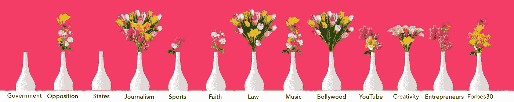
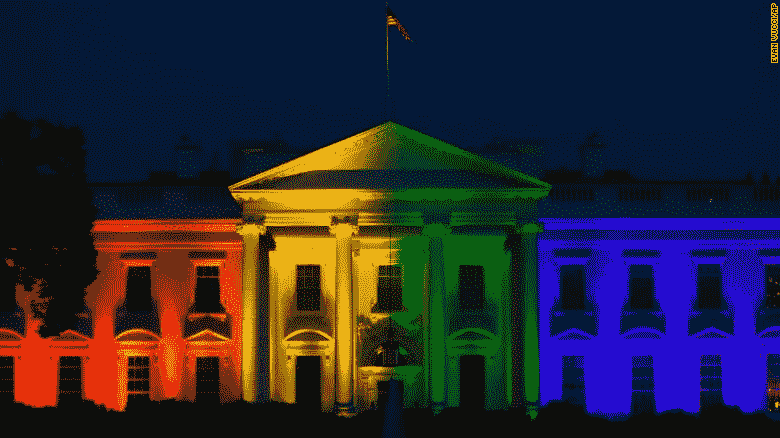
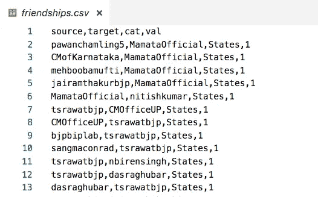
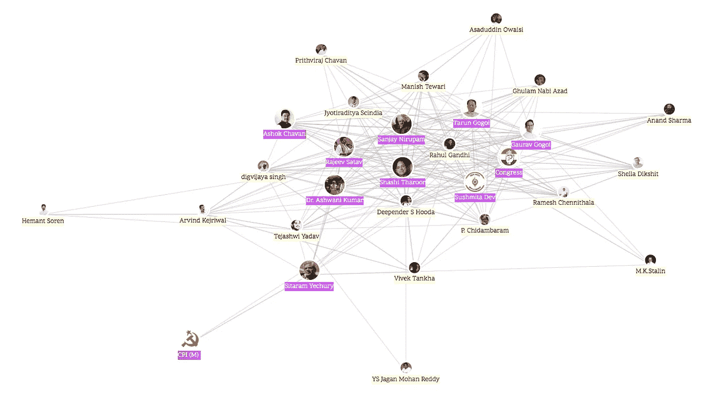
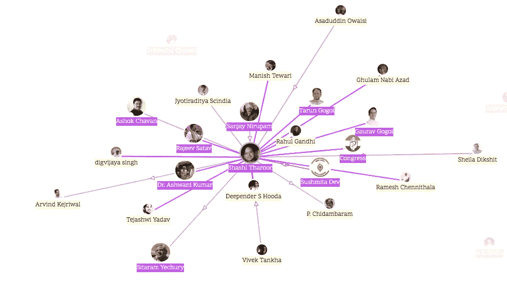
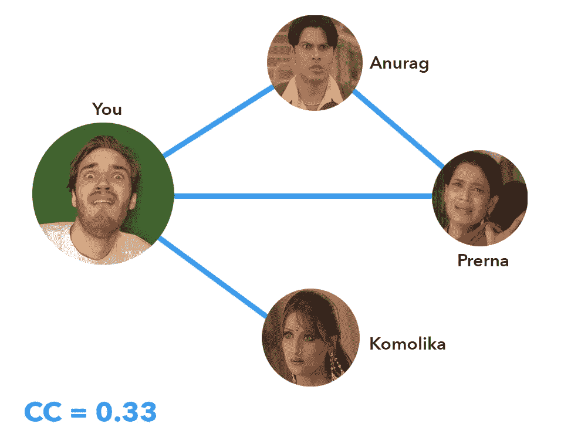
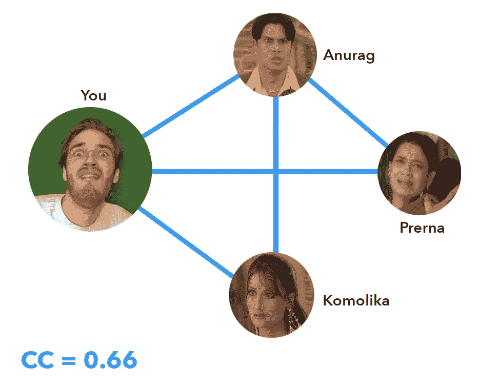
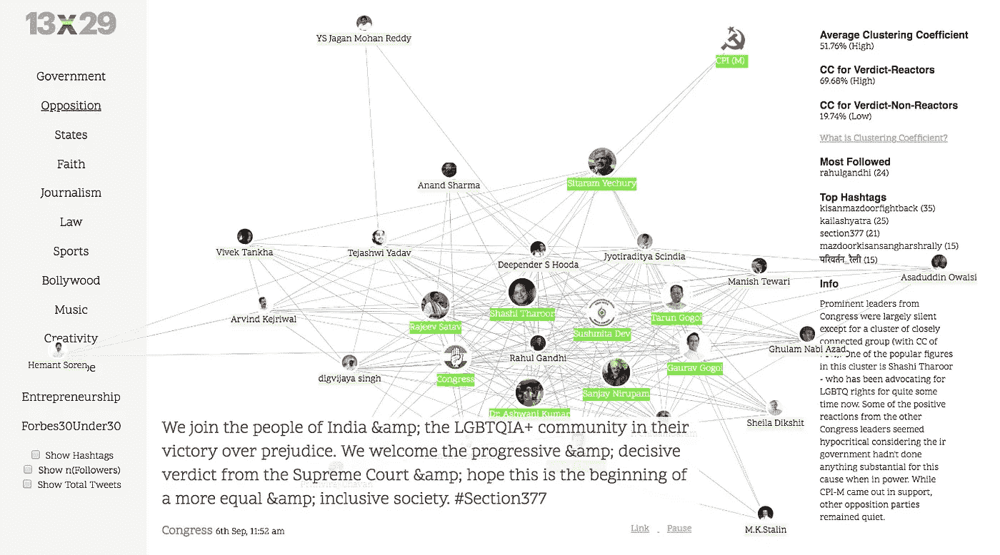

# 13 x 29 项目——观察印度对同性恋合法化的反应

> 原文：<https://towardsdatascience.com/the-13-x-29-project-visualizing-how-india-reacted-to-decriminalization-of-homosexuality-8d105f828748?source=collection_archive---------8----------------------->

*这篇文章是* [*13x29 项目*](https://13x29.github.io) *的姊妹篇——最好在桌面上观看。完成这个项目的最好方法是首先阅读本文的介绍性部分，然后玩交互式网站。*

2018 年 9 月 6 日，印度向未来迈出了大胆的一步。《土地法》宣布第 377 条的部分内容为非法，从而使成年人之间双方同意的身体关系合法化，无论其性别如何。

Celebrations post Section 377 Vedict | Credits: REUTERS/Francis Mascarenhas

人们没有庆祝做爱的自由。人们庆祝不用每天醒着的时候都想着自己是罪犯。这个判决花了 158 年，数以千计勇敢的活动家不屈不挠，五个有远见的法官的智慧才得以实现。

由于这一决定，今天世界上 75%的人生活在同性恋不是犯罪的国家。其他几个国家将会效仿印度改变他们的反同性恋法，印度未来的艾伦·图林斯和蒂姆·库克将不会为了克服耻辱而结束自己的生命。人们可以预料，这样一个历史性的判决将会得到社会各界的强烈反应。

# 为什么这么安静？

判决后的三天，我一直粘在我的推特上。我的心膨胀阅读推文和转发。

彩虹和骄傲溅满了我的推特。但是后来，我注意到一些奇怪的事情。我看到的所有推特都是娱乐圈的人。我没有看到商界人士、政治领袖或运动员对这一判决发表任何意见。

例如，当美国在全国各地将同性婚姻合法化时，这就是白宫庆祝的方式。

令我失望的是，判决被藏在床底下，没有以应有的方式庆祝。

其次，在关注了一些宝莱坞八卦之后(感谢 Koffee 和 Karan)，我知道在宝莱坞圈子里谁是谁的朋友。似乎只有一群亲密的“朋友”在推特上谈论判决，而其他“团体”都很安静。网络科学表明，吸烟、肥胖、投票模式等许多特征会像疾病一样通过网络传播。LGBTQ-思想开放也能通过网络传播吗？在比其他群体更亲 LGBTQ 的群体中是否存在某些子网络？

这让我心中的夏洛克兴奋起来。这有什么规律吗？谁真的对判决发表了评论，这种反应如何因人的职业而异？

# 确认了 377 名嫌疑人

在不做太多假设的情况下，纯粹基于好奇心，我决定分析 13 个不同的领域，每个领域有 29 名有代表性的影响者，总共 377 人。我最初打算探索的领域是政治、娱乐、商业和体育。然后，我将这些字段细分为 13 组，如下所示:

1.  政府:首相、内阁部长和工会部长
2.  **反对派** —来自国会、尼共(毛主义)、AAP 的领导人
3.  **州**—29 个州的首席部长
4.  **信仰** —宗教领袖、组织、活动家
5.  **新闻业** —记者、编辑、作家
6.  **法律** —律师
7.  **体育** —板球运动员，奥运会奖牌获得者
8.  **宝莱坞**——来自印度电影业的人们
9.  **音乐** —歌手
10.  **创意** —舞蹈指导、时装设计师、作家、音乐总监
11.  YouTube——在印度 YouTube 上很受欢迎
12.  **企业家精神**——初创公司创始人、风投
13.  **福布斯 30 位 30 岁以下的人**——福布斯 30 位 30 岁以下的人。

你可以在这里看看样本集中包括的人:[https://twitter.com/iashris/lists](https://twitter.com/iashris/lists)

我的取样基于关注者的数量——一个衡量一个人影响力的指标。对于有相似追随者的人，我随机选择了一些人，我承认这并没有使抽样误差为零，但仍然给出了一个大的图景。

# 他们说了什么？

我对判决时人们谈论的话题很感兴趣，所以我决定选择 9 月 5 日午夜到 9 月 7 日午夜这段时间作为我的分析窗口——以 6 日判决日为中心。

我使用 Tweepy 库编写了一个 Python 脚本，获取了这三天里这 377 个人发布的所有 tweets。Twitter 没有 API 来访问日期之间的推文，所以我写了一个脚本，递归地将 start_date 推回，直到获取所需的推文。除了推文，我还提取了关注者的数量、他们的个人资料图片、使用的标签和他们的转发。我做了一个关键词分析，将推文分为“目标”和“非目标”——取决于推文是否包含标签或文字，如 *377* 、*骄傲*、 *lgbt* 、*最高法院*或*爱就是爱。*

A JSON file was obtained for every person with their tweets and hashtags

# 将群体网络化

我不仅对谁在说什么感兴趣，还对说类似话的人之间是否有某种联系感兴趣。为此，我必须知道每个群体中的人是如何相互联系的。

我在寻找的数据是——谁跟踪谁。Twitter 通过他们的 [show friendship API](https://developer.twitter.com/en/docs/accounts-and-users/follow-search-get-users/api-reference/get-friendships-show.html) 提供这些信息。我获得了一组人的所有可能组合的配对，并获得了他们的“友谊”数据。

CSV containing who-follows-whom data

# 可视化网络和热点

一旦我有了这两个部分——下一步就是想象它。有趣的部分开始了！我用这个神奇的[力导向算法库](https://github.com/dhotson/springy/blob/master/springy.js)触发了一个基于物理的模拟，它把那些互相跟随的人聚集在一起，把那些和其他人没有联系的人隔离开来。

为了指出那些对判决做出反应的人——让我们称他们为“反应者”——我给了他们一个彩虹标签，让他们与众不同。那些没有反应的人——让我们称他们为“非反应者”——我把他们的缩略图变小并进行灰度化。

安恩和……鼓点！

The Opposition Network

每条灰线都意味着 A 和 B 之间有某种联系——A 跟着 B，B 跟着 A，或者两者都跟着对方。您可以通过将鼠标悬停在图像上来准确了解这种关系。

紫色线表示 A 和 B 相互跟随。蓝/粉线是单向的，用指向被跟踪者的箭头指示方向。根据经验，联系最紧密的人占据了原力导向可视化的中心——所以沙希·塔鲁尔，国会议员，桑杰·尼鲁帕姆似乎是这个网络中联系最紧密的人。

# 嗯..那又怎样？

好问题。看起来很漂亮，但是这对我们有什么帮助呢？我们需要一种方法来比较反应堆和非反应堆的结合程度。

# 聚类系数

在图论中，聚集系数是对图中节点聚集程度的度量。有一个令人厌烦的技术定义，但我会用简单的术语来分解它。

考虑一下你的朋友圈。假设我有三个朋友——阿努拉格、普雷娜和科莫利卡。

你所有的朋友都是彼此的朋友。只有 Anurag 和 Prerna 是彼此的朋友。你可能不想把 Komolika 介绍给 Anurag 和 Prerna。

Your Friend Circle

现在，你的人际网络中可以存在的友谊总数是多少？让我们看看。anu rag-komo lika，anu rag-Prerna 和 Prerna-komo lika。

所以总共有三种可能的友谊，其中只有一种是真实的→阿努拉格和普雷那。所以给你朋友圈的聚类系数是 1/3 或者 0.33。

因此，聚类系数简单来说就是你的朋友中朋友对的数量与可能的朋友对总数的比率。

> CC =你朋友中实际友谊的数量/可能友谊的总数(ⁿC₂)

如果 Komolika 不知何故坚持在难近母 Pujo 和一个新的友谊培养期间会见 Anurag，你的 CC 将更新到 2/3 (0.66)。

Komolika gets to know Anurag

Anurag 和 Komolika 花时间在一起，这使得 Prerna 因为你把 Komolika 介绍给 Anurag 而生气，因此她结束了和你的友谊。这是增加了你的聚类系数还是减少了？

Prerna caught up in the Kasauti of Life

这实际上将你的 CC 提高到 1，因为现在你所有的(剩余的)朋友——anu rag 和 Komolika 都是彼此的朋友。所以可能= 1，总= 1。

网络的 CC 定义为其单个节点的平均值。在 Prerna 结束和你的友谊后的最后一个场景中，你能计算出你朋友圈的平均 CC 吗？

对你来说，CC 是 1。
对于 Komolika，CC 也是 1。
对于 Anurag，CC 是 0.33
对于 Prerna，CC 是 0，因为她甚至没有两个朋友。

因此，您的网络的平均 CC 为 2.33/4 = 0.583 = 58.3%

# 分析

[https://13x29.github.io](https://13x29.github.io)

所有的东西都缝合在一起，界面看起来很好。在右侧边栏中，有针对整个网络以及反应堆和非反应堆计算的 CC。网络发布的关于判决的推文会自动加载到屏幕底部。

对于反对派网络，平均 CC 为 51.76%，这是相当高的。裁决反应堆的 CC 甚至更高！70%，而非反应器的 CC 为 19%。这直接表明，反应堆比非反应堆结合得更好，实际上是反对派中一个小的紧密联系的子集，实际上支持这一裁决。

现在我们知道了如何解释这些值，让我们看一下最终产品中的一些类别。

# 一朵花=一个愿望

每个类别都由一个花瓶代表。对于每一个对判决持肯定态度的人来说，花瓶里都有一朵花。

# 结果

最终结果可以在这里查看— [Project 13 x 29](https://13x29.github.io) 。该项目最好在桌面或平板电脑上观看。

## 新闻工作

The Journalism Network

新闻界对判决充满了希望，多达 25 人说了一些积极的话——花瓶里的大花束就说明了这一点。

还要注意这个网络的连接有多紧密。平均 CC 为 55.3%，但非反应器的 CC 为 0%，表明非反应器之间没有结合。这表明新闻网络有强烈的自由主义倾向，而不是像政府那样，我发现针掉在地上保持沉默，因此花瓶里没有花。

# 总结

以下是我从这个项目中得出的推论:

1.  反应当然取决于职业。虽然法律和新闻等领域有近 85%的人在网络上表达积极的观点，但政府、州和体育等领域只有不到 10%的人对判决做出反应。职业确实会影响你对世界的看法。
2.  不仅你的职业很重要，你在职业网络中的位置也很重要。总的来说，宝莱坞、反对派、法律和新闻业在群体内部有一个更小、联系更紧密的子网络，比其他群体更亲 LGBTQ。
3.  像创造力、福布斯 30Under30 等不太集中的领域没有很好的定义，但来自不同领域的人的聚集具有最低的聚类系数，因此没有支持或反对 LGBTQ 的具体网络。
4.  创业网络实际上有一个紧密编织的网络，它没有对判决作出回应。表现出任何反应的都是这群人中的局外人。
5.  令人惊讶的是，许多宗教领袖，如古儒吉斯瓦拉吉玛首席执行官萨德古鲁，都对判决持积极态度。Faith 是唯一一个对判决有负面反应的网络。

# 那都是乡亲们！

我被网络科学迷住了，我正在进行一些实际的项目，看看网络能揭示什么样的隐藏模式。如果你有借助网络探索某个社会问题的想法，请给我写信。我一直在寻找令人敬畏的合作。

我想把这个项目献给我们的律师 Menaka Guruswamy、Arundhati Katju 和 Pritha Srikumar，他们代表了来自印度不同 IIT 的 20 名请愿者，在这个历史性的判决中发挥了很小的作用。成为这 20 个人中的一员是我的荣幸。

我将留给你这个由星金制作的美丽视频——爱有各种颜色。爱就是爱。

# 源代码？

如果你喜欢我的工作，考虑用 [*请我喝咖啡*](https://www.buymeacoffee.com/iashris) *来支持我的工作。该网站托管在*[*Github*](https://github.com/13x29/13x29.github.io)*——这意味着它是完全开源的。请随意查看代码，如果有问题，请告诉我。*