# 2018 年 25 个最佳数据可视化

> 原文：<https://towardsdatascience.com/the-25-best-data-visualizations-of-2018-93643f0aad04?source=collection_archive---------6----------------------->

美化数据的艺术正在席卷全球。数据可视化专家和艺术家每天都在数据设计领域创造惊人的东西。

数据可视化并不是一个新现象。即使在它变得“酷”之前，数据可视化也是许多不同领域中可视化数据的重要工具。

从技术上来说，数据可视化包括所有的东西数据艺术，信息图表和数据仪表板。创造力的范围确实是无穷无尽的，我们很高兴看到它将如何继续发展。

过去几年发生的事情是，数据和数据分析呈现出新的特点。数据和信息现在是创造美丽视觉效果的工具。过去简单的图表和散点图现在变成了复杂而有创意的数据艺术品——有些漂亮到可以挂在墙上。

为了纪念世界各地所有做出惊人数据可视化的艺术家和设计师，这里收集了 2018 年最佳数据可视化。我们包括了一些 2017 年和更早的作品，因为它们太好了，不能错过。

# 2018 年最佳数据可视化

# 布鲁斯·斯普林斯汀历史

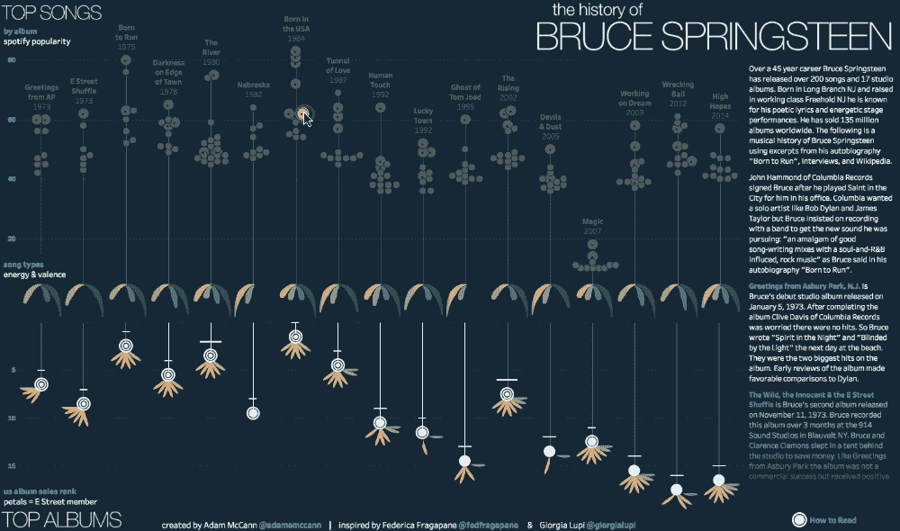

[By Adam McCann](http://duelingdatalarge.blogspot.com/2018/08/history-of-bruce-springsteen.html)

亚当·麦肯的数据可视化技术将布鲁斯·斯普林斯汀录制的每一首歌都可视化了。利用 Spotify 和其他书面来源的数据，他能够描绘出每首歌的每一个方面。专辑和歌曲是按流行程度排列的。每个设计细节都代表了专辑的一个方面。这个主题让人想起有种子、叶子和花的植物。它包括一个如何阅读的弹出窗口，以便于理解。

# Hello Sun 应用程序

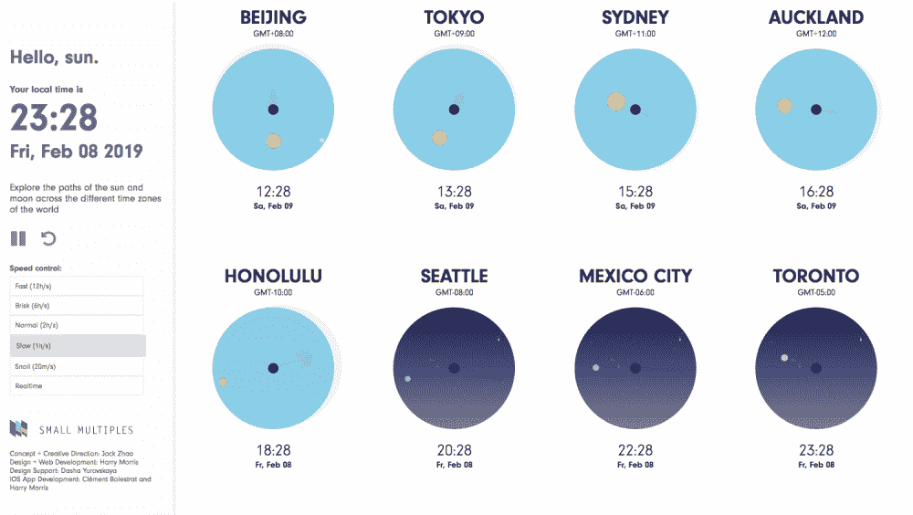

[By Small Multiples](https://hellosunapp.com/)

你好太阳应用程序创建的小倍数，是一个生活数据即你的手机。主仪表盘显示了世界上许多城市的太阳和月亮在天空中的运动。这种运动被描绘在圆形的天空地图上，随着太阳的升起和落下而改变颜色。每个城市都有一个主要的地标，只有当太阳产生阴影时才能看到。该应用程序还让用户通过 GPS 坐标了解 sun 在世界任何地方的行为。这样他们就可以规划出一个蔬菜园，或者知道他们想租的公寓下午是否会有阳光。

# 风和文字

[By Impossible Bureau](http://beta.wind-and-words.com/)

复杂的电影系列和冗长复杂的电视节目有助于数据可视化。一个这样的例子是由不可能局设计的名为风和单词的交互数据。使用《权力的游戏》中的对话，这种复杂的数据可视化描述了该剧所有播出季中角色之间的互动。有直接互动的部分，使用的词汇，每个角色的情绪，最后一部分是如何使用数据。总而言之，探索数据是一件非常有趣的事情。

# 发射它

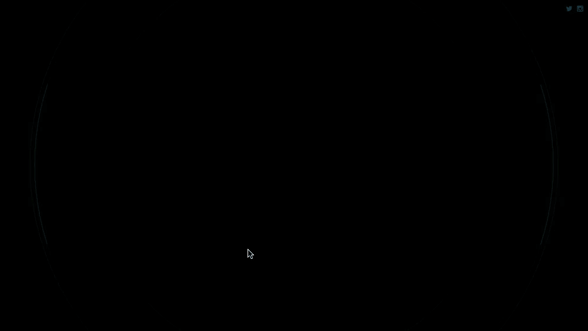

[By Shane Mielke](http://launchit.shanemielke.com/)

当平面设计师 Shane Mielke 出版他的书《Launch It》时，他还设计了一个惊人的在线数据可视化，描绘了他的书可以在哪里购买。这个交互式数据 viz 是一个可旋转的世界地图，显示了在哪里可以获得发布 It 图书的实时数据。为了使它更有趣，用户可以改变地图的颜色和标记的形状。

# 阿波罗

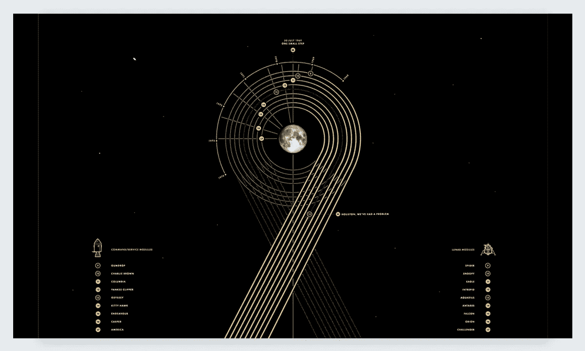

[By Paul Button](https://www.madefromdata.com/product/apollo-black)

Paul Button 是一名平面设计师，他喜欢分析数据，并让数据变得美得令人难以置信。他一直对阿波罗任务和所有与太空有关的事情感兴趣。利用收集到的每一次阿波罗任务的数据，他创造了这种数据可视化。他把它作为艺术印刷品出售，相当成功。阿波罗数据 viz 海报是一个真正的宝石，不仅对太空探索狂热分子，而且对任何喜欢定期看到美丽数据的人来说。

# 行星地球

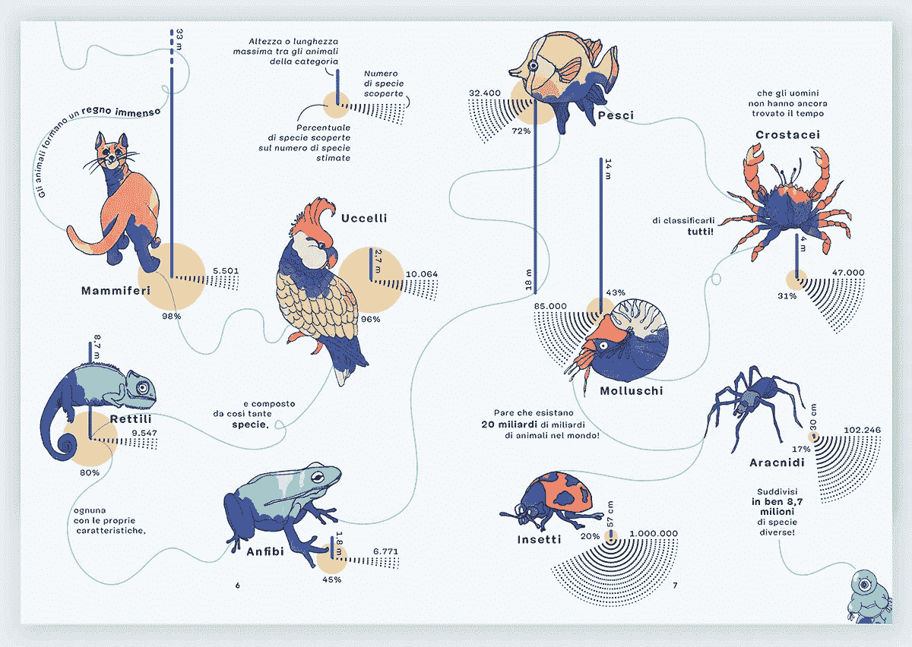

[By Federica Fragapane](https://www.behance.net/gallery/45322159/Planet-Earth)

这本书由数据艺术家 Federica Fragapane 绘制，充满了关于动物和植物的彩色数据可视化页面。《地球星球》是一本儿童读物，因此创建数据可视化的过程与我们在其他地方看到的通常的数据密集型设计有些不同。Federica 从她小时候阅读的儿童书籍中获得灵感，并使用风格指南来帮助她在整本书中保持平衡的风格。

# Keuzestress:寻找“正确的”睫毛膏

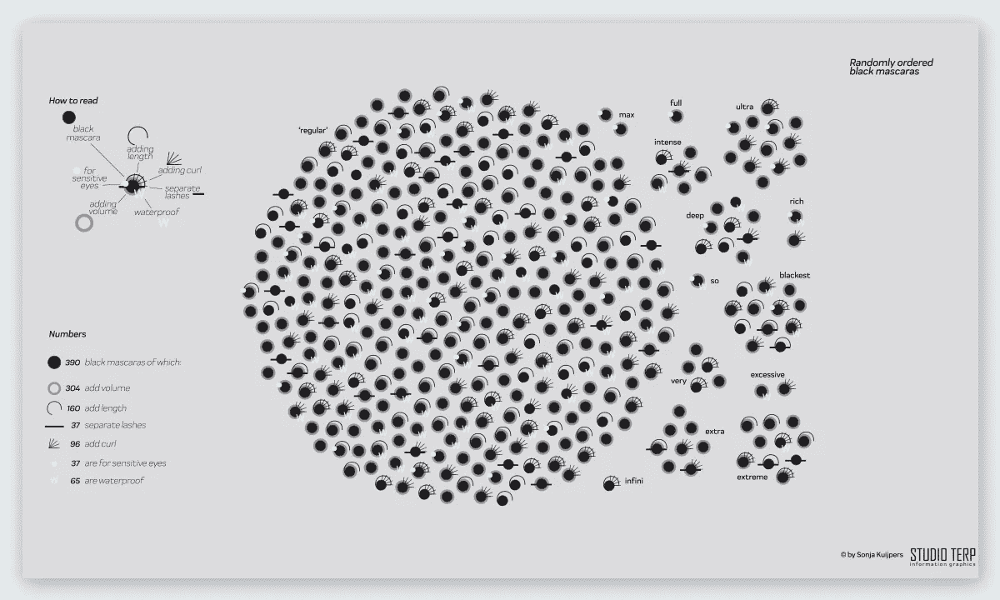

[By Sonja Kuijpers](http://www.studioterp.nl/mascaras-a-datavisualization/)

来自工作室 Terp 的 Sonja Kuijpers 无法在化妆品店挑选她想买的睫毛膏。为了做出决定，她依靠数据和她的创造才能。她对睫毛膏的可视化将来自荷兰一家在线化妆品商店的数据可视化。数据显示每种睫毛膏的颜色及其特殊特征；睫毛分离，赋予体积或长度，以及防水能力。通过数据分析，她能够确定自己需要哪种睫毛膏。在这个过程中创造美丽的数据艺术。

# 漫威电影宇宙

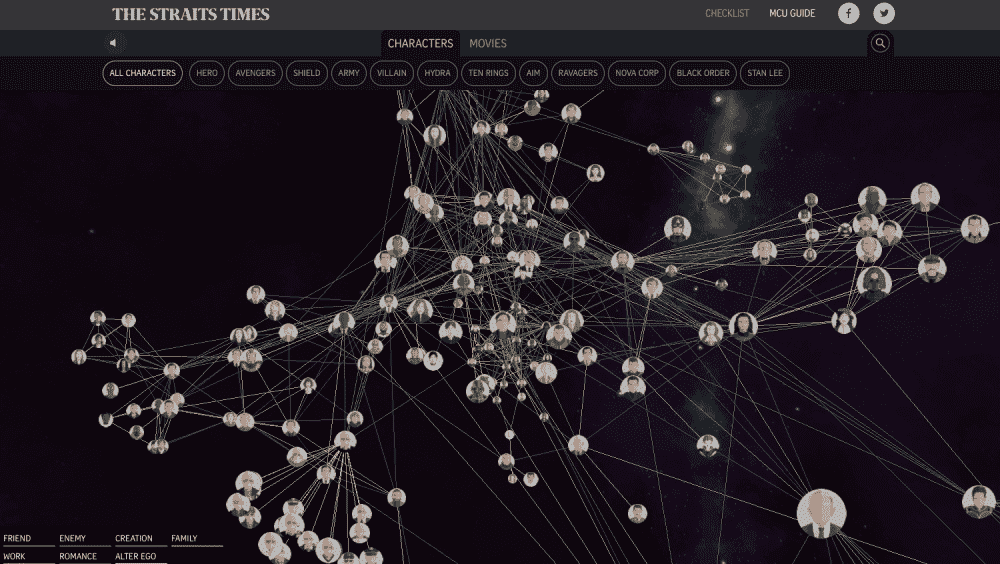

[By Strait Times](https://graphics.straitstimes.com/STI/STIMEDIA/Interactives/2018/04/marvel-cinematic-universe-whos-who-interactive/index.html)

如果你看过任何一部漫威的电影，你就会知道这些角色和故事与其他电影交织在一起。自 2008 年以来，所有漫威电影实际上构成了漫威电影宇宙。有了这种交互式数据可视化，现在就有了一种有趣的方式来理解漫威电影宇宙中人物和电影之间的联系。由新加坡《海峡时报》的数据艺术家创建的这个数据很有趣，也很容易浏览。漫威狂热者将真正享受这一个！

# 生存空间

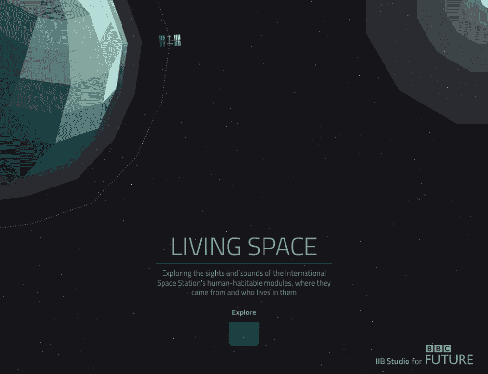

[By Tiziana Alocci](http://www.tizianaalocci.com/portfolio/living-space/)

生活空间是一个关于国际空间站的交互式数据可视化。Tiziana Alocci 为 BBC Future 设计了这个项目。互动设计描绘了国际空间站建设的每一步。这个数据是 2015 年的互动信息图，但它仍然是我们的最爱。

# 木星的众多卫星

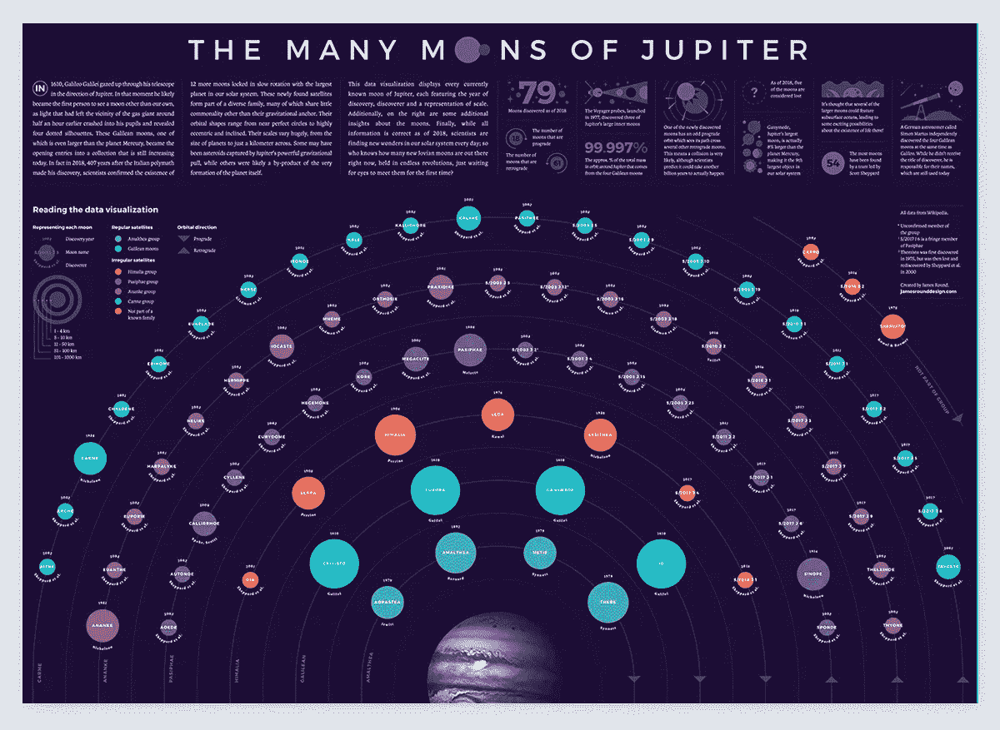

[By James Round](https://www.behance.net/gallery/68723529/The-Many-Moons-of-Jupiter-Data-Visualization)

你知道木星到底有多少颗卫星吗？你知道最大的木卫三比水星还要大吗？设计师 James Round 创建了关于木星许多卫星的数据可视化，包括每个卫星的名称、大小、发现日期和发现者。它很容易阅读，而且相当丰富多彩。它可以很容易地打印成海报挂在墙上。

# 疯狂富有的亚洲人

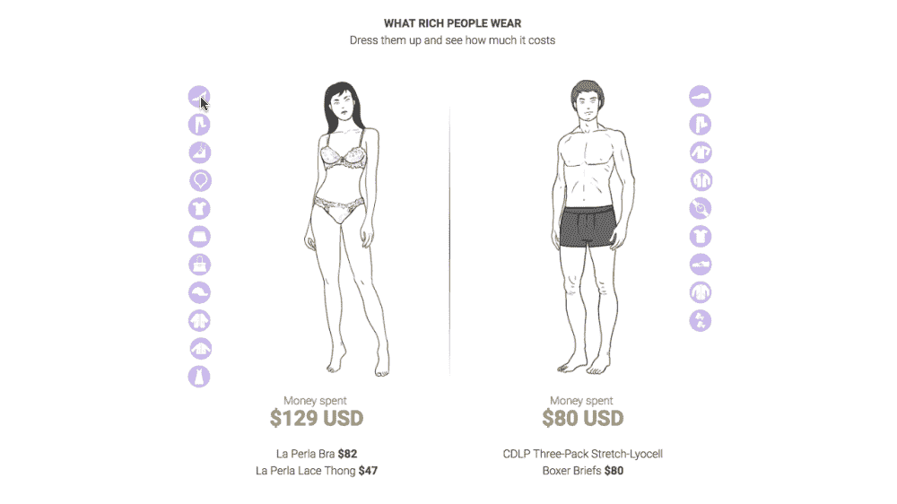

[Crazy Rich Asians](https://multimedia.scmp.com/lifestyle/article/2163738/crazy-rich-asians/index.html)

今年夏天最热门的电影不仅在美国，而且在亚洲引发了一些关于亚洲富人的现实。《南华早报》创建了一系列数据，即图表和交互式可视化，显示亚洲国家与世界其他国家相比的真实财富差距。整个系列非常有趣，更有趣的是关于富人在服装上花费多少的互动图表。当你给图表中的人穿衣服时，这些数据就会累加起来。

# 数据女性即

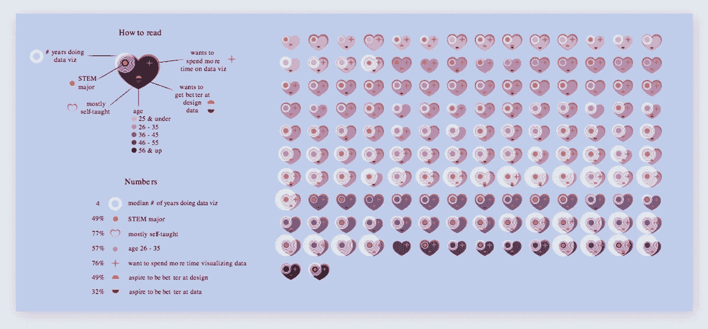

[By Alli Torban](https://dataviztoday.com/shownotes/28)

《今日数据可视化》的 Alli Torban 受到了我们上面提到的关于选择正确睫毛膏的 Keuzestress 可视化的启发。Alli 在睫毛膏中使用了与眼睛相似的风格，但是使用了心形。她的数据集是 Elijah Meeks 进行的关于数据可视化中女性的调查结果。《数据可视化中的女性》是一个练习，让你真正了解自己在做什么。

# 天空中的人影

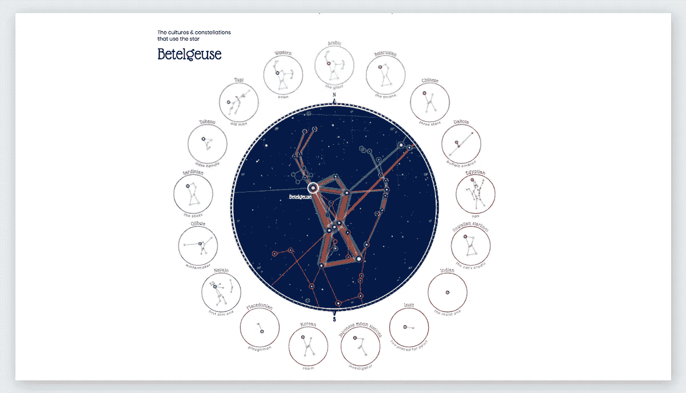

[By Nadieh Bremer](http://www.datasketch.es/may/code/nadieh/)

天文学和星际数据是惊人的数据可视化的一个主要话题，这个也不例外。在想象星座时，构成天空中的图形的大量可视化内容都是关于不同文化如何共享星星的。例如，猎户座腰带上的三颗星被 17 种不同的文化用作许多不同种类星座的一部分。天文学家和数据爱好者 Nadieh Bremer 在收集这些数据方面做得非常出色。

# 最暴力的城市

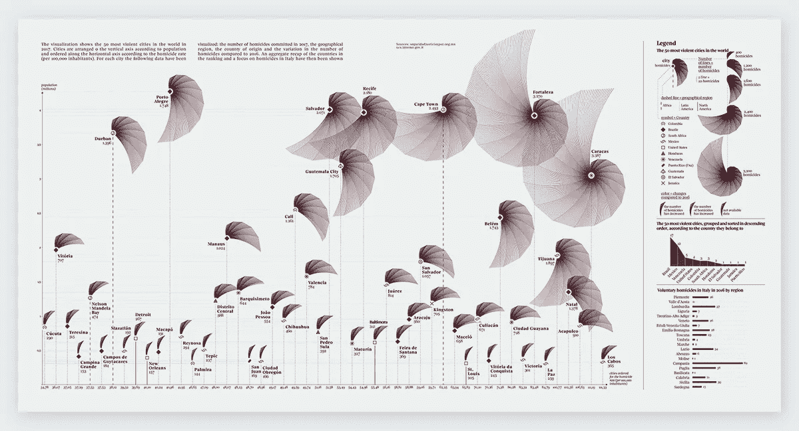

[By Federica Fragapane](https://www.behance.net/gallery/70033395/The-Most-Violent-Cities/)

Federica Fragapane 的这一数据可视化技术收集了世界各地城市凶杀案的数量数据。该图形设置为将城市显示为具有不同形状的垂直线，描绘了沿总人口水平轴放置的凶杀案总数。数据 viz 包括一个如何读取数据的图例和一个只有意大利城市数据的小部分。这是为《晚邮报》文化增刊创作的。

# 旅行签证不平等

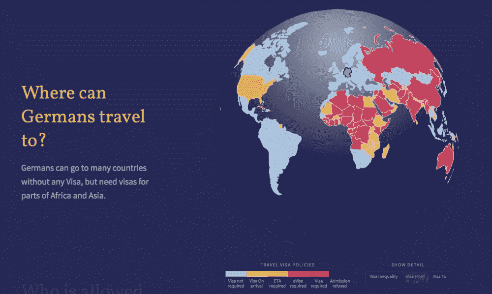

[By Christian Laesser](https://projects.christianlaesser.com/travel-visa-inequality/)

有时候数据可视化非常有用。比如这篇关于旅游签证不平等的文章。Christian Laesser 创建了这个数据，即在去泰国旅行后，想知道每个国家的旅游签证优势是如何不同的。这种交互设计让用户点击一个国家，并找出是否需要签证才能访问任何其他国家，反之亦然。

# CF 天气图

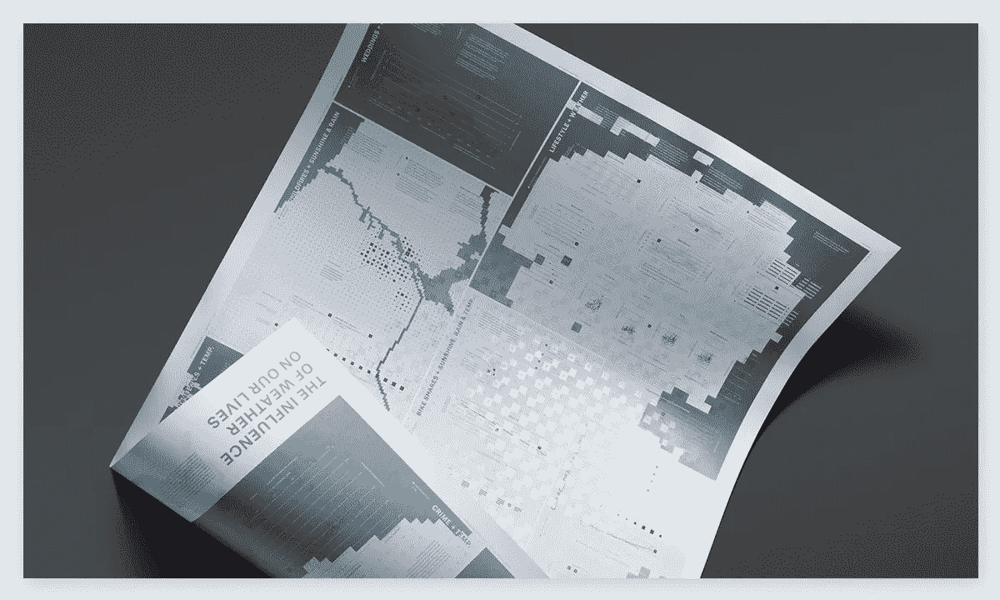

[By Clever and Franke](https://www.cleverfranke.com/work/weather-charts)

Clever 和 Franke 是一家数据设计公司，在荷兰和美国从事数据分析和设计工作。CF 天气图是他们最喜欢的特别项目之一。最新版本，第五版，于今年早些时候出版，内容是关于天气如何影响我们的情绪状态。这些数据收集了大量关于天气模式和人们在一年中不同时间做什么的数据。进行了关联，数据集包括大约 60 个可视化。完成的数据艺术以印刷海报的形式出售。

# 从我们失去的人身上吸取的教训

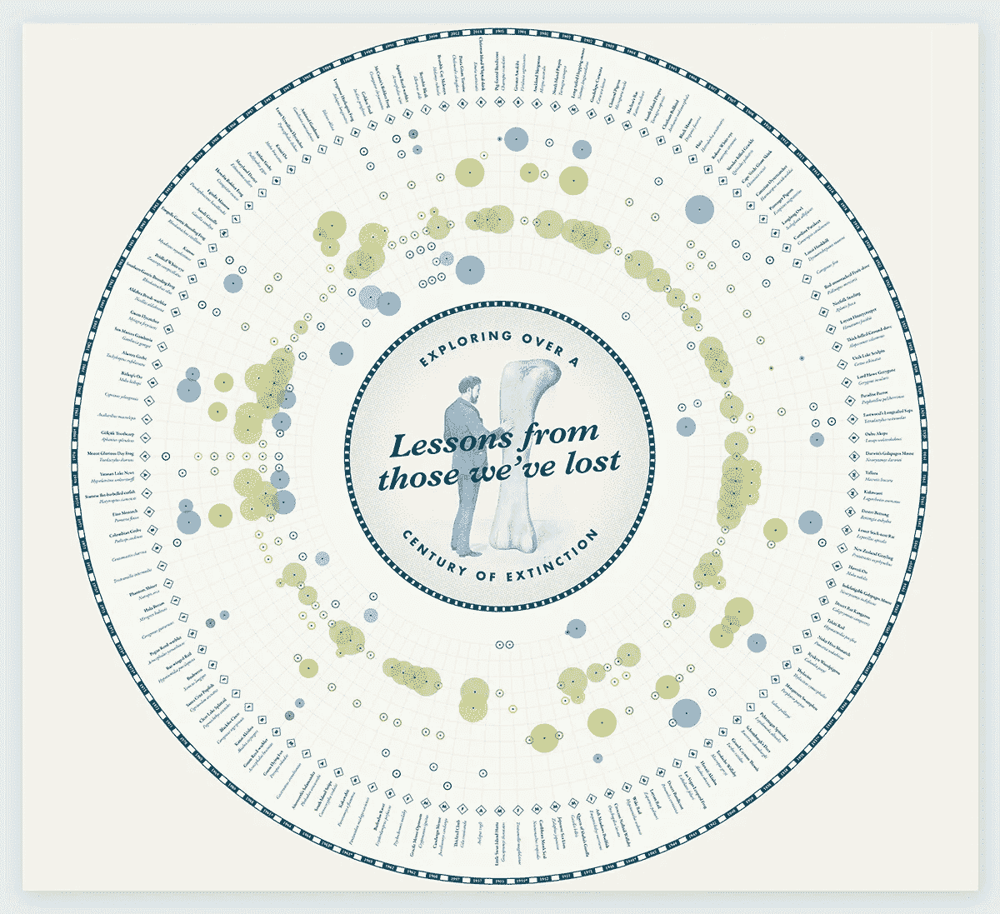

[By James Round](https://www.behance.net/gallery/67151247/Lessons-from-those-weve-lost-Data-Visualization)

这是设计师 James Round 的另一个伟大的数据可视化。这一次他集中研究了大约一百年前灭绝物种的数据。目的是分析它们是如何灭绝的，什么时候，为什么。也许有了这些数据分析，我们可以了解未来如何拯救濒危动物。

# 古怪

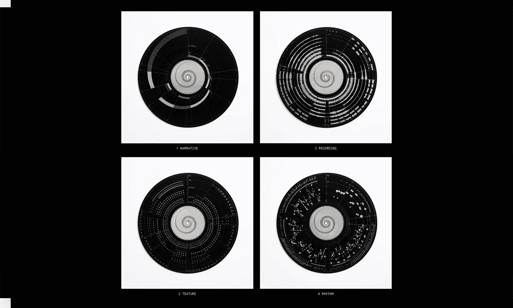

[Oddity Viz](https://www.oddityviz.com/)

当大多数基于音乐的数据可视化是关于一套专辑和歌曲，或关于整个时代，Oddity Viz 是关于一首歌。Valentina D 'Efilippo 和 Miriam Quick 广泛分析了大卫·鲍依的歌曲 Space Oddity，创建了这组美丽的数据可视化。该系列由十张刻本唱片组成，每张描绘了歌曲的一个方面；和声、旋律、歌词等等。每份记录都附有一张海报和如何阅读数据的说明。

# 228 年的总统生涯

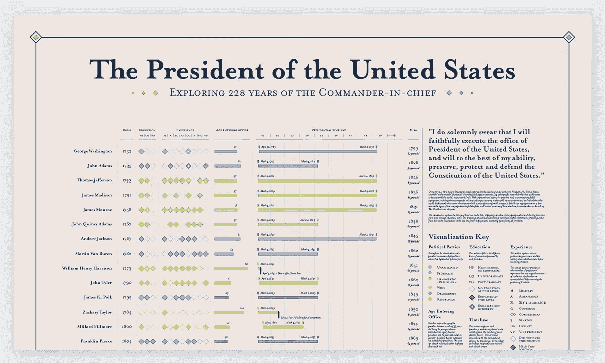

[228 Years of POTUS](https://www.behance.net/gallery/66993495/228-years-of-POTUS-Data-visualization)

尚未更新第 45 任总统的数据，该数据是对所有美国总统数据的完整回忆。另一个詹姆斯回合的美丽，这种数据可视化探索了 228 年的数据，如政党，教育，年龄和任职时间。

# 是的，确实有很多太空垃圾

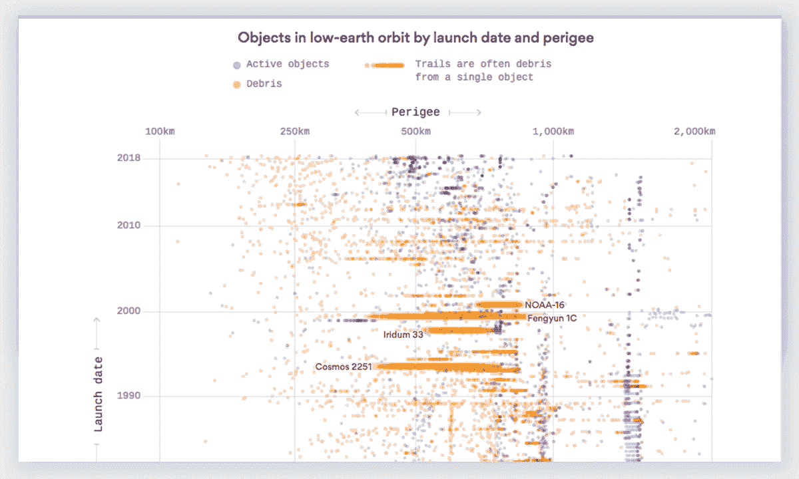

[By Axios](https://www.axios.com/yes-there-really-is-a-lot-of-space-junk-930b166d-68c4-4803-9bd6-9e23514eb942.html)

Axios 的数据团队使用美国军方联合太空作战中心的数据创建了这些数据。根据他们的数据，有超过 13，000 块太空垃圾漂浮在近地轨道上。尽管数据惊人，但他们知道这并不完整，因为由于尺寸和其他因素，许多垃圾没有在卫星上登记。联合太空行动中心希望获得更多关于其他太空碎片的信息，以便参与太空探索的每个人都了解太空垃圾的危险。

# 卡卡托·樱花颂

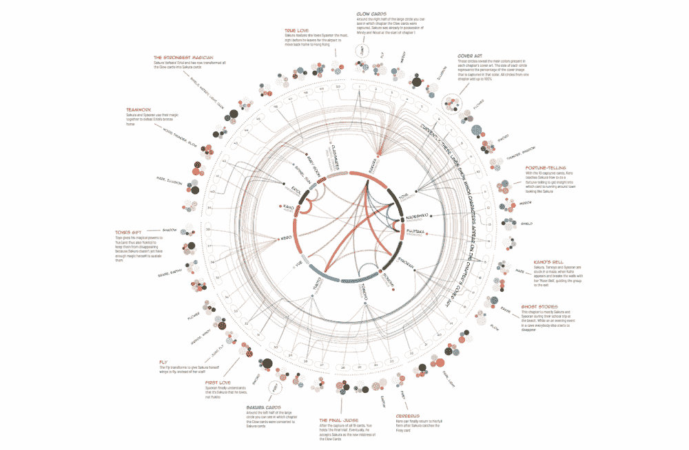

[By Nadieh Bremer](http://www.datasketch.es/june/code/nadieh/)

由专业数据艺术家创建的个人数据项目通常极具创造性。Nadieh Bremer 的这个是关于日本漫画系列 Cardcaptor Sakura 的数据可视化。设计是丰富多彩的，有趣的，娱乐性的，当然也充满了数据。最棒的是，它还具有交互性。

# 封面的银河

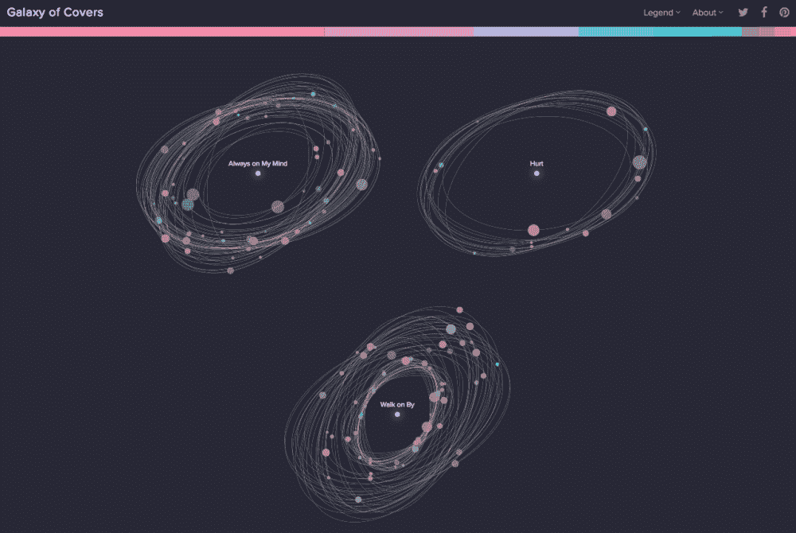

[Galaxy of Covers](https://galaxy-of-covers.interactivethings.io/)

音乐和对星际思想的热爱是如何融合在一起实现数据可视化的？这是一个关于著名歌曲翻唱的数据分析的可爱的互动例子。每首歌都是一颗行星，它的封面是围绕它运行的卫星。每个歌曲星球都可以点击，以可视化自己的具体数据。这些数据是由 Interactive Things 的团队创建的，非常值得一看。

# 红牛派对视觉化

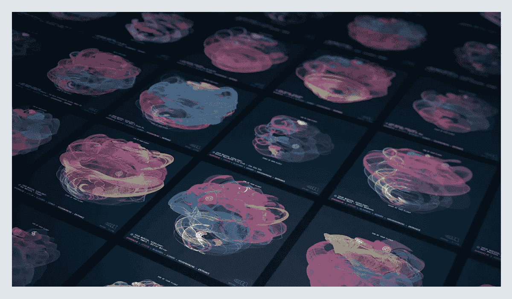

这个数据可视化项目不是今年的，实际上是几年前的。但是我们太喜欢它了，所以它必须被包括在内。在阿姆斯特丹的一次聚会上，客人们得到了一个带有传感器的特殊手镯，这个传感器可以收集他们在俱乐部的体验数据。它收集了关于他们在俱乐部的哪个部分以及他们当时的感受的信息。晚上结束时，当客人归还手镯时，他们会得到自己用整晚收集的数据创作的数据艺术作品。

# 瘀伤，我们看不到的数据

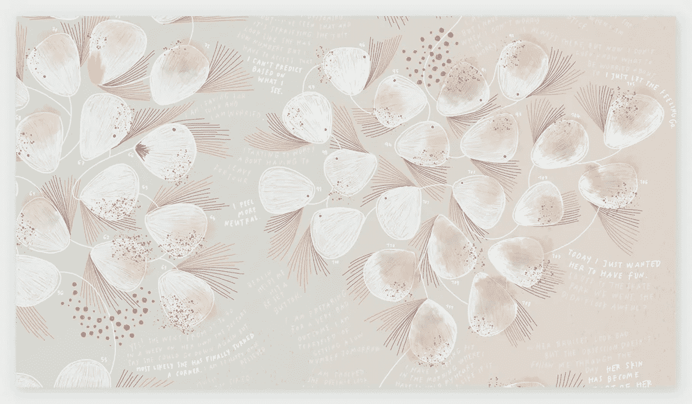

[By Giorgia Luppi](https://medium.com/@giorgialupi/bruises-the-data-we-dont-see-1fdec00d0036)

在某些情况下，数据确实是个人的，最终产品与其说是图表的集合，不如说是一件艺术品。在这个项目中，分析的数据是人性的。意大利数据设计师 Giorgia Luppi 创建了这些艺术数据，以帮助她的朋友应对她儿子的医疗问题。她使用儿童治疗的医疗记录，并结合艺术和音乐来创建这个美丽的数据可视化。

# 珊瑚城市

我们在构建中期捕捉到了这个数据可视化。不确定这位数据艺术家是否会创造一个完整的光谱项目，但与此同时，我们喜欢看到他的珊瑚城市出现在 Twitter 上。克雷格·泰勒(Craig Taylor)使用了 10 个最宜居城市指数的数据和城市地图工具，创建了这些看起来像珊瑚的可视化图像。

# 市场咖啡馆杂志

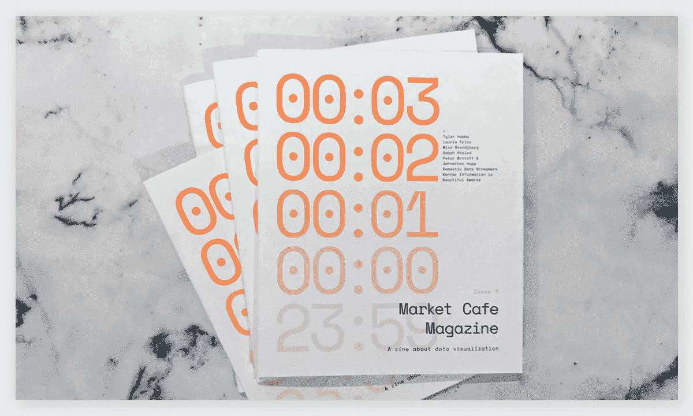

[Market Cafe Mag](http://marketcafemag.bigcartel.com/)

这个条目不完全是一个 data viz，而是一个致力于数据可视化的杂志。《市场咖啡馆杂志》已经是第三版了，而且每出版一期都会越来越好。通过采访、特写和关于视觉数据艺术家的故事，这本杂志正成为所有数据可视化爱好者的需要。他们的 2018 版已经卖完了。设计师和创作者 Tiziana Alocci 和 Piero Zagami 在这本杂志上一针见血。

# 轮到你了

你见过今年创建的任何数据可视化应该包括在这个列表中吗？您是否创建了数据可视化并希望我们看一看它？在评论区给我们留言吧！

*本帖* [*原版*](http://blog.visme.co/best-data-visualizations/) *最早出现在 Visme 的* [*视觉学习中心*](http://blog.visme.co/) *。*