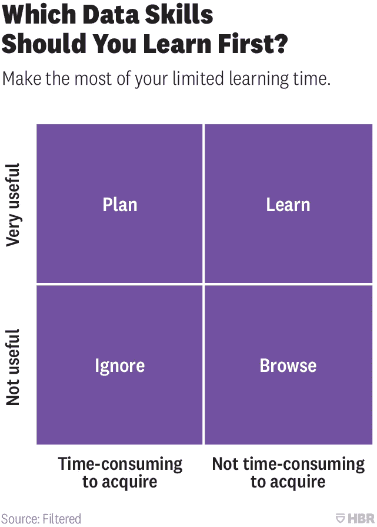
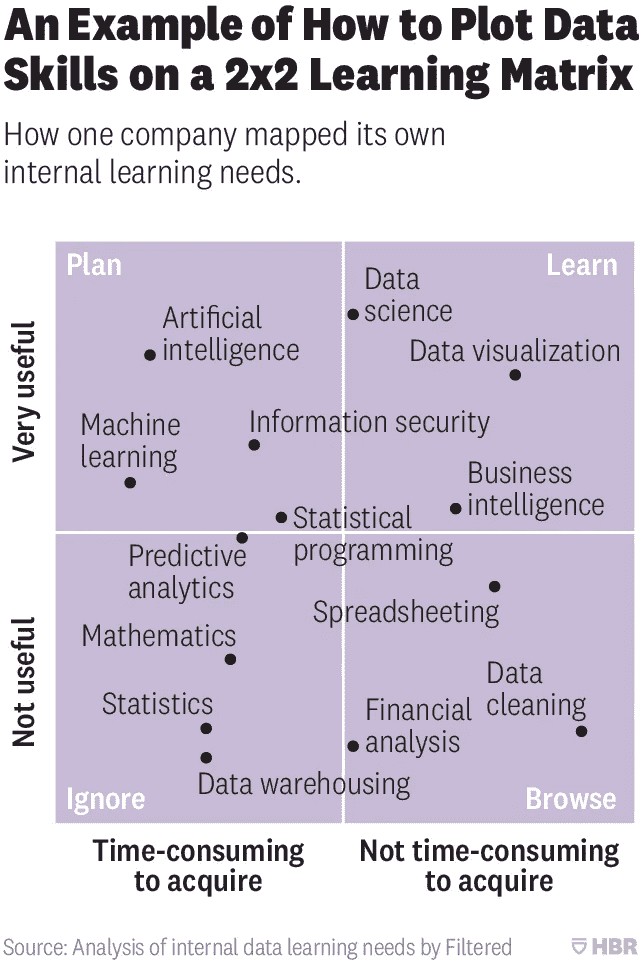

# 哈佛商业评论得到的 2x2 数据科学技能矩阵完全错误！

> 原文：<https://towardsdatascience.com/the-2x2-data-science-skills-matrix-that-harvard-business-review-got-completely-wrong-d85dc41b6fb4?source=collection_archive---------7----------------------->

数据科学是目前市场上的热门词汇。目前，每家公司都在寻求聘请数据科学专业人士来解决一些他们自己目前没有意识到的数据问题。机器学习已经席卷了整个行业，市场上有一群自学成才的数据科学家。

由于数据科学这个词是一个完全不同的世界，所以很难设定学习什么和不学习什么的优先级。所以在这种情况下,《哈佛商业评论》发表了一篇关于你作为一个公司或个人应该重视什么的文章。让我们看一看。

Figure 1\. The empty matrix taken from HBR original Article [(Source)](https://hbr.org/2018/10/prioritize-which-data-skills-your-company-needs-with-this-2x2-matrix)

这是 HBR 共享的空矩阵，这样你可以优先考虑你的学习路径。现在让我们看看他们在数据科学中填写了什么:

Figure 2\. The Data Science Matrix proposed by HBR.

现在让我们看看从这个矩阵中可以得出的推论。

1.  *计划学习机器学习，但忽略预测分析，因为它没有用*
2.  *计划学习机器学习，但忽略数学，因为学起来没用而且非常耗时。*
3.  *计划学习统计编程，但忽略了统计&数学，因为它非常耗时。*
4.  *现在学数据科学但是不太关心数据清理。*

我不是专家，但即使对一个新手来说，这 4 句话看起来也像是讽刺。我们举个例子。

假设您正在处理一个包含 800 个要素和 1000 条记录的数据。现在你发现你需要减少特征，因为大多数特征是多余的(除非有人告诉你)，但是记住你忽略了所有的数学或统计，所以你不知道数学或统计。由于您只是浏览了数据清理，您甚至不知道如何清理数据。那么在这种情况下，你将如何处理这种情况呢？

好的，所以你在谷歌上搜索“减少数据集中的特征”或其他地方，当你学习机器学习时，你发现有一种叫做 PCA 的东西可以为你做这项工作。

所以下一步是你谷歌“PCA sklearn”。检查文档并应用以下内容:

> 从 sklearn.decomposition 导入 PCA
> 
> X =主成分分析(0.99)。拟合 _ 转换(X)

很好，现在你的特征集减少到 60 个，你的训练结果很好。现在我的问题是:

1.  你想成为这种只做事情的开发者吗？
2.  你想成为一名只知道如何做的开发者，而不是只知道幕后的内部运作吗？

如果你对这两个问题的回答都是肯定的，那么你就非常适合那些只想把事情做好而不是掌握它们的公司。那么“软件工程师”对你来说是个不错的职位。

如果你对这两个问题的回答都是否定的，那么你就非常适合目前正在扩大研究部门的公司。那么“研究工程师”对你来说是个不错的职位。

如果你想从研究的角度来解决 PCA 问题，你会使用完全相同的代码，但是在幕后有不同的想法。因为这样你就可以看到特征之间的关系，组合新的特征，计算相关性，计算特征值，特征向量，最后选择那些对方差有 99%贡献的特征。

遵循这个矩阵是你的选择。明智选择！。

如果你有任何意见，请在评论中或在 LinkedIn 上告诉我。