# 4 个推荐引擎可以预测你的电影口味

> 原文：<https://towardsdatascience.com/the-4-recommendation-engines-that-can-predict-your-movie-tastes-109dc4e10c52?source=collection_archive---------1----------------------->


“A person holding a clapper board in a desert” by [Jakob Owens](https://unsplash.com/@jakobowens1?utm_source=medium&utm_medium=referral) on [Unsplash](https://unsplash.com?utm_source=medium&utm_medium=referral)

今晚我应该看什么电影？

当你下班回家的时候，你曾经不得不回答这个问题至少一次吗？至于我——是的，而且不止一次。从网飞到 Hulu，鉴于现代消费者对个性化内容的巨大需求，建立强大的电影推荐系统的需求极其重要。

推荐系统的一个例子是这样的:

*   用户 A 看**权力的游戏**和**绝命毒师**。
*   用户 B 在**上搜索《权力的游戏**，然后系统从收集的关于用户 a 的数据中建议**绝命毒师**。

推荐系统不仅用于电影，还用于其他多种产品和服务，如亚马逊(书籍、商品)、Pandora/Spotify(音乐)、谷歌(新闻、搜索)、YouTube(视频)等。

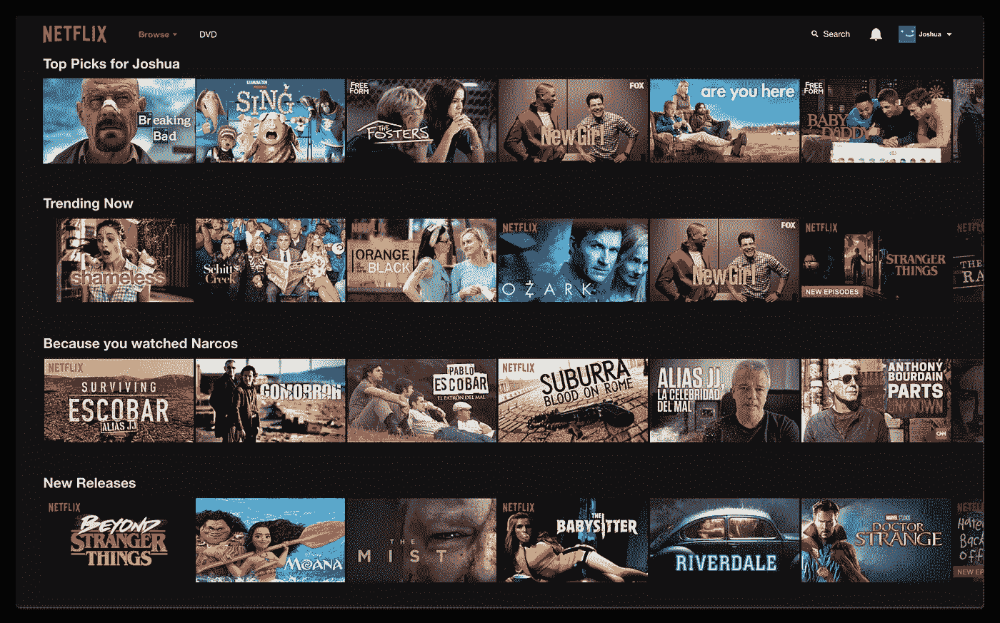

Netflix Recommendations

在这篇文章中，我将向你展示如何实现 4 种不同的电影推荐方法，并对它们进行评估，看看哪一种具有最好的性能。

# 电影镜头数据集

我正在使用的数据集是 [MovieLens](https://grouplens.org/datasets/movielens/) ，这是互联网上最常见的数据集之一，可用于构建推荐系统。我正在使用的数据集版本( [1M](https://grouplens.org/datasets/movielens/1m/) )包含了 2000 年加入 MovieLens 的 6040 名 MovieLens 用户制作的约 3900 部电影的 1000209 个匿名评级。

在处理数据并进行一些探索性分析后，以下是该数据集最有趣的特性:

这是**电影片名**的文字云可视化:

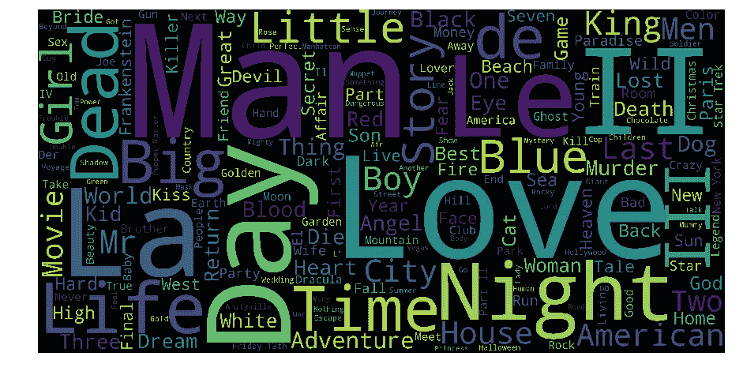

MovieLens Titles

很美，不是吗？我可以识别出这个数据集中有很多电影特许经营权，例如 *II* 和 *III* …除此之外，还有*日*、*爱*、*生*、*时*、*夜*、*男*、*死*、*美*等

下面是**用户评分**的分布:

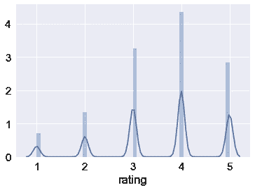

MovieLens Ratings

看起来用户对他们的评价很慷慨。在 5 分制中，平均得分为 3.58 分。一半的电影有 4 级和 5 级。我个人认为，5 级评级技能不是一个好的指标，因为人们可能有不同的评级风格(即，人 A 对一般电影总是使用 4，而人 B 对他们最喜欢的电影只给出 4)。每个用户至少评价了 20 部电影，所以我怀疑这种分布可能只是由电影质量的偶然差异造成的。

这里还有另外一个词——电影类型的云:

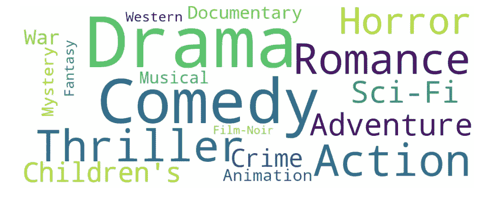

MovieLens Genres

排名前五的类型依次是:戏剧、喜剧、动作片、惊悚片和爱情片。

现在让我们继续探索可以使用的 4 个推荐系统。以下是他们，按照各自的展示顺序:

1.  基于内容的过滤
2.  基于记忆的协同过滤
3.  基于模型的协同过滤
4.  深度学习/神经网络

# 1-基于内容

基于内容的推荐器依赖于被推荐项目的相似性。基本思想是，如果你喜欢一个项目，那么你也会喜欢一个“相似”的项目。当很容易确定每个项目的上下文/属性时，它通常工作得很好。

基于内容的推荐器与用户提供的数据一起工作，该数据或者是针对电影镜头数据集的明确的电影评级。基于该数据，生成用户简档，然后使用该简档向用户提出建议。随着用户提供更多的输入或对推荐采取行动，引擎变得越来越准确。

## 数学

**术语频率(TF)** 和**逆文档频率(IDF)** 的概念用于信息检索系统以及基于内容的过滤机制(例如基于内容的推荐器)。它们用于确定文档/文章/新闻/电影等的相对重要性。

TF 就是一个单词在文档中出现的频率。IDF 是文档在整个语料库中出现频率的倒数。使用 TF-IDF 主要有两个原因:假设我们在谷歌上搜索“**最新欧洲足球赛**的结果。可以肯定的是"**"将比"**足球比赛**"出现得更频繁，但是**足球比赛**的相对重要性高于搜索查询角度。在这种情况下，TF-IDF 加权在确定项目(文档)的重要性时否定了高频词的影响。**

**下面是计算 TF-IDF 分数的公式:**

**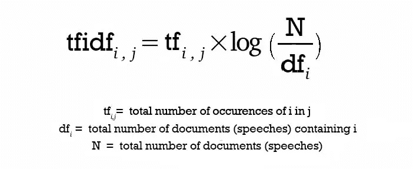**

**TF-IDF Equation**

**在计算 TF-IDF 分数之后，我们如何确定哪些项目彼此更接近，而不是更接近用户简档？这是使用**向量空间模型**完成的，该模型根据向量之间的角度计算接近度。在该模型中，每个项目作为其属性的向量(也是向量)存储在一个 n 维空间**中，并且向量之间的角度被计算以**确定向量之间的相似性**。接下来，也基于用户对项目的先前属性的动作来创建用户简档向量，并且也以类似的方式来确定项目和用户之间的相似性。****

**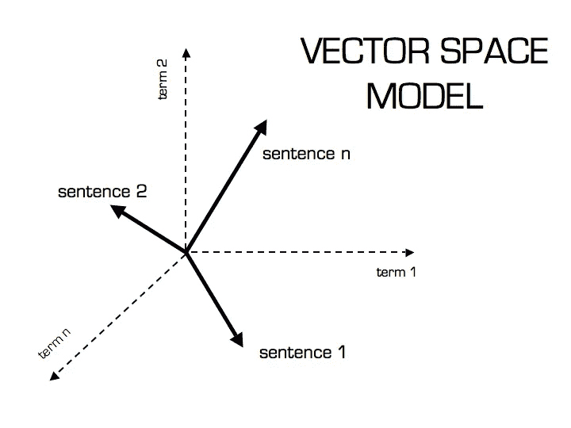**

**Vector Space Model**

**句子 2 更可能使用术语 2，而不是术语 1。对于句子 1 反之亦然。计算这种相对度量的方法是通过取句子和术语之间角度的余弦来计算的。使用余弦的最终原因是余弦的**值将随着角度**值的减小而增加，这意味着更相似。向量被长度归一化，之后它们变成长度为 1 的向量，然后余弦计算简单地是向量的和积。**

## **代码**

**有了这些数学知识，我将构建一个基于内容的推荐引擎，根据电影类型计算电影之间的相似性。它会根据电影的类型推荐与特定电影最相似的电影。**

**我没有一个量化指标来判断机器的性能，所以这将不得不做定性。为了做到这一点，我将使用来自 **scikit-learn** 的 **TfidfVectorizer** 函数，它将文本转换为可用作估计器输入的特征向量。**

```
**from** **sklearn.feature_extraction.text** **import** TfidfVectorizer
tf = TfidfVectorizer(analyzer='word',ngram_range=(1, 2),min_df=0, stop_words='english')
tfidf_matrix = tf.fit_transform(movies['genres'])
```

**我将使用 [**余弦相似度**](https://masongallo.github.io/machine/learning,/python/2016/07/29/cosine-similarity.html) 来计算表示两部电影相似度的数值。由于我使用了 TF-IDF 矢量器，计算点积将直接给出余弦相似性得分。因此，我将使用 sklearn 的 **linear_kernel** 而不是余弦 _ 相似度，因为它要快得多。**

```
**from** **sklearn.metrics.pairwise** **import** linear_kernel
cosine_sim = linear_kernel(tfidf_matrix, tfidf_matrix)
```

**我现在有了数据集中所有电影的成对余弦相似矩阵。下一步是编写一个函数，根据余弦相似性得分返回 20 部最相似的电影。**

```
*# Build a 1-dimensional array with movie titles*
titles = movies['title']
indices = pd.Series(movies.index, index=movies['title'])

*# Function that get movie recommendations based on the cosine similarity score of movie genres*
**def** genre_recommendations(title):
    idx = indices[title]
    sim_scores = list(enumerate(cosine_sim[idx]))
    sim_scores = sorted(sim_scores, key=**lambda** x: x[1], reverse=**True**)
    sim_scores = sim_scores[1:21]
    movie_indices = [i[0] **for** i **in** sim_scores]
    **return** titles.iloc[movie_indices]
```

## **该建议**

**让我们尝试获得几部电影的最佳推荐，看看这些推荐有多好。**

```
genre_recommendations('Good Will Hunting (1997)').head(20)
```

**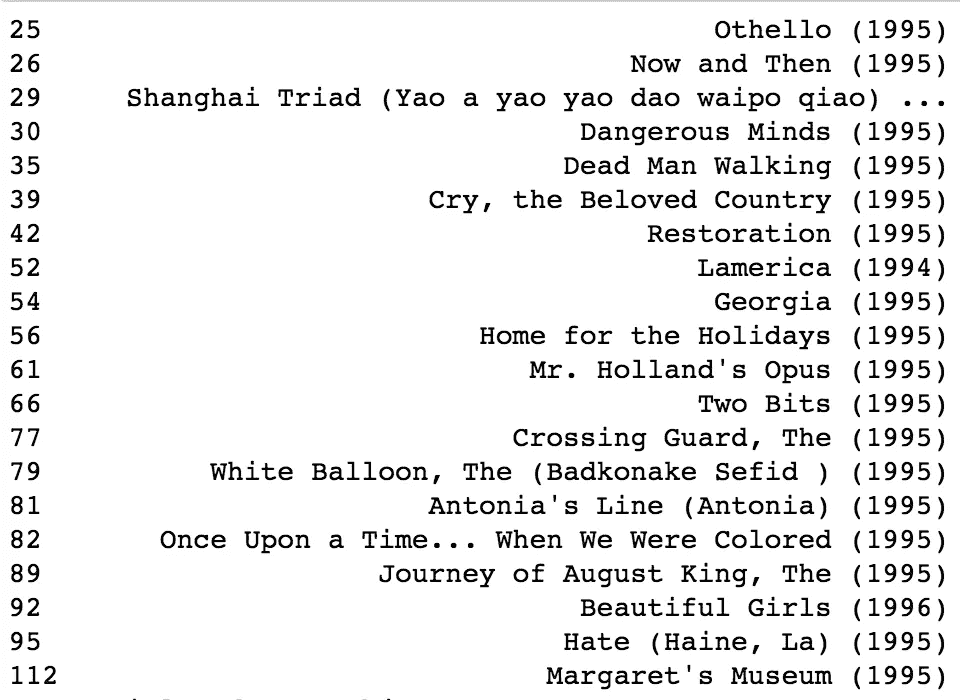**

**Recommendations Similar to “Good Will Hunting”**

```
genre_recommendations('Toy Story (1995)').head(20)
```

****

**Recommendations Similar to “Toy Story”**

```
genre_recommendations('Saving Private Ryan (1998)').head(20)
```

**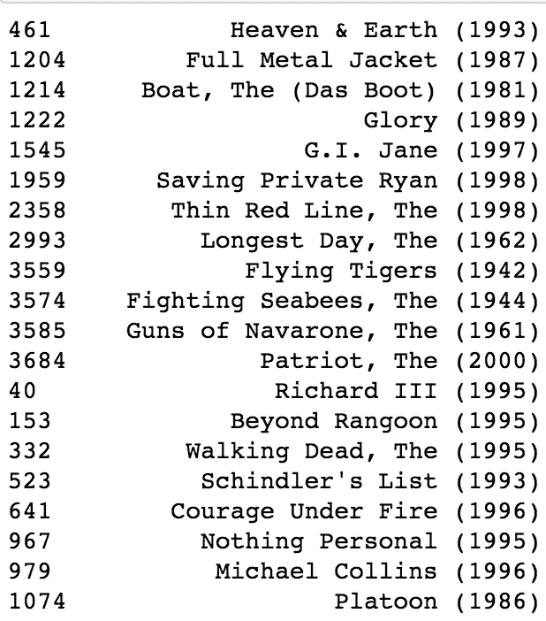**

**Recommendations Similar to “Saving Private Ryan”**

**如你所见，我有一份相当不错的推荐名单，分别是《心灵捕手》(T12)、《剧情》(T13)、《玩具总动员》(T14)、《动画、儿童、喜剧》(T15)、《拯救大兵瑞恩》(T16)、《动作、惊悚、战争》(T17)。**

**总的来说，以下是使用基于内容的推荐的优点:**

*   **不需要关于其他用户的数据，因此没有冷启动或稀疏性问题。**
*   **可以推荐给口味独特的用户。**
*   **可以推荐新的和不受欢迎的项目。**
*   **可以通过列出导致项目被推荐的内容特征(在本例中是电影类型)来为推荐的项目提供解释**

**但是，使用这种方法有一些缺点:**

*   **找到合适的特征很难。**
*   **不推荐用户内容简档之外的项目。**
*   **无法利用其他用户的质量判断。**

# **2 —协同过滤**

**协同过滤推荐器完全基于过去的行为，而不是基于上下文。更具体地说，它是基于两个用户的偏好、品味和选择的相似性。它分析一个用户与另一个用户的口味有多相似，并在此基础上提出建议。**

**例如，如果用户 A 喜欢电影 1、2、3，而用户 B 喜欢电影 2、3、4，那么他们有相似的兴趣，A 应该喜欢电影 4，B 应该喜欢电影 1。这使得它成为最常用的算法之一，因为它不依赖于任何附加信息。**

**一般来说，协同过滤是推荐引擎的主力。该算法有一个非常有趣的特性，即能够自己进行特征学习，这意味着它可以开始自己学习使用什么特征。**

## **数学**

**有两种主要类型的基于记忆的协同过滤算法:**

**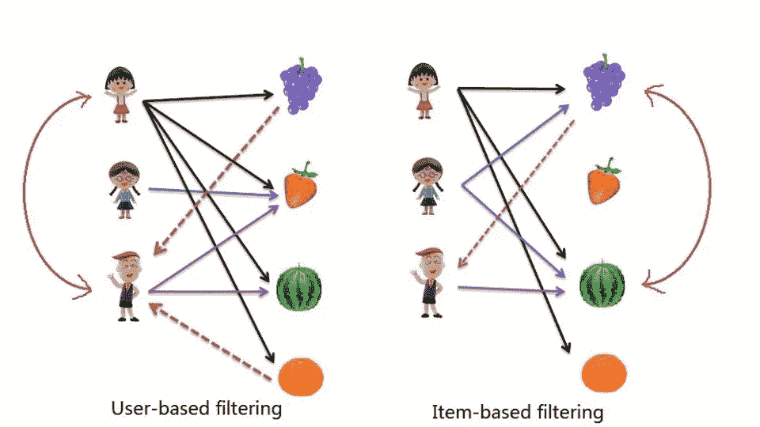**

1.  ****用户-用户协同过滤**:在这里，我们根据相似性找到相似的用户，并推荐第一个用户的相似者过去选择的电影。这种算法非常有效，但需要大量的时间和资源。它需要计算每个用户对信息，这需要时间。因此，对于大型基础平台，如果没有非常强大的可并行化系统，该算法很难实现。**
2.  ****逐项协同过滤**:与之前的算法非常相似，但我们不是寻找用户的相似物，而是尝试寻找电影的相似物。一旦我们有了电影的相似矩阵，我们就可以很容易地向从数据集中给任何电影评分的用户推荐相似的电影。该算法比用户-用户协同过滤消耗的资源少得多。因此，对于一个新用户，该算法比用户-用户协作花费的时间少得多，因为我们不需要用户之间的所有相似性分数。并且对于固定数量的电影，电影-电影相似矩阵随着时间是固定的。**

**在这两种情况下，我们都会建立一个相似度矩阵。对于用户-用户协同过滤，**用户相似性矩阵**将由一些度量任意两对用户之间相似性的距离度量组成。同样，**项目相似性矩阵**将测量任意两对项目之间的相似性。**

**在协同过滤中通常使用 3 种距离相似性度量:**

1.  ****Jaccard 相似度**:相似度基于对项目 A 和 B 评分的用户数量除以对项目 A 或 B 评分的用户数量。它通常用于我们没有数字评分而只有布尔值的情况，如购买的产品或点击的添加。**
2.  ****余弦相似度**:(和基于内容的系统一样)相似度是 A 和 b 的项目向量的 2 个向量之间的夹角余弦，向量越近，夹角越小，余弦越大。**
3.  ****皮尔逊相似度**:相似度是两个向量之间的皮尔逊系数。出于多样性的目的，我将在这个实现中使用**皮尔逊相似度**。**

## **代码**

**由于我的笔记本电脑的计算能力有限，我将只使用评级的子集来构建推荐系统。特别是，我将从 100 万个收视率中随机抽取 2 万个收视率样本(2%)。**

**我使用 **scikit-learn 库**将数据集分成测试和训练。**Cross _ validation . train _ test _ split**根据测试实例的百分比将数据混洗并拆分成两个数据集，这里是 0.2。**

```
**from** **sklearn** **import** cross_validation **as** cv
train_data, test_data = cv.train_test_split(small_data, test_size=0.2)
```

**现在我需要创建一个用户条目矩阵。因为我已经将数据分为测试和训练，所以我需要创建两个矩阵。培训矩阵包含 80%的评级，测试矩阵包含 20%的评级。**

```
*# Create two user-item matrices for training and testing data*
train_data_matrix = train_data.as_matrix(columns = ['user_id', 'movie_id', 'rating'])
test_data_matrix = test_data.as_matrix(columns = ['user_id', 'movie_id', 'rating'])
```

**现在我使用 sklearn 的 **pairwise_distances** 函数来计算[皮尔逊相关系数](https://stackoverflow.com/questions/1838806/euclidean-distance-vs-pearson-correlation-vs-cosine-similarity)。该方法提供了一种将距离矩阵作为输入的安全方法，同时保持了与许多其他采用向量数组的算法的兼容性。**

```
**from** **sklearn.metrics.pairwise** **import** pairwise_distances

*# User Similarity Matrix*
user_correlation = 1 - pairwise_distances(train_data, metric='correlation')
user_correlation[np.isnan(user_correlation)] = 0*# Item Similarity Matrix*
item_correlation = 1 - pairwise_distances(train_data_matrix.T, metric='correlation')
item_correlation[np.isnan(item_correlation)] = 0
```

**有了相似性矩阵，我现在可以预测数据中没有包括的评分。使用这些预测，我可以将它们与测试数据进行比较，以尝试验证我们的推荐模型的质量。**

```
*# Function to predict ratings*
**def** predict(ratings, similarity, type='user'):
    **if** type == 'user':
        mean_user_rating = ratings.mean(axis=1)
        *# Use np.newaxis so that mean_user_rating has same format as ratings*
        ratings_diff = (ratings - mean_user_rating[:, np.newaxis])
        pred = mean_user_rating[:, np.newaxis] + similarity.dot(ratings_diff) / np.array([np.abs(similarity).sum(axis=1)]).T
    **elif** type == 'item':
        pred = ratings.dot(similarity) / np.array([np.abs(similarity).sum(axis=1)])
    **return** pred
```

## **评估**

**有许多评估指标，但用于评估预测评级准确性的最常用指标之一是**均方根误差(RMSE)** 。我将使用 sklearn 的 **mean_square_error (MSE)** 函数，其中 RMSE 就是 MSE 的平方根。我将使用 scikit-learn 的**均方误差**函数作为我的验证指标。比较基于用户和基于项目的协同过滤，看起来基于用户的协同过滤给出了更好的结果。**

```
**from** **sklearn.metrics** **import** mean_squared_error
**from** **math** **import** sqrt

*# Function to calculate RMSE*
**def** rmse(pred, actual):
    *# Ignore nonzero terms.*
    pred = pred[actual.nonzero()].flatten()
    actual = actual[actual.nonzero()].flatten()
    **return** sqrt(mean_squared_error(pred, actual))*# Predict ratings on the training data with both similarity score*
user_prediction = predict(train_data_matrix, user_correlation, type='user')
item_prediction = predict(train_data_matrix, item_correlation, type='item')*# RMSE on the train data*
print('User-based CF RMSE: ' + str(rmse(user_prediction, train_data_matrix)))
print('Item-based CF RMSE: ' + str(rmse(item_prediction, train_data_matrix)))## Output
User-based CF RMSE: 699.9584792778463
Item-based CF RMSE: 114.97271725933925
```

**模型训练的 RMSE 是度量信号和噪声被模型解释了多少的度量。我注意到我的 RMSE 相当大。我想我可能过度拟合了训练数据。**

**总的来说，**基于记忆的协同过滤**易于实现并产生合理的预测质量。然而，这种方法有一些缺点:**

*   **它没有解决众所周知的冷启动问题，即当新用户或新项目进入系统时。**
*   **它不能处理稀疏数据，这意味着很难找到对相同项目进行评级的用户。**
*   **当没有任何评级的新用户或项目进入系统时，它会受到影响。**
*   **它倾向于推荐热门商品。**

****注:**基于内容和基于记忆的协同过滤的完整代码可以在[这个 Jupyter 笔记本](https://github.com/khanhnamle1994/movielens/blob/master/Content_Based_and_Collaborative_Filtering_Models.ipynb)中找到。**

**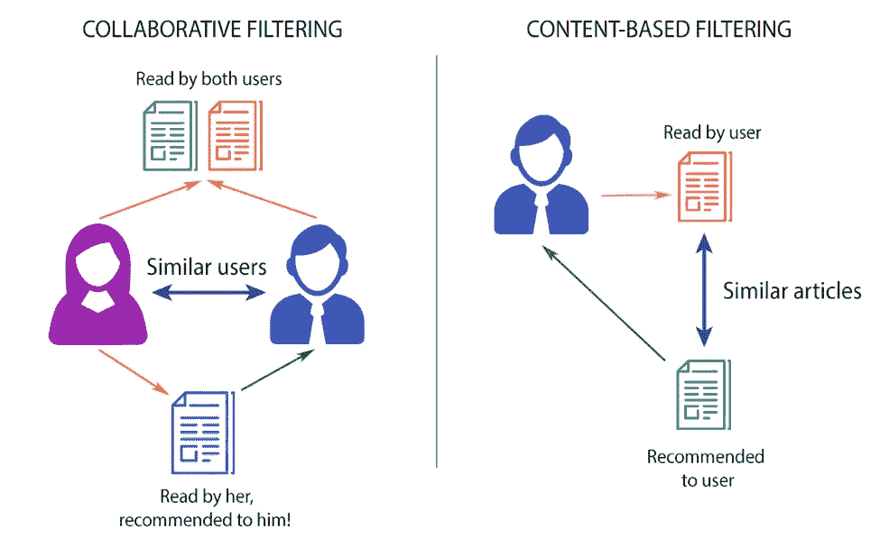**

**Collaborative Filtering vs Content-Based Filtering**

# **3 —矩阵分解**

**在之前的尝试中，我已经使用了基于记忆的协同过滤来根据用户的评分数据进行电影推荐。我只能在一个非常小的数据样本(20，000 个评级)上尝试它们，结果得到了相当高的均方根误差(糟糕的推荐)。计算项目或用户之间的距离关系的基于记忆的协同过滤方法有这两个主要问题:**

1.  **它不太适合大规模数据集，尤其是基于用户行为相似性的实时推荐——这需要大量计算。**
2.  **评级矩阵可能过度适合用户口味和偏好的嘈杂表示。当我们在原始数据上使用基于距离的“邻域”方法时，我们匹配稀疏的低级细节，我们假设这些细节代表用户的偏好向量而不是向量本身。**

**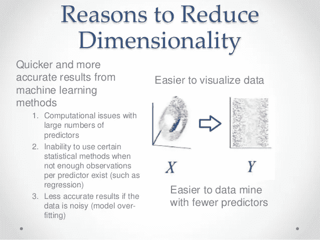**

**3 Reasons to Reduce Data’s Dimensionality**

**因此，我需要应用**降维**技术来从原始数据中提取口味和偏好，也就是所谓的低秩矩阵分解。为什么要降维？**

*   **我可以发现原始数据中隐藏的相关性/特征。**
*   **我可以删除无用的冗余和嘈杂的功能。**
*   **我可以更容易地解释和可视化数据。**
*   **我也可以访问更容易的数据存储和处理。**

## **数学**

*****基于模型的协同过滤*** 是在 ***矩阵分解(MF)*** 的基础上得到更大的曝光，主要作为潜变量分解和降维的无监督学习方法。矩阵分解被广泛用于推荐系统，与基于记忆的 CF 相比，它可以更好地处理可伸缩性和稀疏性:**

*   **MF 的目标是从已知的评分中学习用户的潜在偏好和项目的潜在属性(学习描述评分特征的特征),然后通过用户和项目的潜在特征的点积来预测未知的评分。**
*   **当你有一个非常稀疏的矩阵，有很多维度，通过做矩阵分解，你可以把用户项矩阵重新构造成低秩结构，你可以用两个低秩矩阵相乘来表示矩阵，其中的行包含潜在向量。**
*   **通过将低秩矩阵相乘，填充原始矩阵中缺少的条目，使该矩阵尽可能接近原始矩阵。**

**一种众所周知的矩阵分解方法是 ***【奇异值分解】*** 。在高层次上，SVD 是一种将矩阵 A 分解为原始矩阵 A 的最佳低秩(即更小/更简单)近似的算法。在数学上，它将 A 分解为两个酉矩阵和一个对角矩阵:**

**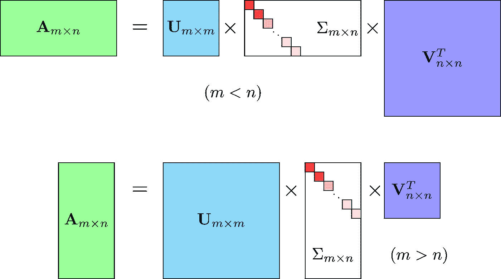**

**SVD Equation**

**其中 **A 是输入数据矩阵**(用户评分) **U 是左奇异向量**(用户“特征”矩阵) **Sum 是奇异值对角矩阵**(实质上是每个概念的权重/强度) **V^T 是右奇异向量**(电影“特征”矩阵)。u 和 V^T 是列正交的，代表不同的东西: **U 代表用户“喜欢”每个特征的程度**和 **V^T 代表每个特征与每个电影的相关程度**。**

**为了得到较低等级的近似，我采用这些矩阵并只保留前 k 个特征，这可以被认为是潜在的品味和偏好向量。**

## ****代码****

**Scipy 和 Numpy 都有进行奇异值分解的函数。我将使用 Scipy 函数 *svds* ,因为它让我可以选择要使用多少潜在因素来逼近原始评级矩阵(而不是在此之后将其截断)。**

```
**from** **scipy.sparse.linalg** **import** svds 
U, sigma, Vt = svds(Ratings_demeaned, k = 50)
```

**因为我要利用矩阵乘法来获得预测，所以我要将 Sum(现在是值)转换成对角矩阵形式。**

```
sigma = np.diag(sigma)
```

**我现在有了为每个用户预测电影收视率所需的一切。我可以通过数学和矩阵乘法 u，Sum，和 V^T，得到 a 的秩 k = 50 的近似值，一次完成**

**但是首先，我需要将用户均值加回去，以获得实际的星级预测。**

```
all_user_predicted_ratings = np.dot(np.dot(U, sigma), Vt) + user_ratings_mean.reshape(-1, 1)
```

**有了每个用户的预测矩阵，我可以构建一个函数来为任何用户推荐电影。为了便于比较，我返回用户已经评级的电影列表。**

```
preds = pd.DataFrame(all_user_predicted_ratings, columns = Ratings.columns)
```

**现在，我编写一个函数来返回指定用户尚未评级的预测评级最高的电影。**

```
**def** recommend_movies(predictions, userID, movies, original_ratings, num_recommendations):

    *# Get and sort the user's predictions*
    user_row_number = userID - 1 *# User ID starts at 1, not 0*
    sorted_user_predictions = preds.iloc[user_row_number].sort_values(ascending=False) *# User ID starts at 1*

    *# Get the user's data and merge in the movie information.*
    user_data = original_ratings[original_ratings.user_id == (userID)]
    user_full = (user_data.merge(movies, how = 'left', left_on = 'movie_id', right_on = 'movie_id').
                     sort_values(['rating'], ascending=False)
                 )

    *# Recommend the highest predicted rating movies that the user hasn't seen yet.*
    recommendations = (movies[~movies['movie_id'].isin(user_full['movie_id'])].
         merge(pd.DataFrame(sorted_user_predictions).reset_index(), how = 'left',
               left_on = 'movie_id',
               right_on = 'movie_id').
         rename(columns = {user_row_number: 'Predictions'}).
         sort_values('Predictions', ascending = False).
                       iloc[:num_recommendations, :-1]
                      )

    **return** user_full, recommendations
```

## **评估**

**我将使用[](https://pypi.python.org/pypi/scikit-surprise)**库来评估其在 MovieLens 数据集上的 RMSE(均方根误差),而不是像上次那样手动评估。这是 Python Scikit-Learn 的构建和分析推荐系统。****

```
***# Import libraries from Surprise package*
**from** **surprise** **import** Reader, Dataset, SVD, evaluate

*# Load Reader library*
reader = Reader()

*# Load ratings dataset with Dataset library*
data = Dataset.load_from_df(ratings[['user_id', 'movie_id', 'rating']], reader)

*# Split the dataset for 5-fold evaluation*
data.split(n_folds=5)*# Use the SVD algorithm.*
svd = SVD()

*# Compute the RMSE of the SVD algorithm.*
evaluate(svd, data, measures=['RMSE'])**
```

****我得到了一个平均值*均方根误差*0.8736，相当不错。****

## ****该建议****

****让我们试着为 ID 为 1310 的用户推荐 20 部电影。****

```
**predictions = recommend_movies(preds, 1310, movies, ratings, 20)predictions**
```

****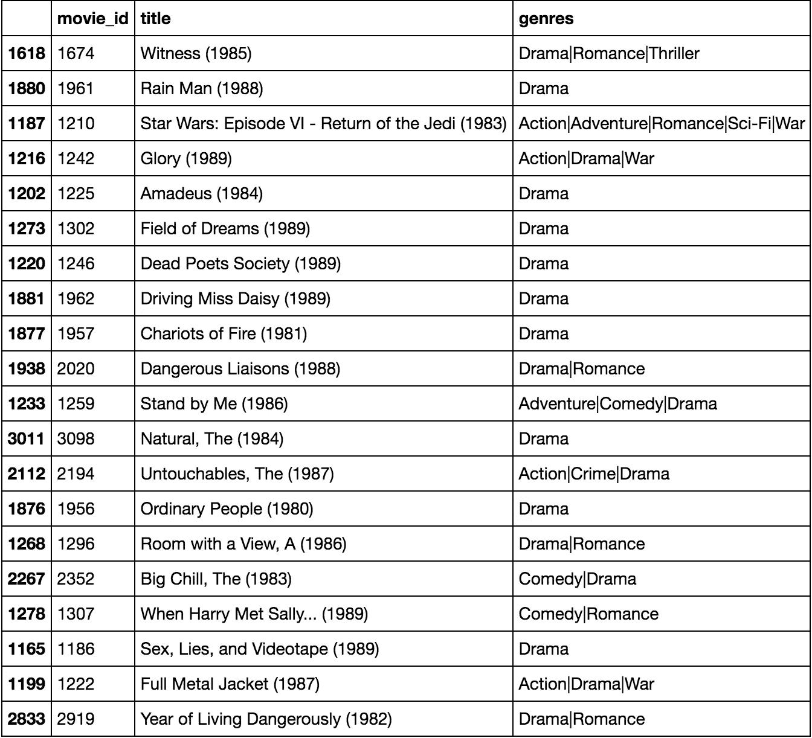****

****Recommendations using SVD****

****这些看起来是很好的建议。很高兴看到，虽然我实际上没有使用电影的类型作为特征，但截断矩阵分解的特征“拾取”了用户的潜在品味和偏好。我推荐了一些喜剧、戏剧和爱情电影——这些都是这个用户评价最高的电影类型。****

******注:**SVD 矩阵分解的完整代码可以在[这本 Jupyter 笔记本](https://github.com/khanhnamle1994/movielens/blob/master/SVD_Model.ipynb)中找到。****

# ****4 —深度学习****

## ****数学****

****使用深度学习的思路类似于基于模型的矩阵分解。在矩阵分解中，我们将原始稀疏矩阵分解成 2 个低秩正交矩阵的乘积。对于深度学习实现，我们不需要它们是正交的，我们希望我们的模型能够学习嵌入矩阵本身的值。对于特定的电影-用户组合，从嵌入矩阵中查找用户潜在特征和电影潜在特征。这些是进一步线性和非线性图层的输入值。我们可以将此输入传递给多个 relu、线性或 sigmoid 层，并通过任何优化算法(Adam、SGD 等)学习相应的权重。).****

## ****代码****

****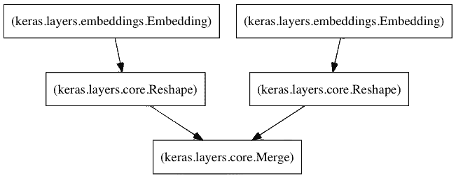****

****Architecture for Neural Network****

****以下是我的神经网络的主要组成部分:****

*   ****左侧嵌入层，通过潜在因素矩阵创建用户。****
*   ****通过潜在因素矩阵创建电影的右嵌入层。****
*   ****当这些图层的输入是(I)用户 id 和(ii)电影 id 时，它们将分别返回用户和电影的潜在因素向量。****
*   ****采用这两个潜在向量的点积来返回预测评级的合并层。****

****这段代码基于[阿尔凯斯特](http://www.fenris.org/)的博客文章[Keras](http://www.fenris.org/2016/03/07/index-html)中概述的方法。****

****然后，我使用均方误差(MSE)作为损失函数和 AdaMax 学习算法来编译模型。****

```
***# Define model*
model = CFModel(max_userid, max_movieid, K_FACTORS)
*# Compile the model using MSE as the loss function and the AdaMax learning algorithm*
model.compile(loss='mse', optimizer='adamax')**
```

****现在我需要训练模型。这一步将是最耗时的一步。在我的特殊情况下，对于我们的数据集，它有近 100 万个评级，近 6，000 个用户和 4，000 部电影，我在我的 MacBook 笔记本电脑 CPU 内每个时期大约 6 分钟(30 个时期~ 3 小时)训练了模型。我以 90/10 的比例分割了训练和验证数据。****

```
***# Callbacks monitor the validation loss*
*# Save the model weights each time the validation loss has improved*
callbacks = [EarlyStopping('val_loss', patience=2), 
             ModelCheckpoint('weights.h5', save_best_only=True)]

*# Use 30 epochs, 90% training data, 10% validation data* 
history = model.fit([Users, Movies], Ratings, nb_epoch=30, validation_split=.1, verbose=2, callbacks=callbacks)**
```

****下一步是实际预测随机用户对随机电影的评价。下面，我对所有用户和所有电影应用新训练的深度学习模型，对每个用户和电影使用 100 维嵌入。****

```
***# Use the pre-trained model*
trained_model = CFModel(max_userid, max_movieid, K_FACTORS)
*# Load weights*
trained_model.load_weights('weights.h5')**
```

****这里我定义了一个函数来预测用户对未评级项目的评级。****

```
***# Function to predict the ratings given User ID and Movie ID*
**def** predict_rating(user_id, movie_id):
    **return** trained_model.rate(user_id - 1, movie_id - 1)**
```

## ****评估****

****在上面的训练过程中，每当验证损失有所改善时，我都会保存模型权重。因此，我可以使用该值来计算最佳验证均方根误差。****

```
***# Show the best validation RMSE*
min_val_loss, idx = min((val, idx) **for** (idx, val) **in** enumerate(history.history['val_loss']))**print** 'Minimum RMSE at epoch', '{:d}'.format(idx+1), '=', '{:.4f}'.format(math.sqrt(min_val_loss))## Output
Minimum RMSE at epoch 17 = 0.8616**
```

****最好的验证损失是在第 17 个时期的 0.7424。取那个数的平方根，得到了 *0.8616* 的 RMSE 值，比 SVD 模型得到的 RMSE(*0.8736*)要好。****

## ****该建议****

****这里我给用户 ID 2000 做一个未分级的 20 部电影的推荐列表，按照预测值排序。让我们看看。****

```
**recommendations = ratings[ratings['movie_id'].isin(user_ratings['movie_id']) == False][['movie_id']].drop_duplicates()recommendations['prediction'] = recommendations.apply(**lambda** x: predict_rating(TEST_USER, x['movie_id']), axis=1)recommendations.sort_values(by='prediction', ascending=False).merge(movies, on='movie_id', how='inner',
suffixes=['_u', '_m']).head(20)**
```

****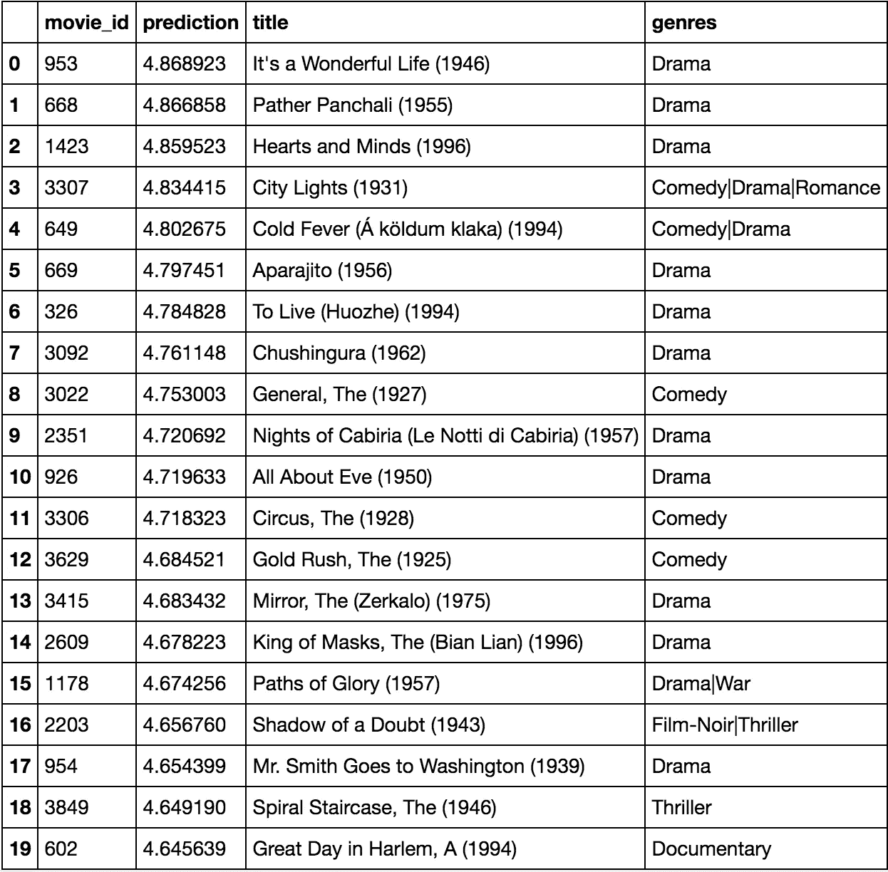****

****Recommendations using Deep Learning / Neural Networks****

****这个模型比我以前尝试过的所有方法(基于内容的、用户-项目相似性的协同过滤，SVD)都表现得更好。我当然可以通过增加更多的线性和非线性层来提高这个模型的性能。****

******注:**深度学习模型的完整代码可以在[本 Jupyter 笔记本](https://github.com/khanhnamle1994/movielens/blob/master/Deep_Learning_Model.ipynb)中找到。****

# ****最后一次外卖****

****推荐引擎是您的伴侣和顾问，通过为您提供量身定制的选项和创建个性化的体验来帮助您做出正确的选择。毫无疑问，推荐引擎在新时代越来越受欢迎和重要。学会使用它们对企业更有竞争力，对消费者更有效率，这将是对你最有利的。****

****我希望这篇文章有助于你了解 4 种不同的方法来建立你自己的电影推荐系统。你可以通过这个链接查看我的 GitHub repo 中的所有源代码([https://github.com/khanhnamle1994/movielens](https://github.com/khanhnamle1994/movielens))。如果您有任何问题或改进建议，请告诉我！****

****— —****

*****如果你喜欢这首曲子，我希望你能按下鼓掌按钮*👏*这样别人可能会偶然发现它。你可以在* [*GitHub*](https://github.com/khanhnamle1994) *上找到我自己的代码，在*[*【https://jameskle.com/】*](https://jameskle.com)*上找到更多我的写作和项目。也可以在* [*推特*](https://twitter.com/@james_aka_yale) *，* [*上关注我直接发邮件给我*](mailto:khanhle.1013@gmail.com) *或者* [*在 LinkedIn*](http://www.linkedin.com/in/khanhnamle94) *上找我。* [*注册我的简讯*](http://eepurl.com/deWjzb) *就在你的收件箱里接收我关于数据科学、机器学习和人工智能的最新想法吧！*****