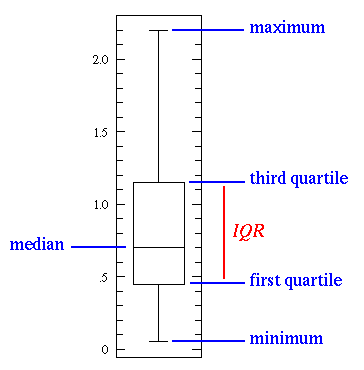
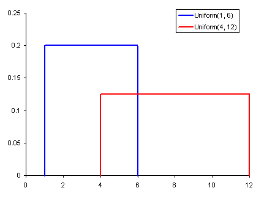
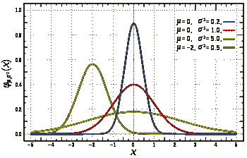
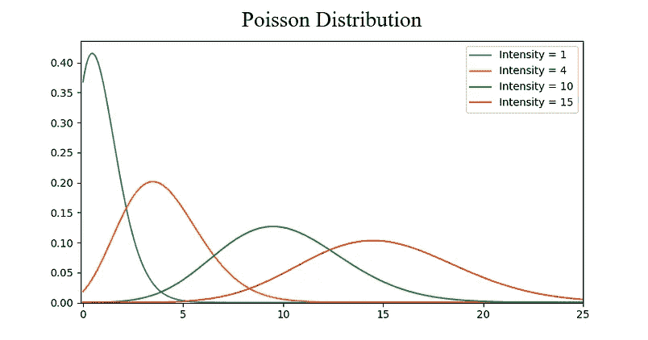
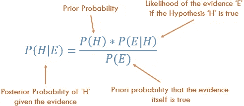

# 数据科学家需要了解的 5 个基本统计概念

> 原文：<https://towardsdatascience.com/the-5-basic-statistics-concepts-data-scientists-need-to-know-2c96740377ae?source=collection_archive---------0----------------------->

> 想获得灵感？快来加入我的 [**超级行情快讯**](https://www.superquotes.co/?utm_source=mediumtech&utm_medium=web&utm_campaign=sharing) 。😎

当执行数据科学(DS)的艺术时，统计学可以是一个强有力的工具。从高层次的角度来看，统计是使用数学对数据进行技术分析。一个基本的可视化，如条形图，可能会给你一些高层次的信息，但有了统计数据，我们可以以一种更加信息驱动和有针对性的方式对数据进行操作。相关的数学帮助我们对数据形成具体的结论，而不仅仅是猜测。

使用统计数据，我们可以更深入、更细致地了解我们的数据究竟是如何构建的，以及基于这种结构，我们如何以最佳方式应用其他数据科学技术来获取更多信息。今天，我们将探讨数据科学家需要了解的 5 个基本统计概念，以及如何最有效地应用它们！

# 统计特征

统计特征可能是数据科学中使用最多的统计概念。这通常是您在探索数据集时应用的第一个统计技术，包括偏差、方差、平均值、中值、百分位数等。理解和用代码实现都相当容易！请看下图的插图。

A basic box plot

中间的线是数据的*中值*。中值用于平均值，因为它对异常值更稳健。第一个四分位数*实质上是第 25 个百分位数；即数据中 25%的点低于该值。第三个四分位数*是第 75 个百分位数；即数据中 75%的点低于该值。最小值和最大值代表我们数据范围的上限和下限。**

箱线图完美地展示了我们可以利用基本统计特征做些什么:

*   当箱线图**短**时，这意味着您的数据点大多相似，因为在一个小范围内有许多值
*   当箱形图**高**时，这意味着你的许多数据点是非常不同的，因为这些值分布在很宽的范围内
*   如果中值更接近底部**那么我们知道大部分数据具有更低的值。如果中值更接近顶部**那么我们知道大多数数据具有更高的值。基本上，如果中线不在方框的中间，则表明**数据偏斜**。****
*   胡须**很长**吗？这意味着您的数据具有较高的**标准差**和**方差**，即数值分散且变化很大。如果盒子的一边有长胡须，而另一边没有，那么数据可能只在一个方向上变化很大。

所有这些信息都来自几个简单的易于计算的统计特征！当您需要快速查看数据时，请尝试这些方法。

# 概率分布

我们可以把概率定义为某一事件发生的概率。在数据科学中，这通常在 0 到 1 的范围内进行量化，其中 0 表示我们确信此**不会发生**，1 表示我们确信此**会发生**。概率分布是一个函数，它代表实验中所有可能值的概率。请看下图的插图。

Common Probability Distributions. Uniform (left), Normal (middle), Poisson (right)

*   一个**均匀分布**是我们这里展示的 3 个中最基本的一个。它只有一个值，这个值只出现在一个特定的范围内，而这个范围之外的值都是 0。这在很大程度上是一种“开或关”的分布。我们也可以认为它是一个具有两个类别的分类变量的指示:0 或值。您的分类变量可能有多个非 0 值，但我们仍然可以将其视为多个均匀分布的分段函数。
*   一个**正态** **分布**，通常被称为一个**高斯****分布，是由其均值和标准差具体定义的。平均值在空间上改变分布，标准偏差控制分布。与其他分布(如泊松分布)的重要区别在于标准差在所有方向上都是相同的。因此，对于高斯分布，我们知道数据集的平均值以及数据的分布，即它是分布在一个很大的范围内，还是高度集中在几个值周围。**
*   **一个**泊松分布**类似于正态分布，但是增加了一个*偏斜度*的因子。当偏斜度值较低时，泊松分布在所有方向上具有相对均匀的分布，就像正态分布一样。但是，当偏斜度值很大时，我们的数据在不同方向上的分布是不同的；在一个方向，它将非常分散，而在另一个方向，它将高度集中。**

**你可以深入研究更多的发行版，但是这 3 个已经给了我们很多价值。我们可以很快看到并解释均匀分布的分类变量。如果我们看到高斯分布，我们知道有许多算法默认情况下特别适合高斯分布，因此我们应该选择这些算法。对于 Poisson，我们将看到，我们必须特别小心，选择一种对空间分布变化具有鲁棒性的算法。**

# **降维**

**术语*降维*理解起来相当直观。我们有一个数据集，我们想减少它的维数。在数据科学中，这是特征变量的数量。请看下图的插图。**

****

**Dimensionality Reduction**

**立方体代表我们的数据集，它有 3 个维度，总共有 1000 个点。现在用今天的计算，1000 点很容易处理，但是在更大的范围内，我们会遇到问题。然而，仅仅从*二维*的角度来看我们的数据，比如从立方体的一边，我们可以看到从那个角度划分所有的颜色是非常容易的。通过降维，我们可以*将 3D 数据投影*到 2D 平面上。这有效地将我们需要计算的点数减少到了 100，大大节省了计算量！**

**我们可以做维度缩减的另一种方法是通过*特征修剪*。通过特征修剪，我们基本上想要移除任何我们认为对我们的分析不重要的特征。例如，在浏览数据集后，我们可能会发现 10 个特征中有 7 个与输出高度相关，而另外 3 个相关性非常低。那么这 3 个低相关性特征可能不值得计算，我们可以在不影响输出的情况下从分析中删除它们。**

**用于降维的最常见的统计技术是 PCA，它本质上创建特征的向量表示，显示它们对输出的重要性，即它们的相关性。PCA 可用于上述两种降维方式。在本教程中了解更多信息。**

# **过采样和欠采样**

**过采样和欠采样是用于分类问题的技术。有时，我们的分类数据集可能过于偏向一边。例如，我们有 2000 个类 1 的例子，但是只有 200 个类 2 的例子。这将抛弃许多我们试图用来建模数据和进行预测的机器学习技术！我们的过采样和欠采样可以解决这个问题。请看下图的插图。**

****

**Under and and Over Sampling**

**在上图的左侧和右侧，我们的蓝色类比橙色类有更多的样本。在这种情况下，我们有 2 个预处理选项，可以帮助训练我们的机器学习模型。**

**欠采样意味着我们将只从多数类中选择*一些*数据，只使用少数类拥有的那么多例子。应该进行这种选择以保持类的概率分布。那很容易！我们只是通过减少样本来平衡数据集！**

**过采样意味着我们将*创建少数类的副本*，以便拥有与多数类相同数量的实例。复制时将保持少数民族的分布。我们只是在没有获得更多数据的情况下平衡了数据集！**

# **贝叶斯统计**

**充分理解我们为什么使用贝叶斯统计需要我们首先理解*频率统计*失败的地方*。频率统计是大多数人听到“概率”这个词时会想到的统计类型。它涉及应用数学来分析某个事件发生的概率，特别是我们计算的唯一数据是*之前的数据*。***

****

**让我们看一个例子。假设我给你一个骰子，问你掷出 6 的几率有多大。大多数人会说是六分之一。事实上，如果我们要做一个频率分析，我们会查看一些数据，其中有人掷骰子 10，000 次，并计算每个数字的掷出频率；大概是六分之一！**

**但是如果有人告诉你，给你*的*特定骰子*被*装载*总是落在 6 上呢？由于频率分析只考虑了*先验数据*，所以给你的关于模具被装载的*证据*是**而不是**被考虑在内。***

***贝叶斯统计**是否考虑了这个证据。我们可以通过看看贝耶定理来说明这一点:*****

**********

*****Baye’s Theoram*****

*****我们方程中的概率 *P(H)* 基本是我们的频率分析；给定我们的先验数据，事件发生的概率是多少。我们等式中的 *P(E|H)* 被称为*可能性*，本质上是给定我们频率分析的信息，我们的证据是正确的概率。例如，如果你想掷骰子 10，000 次，而前 1000 次你得到了全部 6 次，你就开始非常确信骰子已经装好了！ *P(E)* 是实际证据为真的概率。如果我告诉你骰子已经上膛了，你能相信我说它真的上膛了吗？还是你认为这是个骗局？！*****

*****如果我们的频率分析非常好，那么我们的猜测 6 是正确的就有一定的分量了。与此同时，我们考虑到我们的证据加载芯片，如果它是真实的或不基于其本身的先验和频率分析。从等式的布局可以看出，贝叶斯统计把一切都考虑进去了。当您觉得以前的数据不能很好地代表未来的数据和结果时，就使用它。*****