# 你应该知道的 4 个深度学习突破

> 原文：<https://towardsdatascience.com/the-5-deep-learning-breakthroughs-you-should-know-about-df27674ccdf2?source=collection_archive---------4----------------------->

## 非专家深度学习系列的第一篇

## 为什么要看这个？

无论是作为个体从业者还是作为组织，要开始应用深度学习，你需要两件事情:

1.  **“什么”**:深度学习的最新发展能够做什么的想法。
2.  **“如何做”**:培训新模型或使用现有模型并使其投入生产的技术能力。

由于开源社区的强大，第二部分变得越来越容易。关于如何使用 TensorFlow 等库来训练和使用深度学习模型的具体细节，有许多很好的教程，其中许多出版物如《走向数据科学》每周出版一次。

这意味着，一旦你有了如何使用深度学习的想法，实现你的想法虽然不容易，但涉及到标准的“开发”工作:遵循本文中链接的教程，根据你的特定目的和/或数据修改它们，通过阅读 StackOverflow 上的帖子进行故障排除，等等。例如，他们不要求(或雇佣)一个拥有博士学位的独角兽，他可以从零开始编写原始的神经网络架构*和*是一个有经验的软件工程师。

这一系列文章将试图填补第一部分的空白:在高层次上覆盖深度学习的能力，同时为那些想要了解更多和/或深入代码并解决第二部分的人提供资源。更具体地说，我将介绍:

1.  使用开源架构和数据集的最新成就是什么。
2.  导致这些成就的关键架构或其他见解是什么
3.  在自己的项目中开始使用类似技术的最佳资源是什么。

## **这些突破有什么共同点**

这些突破虽然涉及许多新的架构和想法，但都是使用机器学习中常见的“监督学习”过程实现的。具体步骤如下:

1.  收集大量适当的训练数据
2.  建立一个神经网络架构——即一个复杂的方程系统，松散地模仿大脑——它通常有数百万个称为“权重”的参数。
3.  通过神经网络重复输入数据；在每次迭代中，将神经网络的预测结果与正确结果进行比较，并根据神经网络的偏差程度和偏差方向来调整每个神经网络的权重。

This is how neural nets are trained: this process is repeated *many, many times.* [*Source*](https://www.embedded-vision.com/platinum-members/cadence/embedded-vision-training/documents/pages/neuralnetworksimagerecognition)*.*

这个过程已经被应用到许多不同的领域，并且已经产生了看起来已经“学习”的神经网络。在每个领域，我们将涵盖:

1.  训练这些模型所需的数据
2.  使用的模型架构
3.  结果呢

# **1。图像分类**

*神经网络可以被训练来计算出图像包含什么对象。*

## **所需数据**

为了训练图像分类器，你需要带标签的图像，其中每个图像属于多个有限类中的一个。例如，用于训练图像分类器的标准数据集之一是 [CIFAR 10](https://www.cs.toronto.edu/~kriz/cifar.html) 数据，其正确标记了 10 类图像:

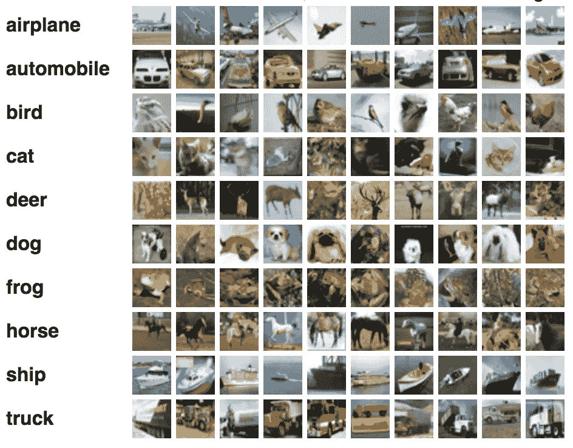

Illustration of images of CIFAR-10 data. [Source](https://becominghuman.ai/training-mxnet-part-2-cifar-10-c7b0b729c33c')

## **深度学习架构**

我们将涉及的所有神经网络架构都是由思考*人*实际上必须如何学习解决问题而激发的。对于图像检测，我们如何做到这一点？当人类确定图像中的内容时，我们首先会寻找高级视觉特征，如树枝、鼻子或车轮。然而，为了检测这些，我们下意识地需要确定较低层次的特征，如颜色、线条和其他形状。事实上，从原始像素到人类可以识别的复杂特征，比如眼睛，我们需要检测像素的特征，然后是像素的特征，等等。

在深度学习之前，研究人员会手动尝试提取这些特征，并将其用于预测。就在深度学习出现之前，研究人员开始使用技术(主要是[支持向量机](https://crypto.stanford.edu/~pgolle/papers/dogcat.pdf))试图找到这些手动提取的特征与图像是猫还是狗之间的复杂非线性关系。

Convolutional Neural Network extracting features at each layer. [Source](https://www.strong.io/blog/deep-neural-networks-go-to-the-movies)

现在，研究人员开发了神经网络架构，可以学习原始像素本身的这些特征；具体来说，深度卷积神经网络架构。这些网络提取像素的特征，然后提取像素的特征等，然后最终通过常规神经网络层(类似于逻辑回归)进行最终预测。

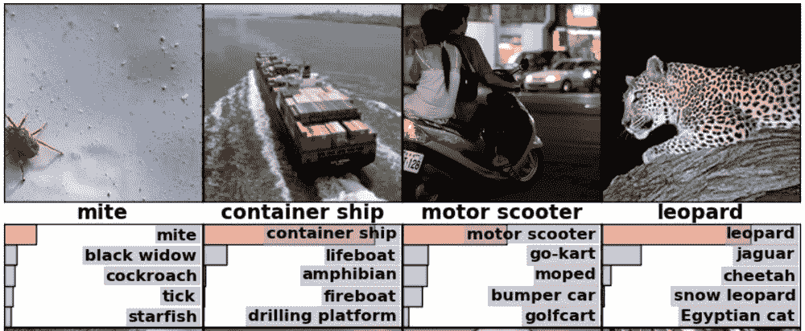

Samples of the predictions a leading CNN architecture made on images from the ImageNet dataset.

在以后的文章中，我们将深入探讨卷积神经网络是如何用于图像分类的。

## 突破

其结果是，在这些架构旨在解决的中心任务——图像分类——上，算法现在可以获得比人更好的结果。在著名的 [ImageNet 数据集](http://www.image-net.org/challenges/LSVRC/)上，这是卷积架构最常用的基准，经过训练的神经网络现在在图像分类上实现了优于人类的性能:

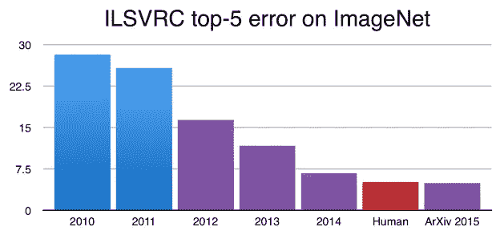

As of 2015, computers can be trained to classify objects in images better than humans. [Source](https://devblogs.nvidia.com/parallelforall/mocha-jl-deep-learning-julia/)

此外，研究人员已经找到了如何获取不立即用于图像分类的图像，分割出最有可能代表特定类别对象的图像矩形，*通过 CNN 架构*馈送这些矩形中的每一个，并最终得到图像中单个对象的分类以及界定其位置的框(这些被称为“边界框”):

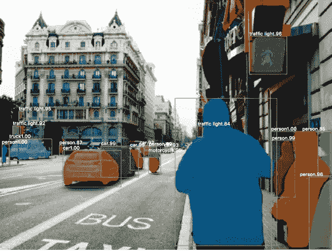

Object detection using “Mask R-CNN”. [Source](https://arxiv.org/pdf/1703.06870.pdf)

这整个多步骤过程在技术上被称为“[物体检测](https://en.wikipedia.org/wiki/Object_detection)，尽管它使用“图像分类”来完成最具挑战性的步骤。

## 资源

**理论**:要深入了解*为什么*CNN 会工作的理论，请阅读 Andrej Karpathy 的斯坦福课程[中的教程。对于一个稍微更数学的版本，查看克里斯·奥拉关于卷积的帖子](http://cs231n.github.io/convolutional-networks/)[这里](http://colah.github.io/posts/2014-07-Conv-Nets-Modular/)。

**代码**:要快速开始构建图像分类器，请查看 TensorFlow 文档中的[这个介绍性示例](https://www.tensorflow.org/tutorials/layers)。

# **2。文本生成**

*可以训练神经网络来生成模仿给定类型文本的文本。*

## **所需数据**

给定类的简单文本。例如，这可能是莎士比亚的所有作品。

## **深度学习架构**

神经网络可以对元素序列中的下一个元素进行建模。它可以查看过去的字符序列，并针对给定的一组过去的序列，确定下一个最有可能出现的字符。

用于该问题的架构不同于用于图像分类的架构。对于不同的架构，我们要求网络学习不同的东西。之前，我们要求它学习图像的哪些特征是重要的。在这里，我们要求它注意一个字符序列，以预测序列中的下一个字符。要做到这一点，与图像分类不同，网络需要一种跟踪其“状态”的方法。例如，如果之前看到的字符是“c-h-a-r-a-c-t-e”，网络应该“存储”该信息，并预测下一个字符应该是“r”。

递归神经网络架构能够做到这一点:在下一次迭代中，它将每个神经元的状态反馈到网络中，允许它学习序列(还有更多内容，但我们将在稍后讨论)。

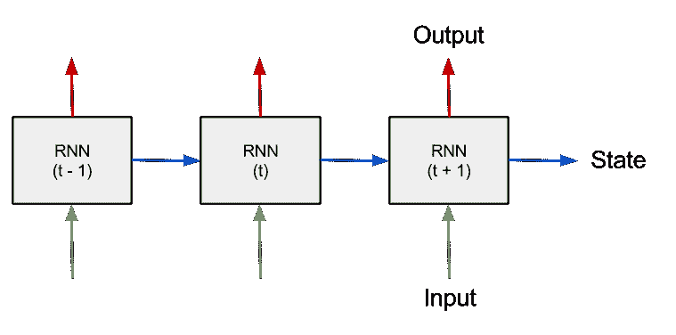

Image of a Recurrent Neural Net architecture. [Source](https://medium.com/@erikhallstrm/hello-world-rnn-83cd7105b767).

然而，要想真正擅长文本生成，网络还必须决定在序列中回溯多远。有时，就像在单词中间，网络只需查看最后几个字符来确定下一个字符，而其他时候它可能需要查看许多字符来确定，例如，我们是否在一个句子的末尾。

有一种叫做“LSTM”(长短期记忆)的特殊细胞在这方面做得特别好。每个细胞根据细胞内部的权重决定是“记住”还是“忘记”，权重随着网络看到的每个新字符而更新。

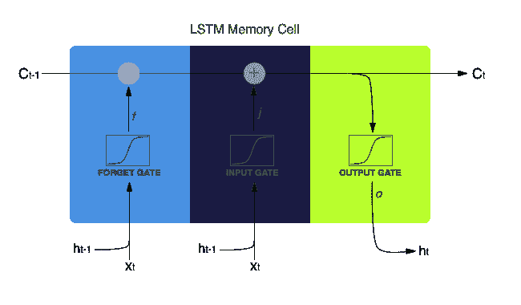

The inner workings of an LSTM cell. [Source](http://harinisuresh.com/2016/10/09/lstms/).

## 突破

简而言之:我们可以生成看起来有点像我们试图生成的文本的特征的文本，减去一些拼写错误的单词和错误，使其不是正确的英语。这个 Andrej Karpathy 的帖子有一些有趣的例子，从生成莎士比亚的戏剧到生成保罗·格拉厄姆的散文。

相同的架构已经被用于通过顺序生成 x 和 y 坐标来生成手写，就像语言是一个字符一个字符地生成一样。点击这里，查看[的演示。](https://www.cs.toronto.edu/~graves/handwriting.cgi)

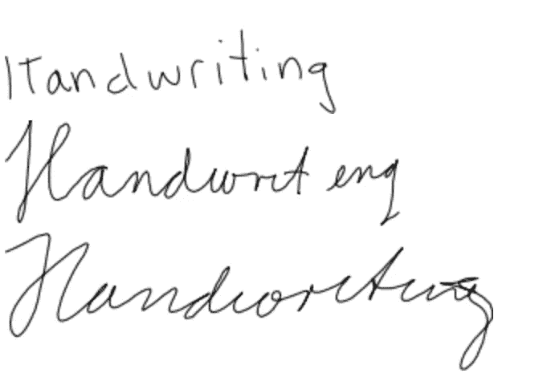

Written by a neural net. Can we still call it *hand*writing? [Source](https://www.cs.toronto.edu/~graves/handwriting.cgi?text=Handwriting&style=&bias=0.15&samples=3)

在以后的文章中，我们将深入探讨递归神经网络和 LSTMs 是如何工作的。

## 资源

**理论上:** [克里斯·奥拉在 LSTMs](http://colah.github.io/posts/2015-08-Understanding-LSTMs/) 上的这篇文章是经典之作，安德烈·卡帕西在 RNNs 上的这篇文章[也是经典之作，它们能完成什么，以及它们是如何工作的。](http://karpathy.github.io/2015/05/21/rnn-effectiveness/)

**代码:** [这个](https://machinelearningmastery.com/text-generation-lstm-recurrent-neural-networks-python-keras/)是关于如何开始构建端到端文本生成模型的一个很好的演练，包括数据的预处理。[这个 GitHub repo](https://github.com/snowkylin/rnn-handwriting-generation) 使得使用预先训练的 RNN-LSTM 模型生成手写变得容易。

# **3。语言翻译**

机器翻译——翻译语言的能力——一直是人工智能研究人员的梦想。深度学习让这个梦想更加接近现实。

## **所需数据**

不同语言之间的成对句子。例如，对“我是学生”和“我是学生”将是训练神经网络在英语和法语之间进行翻译的数据集中的一对句子。

## **深度学习架构**

与其他深度学习架构一样，研究人员已经“假设”了计算机可能如何理想地学习翻译语言，并建立了一个试图模仿这一点的架构。就语言翻译而言，从根本上来说，一个句子(编码为一系列单词)应该被翻译成其潜在的“意义”。这个意思应该被翻译成新语言中的一系列单词。

句子从单词“转化”成意义的方式，应该是一种擅长处理序列的架构——这原来就是上面所说的“递归神经网络”架构。

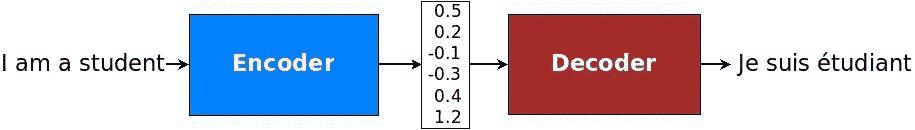

Encoder-decoder architecture diagram. [Source](https://github.com/tensorflow/nmt/tree/tf-1.2)

这种架构在 2014 年[的](https://arxiv.org/pdf/1406.1078.pdf)中首次被发现可以很好地用于语言翻译，此后在许多方向上得到了扩展，特别是“注意力”这一概念，我们将在未来的博客文章中探讨。

## 突破

[这篇谷歌博客文章](https://research.googleblog.com/2016/09/a-neural-network-for-machine.html)表明这个架构确实完成了它设定的目标，将其他语言翻译技术打得落花流水。当然，谷歌能为这项任务获取如此棒的训练数据也无妨！

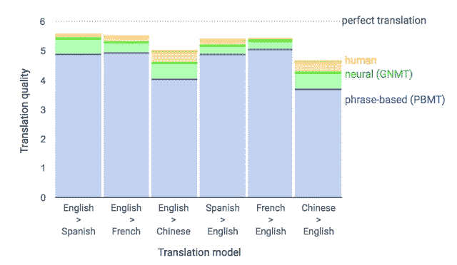

Google Sequence-to-Sequence based model performance. [Source](https://research.googleblog.com/2016/09/a-neural-network-for-machine.html)

## 资源

**代码&理论:**谷歌，值得称赞的是，在这里发表了一篇关于序列到序列架构的精彩教程[。本教程概述了序列到序列模型的目标和理论，并指导您如何在 TensorFlow 中对它们进行编码。它还包括“注意”，这是对基本序列到序列架构的扩展，我将在详细讨论序列到序列时讨论它。](https://github.com/tensorflow/nmt/tree/tf-1.2)

# **4。生成对抗网络**

*神经网络可以被训练来生成看起来像给定类别的图像的图像——例如，不是实际人脸的人脸图像。*

## **所需数据**

特定类别的图像—例如，一组人脸图像。

## **深度学习架构**

gan 是一个令人惊讶的重要成果——世界上领先的人工智能研究人员之一 Yann LeCun 说，在我看来，它们是“[过去 10 年中最有趣的想法。](https://www.quora.com/session/Yann-LeCun/1)“事实证明，我们可以生成看起来像一组训练图像的图像，但实际上不是来自训练集的图像:例如，看起来像人脸但*实际上不是真实人脸的图像*。这是通过同时训练两个神经网络来实现的:一个试图生成看起来真实的假图像，另一个试图检测图像是否真实。如果你训练这两个网络，使它们以“相同的速度”学习——这是构建 GANs 的困难部分——试图生成假图像的网络实际上可以生成看起来非常真实的图像。

说得更详细一点:我们想用 GANs 训练的主要网络叫做生成器:它将学习接收随机噪声向量，并将其转换成逼真的图像。这个网络具有来自卷积神经网络的“逆”结构，被恰当地命名为“去卷积”架构。另一个试图区分真实和虚假图像的网络是一个卷积网络，就像那些用于图像分类的网络一样，被称为“鉴别器”。

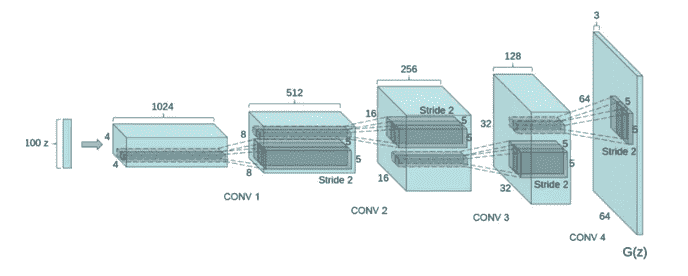

Deconvolutional architecture of a “generator”. [Source](https://medium.com/@awjuliani/generative-adversarial-networks-explained-with-a-classic-spongebob-squarepants-episode-54deab2fce39)

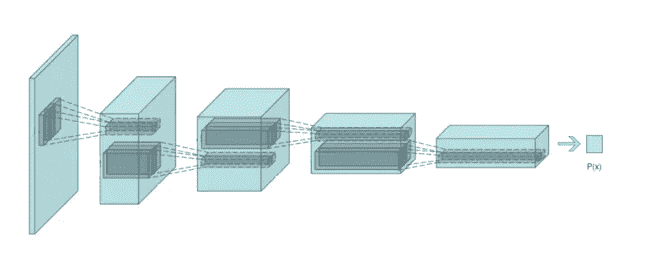

Convolutional architecture of the “discriminator”. [Source](https://medium.com/@awjuliani/generative-adversarial-networks-explained-with-a-classic-spongebob-squarepants-episode-54deab2fce39)

在 GANs 的情况下，两个神经网络都是卷积神经网络，因为这些神经网络特别擅长从图像中提取特征。

## 突破和资源

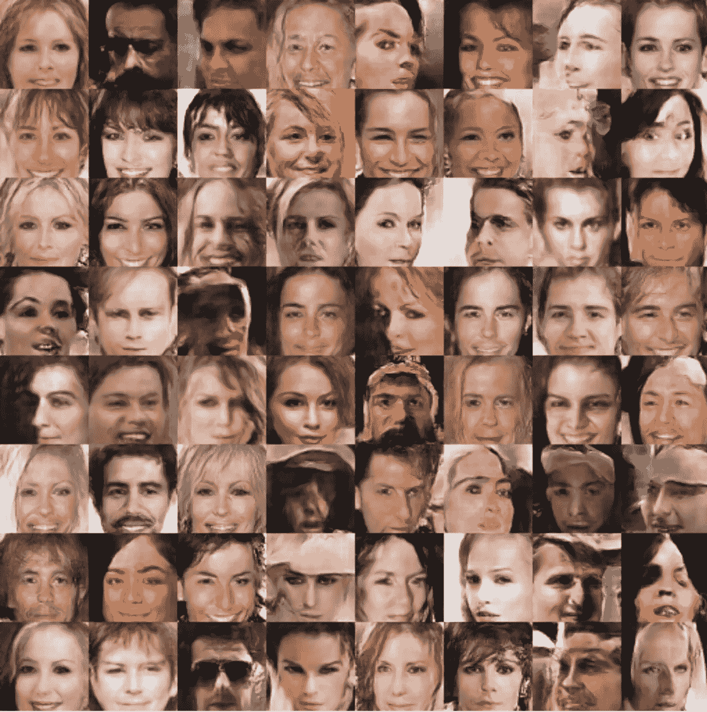

Images generated by a GAN from a dataset of faces of celebrities. [Source](https://github.com/carpedm20/DCGAN-tensorflow)

**Code** : [这个](https://github.com/carpedm20/DCGAN-tensorflow) GitHub repo 既是一个关于使用 TensorFlow 训练 GANs 的很棒的教程，也包含了一些由 GANs 生成的引人注目的图像，比如上图。

**理论**:[Irmak Sirer 的这个演讲](https://www.youtube.com/watch?v=BzRgipHRzOE)是对 GANs 的有趣介绍，也涵盖了许多有监督的学习概念，这也将帮助你理解上面的发现。

最后，优秀的 Arthur Juliani 在这里有另一个有趣的 GANs 的可视化解释，以及在 TensorFlow 中实现它的代码。

# 摘要

这是对深度学习在过去五年中产生最大突破的领域的高度概述。我们讨论的这些模型都有许多开源实现。这意味着您几乎总是可以下载一个“预训练”模型并将其应用于您的数据，例如，您可以下载预训练的图像分类器，您可以通过这些图像分类器输入数据，以便对新图像进行分类或在图像中的对象周围绘制方框。因为这项工作的大部分已经为你完成了，所以使用这些前沿技术所必需的工作不是“进行深度学习”本身——研究人员已经在很大程度上为你解决了这一部分——而是进行“开发”工作，以获得其他人为解决你的问题而开发的模型。

希望现在你对深度学习模型的能力有了一点更好的理解，并且更接近实际使用它们了！