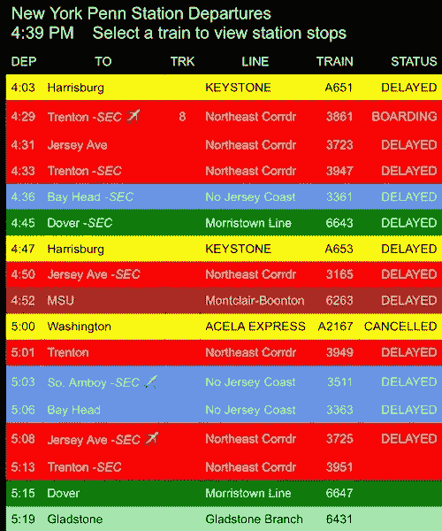
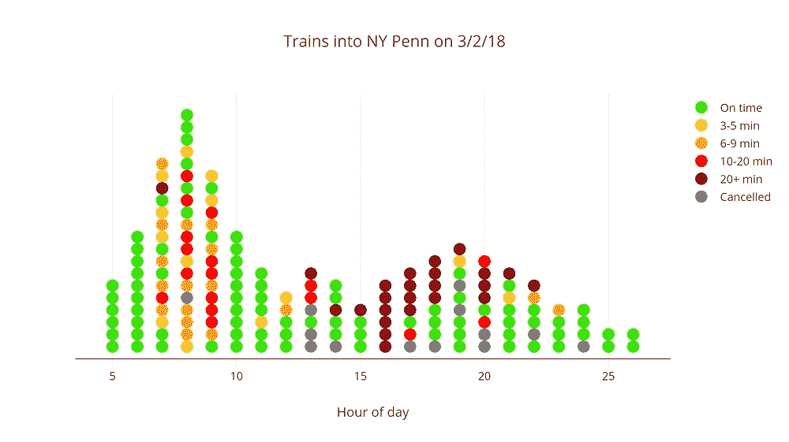
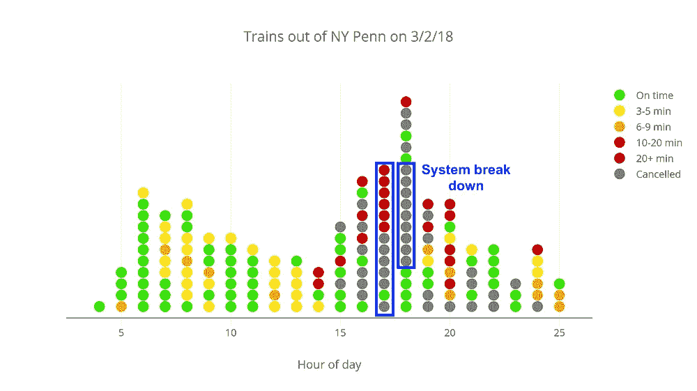
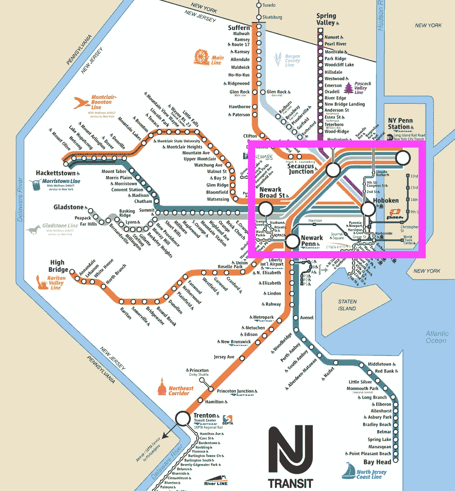
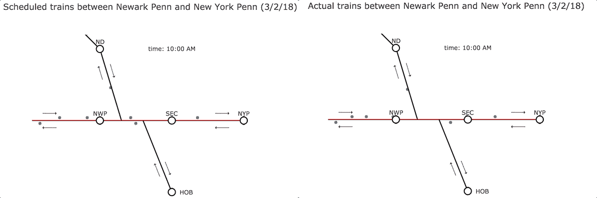
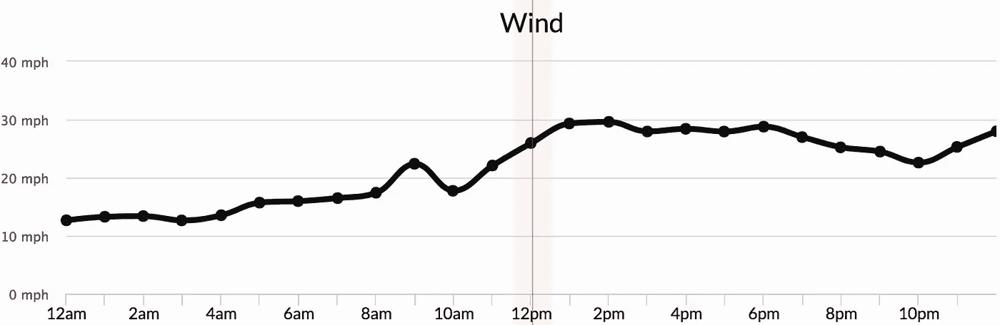
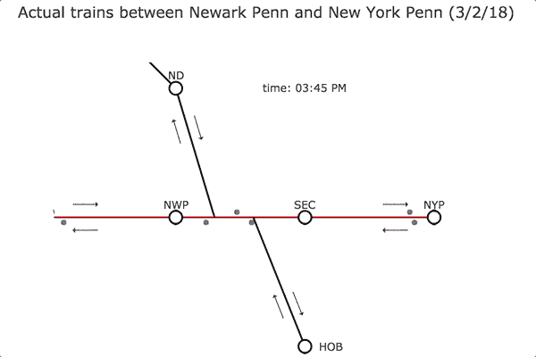
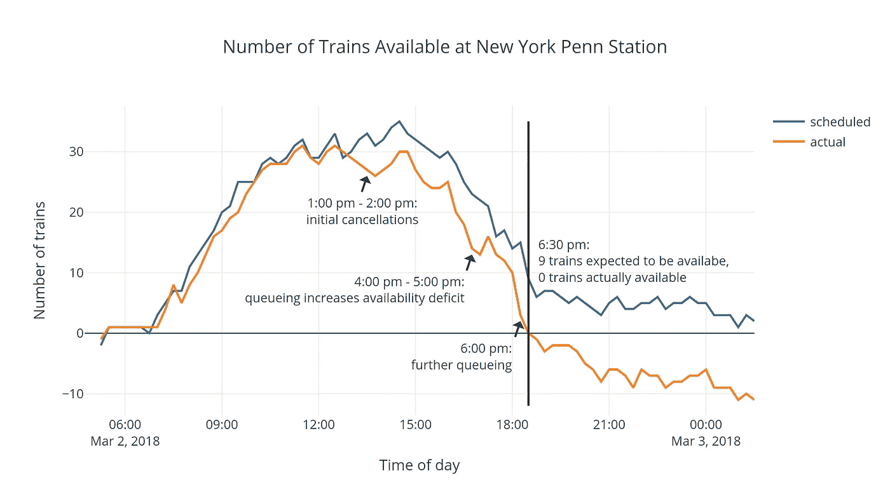
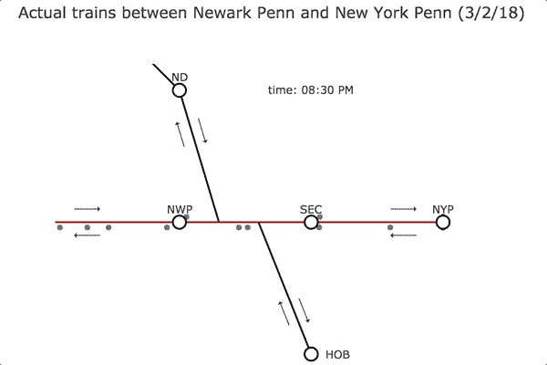

# 新泽西州运输系统故障的 5 个阶段

> 原文：<https://towardsdatascience.com/the-5-stages-of-a-system-breakdown-on-nj-transit-8258127e31e9?source=collection_archive---------7----------------------->

*这篇文章是我和* [*迈克尔·张*](https://medium.com/u/f43daa5e7896?source=post_page-----8258127e31e9--------------------------------) *之间正在进行的合作的一部分，分析我们收集的实时新泽西州过境数据。你可以在这里* *找到入门文章* [*，在这里*](https://medium.com/@pranavbadami/how-data-can-help-fix-nj-transit-c0d15c0660fe) *找到上一篇文章* [*。*](https://medium.com/@mzhang13/what-are-the-chances-that-nj-transit-will-cause-you-to-miss-the-dinky-bfeacd11ebc6)

2018 年 3 月 2 日星期五，纽约市是三月份横扫该地区的四个东北方中的第一个[的末端。从前一天晚上到下午早些时候，寒冷的天气一直在持续下降，并伴有上午晚些时候的阵风。](https://en.wikipedia.org/wiki/March_1%E2%80%933,_2018_nor%27easter)

当我结束一天的工作，前往纽约宾州车站回家时，我越来越担心，因为朋友和家人发来短信告诉我，新泽西州的交通服务严重受阻。

An ominous screenshot of Departure Vision for New York Penn at 4:39 pm on 3/2/18\. Note the “STATUS” column.

我完全没有料到自己会真的到达宾州车站，一大群沮丧的通勤者涌入第七大道。新泽西州的交通系统完全瘫痪，9 趟列车同时取消，随后又有几趟列车因天气原因被取消。

虽然这种大规模、全系统的故障很少见，但它们给成千上万整天或周末都被毁掉的通勤者留下了深刻的印象。让我们来看看这次服务中断的影响:下面的图表显示了 3 月 2 日进出纽约佩恩站的每趟新泽西州运输列车的延误情况。

Each dot is a train colored by delay severity. Note the symmetry in volume about hour 14 or 15\. (Left: Inbound trains into New York Penn, Right: Outbound trains from New York Penn)

进入纽约宾州的火车晚点是由它们到达纽约宾州(它们的最后一站)的累积延迟决定的，而离开纽约宾州的火车晚点是由它们到达第一站的延迟决定的。原定于下午 5 点到 7 点从纽约出发的 32 列火车中，有 18 列被取消，其他几列严重延误。

系统怎么会沦落到这种地步？导致这种情况的原因是什么？导致这种故障的系统动态是什么？我们可以检查数据，以可视化系统如何对中断做出反应，并识别导致系统崩溃的不同阶段。

# 可视化运行中的新泽西州运输系统

对于外行人来说，新泽西州运输系统是一个非循环的铁路网络，服务于新泽西州的 162 个火车站，并将旅客连接到纽约佩恩站。作为参考，这里是放大的系统铁路地图，捕捉了纽约宾州车站周围的车站，包括纽瓦克宾州车站、Secaucus Junction(上层)、纽瓦克布罗德街和霍博肯:

Abbreviated NJ Transit system map. Pink inset: The stations we will focus on. Note the overlap at Secaucus Junction, where the lines crossing above stop at Secaucus Upper Level; the lines crossing below stop at Secaucus Lower Level.

由于许多线路交叉和纽约宾州车站的高容量，新泽西州运输运营的这个区域具有复杂的系统动态，每天影响成千上万的人。

我们将通过关注这一段轨道来调查 3 月 2 日的系统故障，因为催化服务中断(稍后介绍)发生在纽瓦克宾州车站和 Secaucus Junction 之间；此外，大量的列车将展示系统动力学在发挥作用。

# 第一阶段:暴风雨前(或期间)的平静

让我们从 3 月 2 日早上的系统状态开始分析，因为它处理了前一天晚上开始的持续冻雨。在处理了早上由于列车故障和美国国家铁路客运公司轨道维修造成的一些小的服务中断后，该系统在早高峰后立即找到了一些稳定性。

下面的动画显示了左侧的计划系统行为和右侧的实际观察行为。由我们的刮刀收集的停止级列车数据被转换成有状态的数据结构，然后从该数据结构对列车位置进行插值和动画处理。

System animation at 10 am. Each dot here corresponds to a train. Left: Scheduled trains, Right: Observed trains. Stations: NWP (Newark Penn), SEC (Secaucus Upper Level), NYP (New York Penn), ND (Newark Broad St), HOB (Hoboken)

火车在停靠站之间以大致相同的平均速度行驶。此外，我们看到列车在非常接近其预定发车时间的情况下从纽约宾州始发发车。目前，系统是稳定的。

# 第二阶段:有东西坏掉了

当天下午早些时候，暴风雨带来的降水开始减少，取而代之的是阵阵狂风。然后，发生了这样的事:

下午早些时候，纽瓦克·佩恩和 Secaucus Junction 之间的一条高架电线断了。为列车沿途供电的架空电力线是固定铁路基础设施中最脆弱的部分之一，因为它们容易受到大风和持续冬季降水的破坏。

在这种情况下，我们看到，在电线断开时，该地区的风速确实增大了。以下是新泽西州纽瓦克 3 月 2 日的风力数据:

Wind speed in Newark on 3/2/18 (courtesy of the Time Machine on darksky.net)

尽管上面的推文时间标记为下午 4 点 47 分，但由于天气恶劣，下午早些时候有几趟列车被取消；出于分析的目的，我们假设电线在下午 1 点到 2 点之间断开。这条下线导致纽瓦克·佩恩和 Secaucus 之间的有限路段只有一条轨道可用(根据我从 NJ Transit 听到的公告)。让我们看一下系统中受影响的部分是如何应对这种服务中断的。

## **第三阶段:排队**

下午早些时候通常是新泽西州运输服务周期中相对较慢的时段，但随着下午晚些时候的临近，进出纽约宾州的列车数量开始快速增长。作为一个简化的假设，我们可以说足够多的火车需要在下午晚些时候到达纽约宾州，以便它们可以被重用来服务纽约宾州的晚上通勤。这些列车的确切配置尚不清楚，但我们看到该时间表旨在保持进出航站楼的列车数量相等。

然而，在 3 月 2 日，由于纽瓦克和 Secaucus 之间的线路故障，这两个车站之间的列车不得不共用一条轨道。开往纽约宾州的火车慢如蜗牛，因为它们排成了一列，而更早的火车使用的是单轨。

System animation at 4 pm. Note the queueing trains heading towards NWP at 4:00 pm.

## **第四阶段:取消**

让我们检查之前的服务中断和排队对到达纽约宾夕法尼亚的火车数量的影响。为了做到这一点，我们将查看在任何给定时间点到达纽约宾州的累计列车数与计划离开纽约宾州的累计列车数之间的差异。实际上，这是在任何给定的时间点，纽约宾州车站可用于服务预定出站需求的列车数量。同样，这可能是对系统工作方式的简化假设，但它捕捉到了系统的一般行为。

The cumulative difference between how many trains have arrived to New York Penn, versus how many have been scheduled to go out. The “actual” line incorporates observed delays and cancellations on 3/2/18.

在上图中，当“计划”(蓝色)线偏离“实际”(橙色)线并在当天晚些时候恢复时，这表明排队导致了延迟。“实际”线向我们显示，在 3 月 2 日下午 6:30，计划从纽约宾夕法尼亚出发的列车数量超过了已经到达纽约宾夕法尼亚的列车数量。此外，下午 2 点左右备用列车数量的急剧下降也反映了当天早些时候的取消。

如果一切都按照时间表进行，9 趟列车将在下午 6:30 到达纽约宾州车站，为通勤的末端提供服务。相反，早些时候的取消和下午 4 点到 6 点之间的排队使得系统严重落后。在下午 6 点 29 分整，我们收集的数据显示，新泽西州运输同时取消，你猜对了，9 列火车离开纽约宾州。该系统似乎依赖于在终点站有足够的“储备”列车来满足出站需求。

## **第五阶段:决议**

下午 6:30 的批量取消正是我发现自己在 3 月 2 日进入宾州车站的时候。虽然我可以理解通勤者对取消航班有多么沮丧，但我现在看到，新泽西州运输公司可能没有足够的火车在佩恩站的院子里服务于整个晚上的时间表。下午 6:30 的批量取消实际上是一种机制，使系统能够跟上传出的需求。

晚上晚些时候，排队仍然存在，在受影响的轨道上有许多剩余的火车交通，但火车再次进出纽约宾夕法尼亚。我们可以在晚上 8:30 左右看到系统缓慢的恢复:

System animation around 8:30 pm.

## **外卖**

这一重大服务中断影响了 3 月 2 日大约 12 点到 9 点的系统性能。大量航班取消后，数千名通勤者被困，不得不寻找替代方式回家。

分析纽瓦克和 Secaucus 之间的线路中断后的系统响应，也许可以揭示为什么纽约宾州车站缺少可用的列车。根据进出的供应和需求，很明显，在官方宣布大规模取消之前至少一个小时左右，没有足够的列车。

在这种情况下，我非常同情新泽西州运输公司。他们承受着巨大的压力，这些压力来自他们无法控制的因素，即天气、美国国家铁路客运公司基础设施和缺乏资金。首先，我认为 NJ Transit 可以做一些事情来减轻通勤者在大规模延误时的挫折感:

*   **恶劣天气调度**:虽然 3 月 2 日东北风预计会降低降水强度，但由于预计会有大风，NJ Transit 可能会选择使用他们的恶劣天气 1 级备用调度。
*   **警告通勤者即将发生的故障**:当火车被取消或严重延误时，新泽西州运输推特会自动发送推文。在 3 月 2 日这样的情况下，Twitter 页面可以警告客户系统范围内的恶劣条件，并鼓励旅行者制定不同的计划。尚不清楚关于个别列车的推文是否会出现大规模取消。
*   **为通勤者提供一种从整体上查看系统状态的方式**(类似于本文中的动画):通勤者会意识到问题的严重性，并对解决问题需要多长时间有一个现实的感觉。

无论如何，很明显，基础设施的改善是非常必要的，特别是在关键的，高容量的轨道路段。如果没有资金和更具弹性的基础设施，我们可以预期这 5 个阶段会一再重复。

*如果您喜欢这篇分析，请👏下面这篇文章。还有，跟着我的媒体简介，以及* [迈克尔张](https://medium.com/u/f43daa5e7896?source=post_page-----8258127e31e9--------------------------------) *，去获取这些数据(很快！)并在未来几个月阅读更多 NJ Transit 分析！谢谢大家！*