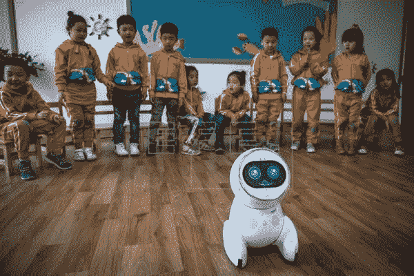
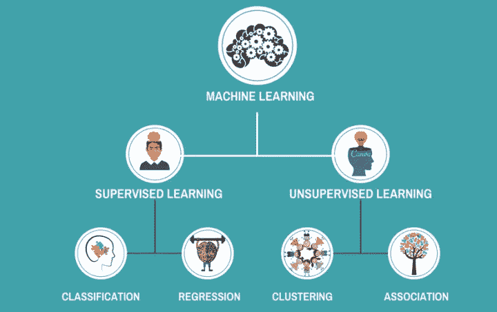
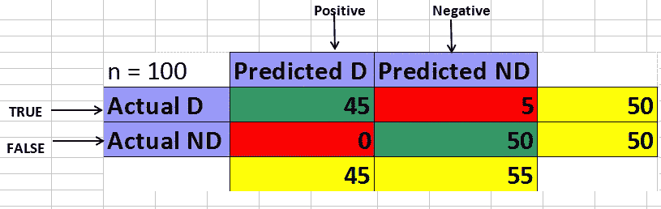

# 机器学习基础知识

> 原文：<https://towardsdatascience.com/the-abc-of-machine-learning-ea85685489ef?source=collection_archive---------4----------------------->

在投入机器学习之前，你需要知道的事情。

在过去的几年里，人们对机器学习重新产生了兴趣。这种复兴似乎是由强大的基本面驱动的——全球各地的传感器发出的大量数据，廉价的存储和有史以来最低的计算成本！

机器学习引起了技术人员对机器学习的浓厚兴趣。然而，在深入 ML 的海洋之前，这里有一些你应该熟悉的基本概念。把这个放在手边，因为在学习 ML 的时候你会经常碰到这些术语。

## **监督、非监督和半监督学习:**

## **监督学习:**

监督式学习顾名思义是指作为老师的监督人的存在。基本上，监督学习是一种学习，在这种学习中，我们使用标记良好的数据来教授或训练机器，这意味着数据已经标记了正确的答案。之后，向机器提供没有目标标签(期望输出)的新的一组示例(数据),并且机器通过应用其从历史训练数据的学习来预测新数据的输出。

在监督学习中，您有输入变量(x)和输出变量(Y ),并使用算法来学习从输入到输出的映射函数。

**Y = f(X)**

目标是很好地逼近映射函数，以便当您有新的输入数据(x)时，可以预测该数据的输出变量(Y)。

监督学习问题可以进一步分为回归和分类问题。

**分类**:一个分类问题是当输出变量是一个类别时，比如“红”或“蓝”或“病”和“没病”。

**回归**:一个回归问题是当输出变量是一个实值时，比如“工资”或者“价格”。

## **无监督学习:**

无监督学习是指只有输入数据(X)而没有相应的输出变量。

无监督学习的目标是对数据中的底层结构或分布进行建模，以便了解更多关于数据的信息。

这些被称为非监督学习，因为不像上面的监督学习，没有正确的答案，也没有老师。算法留给它们自己的设备去发现和呈现数据中有趣的结构。

无监督学习问题可以进一步分为聚类和关联问题。

**聚类**:聚类问题是你想要发现数据中的内在分组，比如按照购买行为对客户进行分组。

**关联**:关联规则学习问题是你想要发现描述大部分数据的规则，比如购买 X 的人也倾向于购买 y。

无监督学习算法的一些流行示例是:

聚类问题的 k-均值算法。

关联规则学习问题的 Apriori 算法。

## **半监督学习:**

你有大量输入数据(X)而只有部分数据被标记(Y)的问题，叫做半监督学习问题。

这些问题介于监督学习和非监督学习之间。

一个很好的例子是照片档案，其中只有一些图像被标记(例如狗、猫、人)，而大多数图像没有标记。

许多现实世界的机器学习问题都属于这一领域。这是因为标记数据既昂贵又耗时，因为这可能需要咨询领域专家。而无标签数据便宜且易于收集和存储。

您可以使用无监督学习技术来发现和学习输入变量中的结构。

您还可以使用监督学习技术对未标记的数据进行最佳猜测预测，将该数据作为训练数据反馈到监督学习算法中，并使用该模型对新的未知数据进行预测。

## **机器学习中的分类和连续特征:**

功能是用于分析基础表(ABT)中的列的术语。所有的特征都可以分类为绝对的或连续的。分类特征具有几个值中的一个，其中选项是类别(例如小于 50 或大于 50)、欺诈或非欺诈、信用卡违约或非违约等，而连续特征具有许多可能的值选项，例如人的工资、人的年龄、商品的价格、要给予的贷款金额等。

如果分类特征不是数字或字符串，则需要通过手动替换、 [*标签编码器或一个热编码器*](/choosing-the-right-encoding-method-label-vs-onehot-encoder-a4434493149b) 将其编码为数字表示，因为 ML 模型只能处理数字而不能处理字符串值

## **Scikit-learn:**

Scikit-learn 可能是 Python 中最有用的机器学习库。Scikit-learn 通过 Python 中的一致接口提供了一系列监督和非监督学习算法。Scikit-learn 附带了许多特性。把 Scikit-learn 当做机器学习的工具箱。这里有几个例子可以帮助你理解这种差异:

**监督学习算法:**想想你可能听说过的任何监督学习算法，它很有可能是 scikit-learn 的一部分。从广义线性模型(如线性回归)、支持向量机(SVM)、决策树到贝叶斯方法——所有这些都是 scikit-learn 工具箱的一部分。算法的传播是 scikit-learn 使用率高的一大原因。我开始使用 scikit 来解决监督学习问题，并向新接触 scikit /机器学习的人推荐它。

**交叉验证:**有多种方法可以检查监督模型对未知数据的准确性

**无监督学习算法:**又一次出现了大量的算法，从聚类、因子分析、主成分分析到无监督神经网络。

**各种玩具数据集:**这在学习 scikit-learn 时派上了用场(例如 IRIS 数据集、波士顿房价数据集)。在学习一个新的库的时候，把它们放在手边很有帮助。

**特征提取:**用于从图像、文本(如单词包)中提取特征

## **训练和测试数据集:**

## **训练数据集:**

训练数据集是我们用来训练 ML 模型的原始数据集的一部分。该模型通过运行算法来学习这些数据，并映射函数 F(x ),其中自变量(输入)中的“x”对应于“y ”,其中“y”是因变量(输出)。在数据集上训练我们的模型时，我们向我们的模型提供输入和输出变量，以便我们的模型能够学习基于输入数据预测输出。

## **测试数据:**

测试数据基本上是从原始数据集保留下来的验证集，它用于通过将模型的预测结果与测试数据集的实际结果进行比较来检查我们的模型的准确性。虽然我们知道测试数据是从原始数据集本身提取出来的，但是我们在测试时并没有向我们的模型提供输出变量。当模型根据对训练数据的学习给出其预测时，我们将预测结果与原始结果进行比较，以获得我们的模型对未知数据的准确性或性能的度量。

考虑一个例子，其中我们的原始数据集有 1000 行，我们的因变量是欺诈而不是欺诈，我们将在 70%的数据即 700 行上训练我们的模型，然后在 30%的数据即 300 行上测试我们的模型准确性。如上所述，在测试我们的模型时，我们不会为我们的模型提供测试数据的结果，尽管我们知道结果，并让我们的模型给出这 300 行的结果，稍后我们将比较我们的模型的结果与我们的测试数据的原始结果，以获得我们的模型预测的准确性。

**为了将我们的数据分割成训练和测试集，我们使用 scikit-learn 库的 train_test_split 方法**

## **混乱矩阵:**

混淆矩阵是分类模型做出的预测的正确性的度量。

顾名思义，混淆矩阵是模型做出的正确和不正确预测的矩阵表示。

考虑这样一个场景，我们预测这个人是患有“疾病”(事件)还是“没有疾病”(没有事件)。

混淆矩阵现在将基于 4 个术语

**正确预测事件值的正真值**。

**误报**为错误预测的事件值。

“**真阴性**”表示正确预测的无事件值。

“**假阴性**”表示预测错误的无事件值。

假设我们有 100 个测试数据，其中 50 个有**疾病(D)** 和 50 个**无疾病(ND)** ，我们的模型预测结果为 **45 疾病(D)** 和 **55 无疾病，在这种情况下，我们的混淆矩阵将为**

Confusion Matrix

**真阳性:45(正确预测的事件值，即左上角的绿色单元格)。**

**假阳性:0(没有事件值被预测为 0，即左下红细胞)**

**真阴性:50(正确预测无事件值，即右下角绿色单元格)**

**假阴性:5(事件值预测为无事件值，即右上红细胞)**

**绿色对角线代表正确预测，红色对角线代表错误预测，因此正确预测的总数为 45+50 = 95**

**而不正确的预测是 5+0 = 5**

## 准确度分数:

准确度分数也提供了对分类模型所做预测的准确度或正确性的测量，但是它在 0 到 1 的范围内，然后乘以 100 得到 0 到 100 之间的分数，该值越接近 1，模型越准确。

**准确度分数计算如下:**

**准确度得分=正确预测总数/做出的预测总数* 100**

**考虑到之前的场景准确度得分将=**

**95/100 * 100 = 0.95*100 = 95%**

**用于计算准确度分数的库是*sk learn . metrics . accuracy _ score***

## **平均绝对误差和均方根误差:**

虽然使用准确度分数和混淆矩阵可以很好地评估分类模型，但使用平均绝对误差和均方根误差评估回归模型，因为我们回归模型的目标是预测尽可能接近实际值的值。

MAE 和 RMSE 越接近 0，模型越准确。

## **平均绝对误差:**

它是作为绝对误差值的平均值来计算的，其中“绝对”意味着“使之为正”，以便将它们相加在一起。

**MAE =总和(abs(预测值-实际值)/总预测值**

**考虑一个例子；**

**实际值= [2，4，6，8]，预测值= [4，6，8，10】**

**MAE = ABS(4–2+6–4+8–6+10–8)/4 = 2**

**用于计算平均绝对误差的库是*sk learn . metrics . mean _ absolute _ error***

## **均方根误差:**

计算一组回归预测中的误差的另一种流行方法是使用均方根误差。

缩写为 RMSE，这种度量有时被称为均方误差或 MSE，从计算和名称中去掉根部分。

RMSE 的计算方法是实际结果和预测之间的平方差的平均值的平方根。

对每个误差求平方会强制这些值为正，而均方误差的平方根会将误差度量返回到原始单位进行比较。

**RMSE = sqrt(总和((预测值-实际值))/总预测值)**

**实际值= [2，4，6，8]，预测值= [4，6，8，10】**

**RMSE = sqrt((8)/4)= sqrt(64/4)= sqrt(16)= 4**

一旦你熟悉了上面的术语，并对 python 有了基本的了解，你就可以尝试一些简单的 ML 模型了。

如果这个博客已经帮你给了一些*****的掌声，那就把它分享给你的朋友吧。*****

*****—谢谢*****