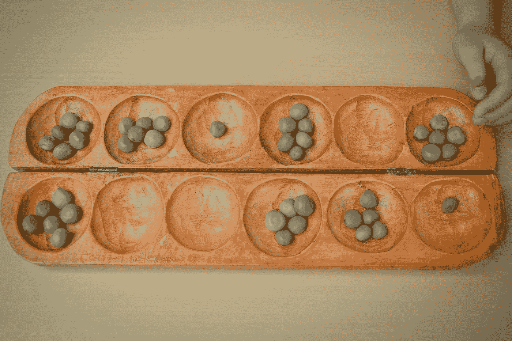
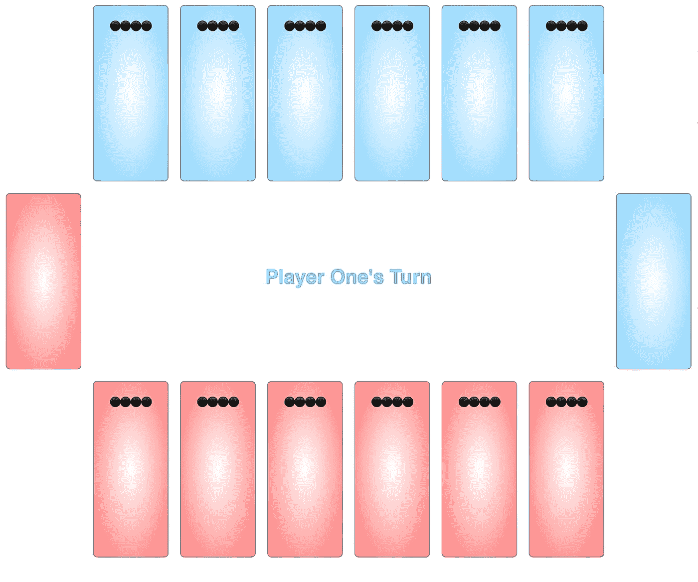
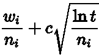
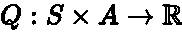
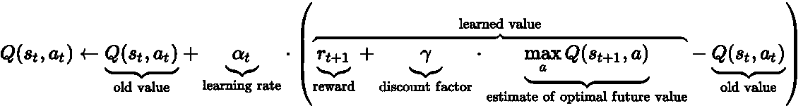
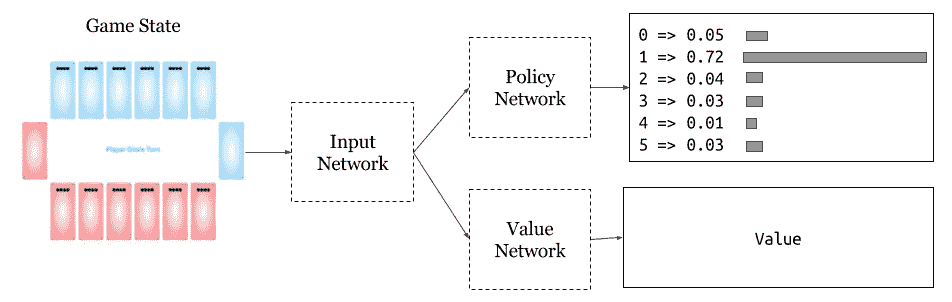
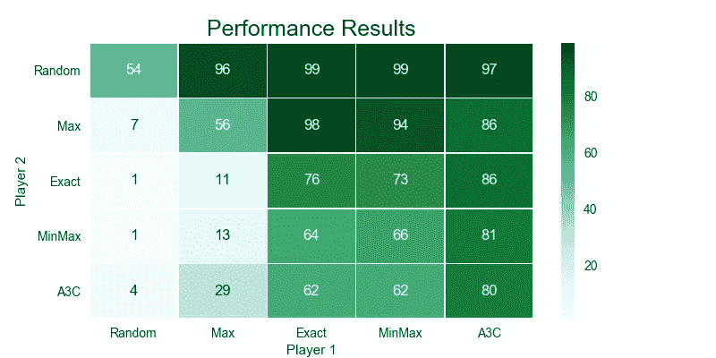

# 古代游戏与人工智能

> 原文：<https://towardsdatascience.com/the-ancient-game-and-the-ai-d7704bea280d?source=collection_archive---------1----------------------->

对于人工智能和人类来说，游戏都是极好的训练工具。让我们一步一步地了解如何编写游戏，训练人工智能机器人，并确定最有效的玩家。一路上，我们了解我们选择的游戏。

由[马特·达沃利奥](https://www.linkedin.com/in/matthewdavolio/) ( [GitHub](https://github.com/mdavolio) )和[埃里克·兰根博格](https://www.linkedin.com/in/eriklangenborg/) ( [GitHub](https://github.com/user01) )。

## 曼卡拉

出于我们的目的，我们将利用一个非常古老的游戏。

Mancala (Oware)

曼卡拉的起源可以追溯到 6 世纪。多年来，这项运动有了许多变化。本文将使用西方世界流行的 Oware 版本。

Mancala UI

曼卡拉游戏棋盘由 14 个盘子组成，其中两个是得分盘，另外 12 个在两个玩家之间平分。游戏开始时，在 12 个非得分的盘子中各放四颗石头。一个玩家从他们的六个包含石头的盘子中选择一个来移动。被选中的盘子里的石头都被捡起来，然后每颗石头被一次一颗地放入下一个顺时针运动的盘子里。可以在十二个非得分盘和当前玩家的得分盘中各放一块石头。对方的得分盘会被跳过。游戏在玩家之间交替进行。当一名玩家得分达到 25 分或更多时，游戏结束。

还应用了两个附加的通用规则。当一个玩家的移动导致最后一块石头被放入得分盘时，他们可以进行另一轮。如果满足两个条件，就会出现捕获规则:玩家在移动中掉落的最后一块石头落在当前玩家这边的空盘子中，并且在对手那边的相邻盘子中至少有一块石头。在这种情况下，当前玩家将获得最后一颗掉落的石头以及对手盘子中的所有石头。

## 游戏状态和动作

曼卡拉的棋盘由 14 个盘子组成，每个盘子可以包含任意数量的石头。这就形成了一个简单的*数组< int >* 表示的棋盘。该状态的唯一其他部分与当前玩家回合有关。单个*布尔*跟踪该信息。额外注意:这个状态是[马尔可夫](https://en.wikipedia.org/wiki/Markov_property):一个无记忆系统，其中所有相关信息都包含在当前状态中。

可行的行动是从 12 个可能收集石头的盘子中选择一个重新分配。在每一回合中，玩家只能在棋盘上自己的一边移动，限制在六个选项之内。此外，只能选择有石头的菜肴。

曼卡拉是一种以[完美信息](https://en.wikipedia.org/wiki/Perfect_information)为特色的游戏，比如井字游戏、国际象棋或围棋。因此，代理的状态视图总是完整的，并且他们被交给完整的游戏来做出决定。

# 代理人

代理只是一个在环境中做出选择的系统。本文将按照复杂性的大致顺序逐步介绍尝试的代理。提供的伪代码涵盖了要点，但是访问[主库](https://github.com/mdavolio/mancala)获得适当的细节。

## 随机代理

让我们检查一下基本系统:随机代理。

随机代理只是查看可用的选项并随机挑选。虽然不是很大的挑战，但这个相当于身份函数的人工智能可以作为一个很好的基线。在未来，任何代理的第一个问题是:它能打败随机机遇吗？

## 最大代理

由于曼卡拉缺少随机成分，任何一个动作的结果都可以被精确预测。最大值代理计算每一个可能的移动的分数，并选择具有最高收益的选择。这是一个专家代理，意味着逻辑来自人类书写的规则。

## 确切代理人

来自 Max 代理的增强利用了 Mancala 中的重复移动规则。通过支持不放弃回合的行动，该代理可以利用在回合中增加领先优势。精确代理搜索的第一个移动是任何移动，其中一个洞中的石头数量与玩家得分洞的距离匹配。这将允许玩家进行另一次移动。如果有一个以上的洞符合条件，将选择最靠近得分孔的洞。这允许球员多次使用这种情况，因为更远的握杆会超过更近的球洞。

如果没有符合条件的可能的移动，代理将退回到最高的可能得分。

## 最小最大代理

最小最大代理是[一种技术](https://en.wikipedia.org/wiki/Minimax)，它在一定深度探索可能的行动，并选择具有最大期望结果的路径。

代理遍历代表每个树深度的选择的大树。当模拟给予代理人控制权时，代理人将分数最大化，而当对手控制时，代理人将分数最小化。这个名字来源于这个模式。当显示游戏状态时，代理建立一个代表树，并播放为当前玩家产生最高分数的根节点。由于移动的次数随着深度的增加呈指数级增加，这个代理需要大量的开销。

Alpha-Beta Pruning Example [2]

[Alpha-beta 修剪](https://en.wikipedia.org/wiki/Alpha%E2%80%93beta_pruning)通过减少遍历树时搜索的分支数量来缓解这个问题。如果代理意识到路径不可能比先前观察到的选择执行得更好，则放弃对分支的评估。通过遍历，存储了两个变量:alpha，玩家在分支中保证的最高分，和 beta，对手保证的最低分。在最大化级别的遍历过程中(代理正在运行)，如果节点不增加 alpha，则修剪分支，代理继续运行。相反，在最小化级别上，如果 beta 不降低，则节点被放弃。对于我们选择的深度，观察到的性能提高大约是一个数量级。

## 蒙特卡罗树搜索代理

[蒙特卡罗树搜索](https://en.wikipedia.org/wiki/Monte_Carlo_tree_search) (MCTS)最近在双人游戏中成为一种流行的方法，这主要是由于 [AlphaGo](https://deepmind.com/research/alphago/) 机器人的成功，它作为一个组件包含在内。MCTS 是最小最大树搜索和阿尔法贝塔剪枝的进步。

代理构建了一个类似的最小最大树，但是一旦达到深度，代理随机地完成游戏并记录输赢。实际上，MCTS 用随机的输赢结果代替了最小最大值的适应度函数。经过多次迭代后，最终结果对有利路径的评分更高。由于游戏的大状态空间，代理需要大量的迭代来调查足够的可用移动，即使在浅的深度。

Kocsis and Szepesvári’s score for selecting nodes [3]

在这些迭代中，记录每个可能节点的分数，以将所选节点的值制成表格。随着每次迭代的执行，代理通过树反向传播结果以更新节点分数。

## q 学习代理

Q 学习是一种强化学习方法，用于估计每个状态的动作值(Q)。实际价值来源于设计者如何构建奖励。除了提取状态的典型任务(通常比这个曼卡拉例子更复杂)，设计者还必须选择系统何时奖励代理以及奖励多少。一个简单的策略可能是对感知到的有利位置进行奖励，而不是最终想要的结果。然而，大多数情况下，让代理学习并在达到最终目标时给予奖励是有益的。对曼卡拉来说，目标是赢得比赛。

Q Values — Value of Actions given current state. [1]

简而言之，Q 函数估计代理人在给定状态下期望从一个行为中获得多少回报。

有多种方法可以发现系统的 Q 值，例如 [SARSA(状态-行动-奖励-状态-行动)](https://en.wikipedia.org/wiki/State-Action-Reward-State-Action)。通过遍历状态、动作和下一个状态，代理不断更新对奖励的估计。对一个国家的一些访问可能会基于代理人或环境(在曼卡拉的例子中，环境是规则和对手代理人的组合)的后续行动而导致不同的回报。因此，在 Q 函数收敛于正确的奖励值之前，需要多次通过。

Example Updating Q Values — [1]

但是许多应用程序都受到这些方法的影响，因为状态/动作空间非常大。对曼卡拉可能的状态的粗略估计是上限为 12⁴⁸ (12 个可玩的盘子，48 个可用的石头)≈10⁵⁰——这太多了，无法探究。有几种方法可以避开这个问题，下面详细介绍一些更成功的版本。

曼卡拉的基本 Q 学习尝试包括通过逼近每个盘子里的石头来压缩状态空间。注意盘子是否是空的将状态空间减少到 12，只有 4096 种可能的状态，很容易探索。结果很糟糕:这种国家表述太不精确了。这种状态表示法忽略了太多的细节。类似的分解状态的方法失败了，并再次将所需的探索路径的数量推到合理的计算之外。

## 深度 Q 学习代理

[深度 Q 学习](https://arxiv.org/abs/1312.5602)是一种流行的技术，利用强化 Q 学习和深度神经网络来表示估计的动作值(Q)，消除了状态/动作表。流程大体相同，但进行了重组，以最大限度地提高网络效率。 *<状态、动作、状态 _ 下一个、奖励>* 的体验重放存储器被不断更新和采样，以便训练网络。

常见的技术包括使用卷积神经网络(CNN)来分析作为状态输入的原始帧。一个小的 CNN 被训练成以 6x2 灰度图像的形式抓住板上的图案。

## 异步优势行动者-批评家代理

[A3C](https://arxiv.org/abs/1602.01783) 代理是一种策略评估方法，它运行并行代理，而不是经验重放。三个网络协同工作:输入、行动和批评。输入网络将状态转换到嵌入空间，策略网络给出可用移动的概率分布，价值网络描述当前状态的回报。

A3C Networks

[多个代理同时](https://openreview.net/pdf?id=Hk3mPK5gg)使用这个共享模型运行游戏，并根据行动的回报结果更新策略和价值网络。除了随着每个额外的线程更新模型而线性加速之外，不同的游戏不太可能收敛到相似的最小值(正常的演员-评论家方法的常见问题)。

# 结果

特工们对比了一个简单的流程:玩曼卡拉！

代理人的每一个组合都被测试了 500 场游戏，每一场游戏都以不同的种子开始，以允许随机因素达到平衡。特工们甚至自己打自己。为了简洁起见，省略了一些表现不佳的代理。

Values are % of wins for Player 1 vs Player 2

代理性能大致符合复杂性:随机代理最差，A3C 代理最好。专家代理在对抗不太专业的代理时比 RL A3C 代理表现得更好，而 A3C 代理避开了最好的专家代理。

请注意，代理人相对于他们自己的对角线总是倾向于第一个玩家——曼卡拉拥有非常强大的先发优势。MinMax 作为第一玩家赢了 62%对 A3C 的比赛，但作为第二玩家只赢了 19%。假设他们交易先发优势，A3C 将赢得 71.5%的比赛。最先进的强化学习技术表现良好。

这并没有贬低专家代理:这些竞争，既不需要昂贵的培训，也不需要装载大型模型。精确代理只需要几行代码，是完成计算最快的代理之一。相比之下，当搜索更大的深度时，MinMax 很容易变得不可行，而 A3C 需要加载模型(需要 GPU 和相关的库)。对于大多数人类玩家来说，Exact 是一个可怕的对手，并且不需要太多的依赖。

建于弗吉尼亚大学的[数据科学研究所。](https://dsi.virginia.edu/)

参见 [GitHub](https://github.com/mdavolio/mancala) 上的代码。

由[马特·达沃利奥](https://www.linkedin.com/in/matthewdavolio/) ( [GitHub](https://github.com/mdavolio) )和[埃里克·兰根博格](https://www.linkedin.com/in/eriklangenborg/) ( [GitHub](https://github.com/user01) )。

## 参考

[1][https://en.wikipedia.org/wiki/Q-learning](https://en.wikipedia.org/wiki/Q-learning)

[2][https://en.wikipedia.org/wiki/Alpha%E2%80%93beta_pruning](https://en.wikipedia.org/wiki/Alpha%E2%80%93beta_pruning)

[3][https://en.wikipedia.org/wiki/Monte_Carlo_tree_search](https://en.wikipedia.org/wiki/Monte_Carlo_tree_search)