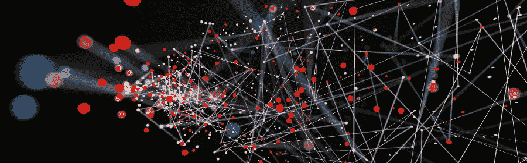
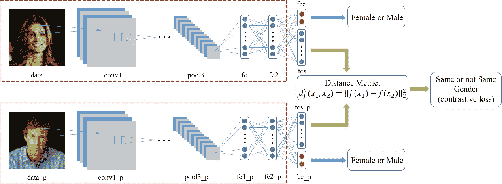

# 人工智能的建筑师——深度学习

> 原文：<https://towardsdatascience.com/the-architect-of-artificial-intelligence-deep-learning-226ac69ab27a?source=collection_archive---------10----------------------->

人工智能是十年来最显著的进步之一。人们正在从显式软件开发转向构建基于人工智能的模型，企业现在依赖于数据驱动的决策，而不是人工定义规则。一切都在变成人工智能，从人工智能聊天机器人到自动驾驶汽车，从语音识别到语言翻译，从机器人到医学。然而，人工智能对研究人员来说并不是什么新鲜事物。它在 90 年代之前就已经存在了。但是是什么让它如此流行并向世界开放呢？？

我已经从事人工智能和数据科学工作近两年了，并且已经围绕许多所谓的最先进的人工智能系统工作，如生成聊天机器人、语音识别、语言翻译、文本分类、对象识别、年龄和表情识别等。因此，在人工智能领域呆了两年之后，我相信在这场人工智能热潮背后只有一项主要技术(或者随便你怎么称呼它)，即**深度学习**。

这是我的入门博客，我不会深入研究深度学习和神经网络的技术细节(将在即将到来的博客中谈论我的工作)，但与你分享为什么我认为深度学习正在接管其他传统方法。如果你对深度学习和人工智能不感兴趣，让我用简单的非技术性的语言解释给你听。想象一下，你必须建立一种方法来将电子邮件分类，如社交邮件、促销邮件或垃圾邮件，这是谷歌为你的 Gmail 收件箱做的主要人工智能任务之一！你会怎么做来实现这个目标？也许你可以列一个单词列表，在电子邮件中查找，如“广告”、“订阅”、“时事通讯”等，然后编写一个简单的字符串匹配正则表达式，在电子邮件中查找这些单词，如果找到这些单词，就将它们分类为促销或垃圾邮件。但这里的问题是，你能通过这种方式抓住多少关键词，或者你能为此手动编写多少规则？你知道互联网上的内容是交叉折叠的，每天都会有新的关键词出现。因此，这种基于关键词的方法不会给你带来好的结果。

现在，如果你仔细想想，你有一台比你快一百万倍的计算机可以进行关键字匹配。因此，与其使用你强大的计算设备来进行简单的字符串匹配，为什么不让计算机来决定分类规则呢！我的意思是，计算机可以处理成千上万的数据，并在你能想到 5 个这样的规则的时间内，为这项任务提出更精确的规则。

这就是深度学习！而不是你明确地设计你认为可以解决问题的规则和条件(比如简单的 if-else，制作关键字字典等等)。)，深度学习致力于赋予计算机产生特定规则的能力，计算机可以使用这些规则来解决问题。这意味着它是一个端到端的架构。您将数据作为输入提供给网络，并告知每个数据点的期望输出。然后，网络仔细检查数据，并相应地更新规则，以找到一组优化的规则。

这种决策能力一般仅限于我们人类，对吧？这就是人工神经网络(或简称神经网络)发挥作用的地方。这些是一组分层排列的节点，通过权重(不过是数字矩阵)连接，就像我们大脑中的神经元连接一样。同样，我不会进入架构的技术细节，它们的学习算法和背后的数学，但这是深度学习模仿大脑学习过程的方式。

让我们再举一个例子，假设你要识别一幅图像中的人脸，它可以位于图像中的任何位置。你会怎么做？一个显而易见的方法是在整个人脸上定义一组关键点，这些关键点一起可以表征人脸。一般来说，这些是 128 或 68 套。这些点相互连接形成一个图像掩模。但是如果脸部的朝向从正面变成侧面呢？？帮助这些点识别面部的面部几何形状发生变化，因此，关键点方法将检测不到面部。

68 key points of human face, Image taken from [www.pyimagesearch.com](http://www.pyimagesearch.com)

深度学习也让这成为可能！我们使用的关键点是基于人类对面部特征(如鼻子、耳朵、眼睛)的感知。因此，为了检测一张脸，我们试图让计算机在一张图像中找到这些特征。但是你猜怎么着，这些手动选择的特性对计算机来说并不那么明显。深度学习让计算机遍历大量的人脸(包含各种扭曲和方向)，并让计算机决定哪些特征图似乎与计算机的人脸检测相关。毕竟电脑要识别的是脸，不是你！这给出了令人惊讶的好结果。你可以通过我的一个项目 [**这里**](https://github.com/saransh-mehta/Face_expression_Recognizer_CNN) 我用 ConvNets(一种深度学习架构)来识别面部表情。

拥有大量人脸数据集来识别人脸可能会给你带来问题。但是像**暹罗网**这样的一次性学习方法也解决了这个问题。这是一种基于称为**对比三重损失**的特殊损失函数的方法，并在 FaceNet 论文中进行了介绍。这个我就不在这里讨论了。如果你想了解它，你可以在这里 查阅论文[。](https://arxiv.org/abs/1503.03832)

Siamese Network for Gender Detection, Image taken from [www.semanticscholar.org](http://www.semanticscholar.org)

关于深度学习的另一个神话是，深度学习是一个黑盒。架构背后没有工程和数学方面的特征。因此，它只是简单地复制数据，而没有真正为问题提供可靠的长期解决方案。
不，不像！它以类似于传统机器学习方法的方式涉及数学和概率，无论是简单的线性回归还是支持向量机。深度学习使用与线性回归相同的梯度下降方程来寻找优化的参数值。成本函数、假设、从目标值的误差计算(损失)都以与传统算法(基于等式)相似的方式完成。深网中的激活函数不过是数学函数。一旦你理解了深度学习的每个数学方面，你就可以弄清楚如何为特定任务建立模型，以及需要做什么样的改变。只是深度学习中涉及的数学证明并不复杂。但是如果你得到了正确的概念，它就不再是一个黑匣子了！事实上，这适用于世界上所有的算法。

据我所知，我已经完成了它背后的所有数学。从简单的感知器开始，神经元的标准 Wx+b 方程和反向传播到现代架构，如 CNN、LSTM、编码器-解码器、Sequence2Sequence 等。

这个博客的目的是在机器学习和人工智能领域为深度学习创造更多的接受度。这也是我没有讲深度学习架构、代码、张量流的原因。基于人工智能开展业务的公司需要支持深度学习以及传统的机器学习方法。在我即将发布的博客中，我将谈论我做的一些很酷的项目，可能是生成聊天机器人，也可能是神经机器翻译。如果你也对人工智能感兴趣，请在博客上告诉我你的看法！