# A/B 测试艺术

> 原文：<https://towardsdatascience.com/the-art-of-a-b-testing-5a10c9bb70a4?source=collection_archive---------2----------------------->

## 走过统计意义的美丽数学

*A/B 测试，又名。分割测试，指的是一种实验技术，根据选定的标准来确定新的设计是否带来改进。*

*在网络分析中，想法是用一个新的网站(B)挑战一个现有的网站(A ),通过随机分割流量并比较每个分割的指标。*

Exchanging on interface layouts

为了举例，让我们看看美容公司丝芙兰东南亚(丝芙兰海，我工作的地方)，特别是它的电子商务平台。

# 使用案例

让我们假设 Sephora SEA 正在考虑为其黄金会员重新安排登陆页面。

Landing pages pane arrangement: version A (current) and version B (alternative to be tested)

对公司至关重要的指标是:

*   每次会话花费在登录页面上的平均时间
*   转换率，定义为以交易结束的会话比例

A/B 测试可用于挑战当前的安排。

请注意，如果您担心版本 b 造成的损失，您可以选择流量分割，而不是 50-50，并将更多流量分配给版本 A。

然而，请记住，非常偏斜的分割通常会导致 A/B 测试变得*(统计)* *显著*之前需要更长的时间。

# A/B 测试作为唯一的最终测试

在网站上开发新功能的问题是，你很难事先知道这些功能会如何发挥作用:它们可能会损害你的业务或让你的利润飙升。

用户体验(UX)设计师的知识对于挑选可能有效的功能建议至关重要。它通常会遵循 UX 的最佳做法或在其他类似情况下被证明是成功的设计范例。

然而，没有任何先验假设可以打败真正的现场测试，即 A/B 测试。

A/B 测试使用真实的客户端实时测量性能。如果执行得很好，在对人口 A 和 B 进行抽样时没有偏见，它会给你最好的估计，如果你部署版本 B 会发生什么。

# 需要统计形式主义

在做了一些预先的市场研究后，Sephora SEA 决定对 B 版进行现场测试，流量分配如下:

让我们假设在 7 天的 A/B 测试之后，实验的跟踪指标是

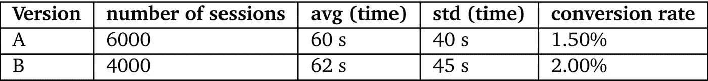

仅从这些结果来看，就产生了一些问题:

*   因为 B 版展现出更高的 CR，是否意味着 B 版带来了提升？同样，我们能得出对平均花费时间的影响吗？
*   如果是，有多大的把握？
*   B 版更高的 CR/更高的平均花费时间是偶然发生的吗？

在下结论之前，你需要记住的是

> 我们得到的原始结果只是更大群体的样本。它们的统计特性随着它们所属人群的不同而不同。

因此，有必要对这些输出进行统计建模。在*假设检验*中引入*统计显著性*的概念也是如此。

# 假设检验入门

关于假设检验的深入解释，我推荐威廉·科尔森的这篇伟大的[文章](/statistical-significance-hypothesis-testing-the-normal-curve-and-p-values-93274fa32687)。

 [## 解释统计显著性

### 用数据证明一件事是什么意思？

towardsdatascience.com](/statistical-significance-hypothesis-testing-the-normal-curve-and-p-values-93274fa32687) 

对于那些想快速复习统计学的人来说，你可能想看看这篇来自 Cassie Kozyrkov 的文章。

 [## 为赶时间的人统计

### 曾经希望有人能告诉你统计学的意义是什么，术语用简单的英语表达是什么意思吗？让…

towardsdatascience.com](/statistics-for-people-in-a-hurry-a9613c0ed0b) 

在这里，我将介绍假设检验的主要内容:一个**工具，用于根据样本比较**两个群体的分布。

可以比较的是它们分布的参数(*例如*花费时间的平均值)或分布本身(*例如*转化率的二元分布)。

这个过程开始于陈述一个关于人口的*无效假设* ***H₀*** 。总的来说就是*相等假设* : *例如*“两个种群均值相同”。

*备择假设* ***H₁*** 否定零假设:*例如*“第二总体的均值高于第一总体”。

测试可以总结为两个步骤:

*   **1。**模型 ***H₀*** 为单个实值随机变量上的分布(称为*检验统计量*
*   **2。**评估这些样本，或者更极端的样本，在 ***H₀.下产生的可能性有多大*** 这个概率就是著名的 *p 值。越低，我们越有信心拒绝 H₀.*

在上述帖子中，[williamkoersshen](https://towardsdatascience.com/@williamkoehrsen)测试大学的平均睡眠时间是否低于全国平均水平，从而将估计值与理论值进行比较。他用一个 T2 Z 测试来达到这个目的。

在这里，我建议将该框架扩展到 Sephora SEA 案例中的 A/B 测试。

**特别是，我将展示:**

*   如何将 Z 测试应用于测试经历 B 的客户端是否平均花费更多时间
*   如何使用卡方检验决定 B 版本是否导致更高的转化率
*   如何调整 Z 检验以测试 B 版本的转换率，以及它是否得出与卡方检验相同的结论

Let’s get testing!

# 1 | Z-平均花费时间测试

要测试的假设是:

*   ***H₀*** :“两个版本平均花费的时间相同”
*   ***h₁***:“b 版平均花费时间较高”

## 第一步是塑造 ***H₀***

Z 检验使用中心极限定理(CLT)这样做。

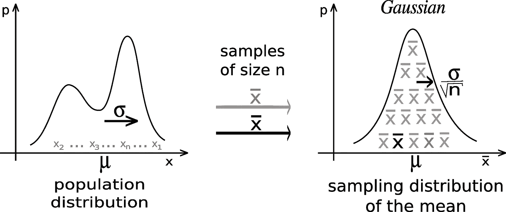

Illustration of the CLT (from [Wikipedia](https://en.wikipedia.org/wiki/Central_limit_theorem))

> CLT 确定:
> 给定期望的随机变量**x***μ*和有限方差 **σ** *、* **{x₁,…,xn}∼x***、****n*****独立同分布(iid) rv，如下**近似值******

***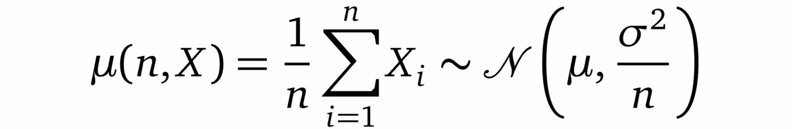***

***在我们的上下文中，我们将花费在每个客户端会话 ***i*** 上的时间建模为实现:***

*   *****t49】aᵢ的**RV**的*aᵢ∨a、*的**如果客户端会话属于版本 a 分裂***
*   ******bᵢ的***RV 的 ***Bᵢ的∨b、*** 别的***

***我们用 CLT 提供的近似值推导出***

***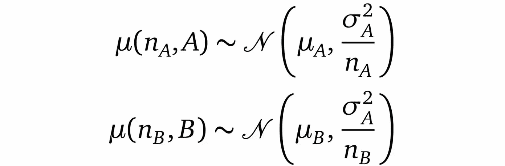***

***因此，rv 的近似值的差异([维基百科:总和的正态分布 rv](https://en.wikipedia.org/wiki/Sum_of_normally_distributed_random_variables) )，***

***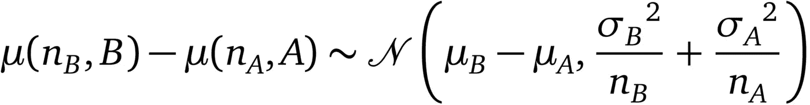***

> ***在 ***H₀、*** 我们有平等的真正手段和因此的模式***

**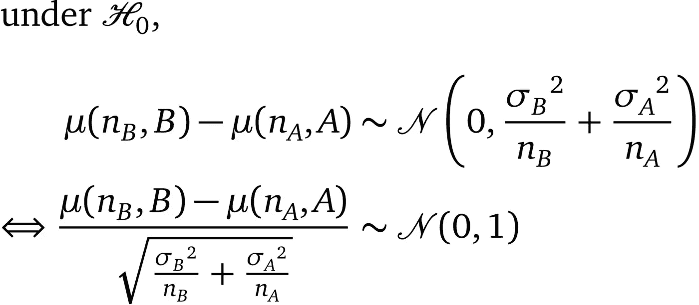****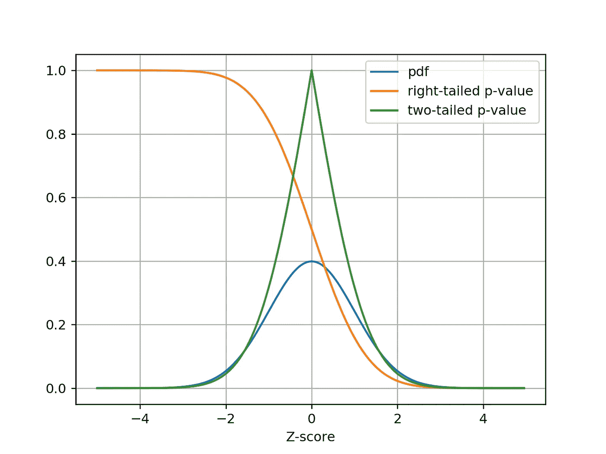**

**Curves about N(0,1): centrered and reduced Gaussian distribution, probability density function (pdf) and associated p-values**

## **第二步是看我们的样品在 H₀下的可能性有多大**

*****A*** 和 ***B*** 的真实期望值和方差未知。我们介绍它们各自的经验估计量:**

**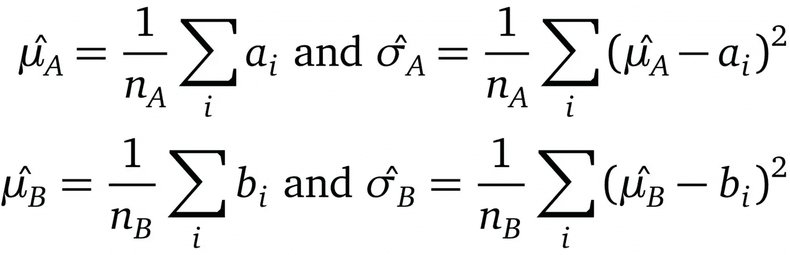**

**我们的样本生成了以下测试统计量 ***Z*** ，需要针对简化的中心正态分布进行测试:**

****

**从概念上讲， ***Z*** 代表观察到的均值差远离 0 的标准差的个数。这个数字越高， ***H₀*** 的可能性越小。**

**还要注意，在这种情况下估计的期望值实际上是不同的，(samples)↗， ***Z*** ↗.**

**从 ***Z*** 的公式中，还可以得到要证明的差越小，需要的样本越多的直觉。**

**在 Python 中，计算如下**

**p-value calculation and graphical representation**

**像我们观察到的这样极端的结果很有可能发生在 H₀.时代 有了 5%的常用标准 ***α*** ，我们就可以放心地拒绝*p value*<***α***和*【h₀*。**

***在样本量不大(<每版 30 个)，CLT 近似不成立的情况下，可以看看* [*学生的 t 检验*](https://en.wikipedia.org/wiki/Student%27s_t-test) *。***

# **2 |转化率的χ检验**

**要检验的假设有:**

*   *****H₀*** :“两个版本的转换率相同”**
*   *****h₁***:“b 版转化率更高”**

**与前一种情况不同，每个客户端会话的结果不是连续的，而是二进制的:“未转换”或“已转换”。**

**观察到的结果总结如下**

**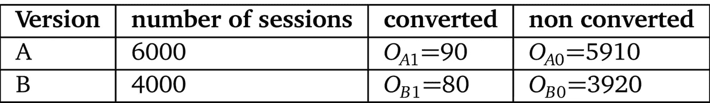**

**χ检验比较了多项结果的分布，但是在这个例子中我们将保持二元的情况。**

**和以前一样，我们将分两步解决这个问题:**

## **第一步是模拟 H₀**

**在 ***H₀中，版本 a 和版本 b 中的*** 转换遵循相同的二项分布 ***B(1，p)*** 。我们汇总了版本 A 和版本 B 中的观测值，并导出了 CR 的估计量**

****

**并得到`\hat{p} = 0.0170`**

**由此可见， ***下的 H₀，*** 下的理论结果表是**

****

**让我们看看 rv D，定义为**

**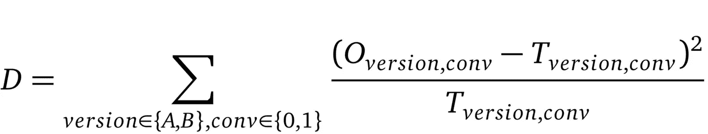**

*****D*** 表示理论分布和观测分布之间的平方相对距离。**

**根据[皮尔逊定理](https://ocw.mit.edu/courses/mathematics/18-443-statistics-for-applications-fall-2003/lecture-notes/lec23.pdf)，在 ***下 H₀*** ， ***D*** 遵循 1 自由度(df)的χ概率定律。**

**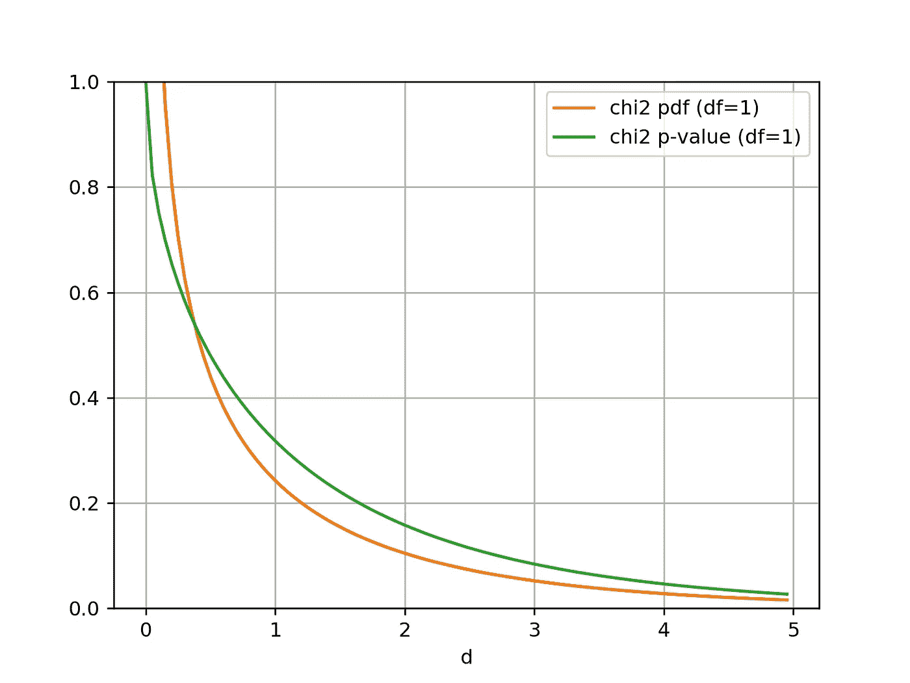**

**Curves about the χ² law (df=1)**

## **第二步是看我们的样品在 H₀下的可能性有多大**

**它包括计算观察到的 ***D*** 并根据χ定律导出其相应的 p 值。**

**这是如何在 Python 中实现的:**

**p-value calculation and graphical representation**

**在 H₀.的情况下，一个结果有可能至少和我们的观察一样远离理论分布 用一个常见的常用词***α***5%的准则，我们有*p value>****α***和***【h₀***不能拒绝。**

# **3 |转换率的 Z 测试**

**通过将转换率建模为以{0，1}为单位实现的 rv，Z 测试可适用于转换率:**

*   **1 表示转换**
*   **0 其他**

**我们保留与之前相同的符号，并将每个客户端会话 ***i*** 的模型转换作为实现:**

*   ***∈{ 0，1 }*RV***aᵢ【a】，*** 如果客户端会话属于版本 a 拆分****
*   ******bᵢ*** ∈ {0，1 }*RV***bᵢ【b】，*** 其他****

## ***第一步是模拟 H₀***

***在 H₀的 ***下，μ(A) = μ(B)*** 和我们有***

***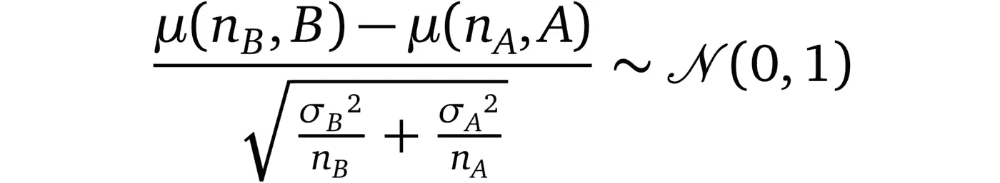***

***相应的测试统计***

******

***这一次，使用二元 rvs，可以证明标准差的估计值是期望值的函数:***

******

## ***第二步是看我们的样品在 H₀下的可能性有多大***

***为此，我们计算 Z 得分和相应的右尾 p 值:***

***p-value calculation and graphical representation***

***使用这种建模，p 值输出略低于χ检验。用同样的 ***α*** =0.05 的准则，我们早就拒绝了零假设(！！！).***

***这种差异可以用 Z-检验的一个轻微弱点来解释，它在这里不承认 rv 的二元性质:***【μ(B)】-μ(A)***实际上在 ***[-1，1】***中有界，因此观察结果被归因于较低的 p 值。***

# ***总是质疑你的测试***

***永远不要做假设。在决定新特性的相关性时，A/B 测试确实是减少人为偏见的好方法。然而，不要忘记 A/B 测试仍然依赖于一个真实的模型:正如我们已经看到的，有不同的可能模型。***

***在大样本的情况下，他们倾向于得出相似的结论。特别是，CLT 近似比小样本情况下更好。***

***在后一种情况下，人们可以探索[学生的 t 检验](https://en.wikipedia.org/wiki/Student%27s_t-test)、[韦尔奇的 t 检验](https://en.wikipedia.org/wiki/Welch%27s_t-test)和[费希尔的精确检验](https://en.wikipedia.org/wiki/Fisher%27s_exact_test)。你也可以探索[强化学习](/reinforcement-learning-64730aaa46c9)的领域，以便在测试时获得最大收益(多臂强盗和开发与探索的两难境地)。***

***你不仅要严格解释结果，还要意识到 A/B 测试的背景效应:***

*   ***一年/一月/一周的时间、天气、经济环境都会影响你的听众的性质***
*   ***即使在两天的 A/B 测试后，你的结果是显著的，也可能不会超过一周***

## ***主要带回家的信息***

*   ***假设检验是对一个零假设 ***H₀*** 进行建模，并评估它的可能性，给定你从 A/B 检验中得到的样本***
*   ***关键是在 ***H₀*** 模型中我们已经看到，它可以从 CLT (Z 检验)或皮尔逊定理(χ检验)中推导出来***

*****我们的统计之旅到此结束:我希望你能像我写这篇文章一样享受这次旅程！非常感谢您的评论、建议和更正。*****

****演职员表:
照片由*[*raw pixel*](https://unsplash.com/@rawpixel?utm_source=medium&utm_medium=referral)和 [*路易·里德*](https://unsplash.com/@_louisreed?utm_source=medium&utm_medium=referral)*****