# 多维数据的有效可视化艺术

> 原文：<https://towardsdatascience.com/the-art-of-effective-visualization-of-multi-dimensional-data-6c7202990c57?source=collection_archive---------0----------------------->

## 有效数据可视化的策略


Image via [Pixy](https://pixy.org/54943/)

# 介绍

[*描述性分析*](https://www.gartner.com/it-glossary/descriptive-analytics/) 是与数据科学项目甚至特定研究相关的任何分析生命周期的核心组件之一。数据聚合、汇总和*可视化*是支持这一数据分析领域的一些主要支柱。从传统的 [*商业智能*](https://en.wikipedia.org/wiki/Business_intelligence) 时代到现在的 [*时代，人工智能*](https://en.wikipedia.org/wiki/Artificial_intelligence) 、 [*数据可视化*](https://en.wikipedia.org/wiki/Data_visualization) 一直是一种强大的工具，并因其在提取正确信息、清晰轻松地理解和解释结果方面的有效性而被组织广泛采用。然而，处理通常具有两个以上属性的多维数据集开始产生问题，因为我们的数据分析和通信媒介通常局限于二维。在本文中，我们将探讨一些有效的多维数据可视化策略(从 ***一维*** 到*)。*

# *动机*

> *[**一张图片胜过千言万语**](https://en.wikipedia.org/wiki/A_picture_is_worth_a_thousand_words)*

*这是一个非常流行的英语习语，我们都很熟悉，应该为我们理解和利用数据可视化作为我们分析中的有效工具提供足够的灵感和动力。永远记住*“有效的数据可视化既是一门艺术，也是一门科学”。*在开始之前，我还想提一下下面这段话，这段话非常贴切，强调了数据可视化的必要性。*

> *一张照片最大的价值是当它迫使我们注意到我们从没想到会看到的东西*
> 
> *约翰·图基*

# *可视化的快速复习*

*我假设普通读者知道用于绘制和可视化数据的基本图形和图表，因此我不会进行详细的解释，但我们将在这里的动手实验中涵盖其中的大部分。正如著名的可视化先驱和统计学家[爱德华·塔夫特](https://en.wikipedia.org/wiki/Edward_Tufte)所提到的，数据可视化应该在数据之上利用*“清晰、精确和高效”来交流模式和见解。**

*结构化数据通常由行表示的数据观察和列表示的特征或数据属性组成。每个列也可以作为数据集的一个特定维度来调用。最常见的数据类型包括连续的数值数据和离散的分类数据。因此，任何数据可视化基本上都是以易于理解的方式描述一个或多个数据属性，如散点图、直方图、箱线图等。我将涵盖*(一维)和 ***多变量*** (多维)数据可视化策略。我们将在这里使用 Python 机器学习生态系统，我们建议您查看用于数据分析和可视化的框架，包括`[pandas](https://pandas.pydata.org/)`、`[matplotlib](https://matplotlib.org/)`、`[seaborn](https://seaborn.pydata.org/)`、`[plotly](https://plot.ly/)`和`[bokeh](https://bokeh.pydata.org/en/latest/)`。除此之外，如果你对用数据制作美丽而有意义的可视化感兴趣，了解`[D3.js](https://d3js.org/)`也是必须的。有兴趣的读者推荐阅读[](https://www.edwardtufte.com/tufte/books_vdqi)**爱德华·塔夫特*的《量化信息的可视化展示》。***

# **空谈是廉价的，让我看看可视化(和代码)！**

**让我们开始工作吧，不要让我在理论和概念上喋喋不休。我们将使用可从 [UCI 机器学习库](https://archive.ics.uci.edu/ml/index.php)获得的 [**葡萄酒质量数据集**](https://archive.ics.uci.edu/ml/datasets/wine+quality) 。该数据实际上由两个数据集组成，描述了葡萄牙*“Vinho Verde”*葡萄酒的红色和白色变种的各种属性。本文中的所有分析都可以在我的 [**GitHub 资源库**](https://github.com/dipanjanS/practical-machine-learning-with-python/tree/master/bonus%20content/effective%20data%20visualization) 中找到，作为一个 [Jupyter 笔记本](https://github.com/dipanjanS/practical-machine-learning-with-python/tree/master/bonus%20content/effective%20data%20visualization)供那些渴望亲自尝试的人使用！**

**我们将从加载以下分析所需的依赖项开始。**

```
****import pandas as pd
import matplotlib.pyplot as plt
from mpl_toolkits.mplot3d import Axes3D
import matplotlib as mpl
import numpy as np
import seaborn as sns****%matplotlib inline****
```

**我们将主要使用`**matplotlib**` 和`**seaborn**` 作为我们的可视化框架，但是您可以自由地使用您选择的任何其他框架进行测试。我们先来看看经过一些基本的数据预处理步骤后的数据。**

**我们通过合并红葡萄酒和白葡萄酒样本的数据集来创建一个单一的葡萄酒数据框架。我们还基于葡萄酒样本的`**quality**`属性创建了一个新的分类变量`**quality_label**` 。现在让我们来看一下数据。**

```
****wines.head()****
```

**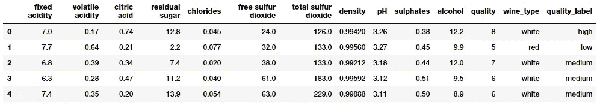**

**The wine quality dataset**

**很明显，我们有几个葡萄酒样品的数字和分类属性。每个观察值属于一个红葡萄酒或白葡萄酒样品，属性是从物理化学测试中测量和获得的特定属性或特性。如果你想了解每个属性的详细解释，你可以查看 Jupyter 笔记本。让我们对其中一些感兴趣的属性做一个快速的基本描述性汇总统计。**

**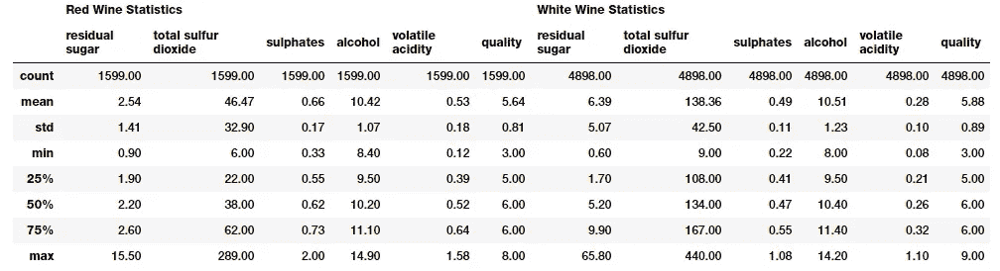**

**Basic descriptive statistics by wine type**

**对不同类型的葡萄酒样本进行对比和比较这些统计数据是非常容易的。请注意一些属性的明显差异。我们将在以后的一些可视化中强调这些。**

# **单变量分析**

**单变量分析基本上是最简单的数据分析或可视化形式，我们只关心分析一个数据属性或变量，并将其可视化(一维)。**

## **一维可视化数据(1-D)**

**可视化所有数字数据及其分布的最快和最有效的方法之一是使用`pandas`来利用 ***直方图*****

****

**Visualizing attributes as one-dimensional data**

**上面的图很好地说明了任何属性的基本数据分布。**

**让我们深入到 ***可视化一个连续的数字属性。*** 本质上是一个 ***直方图*** 或 ***密度图*** 在理解该属性的数据分布方面非常有效。**

**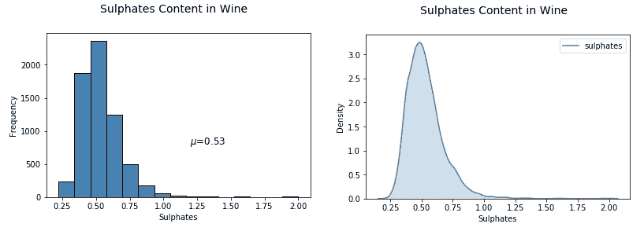**

**Visualizing one-dimensional continuous, numeric data**

**从上面的图中可以明显看出，葡萄酒`sulphates`的分布存在明显的右偏。**

*****可视化一个离散的、分类的数据属性*** 略有不同，而 ***条形图*** 也是最有效的方法之一。你也可以使用*饼状图，但是一般来说要尽量避免使用它们，尤其是当不同类别的数量超过三个的时候。***

***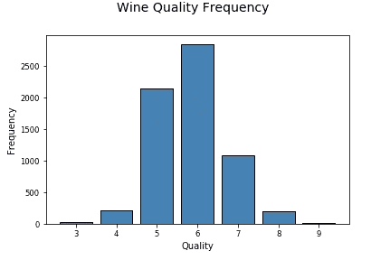***

***Visualizing one-dimensional discrete, categorical data***

***现在让我们继续看更高维度的数据。***

# ***多变量分析***

***多元分析是乐趣和复杂性的开始。这里我们分析多个数据维度或属性(2 个或更多)。多变量分析不仅包括检查分布，还包括这些属性之间的潜在关系、模式和相关性。如果需要，您还可以根据手头要解决的问题，利用推断统计和假设检验来检查不同属性、组等的统计显著性。***

## ***以二维方式可视化数据(2-D)***

***检查不同数据属性之间的潜在关系或相关性的最佳方式之一是利用 ***成对相关矩阵*** 并将其描绘为 ***热图*** 。***

**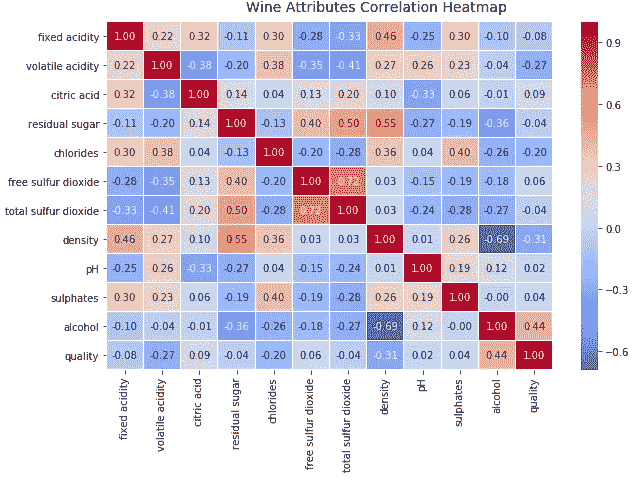**

**Visualizing two-dimensional data with a correlation heatmap**

**热图中的梯度根据相关性的强度而变化，您可以清楚地看到，很容易发现潜在属性之间具有很强的相关性。另一种方法是在感兴趣的属性之间使用 ***成对散点图*** 。**

**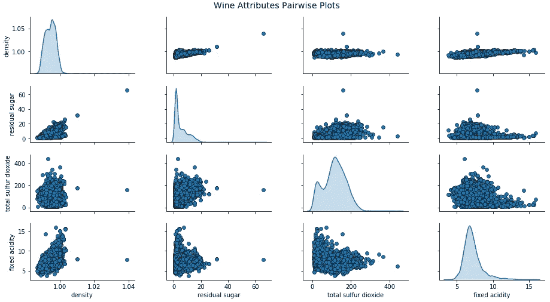**

**Visualizing two-dimensional data with pair-wise scatter plots**

**根据上面的图，您可以看到散点图也是观察数据属性的二维潜在关系或模式的一种不错的方式。**

> **关于成对散点图需要注意的重要一点是，这些图实际上是对称的。任何一对属性`***(X, Y)***`的散点图看起来与`***(Y, X)***`中的相同属性不同，只是因为垂直和水平刻度不同。它不包含任何新信息。**

**将多个属性的多元数据可视化的另一种方式是使用 ***平行坐标*** 。**

**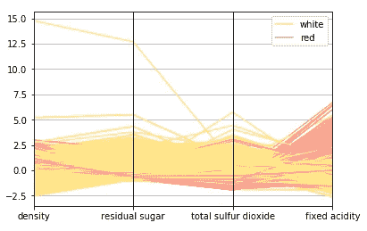**

**Parallel coordinates to visualize multi-dimensional data**

**基本上，在如上所述的可视化中，点被表示为连接的线段。每条垂直线代表一个数据属性。跨越所有属性的一组完整的连接线段代表一个数据点。因此，倾向于聚集的点看起来会靠得更近。通过观察，我们可以清楚地看到，与白葡萄酒相比，`**density**` 更适合红葡萄酒。同样，*白葡萄酒*的`**residual sugar**`和`**total sulfur dioxide**`比*红葡萄酒*高，而*红葡萄酒*的`**fixed acidity**`比`**white wines**`高。查看我们之前导出的统计表中的统计数据来验证这个假设！**

**让我们来看一些我们可以 ***可视化两个连续的数字属性*** 的方法。特别是 ***散点图*** 和 ***联合图*** 不仅是检查模式、关系的好方法，也是查看属性的个体分布的好方法。**

**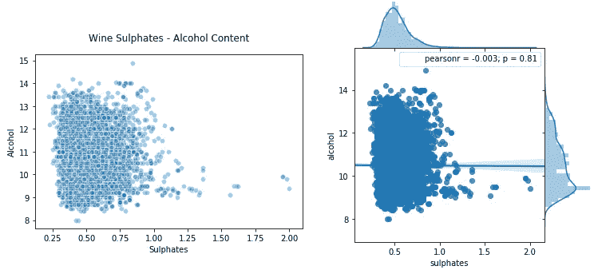**

**Visualizing two-dimensional continuous, numeric data using scatter plots and joint plots**

**上图左侧为 ***散点图*** ，右侧为 ***联合图*** 。正如我们提到的，您可以在联合图中检查相关性、关系以及个体分布。**

**如何看待 ***可视化两个离散的、分类的属性？*** 一种方法是利用单独的情节(支线情节)或 ***面*** 来获得一个分类维度。**

**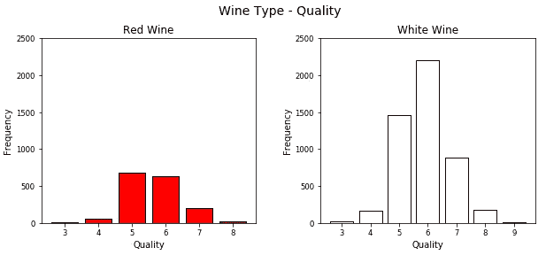**

**Visualizing two-dimensional discrete, categorical data using bar plots and subplots (facets)**

**虽然这是可视化分类数据的好方法，但正如您所见，利用`**matplotlib**` 已经导致编写了大量代码。另一个好方法是使用 ***堆叠条*** 或 ***多个条*** 用于单个图中的不同属性。我们可以轻松地利用`**seaborn**` 实现同样的目的。**

**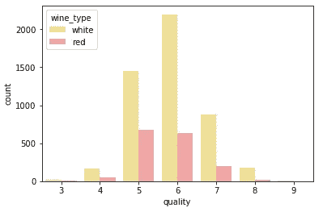**

**Visualizing two-dimensional discrete, categorical data in a single bar chart**

**这肯定看起来更干净，你也可以有效地比较不同的类别很容易从这个单一的阴谋。**

**让我们看看 ***在二维中可视化混合属性*** (本质上是数字和分类在一起)。一种方法是使用 ***刻面\支线剧情*** 连同通用 ***直方图*** 或 ***密度剧情*** 。**

**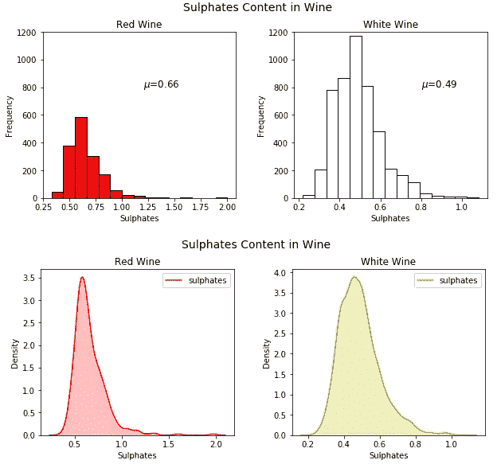**

**Visualizing mixed attributes in two-dimensions leveraging facets and histograms\density plots**

**虽然这很好，但我们又一次有了很多样板代码，我们可以通过利用`**seaborn**` 来避免这些代码，甚至可以在一个图表中描绘这些图。**

**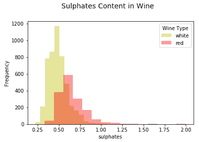**

**Leveraging multiple histograms for mixed attributes in two-dimensions**

**你可以看到上面生成的图清晰简洁，我们可以很容易地比较不同的分布。除此之外， [***箱形图***](https://en.wikipedia.org/wiki/Box_plot) 是根据分类属性中的不同值有效描绘数字数据组的另一种方式。 [***箱形图***](https://en.wikipedia.org/wiki/Box_plot) 是了解数据中四分位值以及潜在异常值的好方法。**

**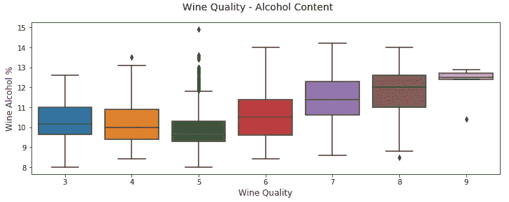**

**Box Plots as an effective representation of two-dimensional mixed attributes**

**另一个类似的可视化是[***violin plots***](https://en.wikipedia.org/wiki/Violin_plot)，这是使用核密度图(描绘不同值的数据的概率密度)可视化分组数字数据的另一种有效方式。**

**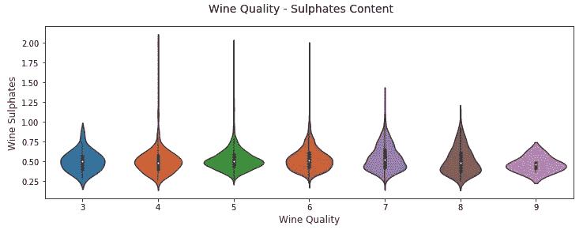**

**Violin Plots as an effective representation of two-dimensional mixed attributes**

**你可以清楚地看到上面不同酒类`quality`和`sulphate`的密度图。**

> **将数据可视化为二维非常简单，但是随着维度(属性)数量的增加，数据开始变得复杂。原因是因为我们被二维的展示媒介和环境所束缚。**
> 
> **对于三维数据，我们可以通过在图表中取一个 **z 轴**或者利用支线图和分面来引入一个虚假的**深度**概念。**
> 
> **然而，对于高于三维的数据，可视化变得更加困难。超越三维的最好方法是使用**小平面、颜色、形状、大小、深度**等等。您也可以使用**时间**作为维度，为其他属性制作一个随时间变化的动画图(考虑到时间是数据中的一个维度)。看看汉斯·罗斯林的精彩演讲[](https://www.ted.com/talks/hans_rosling_shows_the_best_stats_you_ve_ever_seen)**就知道了！****

## ****三维可视化数据(3-D)****

****考虑到数据中的三个属性或维度，我们可以通过考虑一个 ***成对散点图*** 并引入 ***颜色*** 或 ***色调*** 的概念来分离出分类维度中的值，从而将它们可视化。****

****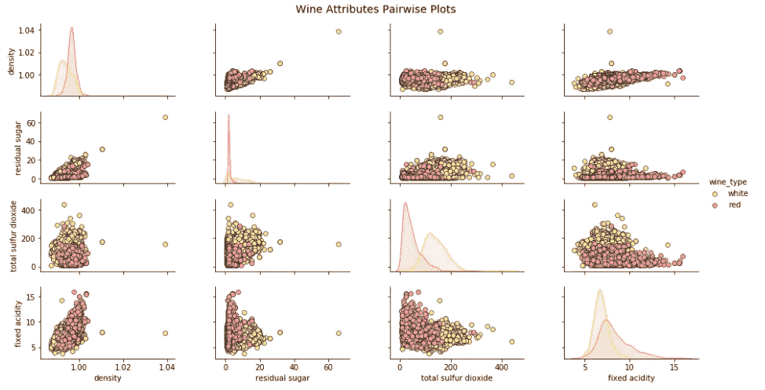****

****Visualizing three-dimensional data with scatter plots and **hue** (color)****

****上面的图使你能够检查相关性和模式，也可以围绕葡萄酒组进行比较。就像我们可以清楚地看到*白葡萄酒*的`**total sulfur dioxide**`和`**residual sugar**`比*红葡萄酒*高。****

****让我们看看 ***可视化三个连续的数字属性*** 的策略。一种方式是将两个维度表示为常规的**(*x*-轴)和 ***宽度***(*y*-轴)，并且还将 ***深度***(*z*-轴)的概念用于第三维。******

****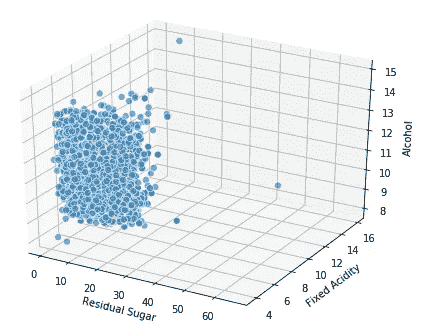****

****Visualizing three-dimensional numeric data by introducing the notion of **depth******

****我们还可以利用常规的二维轴，并引入尺寸*的概念作为第三维(本质上是一个 ***气泡图*** )，其中点的尺寸表示第三维的数量。*****

****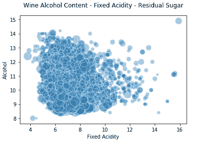****

****Visualizing three-dimensional numeric data by introducing the notion of **size******

****因此，你可以看到上面的图表并不是一个传统的散点图，而是一个气泡图，根据`**residual sugar**`的数量有不同的点大小(气泡)。当然，你并不总是能在数据中找到明确的模式，就像在这种情况下，我们在其他两个维度上看到不同的大小。****

****对于 ***可视化三个离散的分类属性，*** 虽然我们可以使用传统的*，但是我们可以利用*以及 ***面*** 或 ***支线剧情*** 的概念来支持额外的第三维。`**seaborn**` 框架帮助我们将代码保持在最少，并有效地进行规划。******

****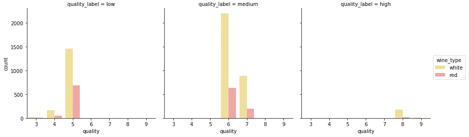****

****Visualizing three-dimensional categorical data by introducing the notion of **hue** and **facets******

****上面的图表清楚地显示了与每个维度相关的频率，您可以看到这在理解相关见解时是多么容易和有效。****

****考虑到*三个混合属性的可视化，我们可以使用 ***色调*** 的概念来将我们的组在一个分类属性中分离，同时使用常规的可视化，如 ***散点图*** 来可视化数值属性的二维。*****

****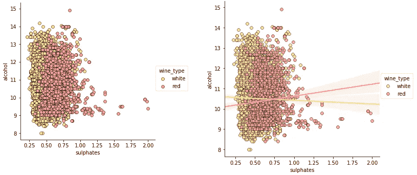****

****Visualizing mixed attributes in three-dimensions leveraging scatter plots and the concept of **hue******

****因此，色调充当了类别或组的良好分隔符，尽管如上所述不存在或非常弱的相关性，但我们仍然可以从这些图中了解到，与*白*相比，*红葡萄酒*的`**sulphates**` 略高。除了散点图，还可以使用 ***内核密度图*** 来理解三维数据。****

****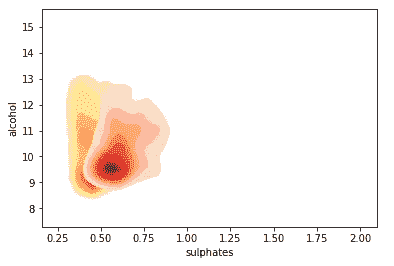****

****Visualizing mixed attributes in three-dimensions leveraging kernel density plots and the concept of **hue******

****与*白葡萄酒*相比，*红葡萄酒*样品具有更高的`**sulphate**` 水平，这是很明显的，也是意料之中的。您还可以看到基于色调强度的密度浓度。****

****如果我们正在处理三维中的 ***多个分类属性*** *，我们可以使用 ***色相*** 和 ***中的一个常规轴*** 来可视化数据，并使用类似于 ***盒图*** 或 ***小提琴图*的可视化*******

***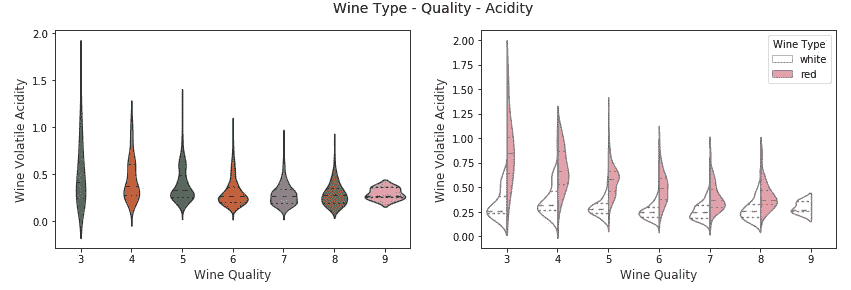***

***Visualizing mixed attributes in three-dimensions leveraging split violin plots and the concept of **hue*****

***在上图中，我们可以看到，在右边的三维可视化图中，我们在 x 轴上表示了葡萄酒`**quality**` ，在`**wine_type**` 上表示了色调*。我们可以清楚地看到一些有趣的现象，比如与*白葡萄酒*相比，*红葡萄酒*的更高。****

****您还可以考虑使用 ***盒图*** 以类似的方式表示具有多个分类变量的混合属性。****

****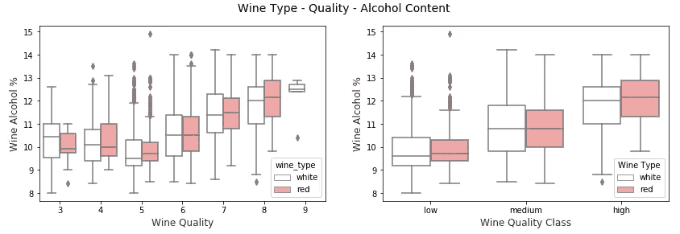****

****Visualizing mixed attributes in three-dimensions leveraging box plots and the concept of **hue******

****我们可以看到，无论是对于`**quality**` 还是`**quality_label**` 属性，葡萄酒的`**alcohol**` 含量随着质量的提高而增加。此外，基于*的质量等级，与*白葡萄酒*相比，*红葡萄酒*往往具有略高的中值`**alcohol**` 含量。然而，如果我们检查*的质量等级，我们可以看到，对于*等级较低的葡萄酒*(**3&4**)*白葡萄酒*中值`**alcohol**` 含量大于*红葡萄酒*样品。除此之外，与白葡萄酒*相比，红葡萄酒***的平均含量似乎略高。**********

## *******以四维方式可视化数据(4-D)*******

*******根据我们之前的讨论，我们利用图表的各种组件来可视化多个维度。一种在四维空间中可视化数据的方法是使用 ***深度*** 和*作为常规绘图中的特定数据维度，如 ***散点图*** 。********

******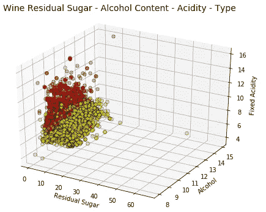******

******Visualizing data in four-dimensions leveraging scatter plots and the concept of **hue** and **depth********

******`**wine_type**` 属性由色调表示，这在上面的图中非常明显。此外，虽然由于情节的复杂性，解释这些可视化变得越来越困难，但你仍然可以收集到一些见解，如`**fixed acidity**`对于*红酒*更高，而`**residual sugar**`对于*白酒*更高。当然，如果`**alcohol**`和`**fixed acidity**`之间存在某种关联，我们可能会看到一个逐渐增加或减少的数据点平面，显示出某种趋势。******

******另一种策略是保持二维绘图，但使用*和数据点 ***大小*** 作为数据维度。通常这将是一个 ***气泡图*** ，类似于我们之前看到的。*******

******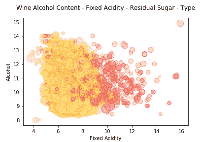******

******Visualizing data in four-dimensions leveraging bubble charts and the concept of **hue** and **size********

******我们用*来表示`**wine_type**` ，用数据点 ***大小*** 来表示`**residual sugar**`。我们确实从之前的图表中观察到了类似的模式，白葡萄酒*的气泡尺寸更大，通常表明白葡萄酒*的`**residual sugar**`值比红葡萄酒*的*值更高。*********

*****如果我们有两个以上的分类属性要表示，我们可以重用我们的概念，利用 ***【色调】*** 和 ***刻面*** 来描述这些属性，以及像 ***散点图*** 这样的规则图来表示数字属性。让我们看几个例子。*****

*****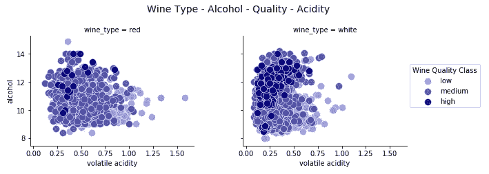*****

*****Visualizing data in four-dimensions leveraging scatter plots and the concept of **hue** and **facets*******

*****我们可以很容易地发现多种模式，这一事实验证了这种可视化的有效性。*白葡萄酒*的`**volatile acidity**`水平较低，同样*高品质葡萄酒*的酸度水平也较低。同样根据*白葡萄酒*样本，*高品质葡萄酒*的`**alcohol**` 含量较高，*低品质葡萄酒*的`**alcohol**`含量最低！*****

*****让我们举一个类似的例子，用其他一些属性来构建一个四维的可视化。*****

*****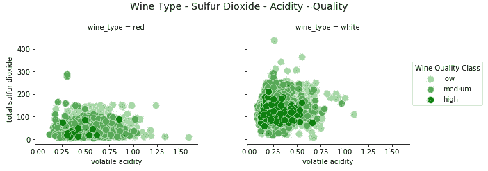*****

*****Visualizing data in four-dimensions leveraging scatter plots and the concept of **hue** and **facets*******

*****我们清楚地看到，*优质葡萄酒*的`**total sulfur dioxide**`含量较低，如果你对葡萄酒成分有必要的了解，这一点是很重要的。我们还看到*红酒*的`**total sulfur dioxide**`水平低于*白酒*。然而，在几个数据点上，*红酒的`**volatile acidity**`水平更高。******

## *****在五维空间中可视化数据(5-D)*****

*****再次遵循与上一节相似的策略，在五维空间中可视化数据，我们利用各种绘图组件。让我们用*、 ***色相*** 和 ***大小*** 来表示除了 ***正轴*** 以外的三个数据维度来表示另外两个维度。既然我们使用了尺寸的概念，我们将基本上绘制一个三维的 ***气泡图*** 。******

******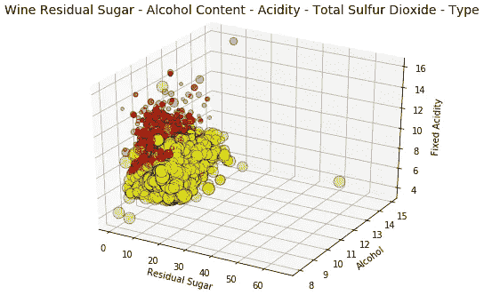******

******Visualizing data in five-dimensions leveraging bubble charts and the concept of **hue, depth** and **size********

******这个图表描述了我们在上一节中谈到的相同的模式和见解。然而，我们也可以看到，根据由`**total sulfur dioxide**`表示的点数大小，*白葡萄酒*比*红葡萄酒*具有更高的`**total sulfur dioxide**`等级。******

******除了 ***深度*** ，我们还可以使用 ***刻面*** 以及 ***色调*** 来表示这五个数据维度中的多个分类属性。代表 ***大小*** 的属性之一可以是*数值(连续)*甚至是*分类*(但是我们可能需要用数字来表示数据点大小)。虽然由于缺乏分类属性，我们没有在这里进行描述，但是您可以在自己的数据集上尝试一下。******

******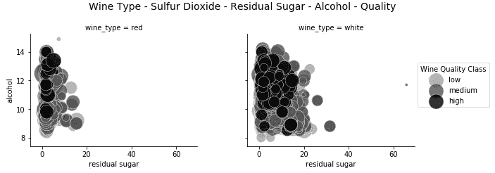******

******Visualizing data in five-dimensions leveraging bubble charts and the concept of **hue, facets** and **size********

******这基本上是另一种方法，可以将我们之前绘制的五维图可视化。虽然在查看我们之前绘制的图时， ***深度*** 的额外尺寸可能会使许多人困惑，但是由于 ***小平面*** 的优势，该图仍然有效地保留在二维平面上，因此通常更有效且更易于解释。******

************

******我们已经可以看到，处理如此多的数据维度变得越来越复杂！如果你们有些人在想，为什么不增加更多的维度呢？让我们试一试吧！******

## ******可视化六维数据(6-D)******

******既然我们玩得开心(我希望！)，让我们在可视化中添加另一个数据维度。我们将利用****色相******大小******形状*** 除了我们的 ***规则的两个轴*** 来刻画所有的六个数据维度。*******

******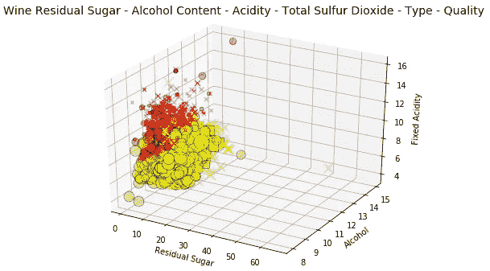******

******Visualizing data in six-dimensions leveraging scatter charts and the concept of **hue, depth, shape** and **size********

******哇，在一个情节中有六个维度！我们有由 ***形状****高*(平方像素)*中*(X 标记)和*低*(圆圈)品质的葡萄酒。其中`**wine_type**`由 ***表示色相，*** `**fixed acidity**`由 ***深度*** 和数据点 ***大小*** 表示`**total sulfur dioxide**`内容。******

******解释这一点似乎有点费力，但是在试图理解正在发生的事情时，请一次考虑几个组件。******

1.  ******考虑到 ***形状*** & ***y 轴*** ，我们有*高*和*中*品质的葡萄酒，与*低*品质的葡萄酒相比具有更高的`**alcohol**` 水平。******
2.  ******考虑到 ***色相******大小*** ，我们对于*白葡萄酒*的`**total sulfur dioxide**`含量要高于*红葡萄酒*。******
3.  ******考虑到 ***深度*** 和 ***色调*** ，我们有*白葡萄酒*比*红葡萄酒*的`**fixed acidity**`水平低。******
4.  ******考虑到 ***色调*** 和 ***x 轴*** ，我们有*红葡萄酒*比*白葡萄酒*的`**residual sugar**`水平低。******
5.  ******考虑到****形状*** ，*白葡萄酒*似乎比*红葡萄酒*拥有更多*高*品质的葡萄酒(可能是因为*白葡萄酒*的样本量更大)。*******

******我们还可以通过移除 ***深度*** 组件并使用 ***面*** 来代替分类属性来构建 6-D 可视化。******

******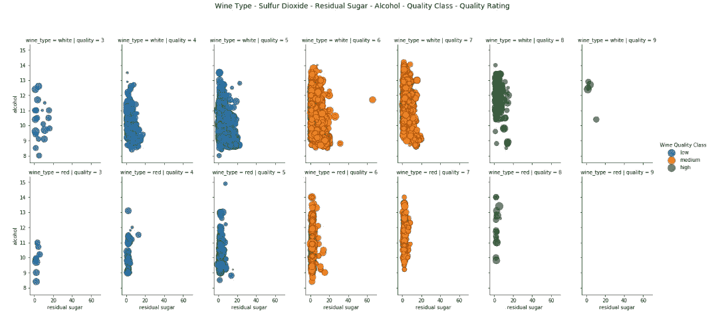******

******Visualizing data in six-dimensions leveraging scatter charts and the concept of **hue, facets** and **size********

******因此，在这个场景中，我们利用 ***面*** 和*来表示三个分类属性，利用 ***两个常规轴*** 和 ***大小*** 来表示我们的 6-D 数据可视化的三个数值属性。*******

# ******结论******

******数据可视化是一门艺术，也是一门科学。如果你正在读这篇文章，我真的很赞赏你通读这篇内容广泛的文章的努力。其目的不是为了记忆任何东西，也不是为了给可视化数据提供一套固定的规则。这里的主要目标是理解和学习一些有效的数据可视化策略，尤其是当维度数量开始增加时。我鼓励你在将来利用这些片段来可视化你自己的数据集。请在评论中留下您的反馈，并分享您自己的有效数据可视化策略*“尤其是如果您能走得更高的话！”*******

******本文使用的所有代码和数据集都可以从我的 [**GitHub**](https://github.com/dipanjanS/practical-machine-learning-with-python/tree/master/bonus%20content/effective%20data%20visualization) 中访问******

******该代码也可作为 [**Jupyter 笔记本**](https://github.com/dipanjanS/practical-machine-learning-with-python/blob/master/bonus%20content/effective%20data%20visualization/Bonus%20-%20Effective%20Multi-dimensional%20Data%20Visualization.ipynb)******