# 制造智能机器的艺术

> 原文：<https://towardsdatascience.com/the-art-of-making-intelligent-machines-e024e2d170d6?source=collection_archive---------1----------------------->

随着围绕数据和机器学习的所有兴奋，人们很容易忘记*在我们所做的事情中发挥了多大作用。对于那些希望进入数据科学等领域的人来说，理解他们的*软*面对于帮助组织创造价值有多重要尤为重要。*

*这是我们的一个网站，我鼓励你去看看，而不是这里显示的静态截图。动画有助于将一些概念变成现实。不管怎样，这是一个关于我们如何制造智能机器的更有创造性的观点。*

***点击这里**->-T10【制造智能机器的艺术】*

*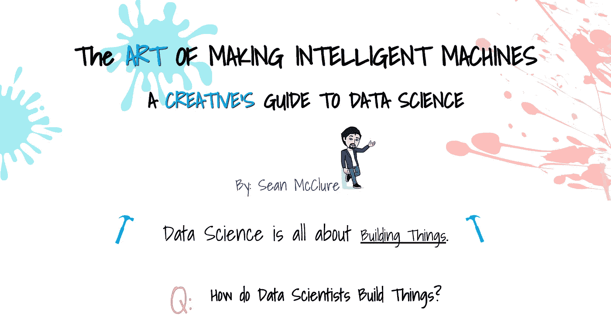**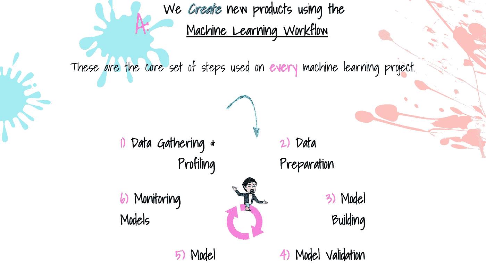**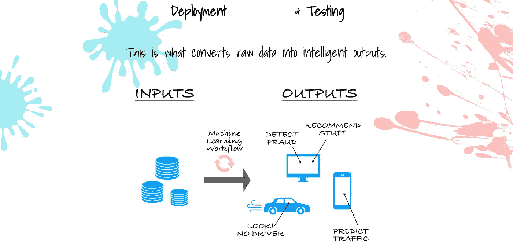**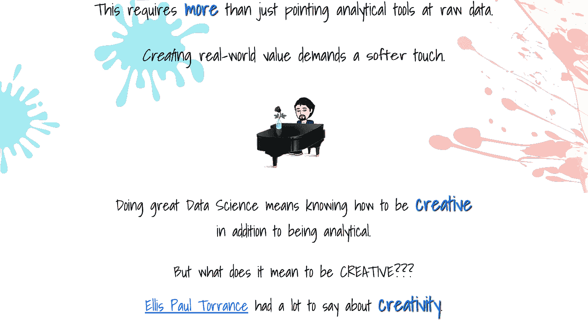**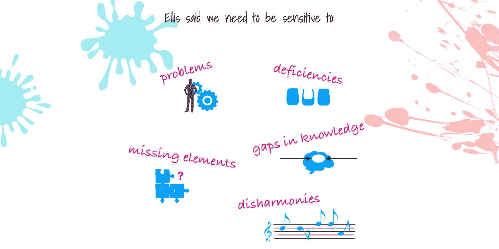**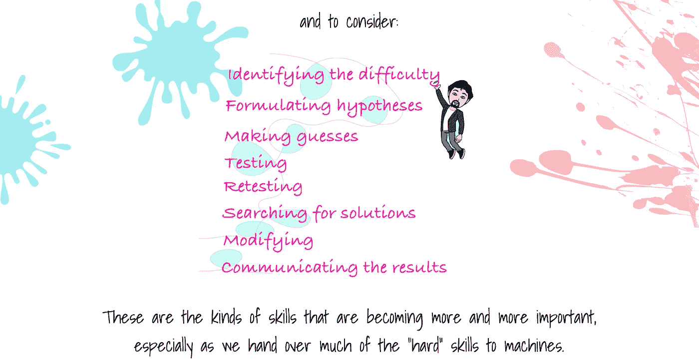**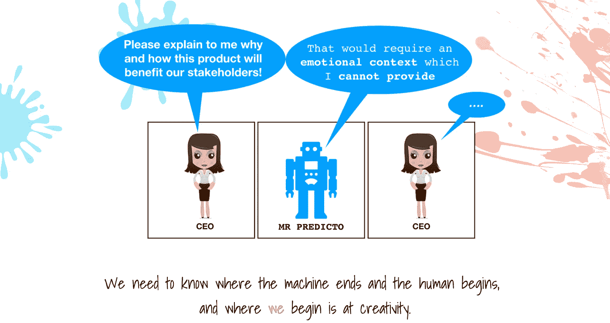**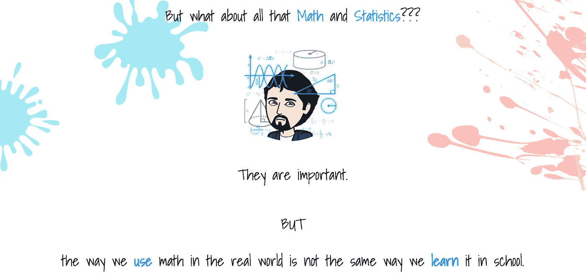**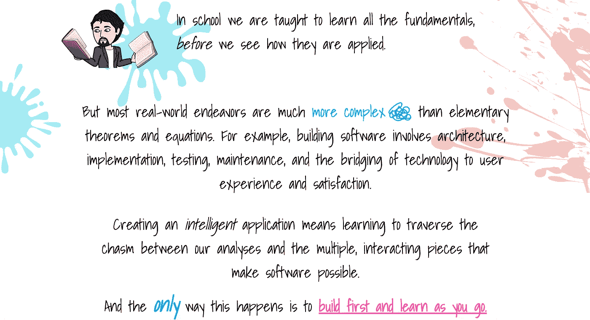**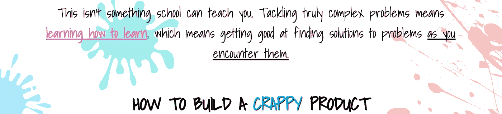******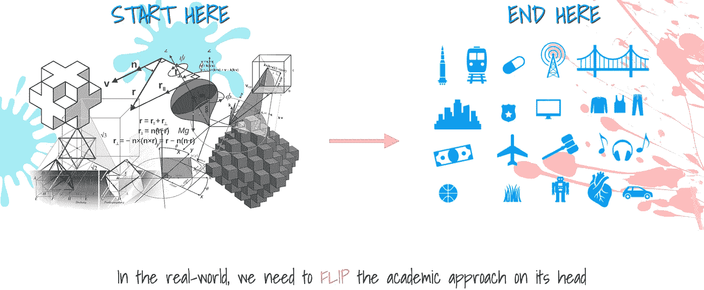**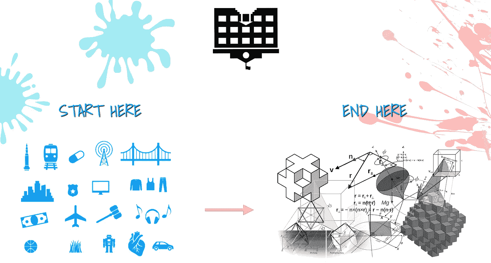**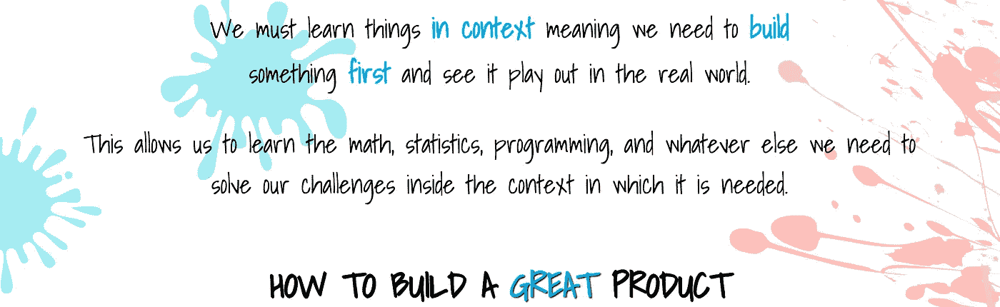**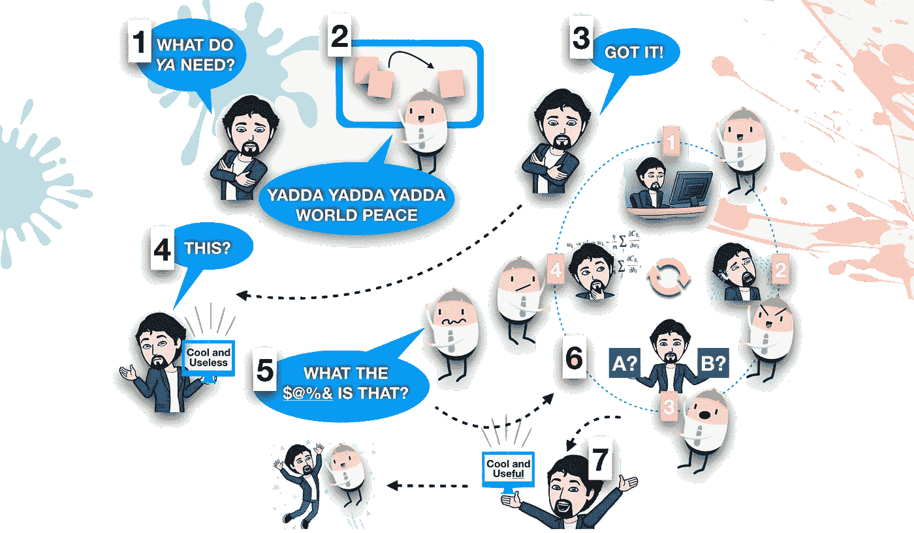**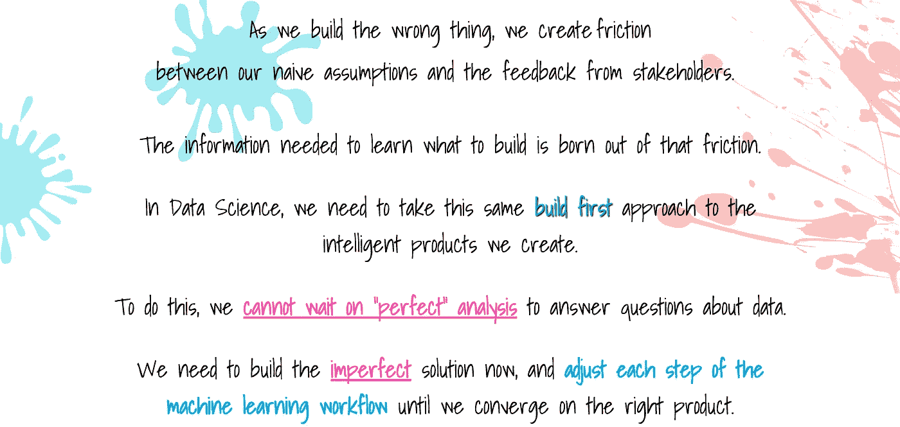**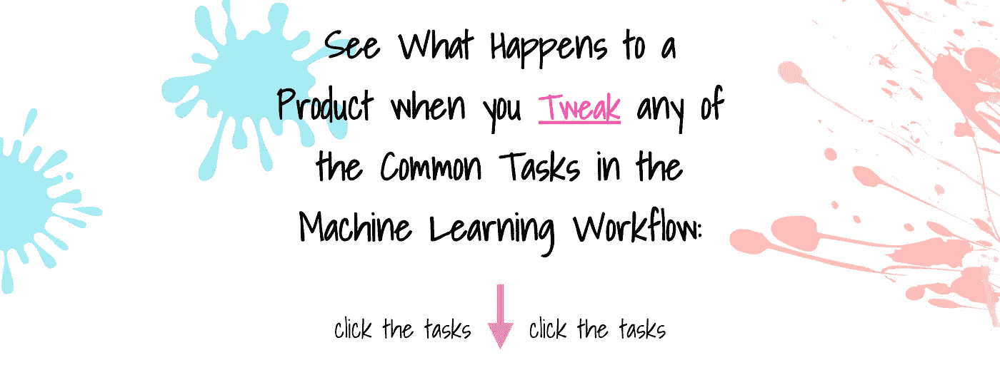**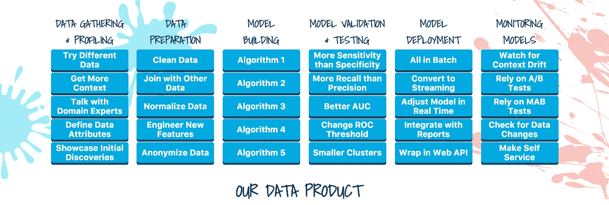**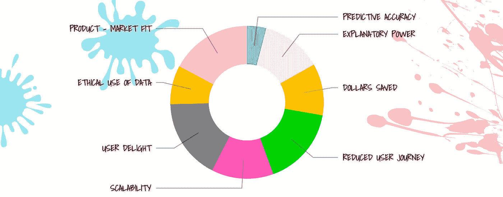**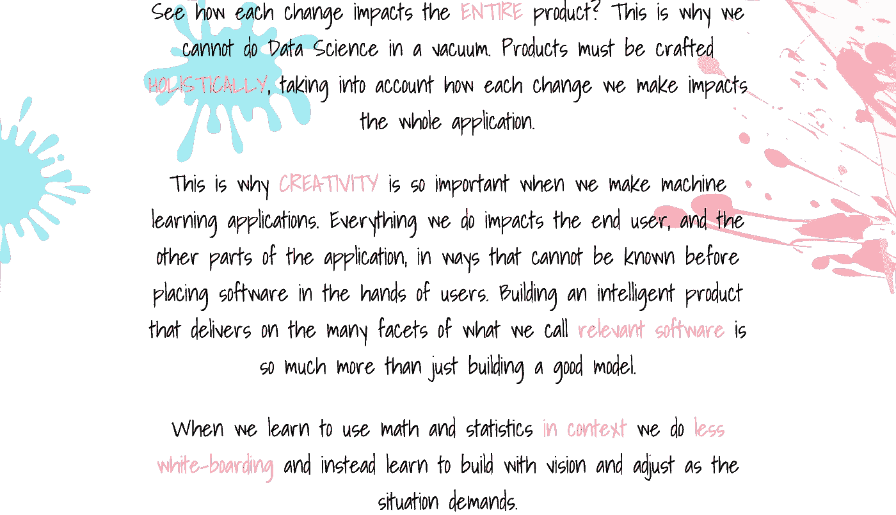**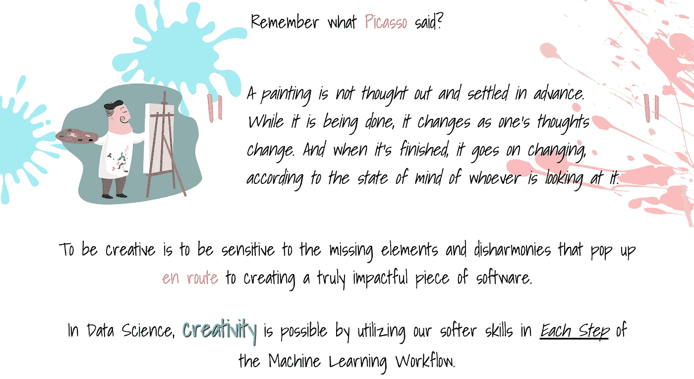**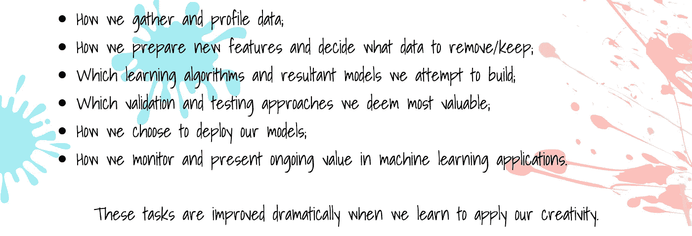**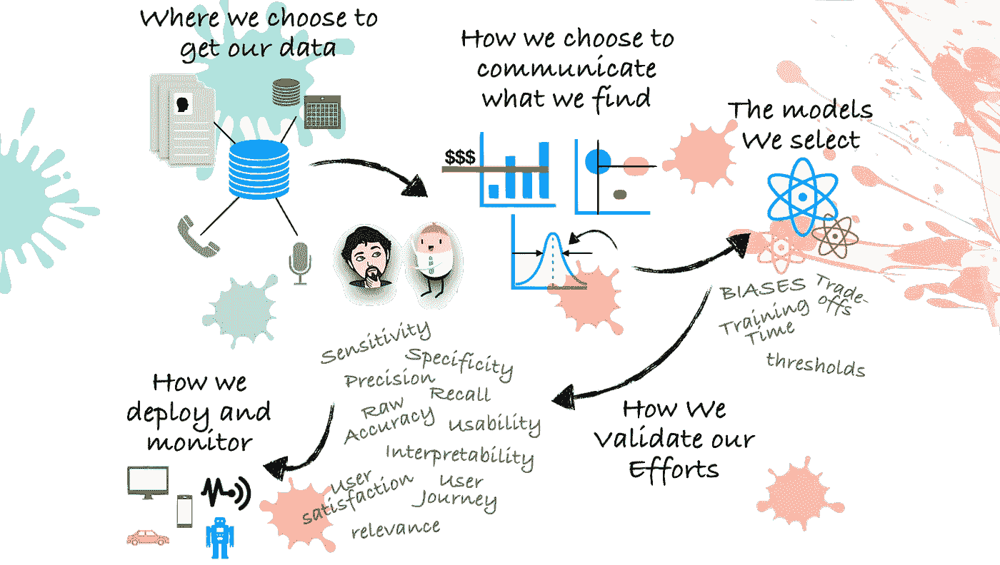***