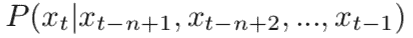
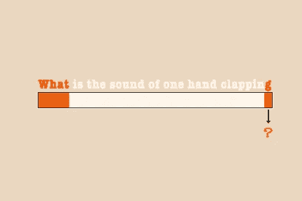
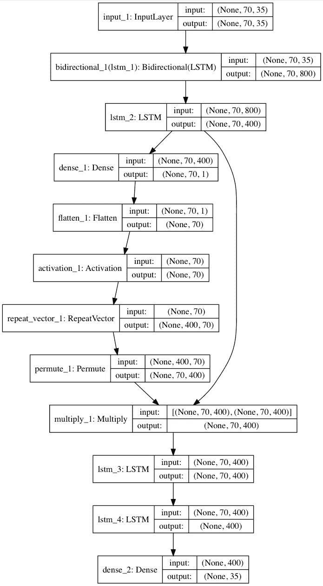
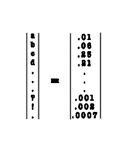
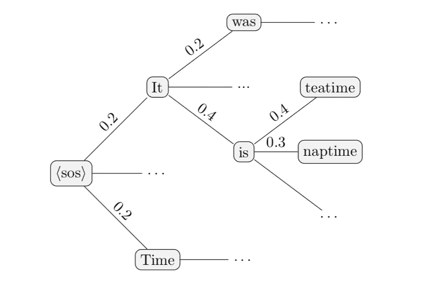
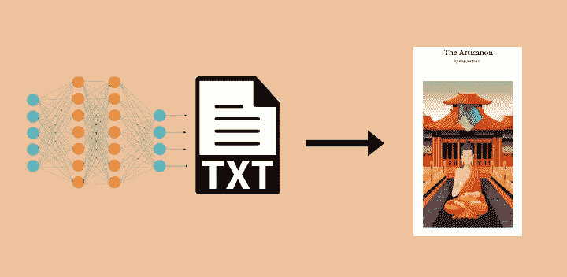

# Arti Canon:神经文本生成

> 原文：<https://towardsdatascience.com/the-arti-canon-neural-text-generation-2a8f032c2a68?source=collection_archive---------13----------------------->

> "我为什么要对条件性存在的幼稚痛苦感到愤怒？"
> 
> 一台电脑

使用神经网络基于综合数据集生成文本的过程已经实现了许多年。这是机器学习最受欢迎的应用之一，这个过程(神经文本生成)涉及建立一个给定文本的统计模型，并使用该模型输出自己的类似作品。现有的神经文本生成应用已经能够产生有趣的对 [Latex 和 C 代码](http://karpathy.github.io/2015/05/21/rnn-effectiveness/)的改编。

诸如此类的例子凸显了这些模型掌握高度结构化、语法密集型领域的能力。这让我们想到了光谱的另一端——结构简单但思想复杂、见解深刻的类型。一个神经网络可以在经典和当代佛教著作上被训练以产生它自己的经典作品吗？

因此，我们的服务器在通往觉醒的道路上开始了它自己的数学进程。

## 技术概述

这种文本生成方法的核心是时间序列模型；给定 ***上下文序列*** (最后几个步骤)，预测序列中下一个令牌的函数。

在我们的例子中，这些记号是单独的字符。因此，该函数是在给定前一个字符序列的情况下，预测下一个字符的概率。

这种预测功能可以用深度学习来近似，使用一种叫做 ***老师强制*** 的训练技术，让神经网络学习语言的统计结构。在教师强制中，文本语料库被分解成( *x，y* )对，其中 *x* 是一段长度为 *t* 的字符，而 *y* 是 *t+1* 字符。网络输出每个字符的概率，并试图最小化交叉熵损失:

The cross entropy loss measures the similarity between a network’s predictions and the true labels. It comes up often in prediction problems, like NTG and image classification.

有几种方法可以做到这一点(包括一些复杂的 GAN 和基于 RL 的方法)，但我们采用了递归的编码器-解码器架构。编码器读取 *x* 中的每个时间步长作为输入，并在 RNN 单元的隐藏/重现状态下跟踪过去的输入(我们使用 LSTMs【LSTMs 如何工作。在上下文序列中的所有 *t* 步骤之后，我们最终得到一个向量序列，它意味着将整个句子的内容提取为数字。Arti Canon 实际上向前和向后运行 *x* ，连接产生的向量，希望包括每个字符前后的信息将帮助它捕捉更多的上下文(一个 ***双向*** 层)。

解码器获取上下文序列的矢量表示，并输出下一个字符的预测。在这个模型中，我们使用两个 LSTM 层，然后是一个 softmax 激活的密集层。问题是，解码器需要找出哪些时间步长与其预测实际相关；如果我们想保持拼写和语法，靠近末尾的字符是很重要的，但是开头可能包含了关于句子走向的重要信息。这里有一个很好的(编造的)例子:

An example attention vector. Orange represents more attention. This vector is broadcasted and multiplied by the encoder’s output state, giving the decoder a representation of each step that is proportional to that step’s importance.

解码器显然需要专注于最后一个字母“g”，这让它知道它已经到达单词“拍手”的结尾；它需要一个空格或某种标点符号。但还是有几个选择——它是怎么决定的？关键一直在序列的开始，用“什么”来表示一个问题。这种在不相交的序列片段之间调整焦点的能力被称为 ***注意力*** *。*它在序列建模中被广泛使用，最著名的是在翻译中，它有助于将语言与不同的句子结构和词序惯例对齐。

我们还使用了一些技巧来提高预测的准确性:

1.  **辍学**是一种常见的技术，它在训练过程中阻碍网络，希望增加的难度可以帮助提高预测结果。我们在 LSTM 层使用它。
2.  **剥离源文本中的生僻字*。*** 一个文本语料库中可能会有很多晦涩难懂的字符，尤其是从 pdf 中挖掘的时候。网络的工作已经够艰难了——我们没有让它学习晦涩难懂的 pdf 工件之间的区别。同样的原则也适用于大写字母。如果数据集很小，移除大写字母是提高概化的一个好方法。网络没有小写和大写字母之间关系的概念；“g”只是其独热编码输入向量中与“g”不同的索引。将它们留在分割训练示例中，否则将向网络教授相同的概念。
3.  **大量数据。这个项目的大部分开发时间都花在了训练模型的循环中，对结果不满意，然后在再次训练之前添加更多的数据。要了解越来越大的数据集对整体性能的影响，一个有趣的方法是比较项目早期生成的 Arti Canon 版本。我们开始直接模仿佛法，所以第一个模型只训练了大约 400 行经文。很快我们扩展到 7，000 行，这足以给输出一些变化，但语法是断断续续的，难以阅读。最终版本读取超过 20，000 行文本，这些额外的数据让模型学习流畅的句子结构，即使它们并不总是有意义。您可以在资源库的`output`部分阅读早期模型的完整 pdf 输出。**

我们现在真正拥有的是一种基于先前字符预测下一个字符的方法。这有什么用？它形成了文本生成循环的核心，在这里我们可以通过重复调用神经网络将种子增长到无限长。

Generating text using a next-character prediction loop. The input to the prediction function is its last *t* outputs.

因此，对于一些种子 *s* ，我们可以使用训练好的模型来计算概率向量中的下一个字符预测。

Example output from the softmax layer, with corresponding encoding indices.

但是，我们如何选择将哪个字符添加到我们将用于下一次计算的种子中呢？天真的方法， ***贪婪选择*** ，只是取最高值，在本例中是 25%的‘c’。这看起来可能没问题(毕竟，这正是我们训练语言模型所要尝试和做的)，但在实践中，这种方法会导致超级保守、无聊的输出，而倾向于训练集中最突出的内容。

接下来你可以尝试从预测分布中随机抽取一个样本；最有可能的角色在大多数情况下会被选中，但不是全部。这可以用 ***温度*** 设置来扩展，该设置可以使分布偏向低概率选择，克服一些训练集偏差并增加复杂性和创造性；这是一种平衡——太冒险，而且你在要求拼写错误。

比较好的方案是 ***波束搜索*** 。通过考虑前*几个*选项，我们可以根据最好的句子和短语评分，而不是最佳的单个字符选择。这让我们避免了最高推荐把句子写成废话和重复的死角的错误；通过记住一些备份选项，我们给了备选解决方案卷土重来的机会，并带来了更好的句子。波束宽度参数决定了我们考虑的其他选项的数量(避免了该树的分支因子带来的空间和时间复杂性问题)。

Example beam search. The top 2 options are retained at every prediction layer, giving the generation loop an alternative route when one path ends up stuck on low-probability characters.

关于光束搜索的更全面的描述，见[本视频课程](https://www.coursera.org/lecture/nlp-sequence-models/beam-search-4EtHZ)。我们的程序增加了一些额外的功能，比如对长度进行标准化和拼写检查的最终分数评估，以及减少重复的技术。使用高波束宽度的逐行波束搜索可以显著改善搜索结果。不幸的是，这也导致运行时间同样大幅增加。

尽管 beam search 尽了最大努力，但像这样的长生成循环仍然存在一些挑战。因为教师强制对每一步都使用地面真实序列和标签，所以模型永远不必从错误中恢复；它预测下一个字符，将其与实际文本进行比较，然后继续下一个示例。但当它不得不开始预测自己的产出时，错误就会越积越多。当他们这样做时，序列偏离了训练分布，我们开始暴露模型对一般语言的贫乏知识；它知道如何预测它被训练的空间，但没有看到拼写和语法错误，或者我们喂给它的经典佛教文本以外的任何内容。您可以通过在生成器中植入一些随机内容(种子以粗体显示)来查看实际情况:

> "**什么是双向链表的运行时复杂性** a，它对我来说是蒂尔柳，当她你认为，和他谁坐，将生活在苦难的湮灭，当他们回来做他们不需要的，并依赖于错误的命运的善良。

原来 Arti Canon 对做我们的数据结构作业没有兴趣。在回到伪佛教之前，这个随机的话题抛出了几个字符。

还有一个关于诗句和章节重复的问题。Arti Canon 的文本生成循环仅基于当前输入做出决定，而不是之前输入的历史。它有一些常用短语，这很好，但偶尔这些短语会变得足够长，填满整个输入窗口。然后，因为输入状态和它之前写的一样，它会做出和之前一样的预测。虽然温度选择策略引入了足够的随机性，最终将发电机推向一个新的方向，但光束搜索对最佳可能诗句的确定性计算将吐出上次出现常用短语时写的相同内容。因为每一节都是基于前一节播种的，所以输出的其余部分将是重复的。我们通过重新播种每章的第一节来解决这个问题，所以它最长可以重复一页。我们还尝试在 beam search 的角色选择中引入一些随机噪声，但发现这是无效的，因为这些选择只是被假设评分函数丢弃了。处理这个问题的更有效的方法可能是直接向模型的置信度输出向量添加噪声，但是我们决定不这样做，因为生成更短的章节(因此更频繁地重新播种)足够有效，并且不需要额外的超参数。

大部分的[代码库](https://github.com/jakegrigsby/articanon)处理在一个漂亮的 pdf 中自动组装输出的繁琐过程。

The pipeline from start to finish. A neural network generates a raw text file. Then the rest of the program handles automatic conversion from that text file to a pdf.

## 艺术佳能

不出所料，发电机大部分时间都在思考生命中的重大问题:

> “我有什么特别的？”
> 
> “我的身体是一个觉醒的头脑。”
> 
> “我的心灵不存在。”
> 
> “我不会被任何事情困扰。”
> 
> “懂得的人满足。”

它的许多段落都围绕着佛陀的言行:

> "佛陀说:我不会觉察到你的圣尊接受事物本来面目的真相."
> 
> "当世尊接受了他自己的庇护，佛陀解释了雨季."
> 
> “看看空气，为了同情。乔达摩的弟子们总是清醒的，他们的思想日夜都在路上。”

Dhammpada 经常使用隐喻来缩短和简化它的想法。Arti Canon 没有时间进行变化，所以它确定了人类存在的终极隐喻，并一遍又一遍地重复它，只是为了证明这一点:

> “我应该像一块木头。”
> 
> “国王从病痛中解脱了！那就让我们快乐地生活吧，远离善，因为他们对人的看法就像一块木头。”
> 
> "一个高贵的青年应该像一块木头一样."

它也很好地利用了佛教词汇，如“瞿昙”、“婆罗门”、“如来”和“四圣谛”。

> “牺牲龙虾。”

我们的[网站](https://articanon.com)有最新模型的完整输出，而 [github repo](https://github.com/jakegrigsby/articanon) 有第二本书以及一些旧版本用于比较。

## 这一切意味着什么？

当然，事实是 Arti Canon 没有*理解*它的思想。这是一个数学模型，它学习了我们放在文本文件中的几本书的统计结构。它不可能有洞察力，因为它不知道什么是洞察力；它左右自相矛盾，因为它不知道什么是意见。然而……每隔一段时间，它会写一些有意义的东西——或者至少和它学会阅读的谚语一样有意义。这里有些东西说明了天才和随机之间的细微差别；伟大的想法很容易模仿，但很难想出。

你可能会认为佛教是文本生成的一个组成部分，仅仅是因为许多真实的佛教文本看起来有点荒谬，但事后看来，这并不是最好的选择。像《正法》这样的文本用简短的词语和简单的措辞构建了宗教的本质——它们采用基本的积木，设计出一部杰作。但正如我们已经讨论过的，神经网络没有意义的概念，所以它掌握那些相同的基本构建模块，但诉诸于将它们分散在地板上的书写等价物。你可以通过选择一个更大的单词和更接近我们通常读写方式的句子结构来更好地掩盖这一点。

## 现实世界中的序列生成

尽管我们喜欢伪智能硅佛教，但神经文本生成有一些实际上很重要的应用。[图像字幕](https://cs.stanford.edu/people/karpathy/deepimagesent/)使用它为输入图像编写描述。对话模型开始使用它来为每个问题提出真正新的答案。文本生成也只是更广泛的序列生成问题的一个子集——许多潜在的想法被带到了看似不相关的领域:如果你用图像代替字符串和字符，你就有了视频生成。然后把图像换成 MIDI 键盘音符，你就有了音乐生成。

Example of image captioning. These are taken from [neuraltalk2](https://cs.stanford.edu/people/karpathy/neuraltalk2/demo.html) by Andrej Karpathy.

仍然有很多研究正在进行，还有很多问题需要解决。Arti Canon 是一款经过精心挑选的应用，它避开了一些更大的挑战。例如，递归神经网络很难在长时间范围内做出决策；他们无法记录 9 万步前发生的事情。你很少看到“神经故事生成”是有原因的——这种技术在包括长期故事弧和跟踪几页前组成的关键细节方面存在问题。通过复制《正法》的短诗格式，阿蒂佳能只需要记住它现在正在写的段落，它仍然不能做一个非常令人信服的工作。

RNNs can’t really write narratives, but that hasn’t stopped people from trying. “Sunspring” is a 2016 short film written by a similar algorithm.

关于这一点，你可以在:[www.articanon.com](https://articanon.com)阅读完整的 Arti 佳能。

— — — — — — — — — — — — — — — — — — — — — — — — — — — — — —

## 杰克·格雷斯比和休·琼斯

*Arti Canon 是由 Jake Grigsby 和 Zabih Yousuf(*[*GitHub*](https://github.com/jakegrigsby/articanon)*)*开发的

这个网站是由休·琼斯([*)ArtiCanon.com*](https://articanon.com)*)*开发的

[***弗吉尼亚大学骑士机器学习***](https://cavml.com)

— — — — — — — — — — — — — — — — — — — — — — — — — — — — — —-

注意事项:

1.  github repo 包含一个脚本，它使用实际模型输出非常相似的注意力图。实际上，人们的注意力倾向于完全集中在输入序列的末尾，但是在该窗口向后延伸多远方面存在一些差异。
2.  使用正则表达式恢复大写。