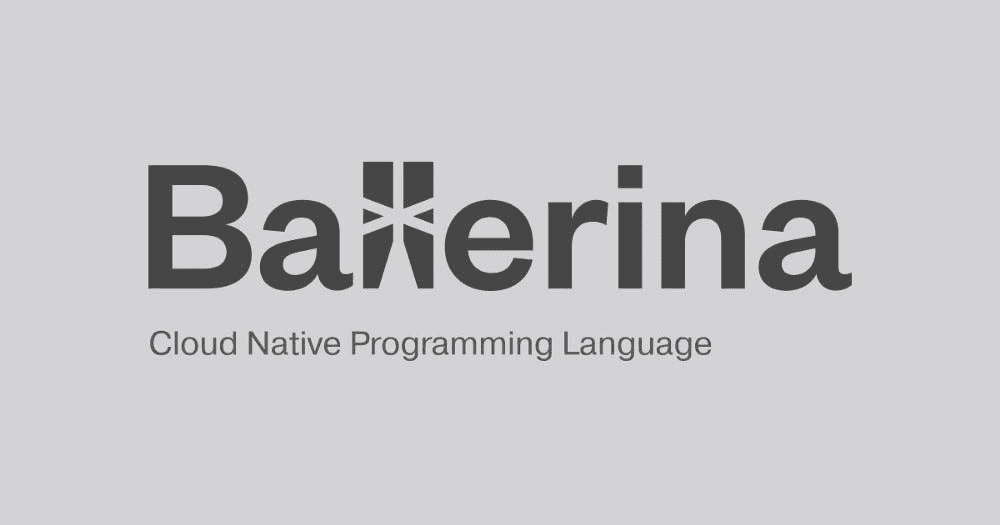
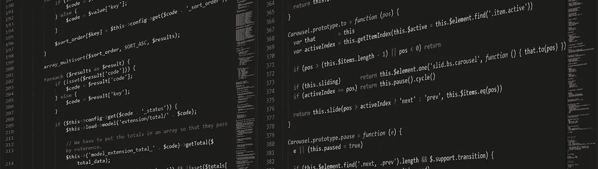

# 小芭蕾舞演员

> 原文：<https://towardsdatascience.com/the-baby-ballerina-a4760c86312e?source=collection_archive---------13----------------------->

[WSO2](https://wso2.com/) 推出了一种新的编程语言，叫做“ ***芭蕾舞演员*** ”。这位芭蕾舞女演员现在正处于 ***婴儿阶段*** 。因此，我想在这篇文章中简单介绍一下。这是我在 Medium 的第 9 篇文章。

Ballerina 是一种编译的、类型安全的并发编程语言。是由 [WSO2](https://wso2.com/) 开发的开源语言。它的并发执行由轻量级并行线程组成，这些线程是非阻塞的，并且具有顺序并发性。它是一种编译的编程语言，编译成平台中性的二进制形式，并由芭蕾舞演员在运行时解释。他们主要使用开源集成中间件。以前这些中间件必须从头开始构建，但是现在我们有这么多可以简单使用的库，而不是从头开始编码。没有融合的语言，这就是芭蕾舞演员诞生的原因。

为了理解集成逻辑如何工作，我们需要序列图，所以他们开发了一种语言，可以将序列图翻译成代码。喜欢的话也可以直接编码。它还为谷歌、脸书、推特等网站预建了连接器。

芭蕾舞演员是云原生编程语言。这意味着它可以与远程端点一起工作，例如无服务器、微服务、Saas 应用、API 和 WebSockets。因为它是为集成而设计的，所以它可以支持断路器、JSON、gRPC、分布式事务、流处理、XML、数据访问。它可以直接与 Docker 和 Kubernetes 一起使用，也可以与 IntelliJ 或 VSCode 集成。

芭蕾舞演员还有一个名为“国际化”的功能，芭蕾舞演员的代码可以用基于语言包的语言程序员编写。芭蕾舞演员增加了集成的可读性，因为它使用了图形的表现方式。在此之前，我们有 XML，这有助于可读性，但随着复杂性，它变得不适合。对于需要多行 XML 的常见集成，几行 Ballerina 就足够了。

它可以在几秒钟内启动，内存占用只有几兆字节，非常适合按需扩展。芭蕾舞演员是一种编程语言，对每个人都有用。它适合做脚本的极客，或者使用图表的架构师，或者完全不懂编程的人，因为它同时具有视觉和文本表示。作曲者是做可视化编程的编辑。它还内置了调试器和测试框架。

Ballerina 有一些表达式，如字段访问、数组访问、匹配表达式和 Elvis 运算符(处理空值的条件运算符)。芭蕾舞演员的交易是原子的，所以你可以对交易安全。芭蕾舞演员有一个称为*可观察性*的功能，开发人员可以通过检查找到最慢的过程，并提高整体速度。

使用一次芭蕾舞演员，获得美妙的体验。此链接是关于 ***芭蕾舞演员快速游览*** 。网址:[https://ballerina.io/community-program/](https://ballerina.io/community-program/)

***感谢您阅读至此。如果你喜欢这篇文章，请分享、评论并发表👏几次(最多 50 次)。。。也许会对某个人有帮助。***

***关注我的*** [***推特***](https://twitter.com/TheSabesan) ***和 Medium 如果你将来对这些更深入、更翔实的文章感兴趣的话！***