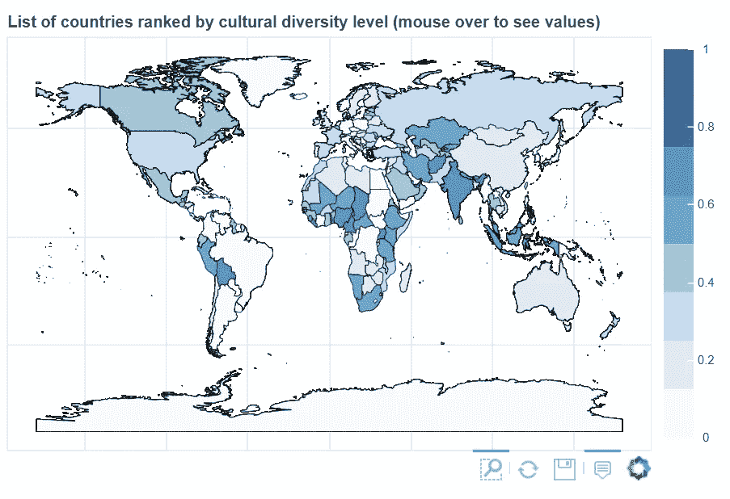
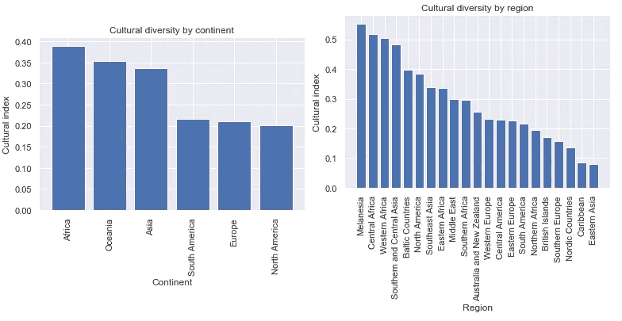

# “巴比伦效应”？

> 原文：<https://towardsdatascience.com/the-babylon-effect-3f2347d22474?source=collection_archive---------14----------------------->

> “不好意思，我来晚了，下雨了。”

空荡荡的办公室让我想起了加纳人用下雨作为迟到的正当理由。这也让我想到了斯大林主义者收紧劳动纪律的法律，在那里，未经授权的迟到 20 分钟甚至怠工都被视为旷工，这是一种刑事犯罪，可能会受到 6 个月苦役和 25%减薪的惩罚。对迟到和守时两种完全不同的看法，两个完全不同的民族。

在你的工作场所，你是否经历过来自不同文化的人对情况的反应不同？你可能会说，我们都是人，都有普遍的人类行为待遇，或者专业文化在所有文化中都很普遍，因此，“一刀切”的管理风格适合每个人，你可以像对待你的同胞一样对待他们。但在我看来，来自不同文化的人会因为不同的教养而对世界有不同的看法，作为团队领导/经理，不能假装文化差异不存在。

## 什么是文化和文化多样性？

根据荷兰社会心理学家海尔特·霍夫斯泰德的说法，文化是“将一个群体或一类人群的成员与另一个群体或一类人群区分开来的集体思维模式”我在这里谈论的是国家层面的文化/民族文化，即一套不同的信仰、价值观、符号、规范、传统、习俗、语言、宗教等。把一个国家统称为加纳人、俄罗斯人等。

## 与你何干?

尽管世界并不像人们描绘的那样是平的，但国际移民的增加是显而易见的。根据国际移民组织在其 2018 年世界移民报告中的数据，2015 年，全球估计有 2.44 亿国际移民(占世界人口的 3.3%)，比 2000 年的 1.55 亿人有所增加。由于许多公司在不止一个国家运营，你很有可能是这 2 亿多人中的一员，或者是和从他的祖国移居到你的国家的人一起工作。

研究人员对多样性的影响提出了相反的证据。如果多样性实施得好，它可以提供经验来源、创新思维、提高团队生产力等等。然而，当种族/文化背景的差异太大时，可能会破坏人们之间的交流，从而降低生产率。

## “巴比伦效应”或通过语言多样性衡量文化多样性

不同的文化多样性研究侧重于文化的一个组成部分，如民族、种族、宗教、文化等。一个广为流传的假设是，说相同或高度相关语言的群体也应该有相似的文化价值观。James D.Fearon 构建了一个文化细分指数，使用语言之间的结构距离作为一个国家群体之间文化距离的代理，从而对该领域的知识体系做出了原创性贡献。该指数从 1(表示人口讲两种或两种以上不相关的语言)到 0(表示全体人口讲同一种语言)不等(参见 https://eponkratova.github.io/cultural_diversity/T2 的互动文档)。

在洲一级，世界上最多样化的国家在非洲，其次是大洋洲。

喀麦隆、乍得和苏丹在语言多样性指数上排名最高，因为它们拥有众多的部落群体，而乌拉圭、多米尼加民众和阿根廷则被列为世界上最不多元化的国家。我没有在这个名单上的任何一个国家工作过，所以我想知道高度的文化多样性是否真的危及它的积极影响。

## 技术方面:

由于我来自一个非技术背景的人，我总是有这些问题:我可以在哪里存储我用于分析的底层文件？“我如何分享我的分析结果，并允许非技术用户与数据互动？”该项目的目标有两个:(1)使用 Bokeh 构建一个交互式可视化，(2)试验不同的共享选项，即上传到 Git 页面的独立 HTML 文档，本地运行的 Bokeh 应用程序，以及部署在 Anaconda Cloud 上的 Jupyter 笔记本。

完整代码请参考 GitHub 的[回购](https://github.com/eponkratova/cultural_diversity/blob/master/map.ipynb)；对于交互式 HTML 文档，请参考 [GitHub 页面](https://eponkratova.github.io/cultural_diversity/)。

为什么选择散景？ Bokeh 是一个 Python 交互式可视化库，面向现代 web 浏览器进行演示。它的目标是以 D3.js 的风格提供新颖图形的优雅、简洁的构造，并通过在非常大的或流数据集上的高性能交互来扩展这种能力。散景可以帮助任何人快速轻松地创建交互式绘图、仪表盘和数据应用程序。通过生成一个 HTML 文档和构建一个散景应用，有两种方法可以生成可视化效果(来源:【https://bokeh.pydata.org/】T2)。*我喜欢散景的什么？*它允许通过简单的命令快速构建复杂的图形。

*为什么选择 GitHub 页面？GitHub Pages 是一个静态站点托管服务，旨在直接从 GitHub 存储库中托管您的个人、组织或项目页面。GitHub Pages 并不旨在或被允许作为一种免费的虚拟主机服务来运行您的在线业务、电子商务网站或任何其他主要旨在促进商业交易或提供商业软件即服务的网站(SaaS)(来源:[https://pages.github.com/](https://pages.github.com/))。*我喜欢 GitHub 页面的什么？*方便、易于部署且免费。*

*为什么是蟒蛇云？* Anaconda Cloud 是 Anaconda 提供的一个包管理服务。云使得寻找、访问、存储和共享公共笔记本、环境以及 conda 和 PyPI 包变得容易(来源:[https://docs.anaconda.com/anaconda-cloud/](https://docs.anaconda.com/anaconda-cloud/))。我喜欢蟒蛇云的什么？Anaconda cloud 可以显示一个 jupyter 笔记本，其交互式散景代码运行良好。

**注意:**每个国家的语言数据集并不是包罗万象的，而是互联网上最全面的列表之一。“文化索引”列中的“0”实际上被 Earon 在原始数据集中指示为 0。“讲某种语言的人数”列中的“NaN”/“NaN”表示没有讲某种语言的人数信息。最后，这篇文章是作为我的散景项目的一部分准备的，不应该被视为一个适当的研究项目。