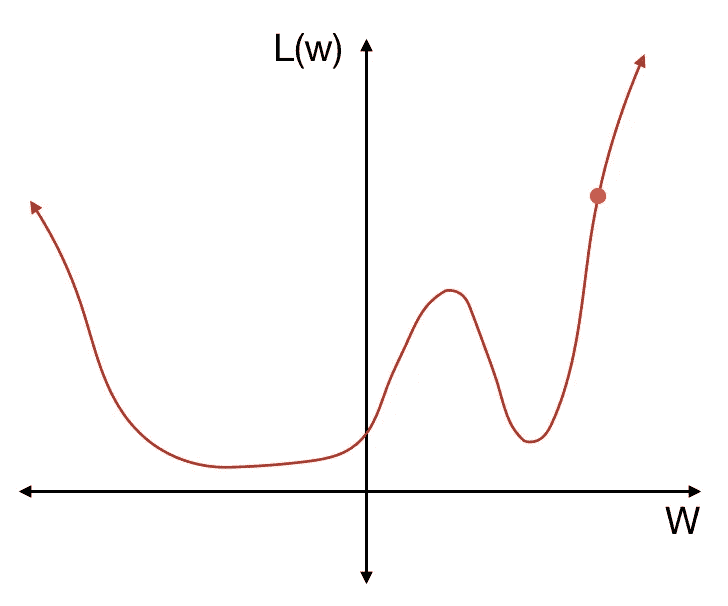
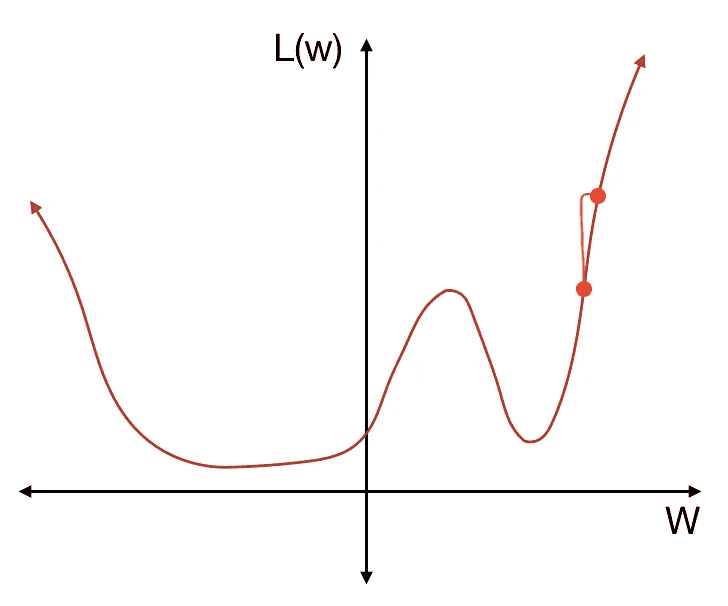
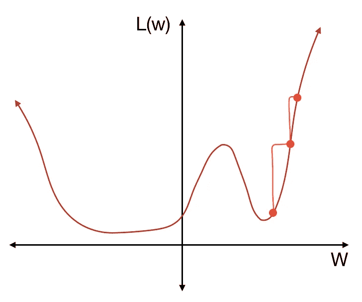
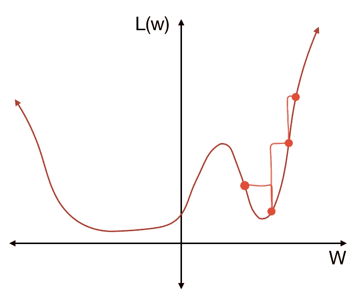
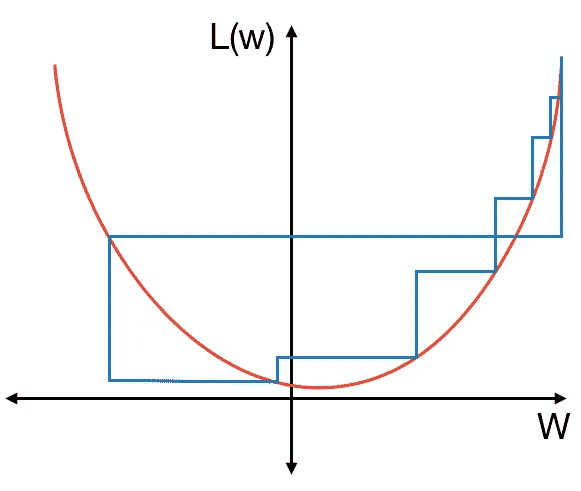
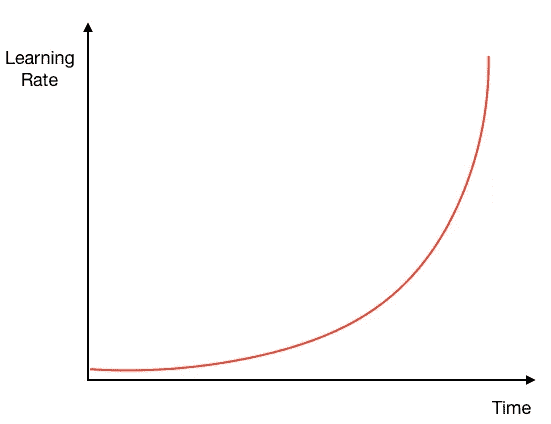
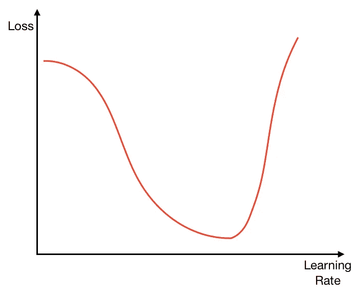
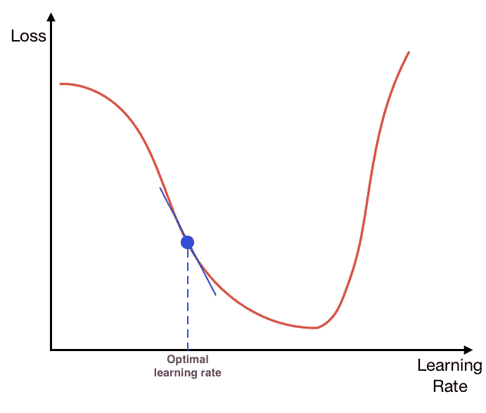

# 梯度下降初学者指南

> 原文：<https://towardsdatascience.com/the-beginners-guide-to-gradient-descent-c23534f808fd?source=collection_archive---------3----------------------->

在每个神经网络中，有许多权重和偏差连接不同层之间的神经元。通过正确的权重和偏差，神经网络可以很好地完成工作。在训练神经网络时，我们试图确定最佳的权重和偏差，以提高神经网络的性能。这个过程叫做“学习”。

最初，我们只是给网络一组随机的权重和偏差。这当然意味着网络不会很准确。例如，当给定一幅猫的图像时，如果一个区分狗和猫的网络对狗返回 0.7 的概率，对猫返回 0.3 的概率，那么它就不是非常准确的。理想情况下，它应该为狗返回 0 概率，为猫返回 1 概率。

为了告诉网络如何改变其权重和偏差，我们必须首先确定网络有多不准确。在狗对猫的例子中，它给出的猫的概率是 0.3，而正确的值是 1。我们可以取这两个值的差，对其求平方，产生一个正数，代表网络无法对猫图像进行分类，就像这样:(0.3–1)2 = 0.49。我们可以用图像是一只狗的概率做同样的事情:(0.7–0)2 = 0.49。然后，我们把两个值加起来:0.49+0.49 = 0.98。这是我们传入的单张照片的神经网络的*损失*。

**注:在只有两个输出(即猫或狗)的神经网络的这种 cast 中，概率差是相同的(在这种情况下，都是 0.49)。但是对于具有多个输出的网络(例如识别字母表的字母的网络，其将具有 26 个输出)，每个概率差异将是唯一的。*

我们现在可以用多个训练图像重复这个过程，每个图像给出不同的损失。一旦我们运行了所有的训练数据，我们就可以得到所有损失的平均值。这个平均损失代表网络的表现有多差，由权重和偏差的值决定。

因此，损失与权重和偏差的值有关。我们可以定义一个*损失函数*，它接受所有权重和偏差值的输入，并返回平均损失。为了提高网络的性能，我们必须以某种方式改变权重和偏差，以最小化损失。

尽管损失函数有多个输入，但更容易将其视为一个具有一个输入(权重)和一个输出的函数。在该图中，纵轴 L(w)代表损耗值，取决于权重。水平轴 w 表示权重值(多个权重，但是为了更好地形象化，我们可以想象只有一个权重)。

Image 1: Loss function

对于我们给定的初始随机权重，我们在损失函数的某一点。为了减少损失，我们不得不向局部最小值迈出一步。我们可以通过对函数求导(斜率)来做到这一点，如果它是正的，向左走一步，如果它是负的，向右走一步。在上面的例子中，我们看到该点的导数为正，所以我们向左移动一步(减小权重的值)。在数学术语中，如果原始权重为 xn，则新的权重为 xn+1 = xn+dy/dxnr。这里，r 是学习速率，或我们采取的步长。

Image 2: Taking a step down

在减轻重量并运行另一批图像后，我们现在有了更低的损失。我们再一次求导，并相应地改变权重，向局部最小值又迈进了一步。

Image 3: Taking another step towards the local minimum

让我们再重复一次同样的步骤。

Image 4: Stepping too far

哦不！这一次，我们走得太远了。所以，我们不得不再退一步，向局部最小值靠拢。

学习率(我们采取的步骤)越小，网络在达到局部最小值时就越准确。但是，小的学习率需要很多步骤才能达到最小值，这需要很多时间。另一方面，较大的学习速率更快，但不太准确。我们如何确定神经网络的最佳学习速率？

莱斯利·史密斯(Leslie Smith)在 2015 年发表的论文“训练神经网络的循环学习率(Cyclical Learning Rates)介绍了一种确定每个神经网络的最佳学习率的方法。用这种方法，我们首先从一小步开始:稍微移动重量。然后，我们第二次运行一批图像时，我们将权重移动一个稍大的量(迈出一大步)。每跑一次，我们就增加学习率，迈出更大的步伐，直到我们越过局部最小值，以更大的损失结束。下图对此进行了说明:

Image 5: Determining learning rate through taking larger and larger steps

开始时，步子很小。然后，我们逐渐增加改变权重的程度，直到我们超过局部最小值并跳出局部低谷。如果我们绘制学习率对时间的曲线，它看起来会像这样:

Image 6: Increasing learning rate

因为学习率随着一批图像的每次新运行而增加。

如果我们将损失与学习率进行对比，结果会是这样的:

Image 7: Loss as we increase learning rate every step

最初，损失缓慢减少，但随着学习率的增加，它开始下降得更快，直到它变得太大并螺旋脱离局部最小值，在这种情况下，损失再次开始快速增加。

Smith 建议我们选择损失减少最快的学习速率。换句话说，我们在损失-学习率图中选择损失仍在减少但斜率最大的点。

Image 8: Optimal learning rate

请注意，我们没有选择具有最低损失的学习率，因为这可能是它刚刚跳过我们的局部最小值的点。

当然，在上面的损失函数图中，我只画了一个权重来更好地形象化这个函数。实际上，有许多权重和偏差都会影响神经网络的损失。然而，梯度下降和寻找学习率的方法仍然是相同的。