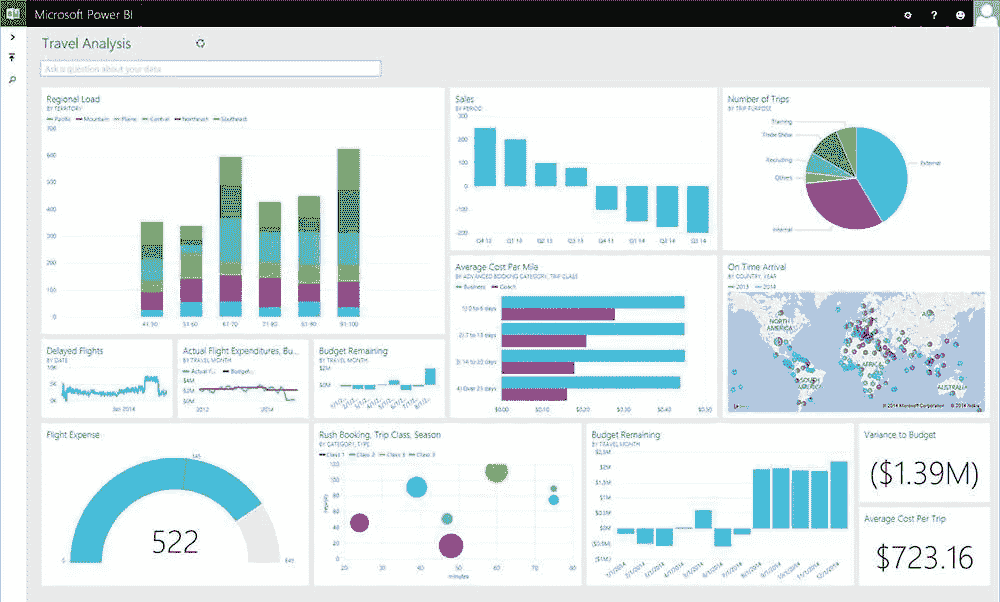
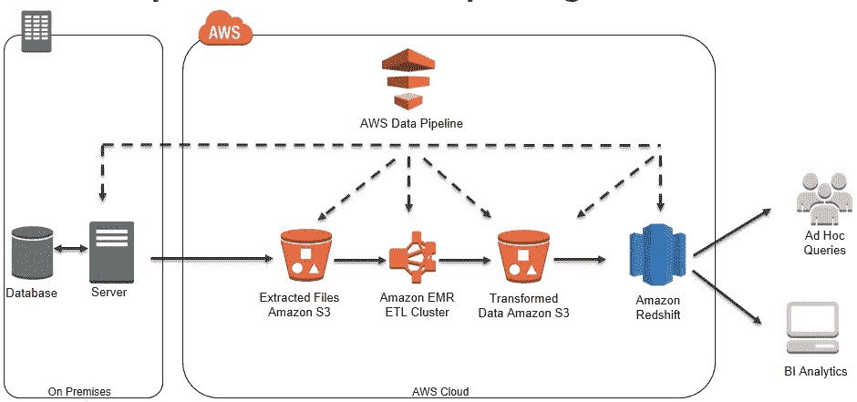

# 数据大爆炸

> 原文：<https://towardsdatascience.com/the-big-bang-of-data-6dce91ff12cf?source=collection_archive---------9----------------------->

## **确定对数据、信息和分析的业务需求**

Business Intelligence drives business

## 数据爆炸

随着技术的进步，创建的数据量正在快速增长。在整个 20 世纪 70 年代、80 年代和 90 年代，收集的大多数数据都是结构化的，并放在数据库中，而互联网、手机和智能设备等新兴技术正在产生比以往任何时候都多的数据。2013 年，IBM 写道，每天会产生 2.5 万亿字节的数据，据估计，到 2020 年将会产生 40 万亿字节的数据。但是，随着数据量的快速增长，数据的种类也在增加。从电子邮件、推文、图片、视频到音乐，一切都是数字化的，不仅存储在本地设备上，而且越来越多地存储在云中。寻求存储结构化和非结构化数据的新型方法，以便在世界各地的各种设备上随时可用。但也许最有趣的是我们现在依赖于正在生成的数据的速度。在过去，业务会被限制在数据可用时，这可能需要几个小时甚至几天，而现在，实时数据在不同的行业都是必要的，例如金融、营销和技术。

## **控制分析**

但是，随着数据的数量、种类和速度不断增加，对能够处理这些数据的分析的需求也在增加。尽管大多数公司都认识到在从销售流程到财务流程的每个流程中收集数据的重要性，但许多公司都被大量的数据所淹没，并且通常不知道如何有效地分析数据或将数据转化为足够及时的信息来采取行动。让事情变得更加复杂的是，业务的每个部分都依赖于从这些数据中得出的信息，这对业务有很大的影响。从管理管道的销售，到试图判断网站是否产生预期结果的营销，到最新的财务信息，甚至是跟踪员工满意度的人力资源。

## **分析的重要性**

企业不能低估其分析计划的重要性。虽然企业仍然需要具有直觉的领导者和决策者，但他们依赖数据来验证他们的直觉。从这个意义上说，数据成为了一个战略指南，帮助高管们看到他们可能没有注意到的模式。来自 [Bain](http://www.bain.com/publications/articles/big_data_the_organizational_challenge.aspx) 的一项研究发现，拥有最先进分析能力的企业远远超过竞争对手，领先企业展示了以下结果:

*   两倍的可能性在他们的行业中处于财务表现的前四分之一
*   决策速度比市场同行快五倍
*   执行决策的可能性是预期的三倍
*   在做决策时，使用数据的频率是平时的两倍

## **分析挑战**

随着越来越多的公司使用分析，分析的类型也变得越来越复杂。高级分析正在扩展，包括预测分析、数据可视化和数据发现。这现在需要一种新的精通数据的人，他们能够开发复杂的分析模型，而且了解业务领域，并以对业务人员有用的方式呈现结果，也就是所谓的数据科学家。随着越来越多的公司认识到他们需要数据科学家来领导他们的分析工作，开放的职位远远超过了数据科学家的实际可用性，导致工资和员工流失的增加。

## **分析策略**

随着我们认识到数据的爆炸式增长以及将数据转化为信息的需求对当今经济中的企业至关重要，对分析策略的需求变得更加明显。由 [Forrester](https://www.forrester.com/report/Customer+Data+Should+Be+The+Lifeblood+Of+Your+Enterprise/-/E-RES99101) 发布的一份报告描述了商业智能分析如此重要的原因:

*   许多商业决策仍然基于直觉，而不是事实
*   分析减少了直觉和事实决策之间的不连续性
*   竞争优势可以通过更复杂的数据使用来实现
*   大数据支持新的用例，但需要分析来充分利用其潜力

为了充分利用分析的力量，企业需要基于其业务人员如何与数据交互和使用数据的策略。分析策略可能包括:

*   设计支持报告、分析、预测建模和自助 BI 的数据架构
*   构建 BI 产品组合
*   设计具有数据发现、数据可视化和内存 BI 的解决方案
*   支持运营和分析 BI
*   设计和实现分析沙箱和中枢
*   创建数据和分析治理计划
*   创建共享 BI 元数据环境

但最重要的是，分析策略需要有一个目标，这个目标来源于业务目标，并且应该用信息支持业务人员实现这些目标。

PowerBI Dashboard

## **数据和信息的区别**

即使数据和信息这两个词经常被用来表示同一件事，但实际上这两者之间有很大的区别。数据是原始的、随机的和无组织的，而信息是经过组织、结构化和处理的数据。举一个更具体的例子，在线支付有很多细节，包括时间戳、卡类型、商家 id 和数十个其他字段，在收单机构和发卡行之间来回发送的原始数据存储在平台内的数据库中。直到采取措施将数据移动到 ETL(提取、转换和加载)系统中，数据才被转换成信息。最后一步是将信息转化为知识。业务人员使用报告中的信息来获取知识，帮助他们做出明智的业务决策。

AWS Analytics Process

## **商业智能在创建可操作信息中的作用**

商业智能(BI)将数据转化为“可操作的”信息，即对业务有用并帮助 it 获取知识的信息。随着业务的快速变化，对能够为业务人员提供能够产生可操作见解的信息的工具的需求比以往任何时候都更加重要。直到十年前，大部分数据主要存储在结构化(SQL)数据库中，而今天，BI 工具需要能够处理各种类型的数据(结构化、非结构化和半结构化)，并将其转化为信息。此外，这些年来，向最终用户交付信息的方式也发生了变化。商务人士现在比以往任何时候都更加移动，而不是通过台式机或笔记本电脑访问信息，用户的期望是 BI 工具能够支持智能手机和平板电脑等移动设备。

向业务人员提供数据库访问权限和提供 BI 的区别在于目标的不同。数据本身并不提供任何见解，但通过将数据转化为信息并提供必要的见解来做出决策以实现公司目标的战略，业务人员可以验证他们的观点，并确保业务朝着既定目标前进。

## 感谢阅读；)，如果你喜欢它，请点击下面的掌声按钮，这对我意义重大，也有助于其他人了解这个故事。通过在[推特](https://twitter.com/dwaynegefferie)或 [Linkedin](https://www.linkedin.com/in/dwaynegefferie/) 上联系让我知道你的想法。或者关注我，阅读我关于数据科学、支付和产品管理的每周帖子。