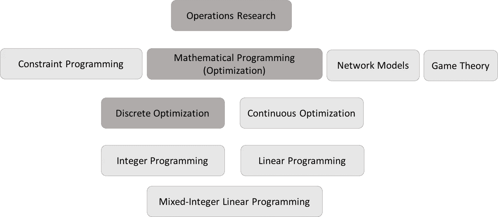
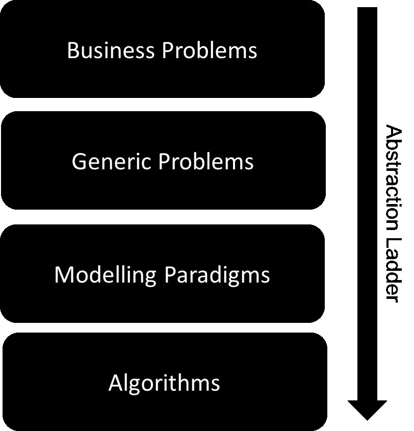
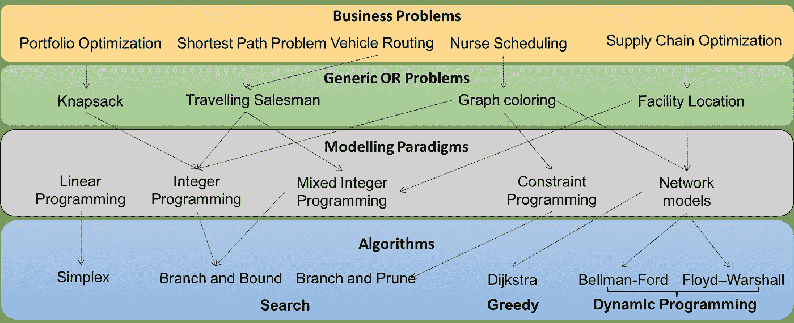

# 运筹学的大图景

> 原文：<https://towardsdatascience.com/the-big-picture-of-operations-research-8652d5153aad?source=collection_archive---------3----------------------->

运筹学可能是一个非常混乱的研究领域，进入门槛很高。我认为这个问题的部分原因是使用了令人困惑的术语和古老的术语。

当我开始学习运筹学时，我花了很多时间试图看到全局。我记得这不是一个微不足道的任务(本来应该是)。

在这篇博文中，我将试着描绘出运筹学的大图景，希望你们中的一些人会觉得有用。

## 运筹学、数学规划和离散最优化

运筹学是研究**如何高效决策**。数学规划是运筹学中最强大的技术之一，有时这两个术语可以互换使用。**数学编程中的编程与计算机编程无关，在英国用法中是最优化的意思。**离散优化(或者你也可以称之为编程)解决变量只能取离散值(例如，整数值)的问题。

Figure 1: Operations Research, Mathematical Programming, and Discrete Optimization

# 实践中的运筹学

运筹学从业者每天都在解决现实生活中的问题，为人们节省金钱和时间。这些问题多种多样，而且几乎总是互不相关。然而，他们的本质总是相同的，以最有效的方式做出决策来实现目标。从了解客户的业务问题到找到解决方案的过程可能充满挑战。总的来说，这个旅程可以分为以下四个层次

Figure 2: Four layers of abstractions to solve Operations Research problems

## 商业问题

当我第一次听到“企业问题”这个术语时，我很自然地被误导，认为它们是企业存在的问题。后来，我对这个词的理解发生了变化，我意识到它的意思略有不同。这一层更好的名字应该是**真实世界应用**。商业这个术语的意思是指出眼前的问题还不是一个数学问题，而是一个更具体的，不太正式的，现实生活中的挑战。

商业问题最好用自然语言表达(比如英语)。它们源于工业中的问题，因此用外行的术语与从业者交流。因此，形式化这些问题并将其降低到更低的抽象层次是 OR 从业者的责任。实际上，这是一个迭代过程。

商业问题的例子可以在不同的行业中找到。你将听到的大多数商业问题都来自于物流行业。以下是一些例子:

*   我是医院经理，如何给医院员工分配班次？
*   我是一家货运公司的经理，我应该按什么顺序安排送货？
*   我要开一家制造公司，我应该把工厂设在哪里？

## 一般性问题

当运筹学第一次被发明出来时，数学家们认识到他们遇到的大多数商业问题都可以被映射到一系列较低层次的普通问题上。因此，他们投入了大量的时间和带宽来研究这些问题，给它们起了具体的名字，并提出了解决方案。我认识的大多数 OR 实践者(包括我自己)将大部分时间花在将业务问题转化为这些众所周知的一般性问题的过程上。一旦你到了那个阶段，解决问题或多或少会成为标准程序。

一般运筹学问题足够简洁，可以用数学符号来描述。然而，运筹学从业者通常使用高级建模语言来表达这些问题。

以下是一些例子:

*   旅行推销员问题(TSP)
*   最短路径问题(SPP)
*   集合覆盖问题
*   图的着色问题

作为高级建模语言的一个例子，调度问题通常使用像**活动、资源**和**优先约束这样的术语来描述。**

## 建模范例

我们讨论了如何使用高级语言来表达一般运筹学问题。这些符号通常是特定于问题的。例如，资源和活动可以用来描述调度问题，但不能用来描述 TSP。然而，您可以使用许多建模范例来描述任何这些一般的或问题(或谨慎的优化问题)。

建模范例是一组规则和实践，允许您使用较低级别的数据结构(如矩阵)来表示较高级别的问题。

当使用建模范例时，OR 从业者使用数学符号或代数建模语言(AML)来表达问题，该语言将这些数学符号转换成矩阵，以传递到抽象的最后一级，即算法。

运筹学中最著名的建模范式是**线性**、**整数**和**混合整数规划**。这些是可以使用线性等式约束来表达问题的建模范例。这是描述最优化问题的一种非常强大和自然的方式。

**约束编程**是另一个最近很流行的范例，特别是对于调度应用程序。

**网络模型**也是基于图论的众所周知的建模范例。这种范式对于建立对问题的良好直觉特别有用，并且可以以有效的方式表示各种各样的谨慎优化问题。

## 算法

算法是一个过程或一系列步骤，如果遵循它就可以解决问题。一些算法普遍存在于计算机科学的所有领域，如搜索和排序，而其他算法则面向更具体的问题。

搜索算法在解决运筹学问题中非常重要。顾名思义，他们正在寻找解决方案。在运筹学中，一系列被称为“分支和 X”的算法被用来解决整数、混合整数和约束规划问题。最基本的例子就是求解整数程序的**分支&限界**算法。其他包括分支&切割、分支&修剪和分支&价格(又名列生成)。

**动态规划**算法在运筹学中同样重要。这一系列算法通过利用它们的**最优子结构**来解决问题。更简单地说，如果一个问题可以用一堆相同的任务来解决，我们就解决其中的一个任务，并将结果存储在一个表中。当我们遇到下一个同样的子问题时，我们只是查找答案，而不是重新计算。这对于解决图形问题非常有帮助。最著名的例子是贝尔曼-福特算法，以动态编程之父理查德·贝尔曼的名字命名。

有时候，问题太难了，无法以最佳方式解决，我们只需要找到一个快速的解决方案。贪婪算法被用来完成这项任务。它们通常不能保证最优(但有时可以)，但它们可以非常快。最著名的例子就是 Dijkstra 的求最短路径问题的算法。如果满足一些假设，Dijkstra 就能保证找到最短的路径。

Figure 3: Four layers of abstractions to solve Operations Research problems with concrete examples.

# 摘要

在这篇博文中，我对运筹学做了一个高层次的非正式描述。我个人认为，在深入研究细节之前，记住任何领域的大局总是有用的。期待您的反馈和意见！

# 参考

*   Roughgarden，t .， *Coursera* ，2018 年 8 月查看，<[https://www.coursera.org/specializations/algorithms](https://www.coursera.org/specializations/algorithms)>
*   [范亨腾里克](https://www.coursera.org/instructor/~1289035)，p .【离散优化】， *Coursera* ，<[https://www.coursera.org/learn/discrete-optimization](https://www.coursera.org/learn/discrete-optimization)>。
*   弗兰克，巴德尼克，麦克利威·丹尼斯和莫杰纳·理查德。“管理运筹学原理”。" (2003): 300–353.