# 皮尔逊相关性和投资组合“贝塔”的信息论替代方案

> 原文：<https://towardsdatascience.com/the-black-swans-in-your-market-neutral-portfolios-part-ii-20dc2299374a?source=collection_archive---------12----------------------->

本文是本文的第二部分，阐述了在评估投资组合风险时，考虑非线性和时间相关性的实际重要性，而广泛采用的(皮尔逊)相关系数未能做到这一点。

在[第一部分](http://bit.ly/2KL5Dxw)中，我们提供了皮尔逊相关性的基本介绍，它与线性回归和投资组合*贝塔*的关系，以及它在衡量资产间相关性方面的局限性。

在这篇文章中，我们提供了资产回报的独立同分布高斯假设不适用于美国股票和期货的经验证据，并且我们提出了皮尔逊相关性的替代方法，即 ***信息调整相关性*** ，它测量时间序列(而不是随机变量)之间的关联，同时充分捕捉非线性，更重要的是，时间结构。然后，我们使用信息调整相关性来构建相对于市场的投资组合的(CAPM 的) *beta* 的信息论替代方案，我们称之为 ***信息调整 beta*** 。

# 用信息论测量时间序列关联

*注:本节中的所有对数均以 2 为基数。*

> 熵作为不确定性的度量

被建模为随机变量的复杂系统中包含的信息量通常被定义为与其相关的随机变量中的不确定性的量。

测量随机变量中的不确定性是一个和信息论本身一样古老的问题。这个问题的规范解决方案是信息论之父 Claude Shannon 在他的开创性论文**中引入的 ***信息*** ***熵*** 的概念，他在论文中专注于离散随机现象(即那些取可数个值的现象)。**

**

*The entropy of a probability distribution with density function **p** with respect to a base measure **dμ.** The entropy of a random variable is that of its probability distribution.*

*Shannon 为离散随机变量引入的信息熵概念后来被推广到任何随机变量。*

*一个重要的相关度量就是所谓的 ***条件熵。*** 直观上，随机变量 ***y*** 给定 ***x*** 的条件熵是关于随机变量*y***x***的剩余信息量/不确定性。**

**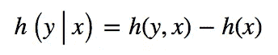**

**Conditional entropy of y given x**

**更具体地说，就是 ***y*** 和 ***x*** 中存在的不确定性(或熵)的总量与 ***x*** 中存在的不确定性的总量之差。**

**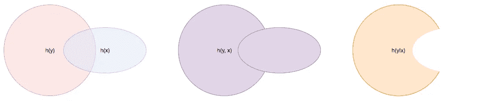**

**Venn diagram illustrating the link between entropies, joint entropy, and conditional entropy**

**如上面维恩图所示， ***y*** 和 ***x*** 包含的信息量总和很少是*和 ***x*** 包含的信息量总和，因为在 ***y*** 和***x***之间可能存在信息冗余***

**使用熵作为信息度量的一个优点是，给定 ***x*** 的条件熵永远不会大于****的条件熵，当且仅当 y 和 x 是独立的*** 时，两者相等(即两者之间没有任何关联***

**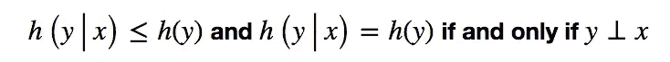**

**The notion of conditional entropy fully captures independence between two random variables**

**与皮尔逊相关不同，条件熵捕捉随机变量之间的线性和非线性关联。**

**关联的一个相关度量是在*和 ***x*** 之间的 ***互信息*，其被定义为*y*y*****给定的 ***x*******

**事实证明，如果我们假设 ***y*** 和 ***x*** 是独立的，即所谓的 [Kullback-Leibler 散度](https://en.wikipedia.org/wiki/Kullback%E2%80%93Leibler_divergence)，这个量与一个正式且流行的统计测量值相符。**

**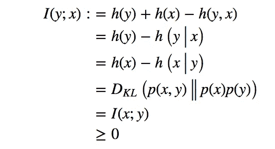**

**Relation between the mutual information between two random variables, their conditional entropies, and the KL-divergence between their joint distribution and the product of its marginals.**

***简而言之，即使我们假设资产回报是独立同分布的，我们也可以借用信息论来构建一个关联度，与皮尔逊相关度不同，它可以完全捕捉线性和非线性关联。***

> **熵率作为时间序列中信息的一种度量**

**时间的概念在经济学和金融市场中扮演着太重要的角色，以至于人们不相信顺序无关紧要，也不相信同样的随机现象会不断重复。简单地说，假设收益是独立同分布的，通常是错误的。模拟金融市场的自然概率抽象是*随机过程*或*时间序列*的概念，而不是*随机变量*的概念。**

**时间序列基本上是带有时间戳的随机变量的集合。**

**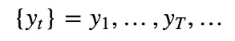**

**幸运的是，通过时间序列的熵率概念，将*熵*和*条件熵*的概念扩展到时间序列**

**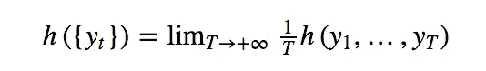**

**给定一个时间序列的条件熵率**

**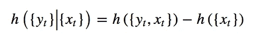**

**他们的解释非常相似。 ***熵率*** 衡量一个时间序列在单位时间内产生的信息量。 ***条件熵率*** 衡量的是一个时间序列在单位时间内产生的新信息的数量，这些信息是另一个时间序列中尚未包含的。**

**与随机变量的情况类似，一个时间序列的熵率与其给定的另一个时间序列的条件熵率之间的差异反映了每单位时间内两个时间序列之间共享的信息量。**

****

**The amount of information shared between time series {x} and {y} per unit of time is equal to the rate of KL-divergence between the joint process of {x, y}, and the product of coordinate processes {x} and {y} (i.e. the joint process stripped out of any association between coordinate processes {x} and {y}). It is also equal to their rate of ‘mutual information’.**

**至关重要的是，条件熵率的概念远远超出了对应于同一时间的样本的线性关联，并且捕获了两个时间序列***之间的线性或非线性以及跨时间的任何关联。*****

**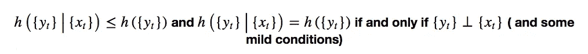**

**The notion of conditional entropy rate fully captures independence between two time series**

> **成对增量多样化作为资产间依赖的一种度量**

**在我们的[黄皮书](https://github.com/devisechain/Devise/blob/master/yellow_paper.pdf)中，我们将一项资产加到另一项资产上的多样化量定义为收益时间序列的*互信息时标*(互信息比率的倒数):**

**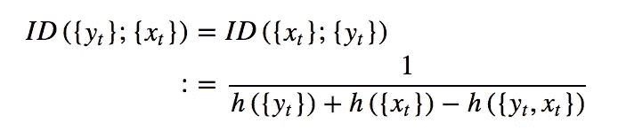**

**直观地说，这个量可以被解释为看到两种资产之间的 1 比特共享信息(或者等价地，它们的回报时间序列)平均需要的时间量。两种资产的相关性越低，观察它们的收益时间序列之间的 1 比特互信息所需的时间就越长。类似地，两个资产越相关，看到两者之间 1 比特的共同信息所花费的时间就越少。**

***增量分散始终为正，并在 0(当一个时间序列的回报可以完全从另一个时间序列中确定)和+∞(当两个时间序列的回报是独立的)之间变化。***

> **从增量多样化到信息调整相关性**

**敏锐的读者肯定已经注意到，我们没有做出任何具体的分布假设，以确保我们的*增量多样化*概念完全捕捉到两个时间序列的收益之间的任何形式的关联，线性或非线性，同时或跨时间。此外，可以从经验证据中估算增量多样化，而无需进行任何任意分布假设(更多详细信息，请参见[黄皮书](https://github.com/devisechain/Devise/blob/master/yellow_paper.pdf) our)。**

**现在，事情是这样的。我们知道，在独立同分布高斯分布的情况下，皮尔逊相关足以描述任何形式的关联，无论是线性的还是其他形式的。这就引出了一个问题:在独立同分布高斯分布的情况下，增量多样化和皮尔逊相关之间的函数关系是什么？事实证明，答案是封闭的:**

**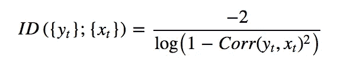**

**Relationship between incremental diversification and Pearson’s correlation when time series of returns are assumed jointly Gaussian and memoryless.**

**我们也可以反过来问。假设[我们知道如何准确估计增量多样化](https://github.com/devisechain/Devise/blob/master/yellow_paper.pdf)，在独立同分布高斯假设下，估计的增量多样化值对应的皮尔逊相关系数是多少？这个问题的答案——通过反演上面的等式获得——就是我们所说的 ***信息调整相关性*** 。**

**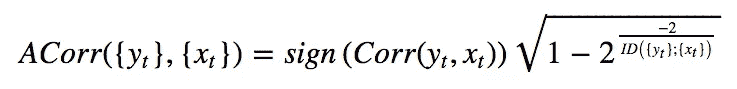**

**The information-adjusted correlation between two assets with time series of returns {y} and {x} is the Pearson’s correlation coefficient that, under the possibly incorrect i.i.d. Gaussian assumption, would produce an accurate measure of incremental diversification.**

**然后，我们可以独立地估计皮尔逊相关性，并将其与信息调整相关性进行比较。如果高斯 i.i.d .假设成立，那么这两个值应该很接近！**

# **一种简单实用的黑天鹅检验**

**这听起来不错，但你可能会问，黑天鹅在哪里？好吧，如果这篇文章有什么实际的收获，那就是:**

*   **阅读我们的[黄皮书](https://github.com/devisechain/Devise/blob/master/yellow_paper.pdf)，找出如何从数据中估算 **ACorr** 。**
*   ****案例一:ACorr ≈ Corr:** 如果你观察到信息调整相关性(近似)等于皮尔逊相关性，那么 i.i.d .高斯假设成立，你可以相信你最喜欢的线性 i.i.d .因子模型。**
*   ****案例二:|ACorr| < |Corr|:** 对不起，你的代码有一个 bug！这在数学上是不可能的。**
*   ****案例三:|ACorr| > > |Corr|:** 红旗！你的投资组合中有很多风险，无论是皮尔逊相关性还是你最喜欢的线性独立同分布因子模型都没有考虑到，这将在市场大幅波动时给你带来沉重打击。你在这些资产中的任何投资组合，你认为是市场中性的，很可能根本不是市场中性的！**

# **这些都重要吗？你打赌它是！**

**如前所述，如果我们绘制一些资产对的信息调整相关性与皮尔逊相关性，任何与 y=x 线的显著偏离都强烈表明资产回报的独立同分布高斯假设不成立。**

**好吧，我们就这么做吧。让我们把 S&P 100 指数成份股和 60 指数最具流动性的美国期货(用后向比率法连续调整的前一个月)视为整个资产。对于宇宙中的每一对资产，我们计算它们每日回报之间的皮尔逊相关性和它们每日回报之间的信息调整相关性，我们在散点图中绘制一个对另一个，我们得到下面的图表。**

**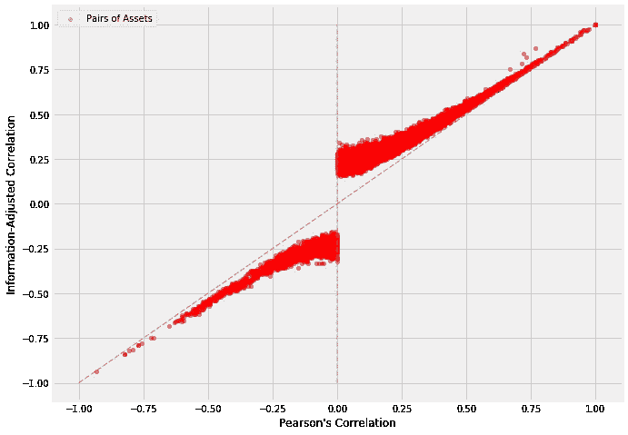**

**Relation between Pearson’s correlation and information-adjusted correlation for S&P 100 stocks and 60 of the most liquid U.S. futures. Information-adjusted correlation are estimated using the maximum-entropy approach described in our Yellow Paper.**

**我们来分析一下图表。**

****观察 1:** 我们看到皮尔逊相关性越接近 1(分别为。-1)，信息调整相关性越接近 1(分别为-1).这很直观。皮尔逊相关性捕捉到了对应于相同时间的回报之间的线性关联。这种特定形式关联的有力证据 ***确实暗示了*** 潜在时间序列回报之间关联的有力证据，这就是信息调整相关性所捕捉到的。**

****观察结果 2:** 然而，我们看到，信息调整相关性不会像皮尔逊相关性那样变为 0。直觉上，缺乏对应于相同时间的日收益率之间线性关联的证据(即弱皮尔逊相关性) ***通常并不意味着日收益率的两个基本*时间序列*之间缺乏关联的*** 证据。这在联合高斯白噪声的特殊情况下是正确的，但在一般情况下肯定不是。一般而言，可能存在其他形式的关联(例如，非线性关联、时间依赖性等。)将被信息调整相关性而不是皮尔逊相关性捕获。**

**上面的散点图明显偏离 y=x 线的事实是充分的经验证据，表明 i.i.d .高斯假设对美国股票和期货的日收益率不成立！**

***主要观察:**你看到纵轴上那些皮尔逊相关为 0 的配对了吗？都没有 0 信息调整相关性！流动性交易所交易美国资产之间 0 的皮尔逊相关性可以隐藏高达 0.3 的“真实”相关性，这只能通过非线性(即厚尾)或时间相关性(即蝴蝶效应)产生，这两种情况都可能是黑天鹅事件的来源。*

**基本上，线性 i.i.d .因素模型不能准确捕捉美国股票和期货的流动性风险！**

# *信息调整投资组合 Beta*

*正如在[第一部分](http://bit.ly/2KL5Dxw)中所讨论的，一个投资组合的(CAPM 的)*β*可以如下获得*

*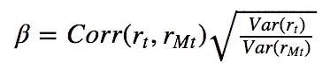*

*Beta of a portfolio relative to the market*

*通过用信息调整相关性代替皮尔逊相关性，获得了这种度量的简单概括，以捕捉投资组合的收益和市场的收益之间的非线性和时间相关性。我们称由此产生的度量 ***为信息调整的投资组合 beta*** 。*

*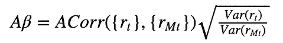*

*Information-adjusted beta of a portfolio relative to the market*

**以上讨论的一个直接后果是，* ***一个信息调整后 beta 为 0 的投资组合*** *具有独立于市场的收益率时间序列，因此* ***是真正独立于市场的*******真正的市场中性*** *。***

# **最后的话**

**在我们的[黄皮书](https://github.com/devisechain/Devise/blob/master/yellow_paper.pdf)中，我们介绍了皮尔逊相关性的一种信息论替代方法，即 ***信息调整相关性*** ，它以一种无模型的方式完全捕捉了*时间序列收益率*之间的非线性和时间相关性。**

**我们使用*信息调整相关性*来构建投资组合的 CAPM 贝塔系数的替代方案，即 ***信息调整贝塔系数*** ，它捕捉投资组合和市场之间的任何关联(线性和非线性，同时，或跨时间)。**

**我们说明了资产回报的独立同分布高斯假设与美国股票和期货的经验证据不一致，这证明了信息调整替代方案的实际重要性。**

**至关重要的是，我们说明了皮尔逊相关性、CAPM 的贝塔系数和其他独立同分布线性因子模型可以隐藏大量的金融风险，这些风险将显示为黑天鹅事件。**