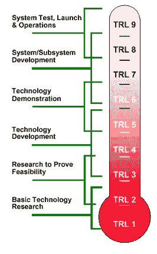
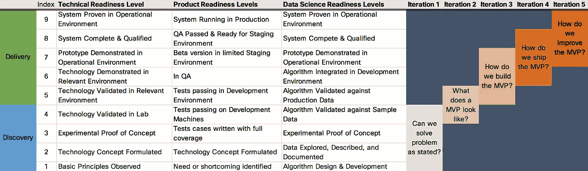

# 对数据科学就绪级别的要求

> 原文：<https://towardsdatascience.com/the-call-for-a-data-science-readiness-level-3355d6d8a1bb?source=collection_archive---------11----------------------->

NASA Technology Readiness Levels

20 世纪 70 年代，美国宇航局开发了[技术成熟度等级(TRL)](https://en.wikipedia.org/wiki/Technology_readiness_level) 量表来衡量**尖端技术**的研发。其目的是在收购过程中评估技术的成熟度，从 1 到 9 分不等，9 分是最成熟的。TRL 支持对不同类型技术的技术成熟度进行一致、统一的讨论。

这一概念为寻求许多政府机构资助的研究人员所熟知，但似乎在其他工程应用中失去了青睐。随着人工智能、机器学习和数据科学领域不断增长的**前沿发现**，本博客将探索如何使用这一尺度来衡量进展，并通过将数据科学项目与 TRL 尺度上的价值联系起来，指导数据科学项目的成功。

这种尺度在[站点可靠性工程](https://en.wikipedia.org/wiki/Site_Reliability_Engineering)和数据科学中的应用，最初是由 Emily Gorcenski 在关于[与数据科学全面融合:使用技术准备度](https://www.youtube.com/watch?v=huqpXMNFD54)的精彩演讲中提出的。如果你有 30 分钟，她的谈话绝对值得你花时间！

她很好地消除了“全栈”或“独角兽”数据科学家的神话，以及您实际上如何需要一个“全栈”团队**和专门角色映射到数据消费周期和 TRL 的每个阶段。她借鉴了站点可靠性工程的原则，并整合了 TRL，以构建一个可靠的计划来界定和执行数据科学工作。**

值得思考的一些要点:

Data Science Readiness Levels mapped

# 发现与交付

在宏观层面上，数据科学项目实际上只有两种类型。发现/研究与交付。

在一个发现项目中，你在 1 到 4 的 TRL 范围内工作，并关注诸如“我们能解决陈述的问题吗？”。整个项目都在探索新的算法、数据集、技术等。看看陈述的问题是否可解。这些类型的项目通常被数据驱动的团队孤立，并且可能没有一个负责的项目发起人来交付项目的成果以从中提取真实的价值。

在分娩项目中，您的工作地点在 TRL 5 至 9 英里范围内。这些项目**必须**有一个专门的项目发起人，该发起人有权将项目成果转化为现有/新的工作流程/流程，以“将数据转化为金钱”。一旦我们有权力实现一个结果，数据科学团队就可以无缝地利用这个结果，并捕获反馈环来构建一个持续学习的模型。

如果您曾经涉足过数据科学项目，您会发现这两类项目之间的鲜明对比。然而，大多数分析工作流都是这样对待它们的！使用项目附带的 TRL 量表有助于为参与项目的每个人设定适当的期望。

# 结果比“将数据转化为金钱”更精细

虽然最终目标总是回到美元，但这些应该只关注处于“交付”阶段的项目(即 TRL 5-9)。当开始一个“发现”项目(即 TRL 1-4)时，您应该对结果*如何被一个*确定的*赞助方消耗*有一个愿景，但它不是该阶段项目的主要焦点。在某些情况下，您甚至可能还没有一个投入的赞助者购买这个项目！要求数据科学家团队量化这些早期 TRL 中项目的投资回报率是不合适的，也是徒劳的。

即使项目进入“交付”阶段，数据科学团队也可以帮助项目发起人量化结果的价值，以及如何将其转化为业务价值和/或货币化。但是，这方面的主要驱动力仍然必须来自项目发起人。“将数据转化为金钱”的最佳例子来自嵌入式数据科学团队，因为他们都是主题专家，并且能够提供结果。

# 对于每个工作周期，要知道你的准备程度从哪里开始，并为它的结束设定现实的目标

在我有幸参与的大多数数据科学团队中，他们喜欢支持[敏捷方法](https://en.wikipedia.org/wiki/Agile_software_development)并使用短期 [Sprints](https://en.wikipedia.org/wiki/Scrum_(software_development)#Sprint) 进行项目执行。然而，sprint 计划中缺少的是关于我们在哪里，以及在 sprint 结束时我们将在哪里的清晰沟通。

我见过 [DMAIC](https://en.wikipedia.org/wiki/DMAIC) 、 [CRISP-DM](https://en.wikipedia.org/wiki/Cross-industry_standard_process_for_data_mining) 、 [CAP](https://www.certifiedanalytics.org/) 以及许多其他尝试过的方法，但没有一个像 TRL 量表那样简洁地抓住了短跑的本质。而不是详细说明你的项目当前所处的阶段的循环性质，以及它如何在任何时候恢复到先前的阶段；向赞助商传达我们目前在 TRL 1，并希望在这个冲刺阶段结束时在 TRL 3，这要容易得多。

拥有 TRL 等级也清楚地设定了对项目结果感兴趣的所有各方的期望。以及他们如何在堆栈中向上移动项目的清晰路径。

尽管任何数据科学团队都可以在 TRL 协议 4 之前执行发现和探索性分析，但这需要赞助商做出更多投资和硬性承诺。光靠数据科学只能解决一半的数据货币化工作。TRL 等级的可视化在传达任何数据科学项目的协作本质方面做得非常好。

在 TRL 5–7 计划中，我们开始将数据科学项目的成果集成到一个确定的工作流中，以增强决策者的流程。这可以是完全自动化的，或者你可以得到帮助人类工人的结果。工作流和流程是需要由发起人确定的项目，以及来自那些消费结果的人的承诺，他们接受过培训并且能够正确地解释结果。

没有赞助商和消费者的承诺，就不可能超越 TRL 协议 4，也不可能从数据中实现货币价值。通过将这些期望与 TRL 量表联系起来，它成为了与你的赞助商合作的一个强有力的工具。

# 不同的准备程度需要不同的技能

Machine Learning Engineer

每个 TRL 都需要不同的技能来完成手头的任务。确保你有正确的团队来解决这个问题。在工作周期开始时，让你的目标 TRL 需要的赞助商和利益相关者参与进来。

这就是数据科学团队的团队方面真正发挥作用的地方。伟大的领导者会在适当的水平上利用个人的优势，并使用 TRL 量表作为个人/职业发展的路线图，帮助你找到自己的弱项。虽然没有“全栈”数据科学家这样的东西，但你仍然可以通过培训成为一名数据科学家。你从其他 TRL 那里了解的越多，你就能为这个项目增加越多的价值！

# 这个过程不是单调的

与其他项目方法类似，随着项目的进展，我们可以上下移动 TRL 尺度。仅仅因为我们在一次冲刺中达到了 TRL 5，并不意味着我们不能在下一次冲刺中回落到 TRL 3。因为大多数机器学习算法和云技术都在不断发展，有时我们需要重新评估之前的预期，并做出相应的调整。

# 失败是正常的！一些工作有一个最高准备水平

失败是正常的。事实上，我会把这个想法进一步阐述为“失败是意料之中的”在我的职业生涯中，我变得愤世嫉俗，以至于我通常带着这样的心态对待每个项目，即它根本不适合数据科学。有时项目只是一个想法，没有任何可用的支持数据。更糟糕的是，这可能仅仅是一种在仪表板上添加“机器学习”的尝试。除了教育赞助商什么是可能的，我们还可以教育他们如何获得部署的解决方案，以利用 TRL 规模实现其数据的价值。

有了 TRL 规模，现在就变成了说明项目在规模上所处位置的问题。这个晴雨表清楚地传达了项目在当前数据集、技术、工作流、流程等条件下能走多远。如果项目停滞在某个水平上，并且如果发起人在项目上投入足够多，他们会发现消除障碍的方法来得到团队需要的东西。否则，团队可以干净利落地脱离，继续下一个项目。不是每个项目都会达到完全成熟和部署。

# 后续步骤

使用 TRL 量表解决了在数据科学项目领域工作的许多挑战。如果你正在读这篇文章，我鼓励你在下一个项目中使用这个量表，看看它会引发什么类型的讨论！