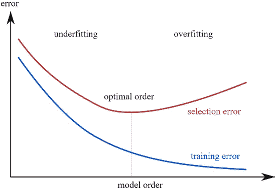

# 机器学习的多变模型

> 原文：<https://towardsdatascience.com/the-capricious-models-of-machine-learning-23cd2f36dbbe?source=collection_archive---------5----------------------->


Photo by [Marten Newhall](https://unsplash.com/photos/uAFjFsMS3YY?utm_source=unsplash&utm_medium=referral&utm_content=creditCopyText) on [Unsplash](https://unsplash.com/search/photos/funny?utm_source=unsplash&utm_medium=referral&utm_content=creditCopyText)

> 这个标题充分说明了机器学习中模型拟合的问题。伙计，统计学对建模有着非常不同的看法，这与我们的认知并不完全一致。

# T 何发出:

机器学习中的这些模型有一个很好地拟合数据的问题。这两个问题是:

O 拟合:**模型很好地吸收了数据**，并完美地拟合了数据，有效地使*平均误差*比例非常小，几乎完美。听起来像是天赐之福，但事实并非如此。我们不希望我们的模型过于完美。数据集就像腐败的政客一样，隐藏着一些肮脏的东西。它们通常既不是线性的，也不是弯曲的。它们有某种粗糙的形状，但几乎从来没有完全符合几何形状。数据中一定有一些值与其他值相差太大。例如，考虑机器学习社区中使用的最喜欢的数据集:*房价数据集*。现在假设数据集的形状大致随大小线性增加。但是有一个特定的房子，它以前的房客自杀了，因此被当地人归类为“闹鬼”。对于这样的房子来说，价格太低了。再想想另一栋房子，它曾是某个死于车祸的非常受欢迎的电影明星的家。这样的房子会有很好的市场价值。这两种数据是我们的数据集的异常，记录在某个特定的区域(或 x 轴)值。我们不希望我们的模型从这些数据中做出推论，因为当我们预测不同社区的房价时，没有必要预测相同区域的类似房屋会闹鬼或以前由名人拥有。我们希望尽量减少模型对这些异常的拟合。为了做到这一点，我们需要找到完美数量的叶节点(如果使用决策树)或神经元(如果使用深度学习)。

nderfitting:顾名思义，模型无法从数据中吸取任何东西。因此**没有学到我们想要的那么多**。(哑巴模特！).为了形象化这个场景，你可以想象一下，房价曲线在某一点之前是线性增长的，但是从这一点开始急剧上升，导致该地区的房价开始变得更加昂贵。一个很好的拟合是，我们的回归线几乎是直线，然后向上弯曲。一个哑拟合将是回归线始终是线性的，完全忽略上升曲线，直接在它下面。或者甚至是一条直线，从起点一直走，穿过曲线。

下图直观地展示了这一场景。每种情况下的橙色线代表数据的最佳拟合(这是我们希望达到的)。左侧第一幅图像中的蓝线描述了模型的欠拟合情况。最右边图像中的蓝线描述了模型如何过度拟合。中间的图像描述了一个最佳匹配。我们可以观察到拟合没有完全覆盖橙色线，但这没关系。(在数据建模中，这种程度的误差总是意料之中的)


Source: Scikit-Learn

为了解决这两个主要问题，*使用绘图可视化数据是很重要的*。(哦，很美的情节！)

同样重要的是，我们要找到节点的最佳值，以便模型与数据达到最佳匹配。

有了神经网络，这个问题变得非常复杂。但值得庆幸的是，我们有许多高级库(*像* [*Keras*](https://keras.io/) *和* [*Caffe*](http://caffe.berkeleyvision.org/) )来抽象所有远离我们的工作(对于大多数通用时间)。



Source: [https://www.neuraldesigner.com](https://www.neuraldesigner.com)

下面是一段代码，它包含了一个函数，我们用它来寻找决策树中最适合模型的节点数。当我们运行这个脚本时，我们可以观察到它不断地遍历节点数并打印出值。然后，我们可以使用视觉检查来决定我们应该在决策树中使用的最佳拟合的正确节点数，因为我们可以观察到平均误差在开始时很高**(节点数较少，拟合不足)，最终**继续减少到点**(最佳点)，然后**返回增加**(节点数过多，拟合过度)。**

一些基本的解释已经作为注释提供。

```
#First, import all the libraries. Ok, this is too formal
import pandas as pd
from sklearn.tree import DecisionTreeRegressor
from sklearn.metrics import mean_absolute_error
from sklearn.model_selection import train_test_split#We import the dataset that we will be using. You can import any dataset you want that probably have 5-6 columns with numerical data(preferably something to do with housing prices)#The data will be imported in the form of a pandas dataframe. Pandas provide an excellent dataframe for all statistical application by formatting all the data in a spreadsheet like tablemy_data = pd.read_csv('*The file destination here without asterisk*')# print the column names of the dataset as we'll be calling names in a while
print(my_data.columns)#Now select the columns that we'll be using for making our decision tree and form a new dataframe with those values
interest_data = my_data['col1','col2',...,'coln']
interest_data.describe()
X = interest_data#Load the column that we need to predict into a new variable called y(maths!)
y = my_data.col_name#Define the data model that we'll be using, in this case, decision tree regressor
data_model = DecisionTreeRegressor()#Fit the data on the model
data_model.fit(X,y)#It's not good to use the same values for testing the dataset so we use the train_test_split function by Scikit-Learn to randomly split the dataset into a training set and validation set
train_X, val_X, train_y, val_y = train_test_split(X, y,random_state = 0)#Fitting the data model using the training values
data_model.fit(train_X,train_y)#We use the validation set we splitted earlier to check the accuracy of our model by printing the MAE of the predictions
predictions = my_model.predict(val_X)
print(mean_absolute_error(val_y, predictions))#Now, to fit the entire model optimally, we'll have to change the number of leaf nodes to find the optimal requirement for which the MAE would be the lowest. For this, we develop one function to calculate the MAEdef get_mae(max_leaf_nodes, predictors_train, predictors_val, targ_train, targ_val):
    model = DecisionTreeRegressor(max_leaf_nodes=max_leaf_nodes, random_state=0)
    model.fit(predictors_train, targ_train)
    preds_val = model.predict(predictors_val)
    mae = mean_absolute_error(targ_val, preds_val)
    return(mae)#Now take some random values in an array that denote the number of leaf nodes. We will be using these values to test the fit so try out a good amount of them 
n = [10,50,100,200,400,500,800,1000]#We define another function to iterate over all the leaf node values we described above and find the optimal nodes for which MAE would be the least.def optimal_nodes(n, train_X, val_X, train_y, val_y):
    on = 1000000 #Just a really high random value
    leaf = 0 #The variable which will save the minimum nodes we need
    for max_leaf_nodes in n:
        my_mae = get_mae(max_leaf_nodes, train_X, val_X, train_y, val_y)
        if my_mae < on:
            on = my_mae
            leaf = max_leaf_nodes
        print("Max leaf nodes: %d  \t\t Mean Absolute Error:  %d" %(max_leaf_nodes, my_mae))
    return(leaf)#By running the above function, we derive the optimal leaf nodes we need in our decision tree to have the least MAE. For that number of nodes, we can say that the model fits optimally.print("The optimal number of nodes for our model would be: "+str(optimal_nodes(n, train_X, val_X, train_y, val_y)))
```

> 如果你需要更好地理解拟合的概念，请参考伊恩·古德菲勒写的这本关于深度学习的优秀书籍:[深度学习书籍](http://www.deeplearningbook.org/)，可在线免费获得。